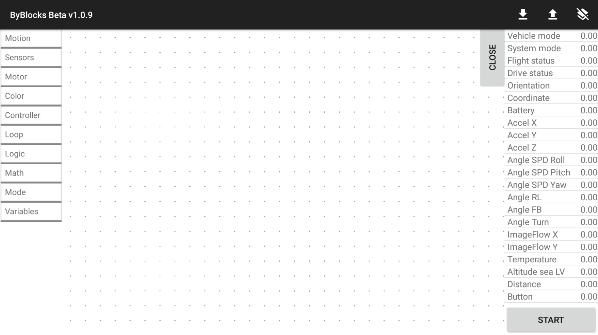
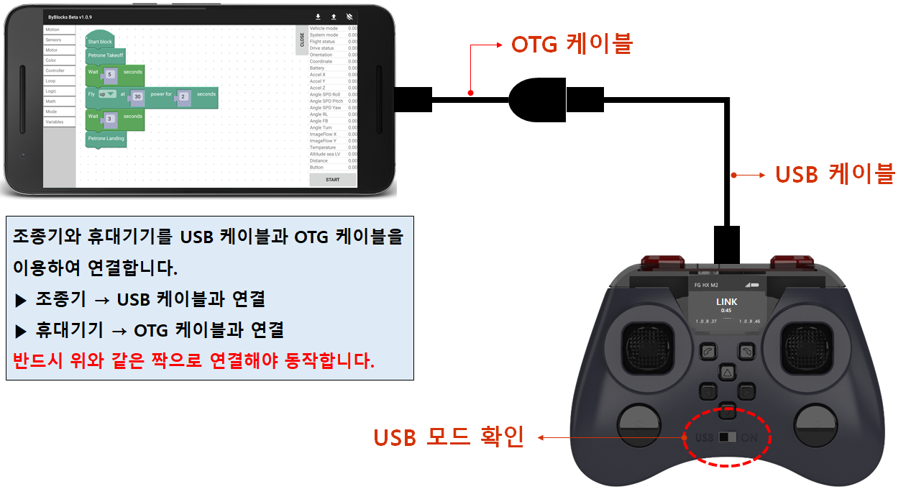
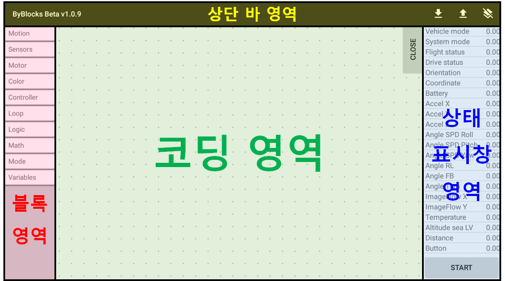
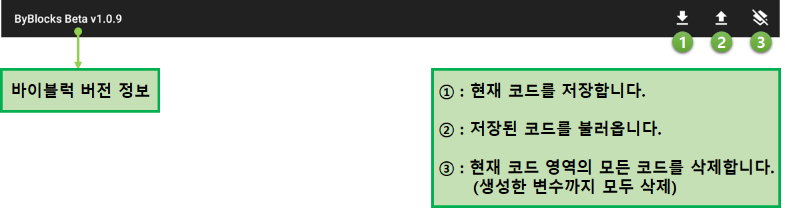
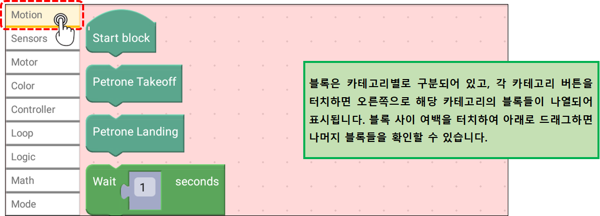
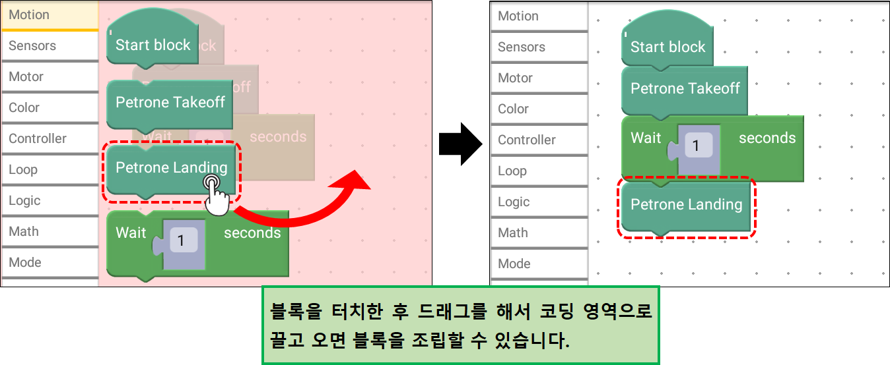
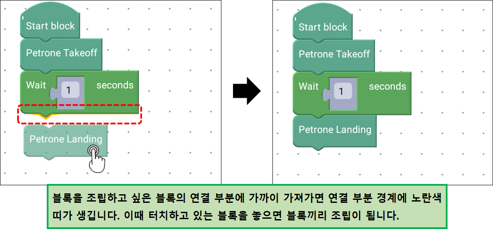
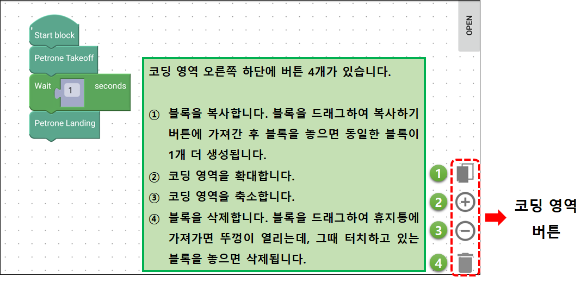
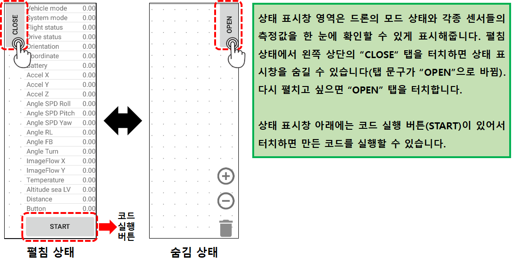

 

    <h1>Lesson 1. 페트론 V2와 바이블럭이 만났어요</h1>

 

---

 

    <h1>[들어가기]</h1>

 

바이블럭(ByBlocks)은 바이로봇에서 개발한 드론 코딩용 애플리케이션 프로그램입니다. 대부분의 드론 코딩용 프로그램은 PC에서만 사용할 수 있기 때문에 PC가 없다면 드론 코딩을 할 수 없는 단점이 있었습니다. 하지만 바이블럭은 애플리케이션 프로그램이기 때문에 스마트폰, 태블릿 등 휴대용 기기만 있다면 언제 어디서든 드론 코딩을 할 수 있습니다. 그리고 텍스트가 아닌 블록을 조립하는 순차 코딩 방식이기 때문에 누구나 쉽게 배우고 사용할 수 있습니다.

이 강의를 통해서,
1. 코딩의 기본 개념을 배울 수 있습니다.
2. 드론의 자율비행을 직접 체험해볼 수 있습니다. 
3. 4차산업의 핵심 분야인 코딩과 드론을 접목하여 STEAM 교육에 필요한 통합&융합적 사고력을 기를 수 있습니다. 
4. 다가올 미래 사회에 꼭 필요한 창의융합형 인재의 역량을 키울 수 있습니다.

※ 바이블럭은 현재 페트론 V2를 지원하고 있고, 지원되는 드론은 계속 업데이트될 예정입니다.

 

---

 

    <h1>[설치하기]</h1>

 

<h2> 1. 바이블럭(ByBlocks) 애플리케이션 설치하기</h2>

다음 순서대로 스마트폰 or 태블릿에 바이블럭 애플리케이션을 설치합니다.(현재 안드로이드 OS 기기만 설치 가능)

1) 스마트폰의 앱 스토어에서 “바이블럭” or “ByBlocks”로 검색합니다.

2) 검색된 다음 애플리케이션을 설치합니다.

3) 설치된 애플리케이션을 실행하여 다음과 같은 화면이 나오면 정상적으로 설치된 것입니다.

 

    (앱 설치된 스마트폰 화면)

 

    

 

    (바이블럭 지원 사양)

 
 

<h2> 2. 바이블럭(ByBlocks)에 페트론 V2 연결하기</h2>

다음과 같이 바이블럭에 페트론 V2를 연결합니다.

1) 준비물: 스마트폰 or 태블릿, USB 케이블, OTG 케이블, 페트론 V2 드론, 조종기

2) 페트론 V2에 배터리를 장착합니다.

3) 조종기를 USB 모드로 설정하고 USB 케이블과 OTG 케이블을 이용하여 스마트폰 or 태블릿과 연결합니다.

- 조종기: USB 케이블과 연결

- 스마트폰 or 태블릿: OTG 케이블(5핀)

4) 바이블럭 애플리케이션이 자동으로 실행됩니다. (정상적으로 연결되었다면 조종기 화면에 “LINK”라고 표시됩니다.)

    

 

---

 

    <h1>[알아두기]</h1>

 

<h2>1. 바이블럭 기본 사용법</h2>

<h3>1) 화면 구성 및 각 화면 영역별 사용법</h3>

    

 

<h4>상단 바 영역</h4>
- 바이블럭 버전 정보와 코드 관련 버튼들이 있습니다.

    

 

<h4>블록 영역</h4>
- 바이블럭에서 사용하는 블록들이 카테고리별로 구분되어 있고, 블록을 가져올 수 있습니다.

    
     
    

 

<h4>코딩 영역</h4>
- 블록을 조립하여 코드를 만드는 공간입니다.

    
     
    

 

<h4>상태 표시창 영역</h4>
- 드론의 모든 센서들의 값들을 실시간으로 확인할 수 있습니다. (OPEN/CLOSE 버튼을 터치하여 창 펼치기/숨기기 가능)

    

 

<h3> 2) 코드 실행방법</h3>

    

 

<h2> 2. 사용 시 주의사항</h2>

1) 드론의 배터리가 완전히 충전된 상태에서 사용해주시고, 배터리 잔량이 50% 미만이면 배터리를 교체합니다.

2) 배터리 잔량과 모터, 프로펠러 등 부품의 상태(모터 성능, 프로펠러 결함 여부 등)에 따라 비행 상태에 좋고 나쁨의 차이가 발생할 수 있습니다.

3) 드론과 조종기는 항상 최신 펌웨어를 설치합니다.

4) 프로그램 오류 등으로 인해 드론에 오작동이 발생할 수 있으니 가급적 넓은 공간에서 사용해주시고, 주변에 사람이나 장애물이 없는지 확인합니다.

 

<h2> 3. 드론을 강제로 멈추는 방법</h2>

바이블럭 사용 중에 오류가 발생하거나 드론이 원하는 방향으로 비행하지 않게 되면 드론을 강제로 멈춰야 합니다.

1) 상태 표시창 아래 코드 정지 버튼(STOP)을 터치합니다. 드론이 비행 중인 경우에는 그 위치에서 모터가 정지하여 드론이 추락하오니 주의해주세요.

2) 바이블럭에 오류가 발생한 경우에는 휴대기기와 조종기의 연결을 해제합니다. 연결을 해제하면 드론은 약 5초간 호버링 후 자동으로 착륙합니다.

 

---

 

    <h1>[정리하기]</h1>

 

바이블럭을 설치하고 페트론 V2와 연결하는데 어려움은 없었나요? 혹시 문제가 발생하여 해결하지 못하는 경우가 발생하면 바이로봇 AS센터(031–227–9675, help@byrobot.co.kr)로 연락바랍니다. 그리고 바이블럭의 모든 블록에 대한 자세한 설명이 되어 있는 자료를 제공해 드리오니 참고 바랍니다. (링크 주소 업데이트 필요) 다음 강의부터는 직접 바이블럭으로 코딩해보고, 만든 코드를 실행하여 드론을 자율비행시켜보도록 하겠습니다.

 

---

<a href="../"><h3>바이블럭으로 코딩해요</h3></a>

 **Lesson 1. 페트론 V2와 바이블럭이 만났어요** 
 [Lesson 2. 페트론 V2와 인사해요](lesson2) 
 [Lesson 3. 페트론 V2로 음악을 연주해요](lesson3)

---

Modified : 2018.8.23