 

    <h1>Lesson 2. 페트론 V2와 인사해요</h1>

 

---

 

    <h1>[들어가기]</h1>

 

이번 강의에서는 드론의 기본적인 비행을 바이블럭으로 코딩하여 자율비행시켜보는 코딩을 해보려고 합니다. 어렵지 않은 간단한 코드를 직접 만들어보고 코드의 명령대로 드론이 비행하는 것을 보면서 바이블럭, 페트론 V2와 친해져 봐요.

 

---

 

    <h1>[코드 생각하기]</h1>

 

드론의 기본 비행은 다음과 같습니다. 기본 비행을 수행하기 위해 필요한 블록들은 “Motion” 카테고리에 있습니다. 각 기본 비행별로 어떤 블록을 사용해야할지 생각해봅니다.

    <table>
        <tr>
            <td>
드론의 기본 비행
</td>
        </tr>
        <tr>
            <td>
                

                    1. 이륙/착륙 
                    2. 상승/하강 
                    3. 전진/후진 
                    4. 좌/우 이동 
                    5. 좌/우 회전
                

            </td>
        </tr>
    </table>

 

---

 

    <h1>[코딩 및 실행하기]</h1>

 

바이블럭에서 모든 코딩의 시작은 “Start block” 블록부터 시작합니다. “Start block”이 없다면 아무리 많은 블록을 조립해도 실행되지 않습니다. 그럼 다음과 같이 블록을 조립하여 코드를 만들어봅시다.

<h2>1. 이륙/착륙</h2>

    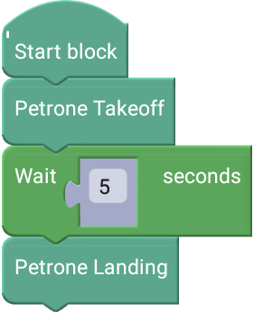

 

    <table>
        <tr>
            <td>
                

                     
                    시작 블록
                

            </td>
            <td>
                

                    코드를 실행합니다. 시작 블록의 바로 다음 블록부터 순차적으로 실행됩니다. 
                    ※ 코드 처음에 시작 블록이 없으면 코드는 실행되지 않습니다.
                

            </td>
        </tr>
        <tr>
            <td>
                

                     
                    이륙 블록
                

            </td>
            <td>
                

                    페트론 V2가 이륙합니다. 약 60cm 높이까지 이륙 후 호버링합니다. 
                    ※ 배터리 잔량과 드론의 상태에 따라 이륙하는 높이는 차이가 날 수 있습니다.
                

            </td>
        </tr>
        <tr>
            <td>
                

                     
                    기다리기 블록
                

            </td>
            <td>
                

                    현재 상태를 설정한 시간 동안 유지합니다. 시간은 0.01초 단위로 입력 가능합니다. 약 60cm 높이까지 상승하여 이륙을 완료하기 위해서는 약 5초의 시간이 필요합니다. 5초 기다리기 블록을 사용하여 이륙 완료 후, 다음 동작이 수행될 수 있도록 합니다. 
                    ※ 숫자 블록을 터치하면 숫자 입력이 가능합니다.
                

            </td>
        </tr>
        <tr>
            <td>
                

                     
                    착륙 블록
                

            </td>
            <td>
                

                    페트론 V2가 착륙합니다. 블록이 실행되면 현재 위치에서 착륙합니다. 드론에 충격을 줄 수 있으므로 착륙은 50cm 정도 높이에서 실행합니다.
                

            </td>
        </tr>
    </table>

 

이제 실행해볼까요? 코드를 실행하는 방법은 바이블럭 화면 우측 아래 “START” 버튼을 터치합니다.

 

    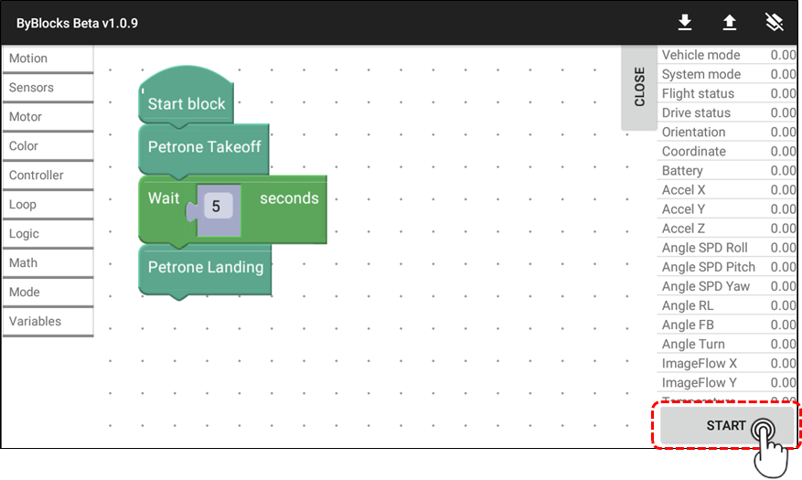

 

    <table>
        <tr>
            <td>
                

                    
                

            </td>
            <td>
                

                    잠깐! 바이블럭 코드를 실행하기 전에 한 번 더 확인해봐요! 
                    1. 드론과의 안전거리(3m 이상)를 확보합니다. 
                    2. 드론 주변에 사람이나 장애물이 없는지 확인합니다. 
                    ☞ 코드의 드론 이동 방향과 거리를 예측하여 경로에 사람이나 장애물이 없는지 확인합니다. 
                    3. 드론의 오작동이나 바이블럭 오류 발생 시 드론을 강제로 멈추는 방법을 확인합니다.
                

            </td>
        </tr>
    </table>

 

드론이 어떻게 비행하나요? 자신이 만든 코드 순서대로 드론이 잘 비행한다면 성공한 것입니다. 그럼 다음 비행들도 코드를 만들어서 실행해볼까요?

 

<h2>2. 상승/하강</h2>

    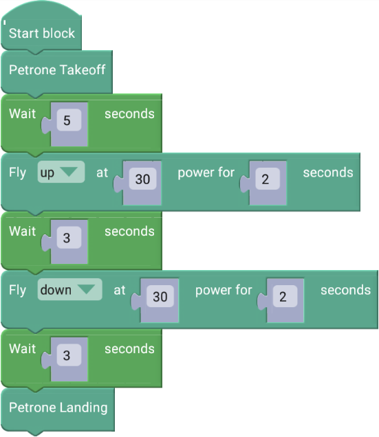

 

    <table>
        <tr>
            <td>
                

                    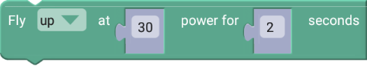 
                    상승(지정시간) 블록
                

            </td>
            <td>
                

                    페트론 V2가 상승합니다. “power”는 조종값으로 0~100까지 입력 가능하고, 값이 클수록 모터의 출력이 커져서 드론의 이동 속도가 빨라집니다. 시간은 0.01초 단위로 입력 가능하고, 입력한 시간 동안 전진합니다. 
                    ※ 입력한 시간 동안 상승한 후 다음 블록이 실행됩니다.
                

            </td>
        </tr>
        <tr>
            <td>
                

                    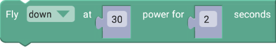 
                    하강(지정시간) 블록
                

            </td>
            <td>
                

                    페트론 V2가 하강합니다. “power”는 조종값으로 0~100까지 입력 가능하고, 값이 클수록 모터의 출력이 커져서 드론의 이동 속도가 빨라집니다. 시간은 0.01초 단위로 입력 가능하고, 입력한 시간 동안 후진합니다. 
                    ※ 입력한 시간 동안 하강한 후 다음 블록이 실행됩니다.
                

            </td>
        </tr>
        <tr>
            <td>
                

                     
                    기다리기 블록
                

            </td>
            <td>
                

                    바이블럭에서 코드를 실행하고 블록 명령이 페트론 V2에 잘 전달되려면 시간이 필요합니다(Delay time). 그래서 이와 같이 특정 동작을 수행하는 블록 다음에는 꼭 기다리기 블록을 사용하여 명령이 잘 전달될 수 있도록 해줍니다. 
                    ※ 숫자 블록을 터치하면 숫자 입력이 가능합니다.
                

            </td>
        </tr>
    </table>

 

<h2>3. 전진/후진</h2>

    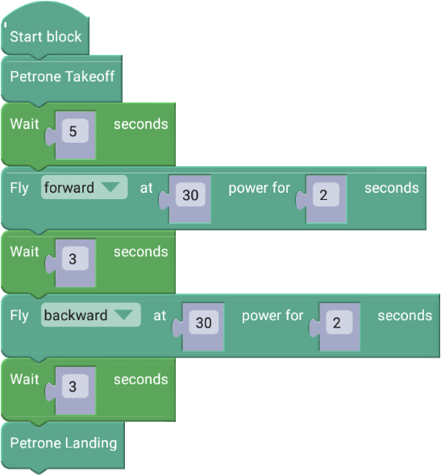

 

    <table>
        <tr>
            <td>
                

                    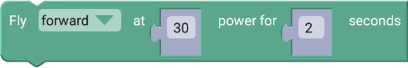 
                    전진(지정시간) 블록
                

            </td>
            <td>
                

                    페트론 V2가 전진합니다. “power”는 조종값으로 0~100까지 입력 가능하고, 값이 클수록 모터의 출력이 커져서 드론의 이동 속도가 빨라집니다. 시간은 0.01초 단위로 입력 가능하고, 입력한 시간 동안 전진합니다. 
                    ※ 입력한 시간 동안 전진한 후 다음 블록이 실행됩니다.
                

            </td>
        </tr>
        <tr>
            <td>
                

                    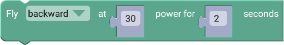 
                    후진(지정시간) 블록
                

            </td>
            <td>
                

                    페트론 V2가 후진합니다. “power”는 조종값으로 0~100까지 입력 가능하고, 값이 클수록 모터의 출력이 커져서 드론의 이동 속도가 빨라집니다. 시간은 0.01초 단위로 입력 가능하고, 입력한 시간 동안 후진합니다. 
                    ※ 입력한 시간 동안 후진한 후 다음 블록이 실행됩니다.
                

            </td>
        </tr>
    </table>

 

<h2>4. 좌/우 이동</h2>

    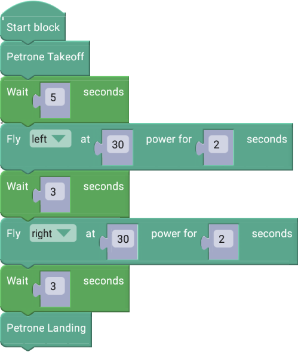

 

    <table>
        <tr>
            <td>
                

                    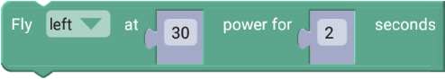 
                    좌 이동(지정시간) 블록
                

            </td>
            <td>
                

                    페트론 V2가 좌(왼쪽)로 이동합니다. “power”는 조종값으로 0~100까지 입력 가능하고, 값이 클수록 모터의 출력이 커져서 드론의 이동 속도가 빨라집니다. 시간은 0.01초 단위로 입력 가능하고, 입력한 시간 동안 좌로 이동합니다. 
                    ※ 입력한 시간 동안 좌로 이동한 후 다음 블록이 실행됩니다.
                

            </td>
        </tr>
        <tr>
            <td>
                

                    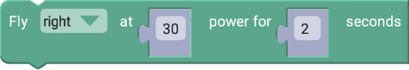 
                    우 이동(지정시간) 블록
                

            </td>
            <td>
                

                    페트론 V2가 우(오른쪽)로 이동합니다. “power”는 조종값으로 0~100까지 입력 가능하고, 값이 클수록 모터의 출력이 커져서 드론의 이동 속도가 빨라집니다. 시간은 0.01초 단위로 입력 가능하고, 입력한 시간 동안 우로 이동합니다. 
                    ※ 입력한 시간 동안 우로 이동한 후 다음 블록이 실행됩니다.
                

            </td>
        </tr>
    </table>

 

<h2>5. 좌/우 회전</h2>

    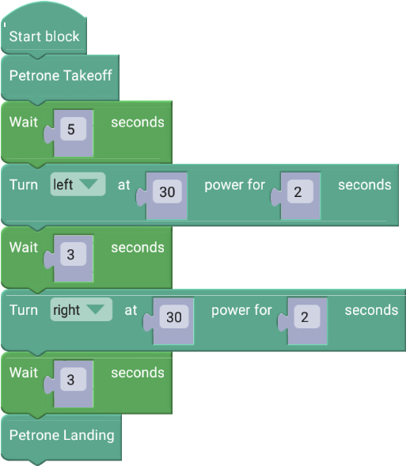

 

    <table>
        <tr>
            <td>
                

                    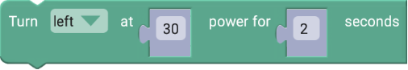 
                    좌 회전(지정시간) 블록
                

            </td>
            <td>
                

                    페트론 V2가 좌(왼쪽)로 회전합니다. “power”는 조종값으로 0~100까지 입력 가능하고, 값이 클수록 모터의 출력이 커져서 드론의 이동 속도가 빨라집니다. 시간은 0.01초 단위로 입력 가능하고, 입력한 시간 동안 좌로 회전합니다. 
                    ※ 입력한 시간 동안 좌로 회전한 후 다음 블록이 실행됩니다.
                

            </td>
        </tr>
        <tr>
            <td>
                

                    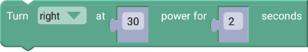 
                    우 이동(지정시간) 블록
                

            </td>
            <td>
                

                    페트론 V2가 우(오른쪽)로 회전합니다. “power”는 조종값으로 0~100까지 입력 가능하고, 값이 클수록 모터의 출력이 커져서 드론의 이동 속도가 빨라집니다. 시간은 0.01초 단위로 입력 가능하고, 입력한 시간 동안 우로 회전합니다. 
                    ※ 입력한 시간 동안 우로 회전한 후 다음 블록이 실행됩니다.
                

            </td>
        </tr>
    </table>

 

---

 

    <h1>[정리하기]</h1>

 

바이블럭, 페트론 V2와 좀 친숙해졌나요? 조종값과 비행 시간을 바꿔보고 블록들을 다르게 조합하여 실행해보면서 좀 더 다양하고 재미있게 자율비행을 즐겨봅시다.

1. 이/착륙 블록은 처음에 드론을 이륙시키고, 마지막에 착륙시킬 때 사용합니다.

2. 기본 비행 블록에서 방향, 조종값, 비행 시간을 설정하여 드론을 자율비행시킬 수 있습니다.

3. 조종값이 크면 모터의 출력이 커져서 드론의 이동 속도가 빨라집니다.

4. 이륙 후 5초 기다리기 블록을 사용하여 드론이 완전히 이륙할 수 있도록 합니다.

5. 비행 동작 후에는 3초 기다리기 블록을 사용하여 다음 명령이 드론에게 잘 전달될 수 있도록 합니다.

 

---

### [바이블럭으로 코딩해요](../)

 1. [페트론 V2와 바이블럭이 만났어요](../lesson1)
 2. **페트론 V2와 인사해요**
 3. 페트론 V2로 음악을 연주해요 - 준비중
 4. 페트론 V2로 사각형을 그려보아요 - 준비중
 5. 페트론 V2로 계단을 오르락내리락 해요 - 준비중
 6. 페트론 V2를 원하는 높이로 상승시켜 보아요 - 준비중
 7. 페트론 V2를 손바닥 위에 착륙시켜 보아요 - 준비중
 8. 페트론 V2를 버튼으로 이륙/착륙시켜 보아요 - 준비중
 
---

Modified : 2018.8.24