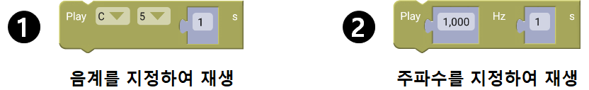
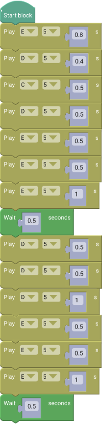
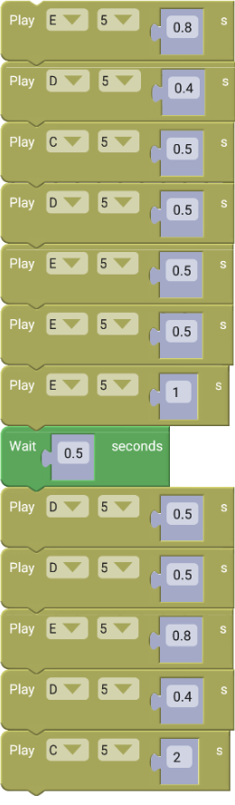
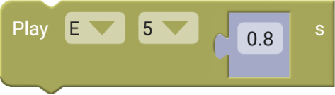
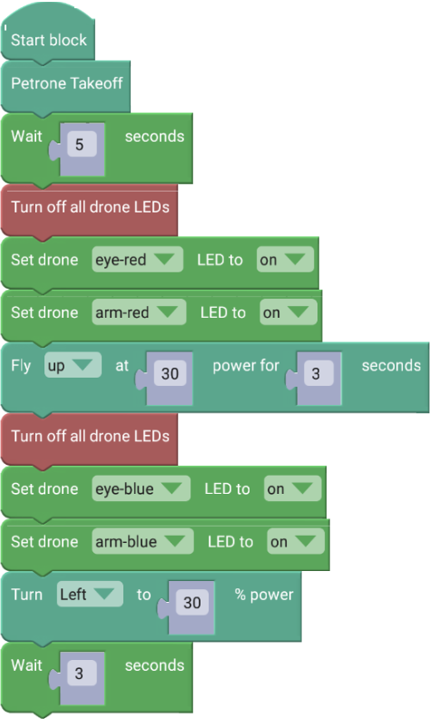
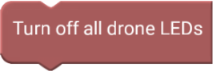
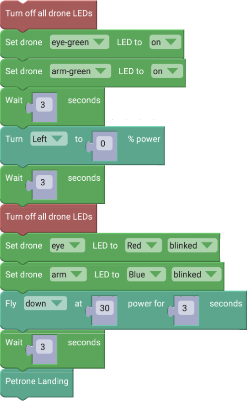

 

    <h1>Lesson 3. 페트론 V2로 음악을 연주해요</h1>

 

---

 

    <h1>[들어가기]</h1>

 

이번 강의에서는 조종기의 Buzzer로 음악을 연주하고, 드론의 LED를 여러가지 색상으로 채워보는 코드를 만들어보려고 합니다.  페트론 V2의 조종기에는 음을 재생할 수 있는 Buzzer가 있는데, 주파수별로 소리가 달라서 마치 음계 연주가 가능합니다.  그리고 드론의 LED를 코딩으로 제어할 수 있습니다.  빛의 3원색인 RGB(Red, Green, Blue)를 이용하여 다양한 색상으로 LED를 빛나게 할 수 있습니다.

    <h3>빛의 3원색</h3>
    

코딩에서 빛의 3원색 표시 방법

① 컴퓨터는 기계어 2진수로 이해하므로 색상도 2진수로 표시합니다.

② RGB칼라는 8비트를 이용하여 표시하므로 0과 1로 표시할 수 있는 1비트 8개를 이용합니다.

    <table>
        <tr>
            <td>1</td>
            <td>1</td>
            <td>0</td>
            <td>0</td>
            <td>1</td>
            <td>0</td>
            <td>0</td>
            <td>0</td>
        </tr>
    </table>

③ 28 = 256 이므로, 8비트를 10진수로 표시하면 범위는 0~255 입니다.

④ 빛을 혼합할 때 혼합한 색이 원래의 색보다 명도가 높아짐으로 가산혼합이라고 합니다. 조명, 컴퓨터 모니터 등에서 사용합니다.

 

---

 

    <h1>[코드 생각하기]</h1>

 

<h2> 1. 조종기로 음악 연주하기</h2>

다음 “비행기” 동요를 조종기로 연주해봐요.

    <table>
        <tr>
            <td>가사</td>
            <td>떴다 떴다 비행기 날아라 날아라 높이 높이 날아라 우리 비행기</td>
        </tr>
        <tr>
            <td>음계</td>
            <td>미레 도레 미미미 레레레 미미미 미레 도레 미미미 레레 미레도</td>
        </tr>
    </table>

조종기 Buzzer를 재생할 수 있는 블록은 “Controller” 카테고리에 있습니다.  
다음과 같이 2가지 종류의 블록이 있는데 여기서는 ①번 블록을 사용합니다.

    

①번 블록에서 영어 음계는 각각 다음 음을 나타냅니다.
 

    <table>
        <tr>
            <td>C</td>
            <td>CS</td>
            <td>D</td>
            <td>DS</td>
            <td>E</td>
            <td>F</td>
            <td>FS</td>
            <td>G</td>
            <td>GS</td>
            <td>A</td>
            <td>AS</td>
            <td>B</td>
        </tr>
        <tr>
            <td>도</td>
            <td>도＃</td>
            <td>레</td>
            <td>레＃</td>
            <td>미</td>
            <td>파</td>
            <td>파＃</td>
            <td>솔</td>
            <td>솔＃</td>
            <td>라</td>
            <td>라＃</td>
            <td>시</td>
        </tr>
    </table>

 
<h2> 2. 드론 LED 꾸며보기</h2>
 
드론이 눈과 팔 부분의 LED 색상을 다음과 같이 바꿔가며 비행하는 코드를 만들어봅니다.  드론의 LED 색상을 제어할 수 있는 블록은 “Color” 카테고리에 있습니다.

1) 드론 이륙하기 
2) 눈과 팔 LED 모두 Red로 바꾸기 
3) 3초간 상승하기 
4) 눈과 팔 LED 모두 Blue로 바꾸기 
5) 좌로 회전하기 
6) 회전하면서 3초 뒤 눈과 팔 LED 모두 Green으로 바꾸기 
7) 3초 더 회전 후 회전 멈추기 
8) 눈 LED는 Red, 팔 LED는 Blue로 바꾸고 깜빡이기 
9) 3초간 하강하기 
10) 착륙하기 

 

---

    <h1>[코딩 및 실행하기]</h1>

 

<h2> 1. 조종기로 음악 연주하기</h2>
 

    <table>
        <tr>
            <td>
                

                     
                

            </td>
            <td>
                

                     
                

            </td>
        </tr>
        <tr>
            <td>
                

                    코드 앞부분
                

            </td>
            <td>
                

                    코드 뒷부분
                

            </td>
        </tr>
    </table>

    <table>
        <tr>
            <td>
                

                     
                

            </td>
        </tr>
        <tr>
            <td>
                

                    조종기 버저(음계) 블록
                

            </td>
        </tr>
        <tr>
            <td>
        조종기의 버저로 설정한 음계를 재생할 때 사용합니다. 음계와 옥타브(1~8단계)를 선택할 수 있고, 재생 시간을 입력할 수 있습니다.재생이 완료 후에 다음 블록이 실행됩니다.
            </td>
        </tr>
    </table>

코드를 실행합니다. 훌륭한 연주가 되었나요? 다른 듣고 싶은 노래들도 코딩하여 멋지게 연주해봐요.

 

<h2> 2. 드론 LED 꾸며보기</h2>

 

    <table>
        <tr>
            <td>
                

                     
                

            </td>
        </tr>
        <tr>
            <td>
                

                    코드 앞부분
                

            </td>
        </tr>
    </table>

    <table>
        <tr>
            <td>
                

                     
                    드론 LED 끄기 블록
                

            </td>
            <td>
                

                    드론의 모든 LED(눈과 팔 부분)를 끌 때 사용합니다. 
                    LED를 끄지 않고 색상을 바꾸면 이전 색상과 색이 겹쳐지기 때문에 원하는 색상으로 바꿀 수 없습니다.
                    색상 겹침을 피하기 위해서는 꼭 LED를 먼저 끄고 색상을 변경합니다.
                

            </td>
        </tr>
        <tr>
            <td>
                

                     
                     
                    드론 LED 설정(RGB) 블록
                

            </td>
            <td>
                

                    드론 눈/팔 부분 LED를 설정한 색상으로 켜고 끌 때 사용합니다.
                    색상은 Red, Green, Blue 중에서 선택 가능합니다.
                

            </td>
        </tr>
    </table>

    <table>
        <tr>
            <td>
                

                     
                

            </td>
        </tr>
        <tr>
            <td>
                

                    코드 뒷부분
                

            </td>
        </tr>
    </table>

    <table>
        <tr>
            <td>
                

                     
                     
                    드론 LED 설정(색선택) 블록
                

            </td>
            <td>
                

                    드론 눈/팔 부분 LED를 설정한 색상으로 켜고 끌 때 사용합니다. 
                    색상은 여러 가지 색상 중에서 선택 가능합니다. 
                    ※ 의도보다 색상이 더 밝게 표현될 수 있습니다.
                

            </td>
        </tr>
    </table>

코드를 실행합니다. 드론의 LED 색상이 변하면서 비행하니까 더 멋있지 않나요? 좀 더 다양한 색상으로 드론을 예쁘게 꾸며봐요.

---

 

    <h1>[정리하기]</h1>

 

눈과 귀가 즐거운 강의였나요? 이번 강의에서 배운 것을 활용하여 자신만의 음악을 만들어서 조종기로 연주해보고, 드론의 LED를 좀 더 화려하게 꾸며봐요.

1. 조종기의 Buzzer를 이용하여 음을 재생할 수 있습니다. (음계 선택 or 주파수)

2. 드론에는 눈과 팔 부분에 LED가 장착되어 있는데, 코딩으로 색상을 변경할 수 있습니다.

3. 드론의 LED 색상을 변경할 때, 이미 LED가 다른 색상으로 설정되어 있다면 색상이 겹쳐지기 때문에 꼭 LED를 먼저 끈 후 변경합니다.

※ 색상 겹침을 이용하여 특정 색상을 만들고 싶다면 LED를 끄지 않고 사용합니다.

 

---

### [바이블럭으로 코딩해요](../)

 1. [페트론 V2와 바이블럭이 만났어요](../lesson1)
 2. [페트론 V2와 인사해요](../lesson2)
 3. **페트론 V2로 음악을 연주해요**
 4. [페트론 V2로 사각형을 그려보아요](../lesson4)
 5. [페트론 V2로 계단을 오르락내리락 해요](../lesson5)
 6. [페트론 V2를 원하는 높이로 상승시켜 보아요](../lesson6)
 7. [페트론 V2를 손바닥 위에 착륙시켜 보아요](../lesson7)
 8. [페트론 V2를 버튼으로 이륙/착륙시켜 보아요](../lesson8)

---

Modified : 2018.8.28