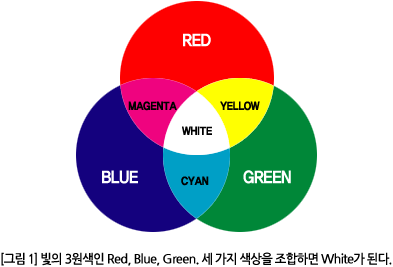

 

    <h1>Lesson 3. 페트론 V2로 음악을 연주해요</h1>

 

---

 

    <h1>[들어가기]</h1>

이번 강의에서는 조종기의 Buzzer로 음악을 연주하고, 드론의 LED를 여러가지 색상으로 채워보는 코드를 만들어보려고 합니다. 페트론 V2의 조종기에는 음을 재생할 수 있는 Buzzer가 있는데, 주파수별로 소리가 달라서 마치 음계 연주가 가능합니다. 그리고 드론의 LED를 코딩으로 제어할 수 있습니다. 빛의 3원색인 RGB(Red, Green, Blue)를 이용하여 다양한 색상으로 LED를 빛나게 할 수 있습니다.

    <h3>빛의 3원색</h3>
    

코딩에서 빛의 3원색 표시 방법

① 컴퓨터는 기계어 2진수로 이해하므로 색상도 2진수로 표시합니다.

② RGB칼라는 8비트를 이용하여 표시하므로 0과 1로 표시할 수 있는 1비트 8개를 이용합니다.

    <table>
        <tr>
            <td>1</td>
            <td>1</td>
            <td>0</td>
            <td>0</td>
            <td>1</td>
            <td>0</td>
            <td>0</td>
            <td>0</td>
        </tr>
    </table>

③ 28 = 256 이므로, 8비트를 10진수로 표시하면 범위는 0~255 입니다.

④ 빛을 혼합할 때 혼합한 색이 원래의 색보다 명도가 높아짐으로 가산혼합이라고 합니다. 조명, 컴퓨터 모니터 등에서 사용합니다.

 

---

 

    <h1>[코드 생각하기]</h1>

<h2> 1. 조종기로 음악 연주하기</h2>

다음 “비행기” 동요를 조종기로 연주해봐요.

    <table>
        <tr>
            <td>가사</td>
            <td>떴다 떴다 비행기 날아라 날아라 높이 높이 날아라 우리 비행기</td>
        </tr>
        <tr>
            <td>음계</td>
            <td>미레 도레 미미미 레레레 미미미 미레 도레 미미미 레레 미레도</td>
        </tr>
    </table>

 

---

 

    <h1>[정리하기]</h1>

눈과 귀가 즐거운 강의였나요? 이번 강의에서 배운 것을 활용하여 자신만의 음악을 만들어서 조종기로 연주해보고, 드론의 LED를 좀 더 화려하게 꾸며봐요.

1. 조종기의 Buzzer를 이용하여 음을 재생할 수 있습니다. (음계 선택 or 주파수)

2. 드론에는 눈과 팔 부분에 LED가 장착되어 있는데, 코딩으로 색상을 변경할 수 있습니다.

3. 드론의 LED 색상을 변경할 때, 이미 LED가 다른 색상으로 설정되어 있다면 색상이 겹쳐지기 때문에 꼭 LED를 먼저 끈 후 변경합니다.

※ 색상 겹침을 이용하여 특정 색상을 만들고 싶다면 LED를 끄지 않고 사용합니다.

 

---

<a href="../"><h3>바이블럭으로 코딩해요</h3></a>

 [Lesson 1. 페트론 V2와 바이블럭이 만났어요](lesson1) 
 [Lesson 2. 페트론 V2와 인사해요](lesson2) 
 **Lesson 3. 페트론 V2로 음악을 연주해요**

---

Modified : 2018.8.23