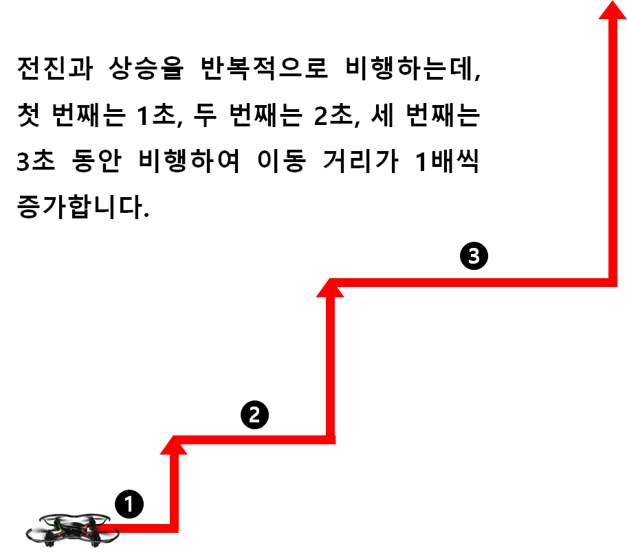
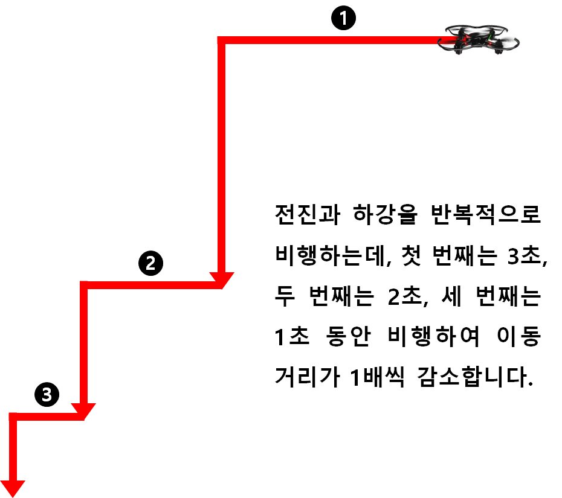
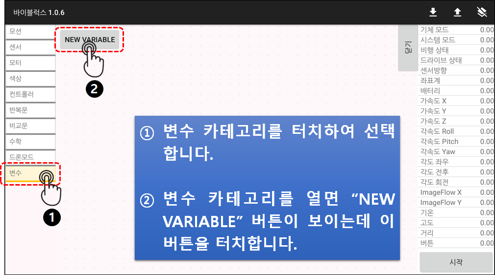
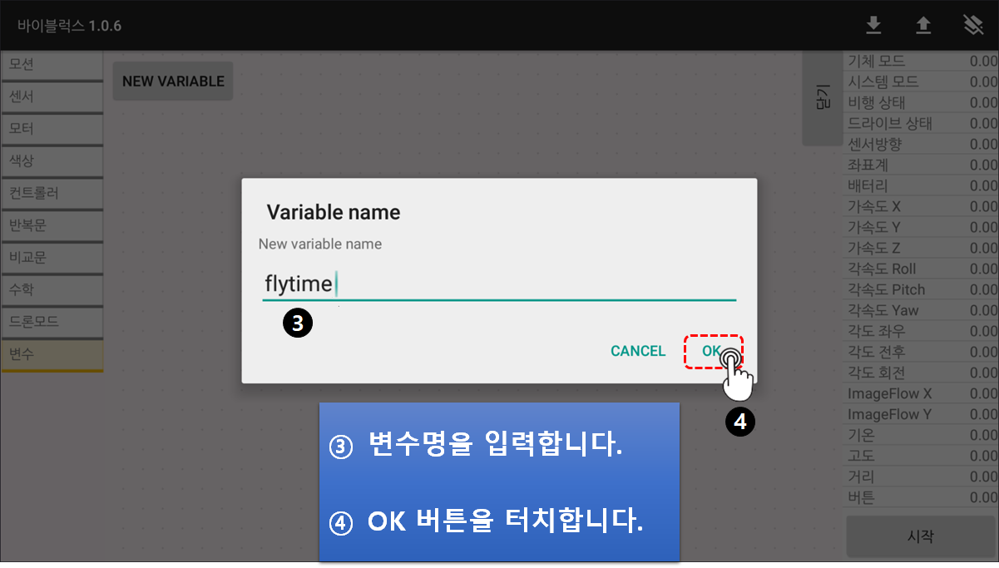
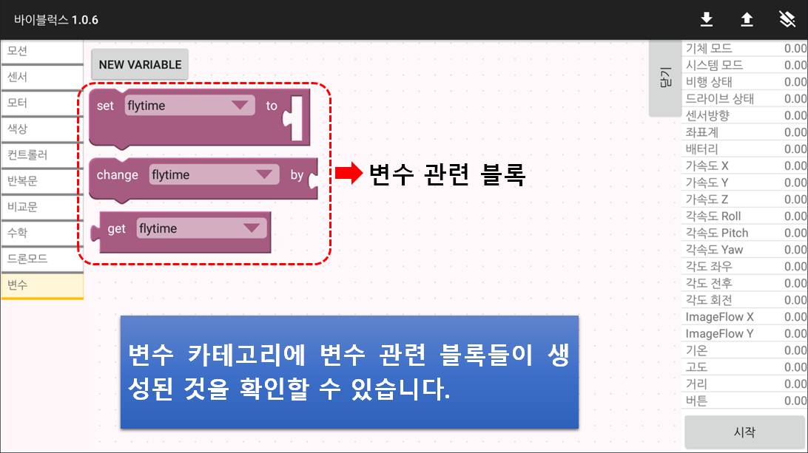
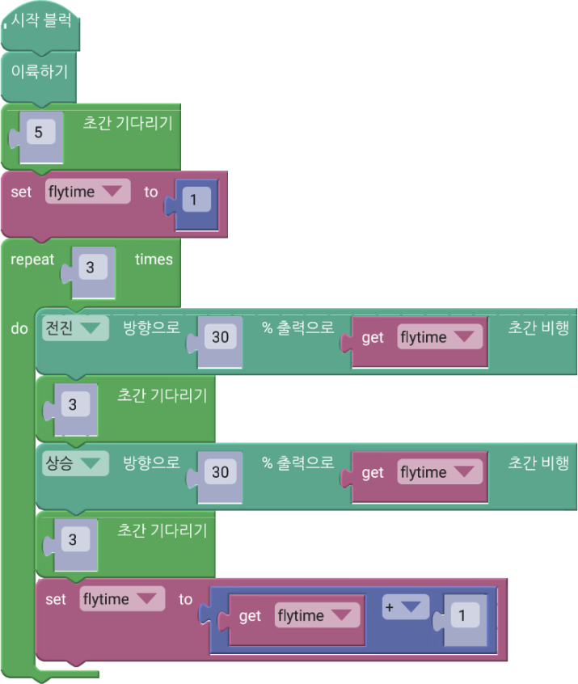
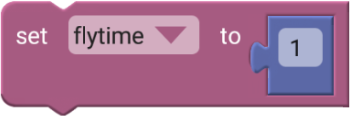
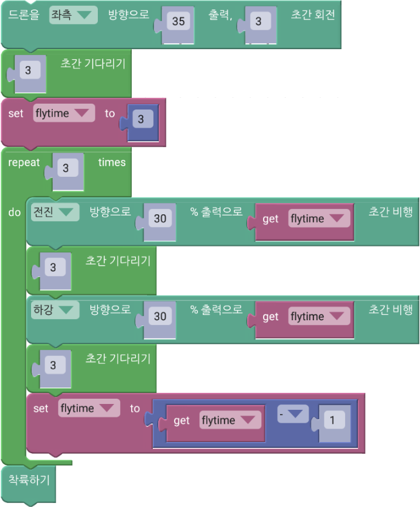
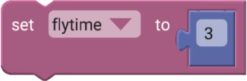
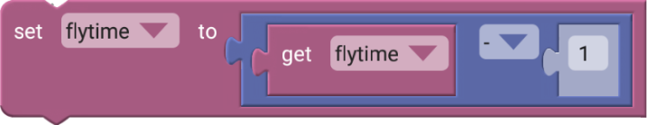

 

    <h1>Lesson 5. 페트론 V2로 계단을 오르락내리락 해요</h1>

 

---

 

    <h1>[들어가기]</h1>

 

이번 강의에서는 드론이 마치 계단을 오르락내리락하듯이 패턴 비행하는 코드를 만들어봅니다. 이번에도 지난 강의에서 배운 반복문을 사용하여 효율적인 코딩을 할 수 있습니다. 그리고 변수가 무엇인지 알아보고 변수를 사용하여 값을 저장하고 변경하는 방법을 배울 수 있습니다.

 

---

 

    <h1>[코드 생각하기]</h1>

 

계단 패턴은 다음과 같이 비행합니다. 총 3계단을 올라가고 내려오는데 1계단이 올라갈 때마다 계단 길이가 0.5m씩 늘어납니다. 그리고 내려올 때는 180도 회전하여 드론의 앞 방향을 이동 경로와 일치시킵니다.

1. 계단 올라가기 
    가. 0.5m 전진 → 0.5m 상승 
    나. 1.0m 전진 → 1.0m 상승 
    다. 1.5m 전진 → 1.5m 상승 
 
2. 우(오른쪽)로 180도 회전하기 
 
3. 계단 내려가기 
    가. 1.5m 전진 → 1.5m 하강 
    나. 1.0m 전진 → 1.0m 하강 
    다. 0.5m 전진 → 0.5m 하강 
 

    <table>
        <tr>
            <td>
                

                     
                    계단 올라가기
                

            </td>
            <td>
                

                     
                    계단 내려가기
                

            </td>
        </tr>
    </table>

 

---

 

    <h1>[코딩 및 실행하기]</h1>

 

먼저 변수가 무엇인지 알아볼까요?
 

    <table>
        <tr>
            <td>
                

                    알기 쉬운 코딩
                

            </td>
            <td>
                

                    변수
                

            </td>
        </tr>
        <tr>
            <td>
                

                    
                

            </td>
            <td>
                

                    변수(Variables)란 코딩에서 발생하는 문자, 숫자 등의 데이터를 저장하는 공간을 말합니다. 데이터는 변경될 수 있기 때문에 “변하는 수”라는 의미로 변수라고 한답니다.
                      
                    계속 값이 변하는 데이터를 저장해놓고 사용해야하는 경우에 변수를 사용하면 용이합니다. 그래서 시간이나 점수를 관리하는데 변수를 유용하게 사용할 수 있습니다.
                

            </td>
        </tr>
    </table>

 

이러한 변수를 각 블록의 실행 시간에 사용하면 일일이 시간을 입력하지 않고 코딩을 효율적으로 할 수 있습니다. 변수는 “Variables” 카테고리에서 생성할 수 있습니다.

 

    

 

    

 

    

 

변수를 생성했으니 이제 코드를 만들어봅니다.

 

    <table>
        <tr>
            <td>
                

                     
                

            </td>
        </tr>
        <tr>
            <td>
                

                    코드 앞부분(계단 올라가기)
                

            </td>
        </tr>
    </table>

    <table>
        <tr>
            <td>
                

                     
                    변수 설정하기 블록
                

            </td>
            <td>
                

                    변수에 숫자 등의 데이터를 저장할 때(변수에 값을 설정) 사용합니다. 데이터는 변경할 수 있고, 변수에는 가장 마지막에 설정한 데이터가 저장되어 있습니다. 여기서는 비행 시간을 변수로 사용합니다.
                    ※ 숫자 블록은 “수학” 카테고리에 있습니다.
                

            </td>
        </tr>
        <tr>
            <td>
                

                     
                    변수 불러오기 블록
                

            </td>
            <td>
                

                    변수를 불러올 때 사용합니다. 현재 변수에 저장되어 있는 값을 이용해야하는 경우에 사용할 수 있습니다.
                

            </td>
        </tr>
        <tr>
            <td>
                

                     
                    산술 연산자 블록
                

            </td>
            <td>
                

                    산술 연산을 할 때 사용합니다. 덧셈, 뺄셈, 곱하기, 나누기, 제곱 연산이 가능합니다. 여기서는 “flytime” 변수에 1을 더하여 코드가 반복될 때마다 비행 시간이 1초씩 늘어나도록 합니다.
                    ※ 산술 연산자 블록은 “수학” 카테고리에 있습니다.
                

            </td>
        </tr>
    </table>

 

    <table>
        <tr>
            <td>
                

                     
                

            </td>
        </tr>
        <tr>
            <td>
                

                    코드 뒷부분(계단 내려가기)
                

            </td>
        </tr>
    </table>

    <table>
        <tr>
            <td>
                

                     
                     
                    변수 설정하기 블록
                

            </td>
            <td>
                

                    계단을 내려올 때는 올라갈 때와 반대로 “flytime” 변수에 1을 빼서, 코드가 반복될 때마다 비행 시간이 1초씩 줄어들도록 합니다.
                

            </td>
        </tr>
    </table>

 

코드를 실행합니다. 드론이 마치 계단을 오르락 내리락 하듯이 비행하나요? 비행에 성공했다면 나선형 모양으로 상승하고 하강하는 패턴 비행에 도전해봐요.

 

---

 

    <h1>[정리하기]</h1>

 

변수를 사용하면 코드에서 사용되는 데이터의 관리가 쉬워집니다. 변수를 사용하여 또 어떤 자율비행 코딩을 할 수 있는지 생각해봐요.

1. 변수는 데이터를 저장하는 공간이며, 값이 변하는 데이터를 관리하는데 유용하게 사용할 수 있습니다.
2. 변수 카테고리에서 변수를 생성할 수 있고, 변수 관련 블록들을 가져올 수 있습니다.
3. 반복문 안에서 비행 시간을 증가 or 감소시키기 위해 변수를 사용하면 효율적으로 코딩을 할 수 있습니다.

 

---

### [바이블럭으로 코딩해요](../)

 1. [페트론 V2와 바이블럭이 만났어요](../lesson1)
 2. [페트론 V2와 인사해요](../lesson2)
 3. [페트론 V2로 음악을 연주해요](../lesson3)
 4. [페트론 V2로 사각형을 그려보아요](../lesson4)
 5. **페트론 V2로 계단을 오르락내리락 해요**
 6. [페트론 V2를 원하는 높이로 상승시켜 보아요](../lesson6)
 7. [페트론 V2를 손바닥 위에 착륙시켜 보아요](../lesson7)
 8. [페트론 V2를 버튼으로 이륙/착륙시켜 보아요](../lesson8)
 
---

Modified : 2018.8.28