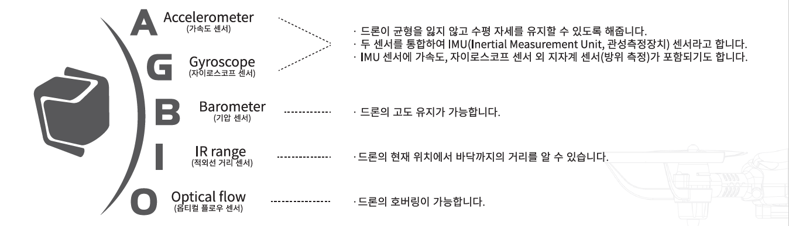
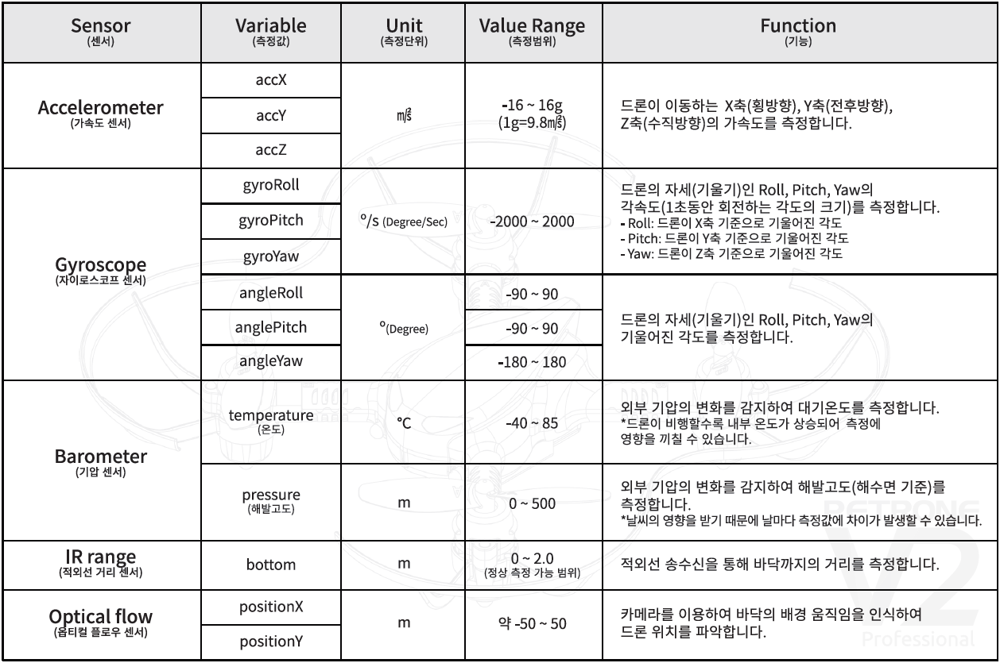
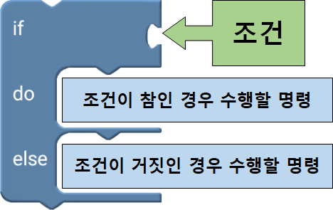
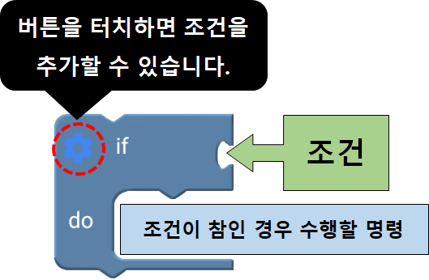
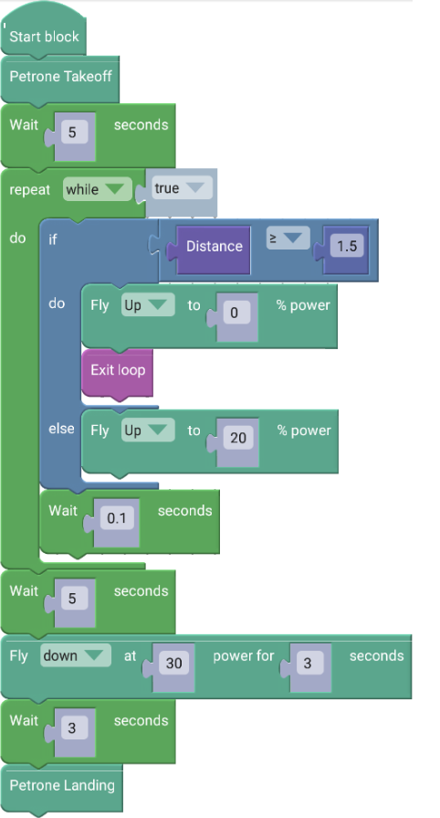
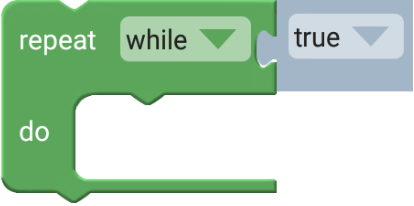
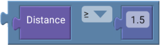
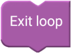

 

    <h1>Lesson 6. 페트론 V2를 원하는 높이로 상승시켜 보아요</h1>

 

---

 

    <h1>[들어가기]</h1>

 

이번 강의에서는 드론을 원하는 높이까지 상승시키는 코드를 만들어보도록 해요. 페트론 V2에는 다양한 센서들이 장착되어 있는데, 이러한 센서들이 안정적으로 비행하는데 도움을 줍니다. 그리고 센서들은 코딩에도 다양하게 활용될 수 있습니다. 이번 강의에서는 센서들 중의 하나인 거리 센서(IR Range Sensor)를 이용해보려고 합니다. 거리 센서는 적외선을 이용하여 드론의 밑면으로부터 바닥까지의 거리를 측정할 수 있어서 원하는 높이까지 드론을 상승시킬 수 있습니다. 또한, 주어진 조건에 따라 서로 다른 명령을 수행할 수 있게 해주는 조건문에 대해서도 배워보고 활용해보도록 하겠습니다.

 

<h2> 1. 페트론 V2의 센서 및 용도</h2>

    

 

<h2> 2. 센서 상세정보</h2>

    

 

---

 

    <h1>[코드 생각하기]</h1>

 

드론을 1.5m 높이까지 상승시킨 후, 그 위치에서 멈추어 5초간 호버링하고 착륙합니다.

조건문의 조건과 조건별 명령은 다음과 같습니다.

1. 조건: 드론이 바닥으로부터 거리가 1.5m 이상이다.

2. 명령
1) 참: 드론의 상승을 멈추고 그 위치에서 5초간 호버링한 후 착륙한다.
2) 거짓: 드론을 상승시킨다.

 

---

 

    <h1>[코딩 및 실행하기]</h1>

 

먼저 조건문이 무엇인지 알아볼까요
 

    <table>
        <tr>
            <td>
                

                    알기 쉬운 코딩
                

            </td>
            <td>
                

                    조건문
                

            </td>
        </tr>
        <tr>
            <td>
                

                    
                

            </td>
            <td>
                

                    조건문이란 코딩의 주요 문법 중 하나로서 특정 조건을 주고 그 조건에 따라 서로 다른 명령을 수행해야할 때 사용합니다. 우리가 흔히 “만약 ~라면, ~하겠다”란 말을 자주 사용하는데, 바로 이러한 상황을 코딩으로 표현한 것이라고 보면 됩니다. 
                      
                    주어진 조건이 참인지 거짓인지 판단하여 참이면 명령A를 거짓이면 명령B를 수행할 수 있게 할 수 있습니다. 또한, 참과 거짓 2가지 경우로만 구분하지 않고 여러가지 경우에 따라 서로 다른 명령을 줄 수도 있습니다.
                

            </td>
        </tr>
    </table>

 

조건문 블록은 “Logic” 카테고리에 있습니다. “Logic” 카테고리에는 조건문 블록뿐만 아니라 비교 연산자, 논리 연산자 블록들도 있는데, 이 블록들을 이용하여 조건을 만들 수 있습니다.

 

    <table>
        <tr>
            <td>
                

                    
                

            </td>
            <td>
                

                    
                

            </td>
        </tr>
        <tr>
            <td>
                

                    1. 1가지 조건의 참/거짓을 판단하여 명령을 다르게 수행할 때 사용
                

            </td>
            <td>
                

                    1. 1가지 조건이 참인 경우만 판단하여 명령을 수행할 때 사용 
                    2. 조건을 더 추가해서 조건에 따라 명령을 다르게 수행할 때 사용
                

            </td>
        </tr>
    </table>

 

변수를 생성했으니 이제 코드를 만들어봅니다.

 

    <table>
        <tr>
            <td>
                

                     
                

            </td>
        </tr>
        <tr>
            <td>
                

                    코드
                

            </td>
        </tr>
    </table>

    <table>
        <tr>
            <td>
                

                     
                    반복문(조건) 블록
                

            </td>
            <td>
                

                    반복문 블록 안에 블록들을 조건이 참인 동안 계속해서 반복합니다. 기본 블록은 조건이 “true”이기 때문에 무한 반복하게 됩니다. 
                    ※ “true” 블록에 비교 연산자, 논리 연산자 블록을 조립하여 다른 조건을 줄 수 있습니다.
                

            </td>
        </tr>
        <tr>
            <td>
                

                     
                    비교 연산자 블록
                

            </td>
            <td>
                

                    조건문의 조건으로, Distance(바닥까지 거리) 값이 1.5m 이상이 되는지를 확인합니다. 무한 반복문 안에서 바닥까지 거리 값을 지속적으로 확인하여 1.5m 미만이면 드론을 상승시키고, 1.5m 이상이 되면 상승을 멈추고 무한 반복문을 빠져나갑니다. 
                    ※ Distance(거리 센서) 값의 단위는 m(미터)입니다. 
                    ※ 비교 연산자 블록은 “Math” 카테고리에 있습니다. 
                

            </td>
        </tr>
        <tr>
            <td>
                

                     
                    반복 중단 블록
                

            </td>
            <td>
                

                    반복문 안에 사용하여 반복을 중단하고 반복문을 빠져나갈 때 사용합니다.
                

            </td>
        </tr>
    </table>

 

코드를 실행합니다. 드론이 정확하게 1.5m 위치에서 멈추나요? 대부분 그렇지 않을 것입니다. 왜냐하면 바이블럭에서 명령이 드론에 전달되는데 지연 시간이 발생하기 때문에 오차가 발생합니다. 드론의 상승 속도를 빠르게 하면 그 오차는 더 커질 수 있고, 속도를 느리게 하면 오차를 줄일 수 있습니다.

 

그리고 반복문에서 반복문 안의 블록들이 실행되고 다시 반복을 시작하려고 할 때, 기다리기 블록이 사용되지 않았다면 0.1~0.2초 정도의 기다리기 블록을 사용하여 명령이 잘 전달될 수 있도록 해주는 것이 좋습니다.

 

---

 

    <h1>[정리하기]</h1>

 

드론의 센서들을 활용하여 코딩을 하니까 더 재미있고 신기하지 않나요? 거리 센서 외에 다른 센서들은 어떻게 활용할 수 있는지 생각해보고 코딩해봐요.

1. 페트론 V2에는 다양한 센서들이 장착되어 있고, 이 센서들은 드론이 안정적으로 비행하는데 도움을 줍니다.
2. IR Range Sensor(거리 센서)는 적외선을 이용하여 드론이 바닥으로부터 얼마나 떨어져 있는지 측정해주는 센서입니다.
3. 거리 센서를 이용하여 드론을 원하는 높이까지 상승시킬 수 있습니다.
4. 조건문은 조건에 따라 명령을 다르게 수행할 때 사용하고, 조건은 1개부터 여러 개까지 줄 수 있습니다.

 

---

### [바이블럭으로 코딩해요](../)

 1. [페트론 V2와 바이블럭이 만났어요](../lesson1)
 2. [페트론 V2와 인사해요](../lesson2)
 3. [페트론 V2로 음악을 연주해요](../lesson3)
 4. [페트론 V2로 사각형을 그려보아요](../lesson4)
 5. [페트론 V2로 계단을 오르락내리락 해요](../lesson5)
 6. **페트론 V2를 원하는 높이로 상승시켜 보아요**
 7. [페트론 V2를 손바닥 위에 착륙시켜 보아요](../lesson7)
 8. [페트론 V2를 버튼으로 이륙/착륙시켜 보아요](../lesson8)
 
---

Modified : 2018.8.28