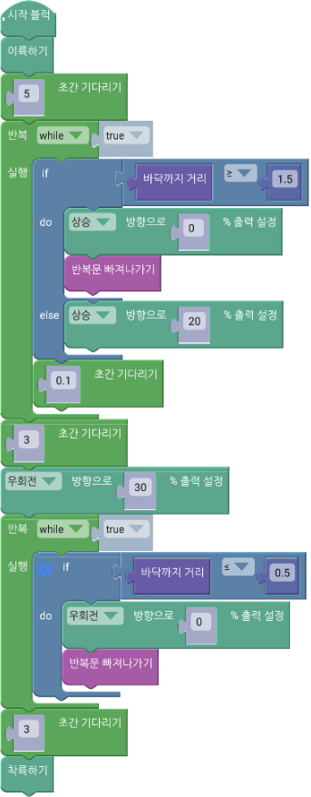
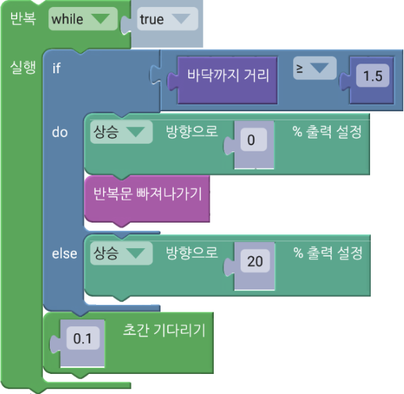
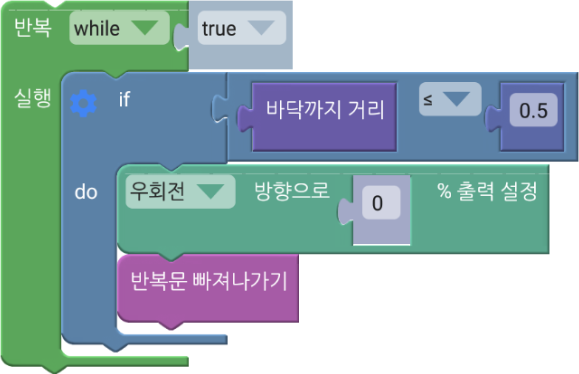

 

    <h1>Lesson 7. 페트론 V2를 손바닥 위에 착륙시켜 보아요</h1>

 

---

 

    <h1>[들어가기]</h1>

 

이번 강의에서는 드론을 손바닥 위에 착륙시키는 코딩을 해보도록 해요. 지난 강의에서 거리 센서를 이용하여 드론을 원하는 높이까지 상승하는 코드를 만들어보았는데요. 이번에는 거리 센서를 이용하여 드론과 바닥까지의 거리가 정해진 길이보다 짧아지면 드론이 착륙하는 코드를 만들어보려고 합니다. 그래서 드론 아래에 손바닥을 대면 드론을 손바닥 위로 착륙시킬 수 있습니다. 지난 강의에서 배운 센서와 조건문을 잘 활용해서 코딩을 해보도록 합니다.
 
 
드론을 왜 손바닥 위에 착륙시키나요?

드론을 직접 날리거나 코딩을 하다 보면 긴급 상황이 발생하여 갑자기 착륙시키거나 혹은 착륙할 곳이 마땅치 않아서 평평하지 않은 곳에 착륙시킬 때도 있습니다. 이렇게 착륙을 하게 되면 드론에 충격이 가해져 드론이 고장날 확률이 높고, 더 큰 문제는 다른 사람이나 물건에 피해를 입힐 수도 있습니다. 그렇다면 이런 경우에 손바닥 위로 드론을 착륙시킬 수 있다면 어떨까요? 사람이 다치거나 드론이 고장나지 않고 안전하게 착륙할 수 있습니다. 페트론 V2는 자동 호버링이 되고 소형 사이즈이기 때문에 손바닥 위로 착륙이 가능합니다. 그럼 코딩을 통해서 손바닥 위로 드론을 착륙시키는 연습을 해볼까요?

 

---

 

    <h1>[코드 생각하기]</h1>

 

드론을 1.5m 높이까지 상승시킨 후, 그 위치에서 멈추어 계속 우(오른쪽)로 회전합니다. 이때, 손바닥을 드론 밑면과 50cm 이하로 떨어진 위치에 대면 드론이 회전을 멈추고 손바닥 위로 착륙합니다.

1. 조건: 드론이 바닥으로부터 거리가 0.5m 이하이다.
2. 명령
- 참: 드론이 호버링을 멈추고 착륙한다.

 

---

 

    <h1>[코딩 및 실행하기]</h1>

 

     

    <table>
        <tr>
            <td>
                

                     
                    첫 번째 반복문&조건문 – 상승하기
                

            </td>
            <td>
                

                    무한 반복문 안에서 바닥까지 거리 값이 1.5m 이상이 되는지를 지속적으로 확인하여 1.5m 이상이 되면 상승을 멈추고 호버링합니다.<b>(Lesson 6 참조)</b>
                

            </td>
        </tr>
        <tr>
            <td>
                

                     
                    두 번째 반복문&조건문 – 착륙하기
                

            </td>
            <td>
                

                    무한 반복문 안에서 바닥까지 거리 값이 0.5m 이하가 되는지를 지속적으로 확인하여 0.5m 이하가 되면 회전을 멈추고 드론을 착륙시킵니다. 손바닥을 드론 밑면과 50cm 이하로 떨어진 위치에 대면 드론이 손바닥 위로 착륙합니다. 
                    ※ 주어진 조건을 만족하는 경우(참인 경우)에만 착륙시키면 되므로 “else” 구문이 없는 조건문 블록을 사용 가능합니다.
                

            </td>
        </tr>
    </table>

 

코드를 실행합니다. 손바닥을 드론 밑으로 가져가고 드론이 손바닥 위로 착륙할 때 다치지 않도록 조심합니다. 손바닥을 평평하게 펴야 하고 오므리거나 손가락을 구부리면 안됩니다. 드론이 착륙하기에 손바닥이 작다면 드론보다 큰 책을 손바닥 위에 올려서 드론이 책 위로 착륙할 수 있도록 합니다.

 

---

 

    <h1>[정리하기]</h1>

 

드론을 손바닥 위로 잘 착륙시킬 수 있었나요? 어떤 경우에도 드론을 안전하게 착륙시킬 수 있도록 연습을 많이 해봐요.

1. 거리 센서를 활용하여 드론을 손바닥 위로 착륙시킬 수 있습니다.
2. 긴급 상황 시 드론을 손바닥 위로 착륙시키면 사고 발생 확률을 줄이면서 안전하게 착륙시킬 수 있습니다.
3. 반복문 안에 조건문을 사용하면 특정 동작을 반복적으로 수행하면서 어떤 조건이 발생했을 때 다른 동작을 수행하도록 할 수 있습니다.

 

---

### [바이블럭으로 코딩해요](../)

 1. [페트론 V2와 바이블럭이 만났어요](../lesson1)
 2. [페트론 V2와 인사해요](../lesson2)
 3. [페트론 V2로 음악을 연주해요](../lesson3)
 4. [페트론 V2로 사각형을 그려보아요](../lesson4)
 5. [페트론 V2로 계단을 오르락내리락 해요](../lesson5)
 6. [페트론 V2를 원하는 높이로 상승시켜 보아요](../lesson6)
 7. **페트론 V2를 손바닥 위에 착륙시켜 보아요**
 8. [페트론 V2를 버튼으로 이륙/착륙시켜 보아요](../lesson8)
 
---

Modified : 2018.8.28