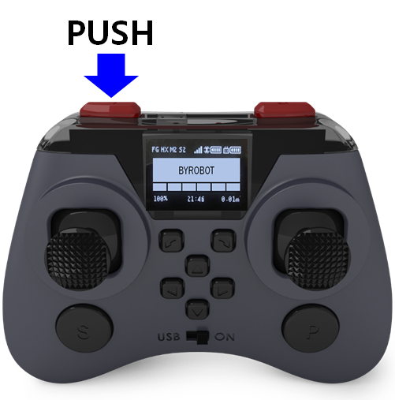
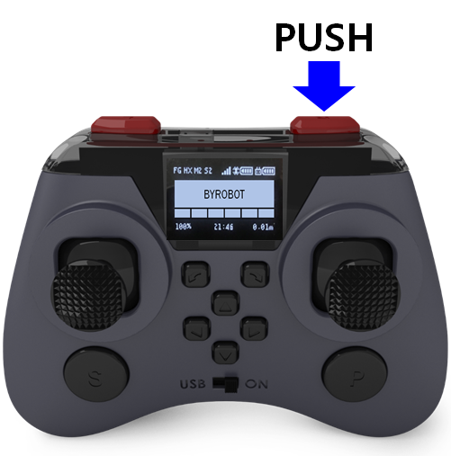
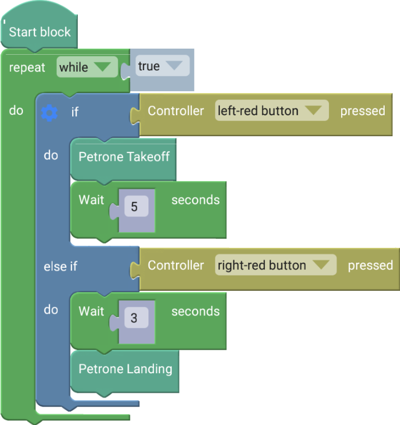

 

    <h1>Lesson 8. 페트론 V2를 버튼으로 이륙/착륙시켜 보아요</h1>

 

---

 

    <h1>[들어가기]</h1>

 

이번 강의에서는 조종기의 버튼을 누르면 드론이 자동으로 이륙하거나 착륙하는 코드를 만들어봐요. 바이블럭에 페트론 V2를 연결하게 되면 조종기의 레버를 움직이거나 버튼을 눌러도 아무런 반응이 나타나지 않는 것을 알 수 있습니다. 하지만 이벤트를 발생시키는 코드를 추가하면 조종기의 레버와 버튼 작동에 따라 명령을 수행할 수 있게 만들 수 있습니다. 이번 강의에서는 조종기의 특정 버튼을 누르면 드론이 이륙하고, 다른 버튼을 누르면 드론이 착륙하는 코딩을 해보도록 해요. 코딩에서 이벤트 발생은 여러가지 상황에 맞게 명령을 수행하고 발생 가능한 오류들에 대처할 수 있게 해줍니다.
 
이벤트 발생 블록은 “Controller” 카테고리에 있습니다.
 

    <table>
        <tr>
            <td>
                

                     
                

            </td>
            <td>
                

                    조종기의 버튼을 눌렀을 때 이벤트 발생  
1. 왼쪽 빨간 버튼 
2. 오른쪽 빨간 버튼 
3. 왼쪽 S 버튼 
4. 오른쪽 P 버튼 
5. 트림 버튼 6개 (◀, ▶, ▲, ▼,  ,)
                

            </td>
        </tr>
        <tr>
            <td>
                

                     
                    조종기 버튼 이벤트 블록
                

            </td>
            <td>
                

                    조종기의 레버를 움직였을 때 이벤트 발생  
1. 왼쪽 레버: 상, 좌상, 우상, 하, 좌하, 우하, 좌, 우, 센터 
2. 오른쪽 레버: 상, 좌상, 우상, 하, 좌하, 우하, 좌, 우, 센터 
                

            </td>
        </tr>
    </table>

 

---

 

    <h1>[코드 생각하기]</h1>

 

조종기의 왼쪽 빨간 버튼을 누르면 드론이 이륙하고, 오른쪽 빨간 버튼을 누르면 드론이 착륙합니다.
 

    <table>
        <tr>
            <td>
                

                     
                

            </td>
            <td>
                

                     
                

            </td>
        </tr>
        <tr>
            <td>
                

                    이륙하기
                

            </td>
            <td>
                

                    착륙하기
                

            </td>
    </table>

 

---

 

    <h1>[코딩 및 실행하기]</h1>

 

이벤트가 발생하였는지 지속적으로 확인을 해야 하기 때문에 조건문을 무한 반복문 안에 넣습니다.

 

    

    <table>
        <tr>
            <td>
                

                     
                    조종기 버튼 이벤트 블록
                

            </td>
            <td>
                

                    조종기의 왼쪽 버튼을 눌렀을 때 이벤트가 발생합니다. 이벤트가 발생하면 조건문 안의 블록이 실행됩니다. 여기서는 드론을 이륙시킵니다.
                

            </td>
        </tr>
        <tr>
            <td>
                

                     
                    조종기 버튼 이벤트 블록
                

            </td>
            <td>
                

                    조종기의 오른쪽 버튼을 눌렀을 때 이벤트가 발생합니다. 이벤트가 발생하면 조건문 안의 블록이 실행됩니다. 여기서는 드론을 착륙시킵니다.
                

            </td>
        </tr>
    </table>

 

---

 

    <h1>[정리하기]</h1>

 

조종기로 드론을 조종하니까 실제 조종하는 것처럼 느껴지지 않나요? 이처럼 이벤트 블록을 이용하면 실제 조종하는 것처럼 조종기로 드론을 비행시킬 수 있을 뿐만 아니라 실제 조종법과 다르게 드론이 동작하도록 코딩하여 나만의 조종기를 만들 수도 있습니다. 
(예: 전진/후진 레버와 상승/하강 레버를 서로 바꿔보기 등)

1. 조종기의 레버를 움직이거나 버튼을 눌렀을 때, 이벤트 발생 블록을 사용하여 명령을 수행하도록 할 수 있습니다.
2. 조종기 이벤트 블록은 2가지 종류(레버, 버튼)가 있습니다.
3. 이벤트 블록은 해당 이벤트가 발생하였는지 지속적으로 확인해야 하기 때문에 반복문 안에서 조건문의 조건으로 사용합니다.

 

---

### [바이블럭으로 코딩해요](../)

 1. [페트론 V2와 바이블럭이 만났어요](../lesson1)
 2. [페트론 V2와 인사해요](../lesson2)
 3. [페트론 V2로 음악을 연주해요](../lesson3)
 4. [페트론 V2로 사각형을 그려보아요](../lesson4)
 5. [페트론 V2로 계단을 오르락내리락 해요](../lesson5)
 6. [페트론 V2를 원하는 높이로 상승시켜 보아요](../lesson6)
 7. [페트론 V2를 손바닥 위에 착륙시켜 보아요](../lesson7)
 8. **페트론 V2를 버튼으로 이륙/착륙시켜 보아요**
 
---

Modified : 2018.8.28