 

    <h1>Lesson 1. 코딩드론과 친구해요!</h1>

 

---

 

    <h1>[들어가기]</h1>

 

코딩드론(BRC-105)은 세계 최초로 언플러그드 코딩이 가능한 코딩교육용 드론입니다.  
드론 하단에 컬러 센서를 장착하여 8가지 색상으로 구성된 코딩카드로 언플러그드 코딩을 할 수 있습니다.  
또한, 언플러그드 코딩 뿐만 아니라 PC와 연결하여 엔트리, 파이썬으로 코딩 활동이 가능합니다.  
이처럼 코딩드론은 다양한 코딩 방식을 제공하여 언제 어디서든지 쉽게 드론 코딩을 즐길 수 있도록 설계되었습니다.

이 강의를 통해서,
1. 다양한 방식의 코딩 활동을 통해 코딩의 기본 개념을 배울 수 있습니다.
2. 코딩드론의 자율비행을 직접 체험할 수 있습니다.
3. 4차산업의 핵심 분야인 코딩과 드론을 접목하여 STEAM 교육에 필요한 통합&융합적 사고력을 기를 수 있습니다. 
4. 다가올 미래 사회에 꼭 필요한 창의융합형 인재의 역량을 키울 수 있습니다.

 

---

 

    <h3>코딩드론은 이렇게 생겼어요!</h3>

 

        <table>
        <tr>
            <td>
                

                    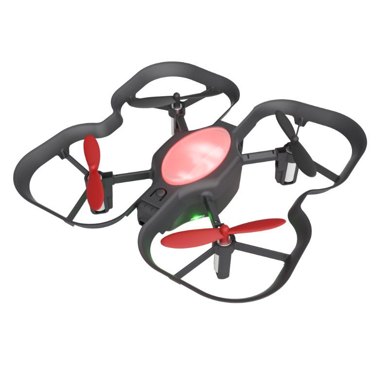 
                

            </td>
            <td>
                

                    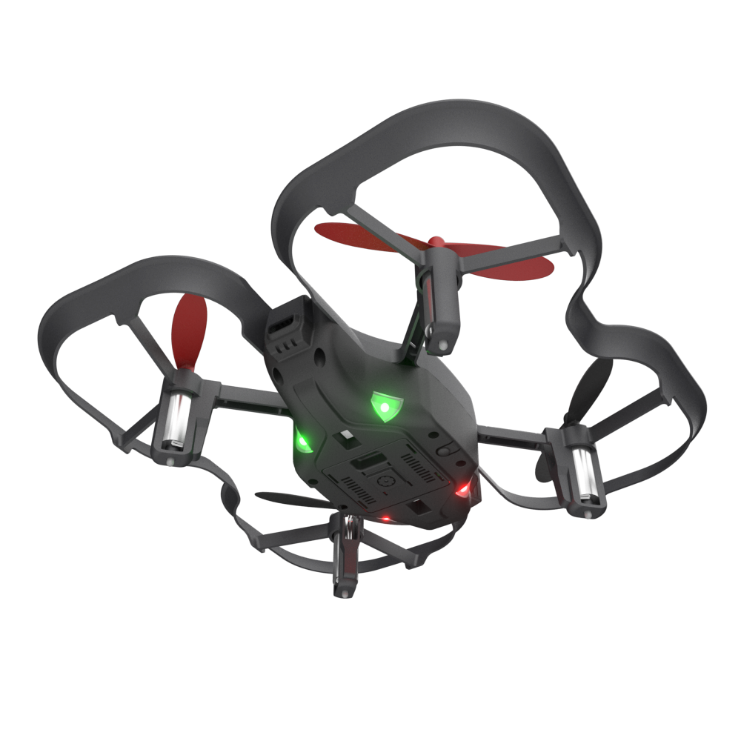 
                

            </td>
            <td>
                

                    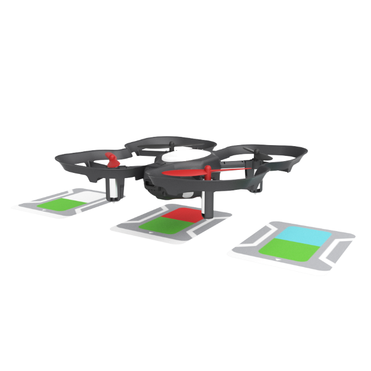 
                

            </td>
        </tr>
    </table>

 

    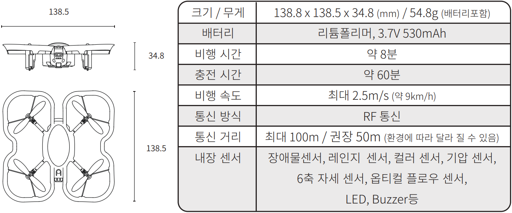 <h3>스펙</h3>
      
    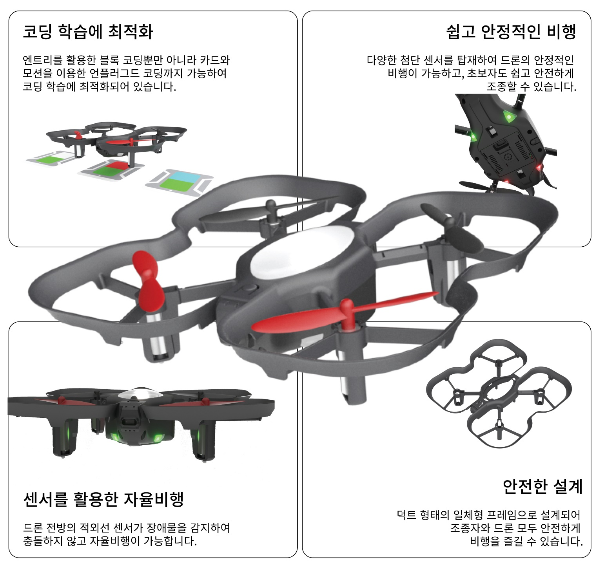 <h3>주요 특징</h3>
      
    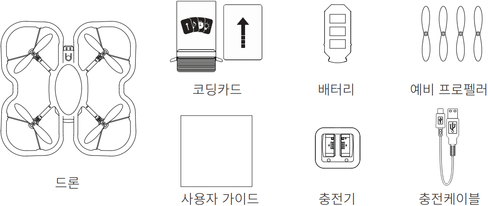 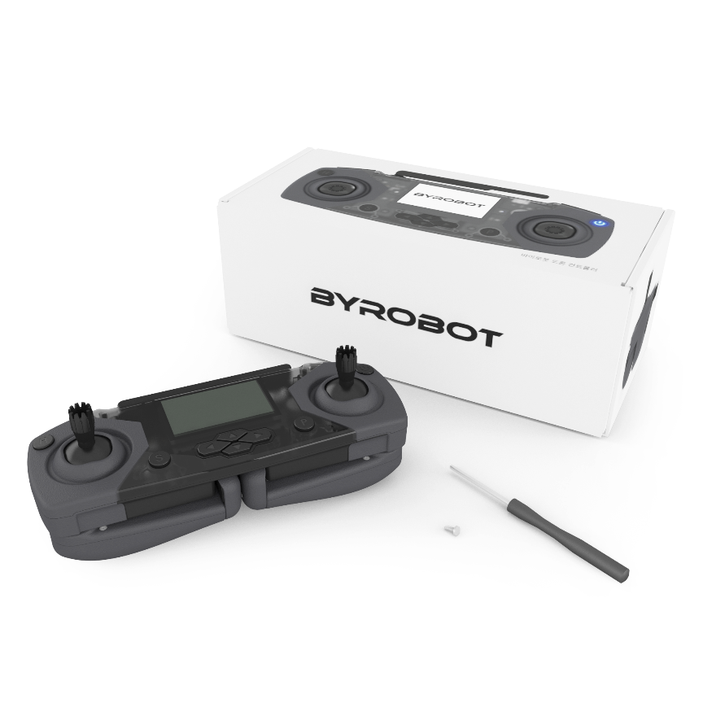 <h3>패키지 구성</h3>
      
    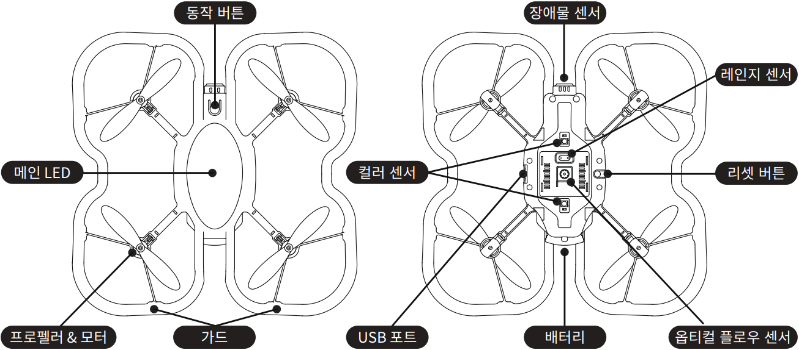 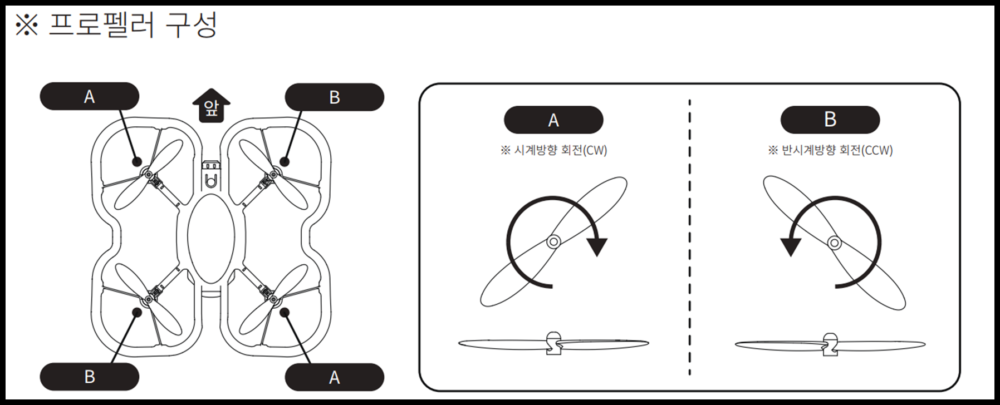 <h3>부분별 명칭</h3>
      
    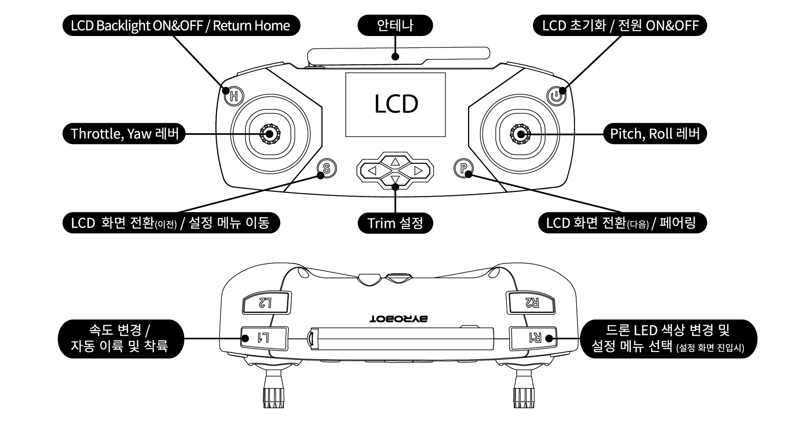 <h3>조종기 설명</h3>

 

---

 

    <h1>[알아두기]</h1>

 

<h2>1. 배터리 충전하기</h2>

배터리를 충전하는 방법을 알아보아요. 배터리는 꼭 전용 충전기를 사용하여 충전을 하고 충전이 완료된 배터리를 사용합니다.
 

        <table>
        <tr>
            <td>
                

                    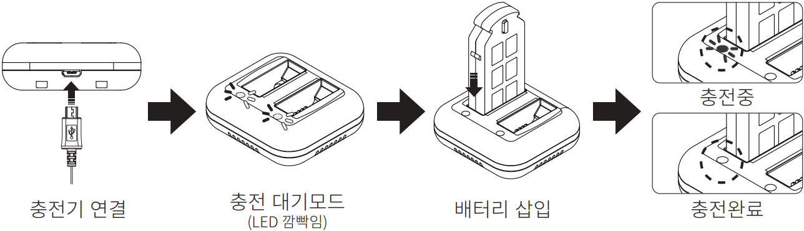
                

            </td>
        </tr>
        <tr>
            <td>
                

                1) 전용 충전기를 충전 가능한 기기(충전용 어댑터, PC 등)와 연결합니다. 
                2) 충전 대기모드에서는 충전기의 LED가 빨간색으로 깜빡입니다. 
                3) 충전할 배터리를 커넥터 방향에 맞춰서 충전기에 꽂습니다. 
                4) 충전 상태는 충전기의 LED 불빛으로 판단합니다. 
                    ① 충전중: LED에 빨간색 불빛이 켜집니다. 
                    ② 충전완료: LED 불빛이 꺼집니다. 
                

            </td>
        </tr>
    </table>

 
<b>※충전을 완료하는데 60분 정도 필요하고, 충전된 배터리로 드론을 8분 정도 비행할 수 있습니다. 비행시간은 주변 환경(예: 온도, 바람 등)에 따라 차이가 발생할 수 있습니다.</b>

 

<h2>2. 배터리 장착하기</h2>

드론과 조종기에 배터리를 장착하는 방법은 다음과 같습니다.

        <table>
        <tr>
            <td>
                

                    <h3>드론</h3>
                

            </td>
            <td>
                

                    <h3>조종기</h3>
                

            </td>
        </tr>
        <tr>
            <td>
                

                    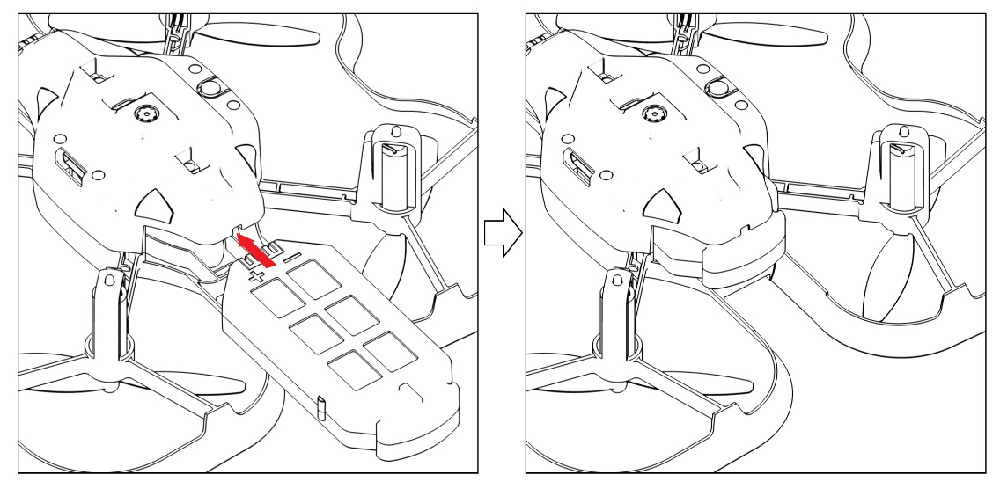
                

            </td>
            <td>
                

                    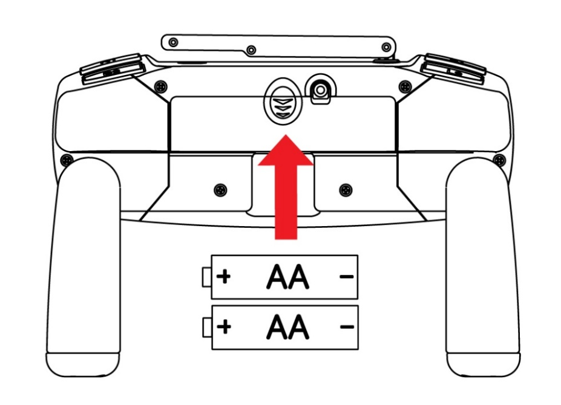
                

            </td>
        </tr>
        <tr>
            <td>
                

                배터리의 커넥터 부분을 아래 방향으로 하여 드론 뒤쪽의 배터리 프레임에 밀어 넣어서 끼웁니다. 
                

            </td>
            <td>
                

                조종기는 배터리로 일반 건전지 AA 사이즈 2개가 사용됩니다. 조종기 뒷면의 배터리 마개를 열고 극성 방향에 맞춰 1개씩 끼워 넣습니다.
                

            </td>
        </tr>
    </table>

 

<b>※배터리가 방전되면?!</b>

 

        <table>
        <tr>
            <td rowspan="2">
                

                    
                

            </td>
            <td>
                

                비행 중 드론의 배터리가 방전되면 드론에서는 부저음과 함께 메인 LED가 깜빡이고, 조종기에서는 계속해서 진동이 울립니다.  
                이 경우에는 즉시 드론을 착륙시킨 후, 방전된 배터리를 충전이 완료된 배터리로 교체합니다.
                

            </td>
        </tr>
        <tr>
            <td>
                

                [배터리 완충 시간 = <b>약 60분</b> / 비행 시간(1회 완충 시) = <b>약 8분</b>]
                

            </td>
        </tr>
    </table>

<h2>3. 리셋 및 페어링하기</h2>

드론과 조종기를 페어링해보아요.  
코딩드론은 한 번 페어링을 하면 계속 유지되지만 어떤 이유로 페어링이 끊어졌거나 다른 드론 또는 조종기와 페어링을 해야 하는 경우에는 리셋 후 다시 페어링을 해주어야 합니다. 

 

    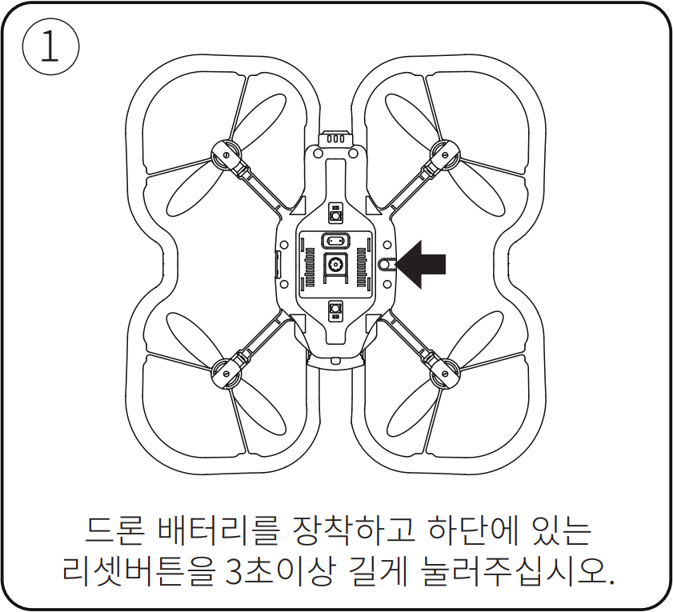
    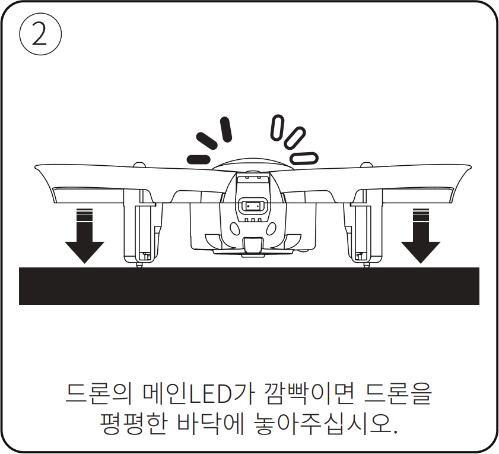
    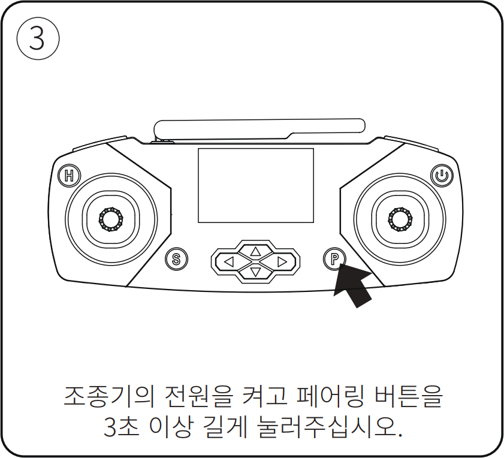
    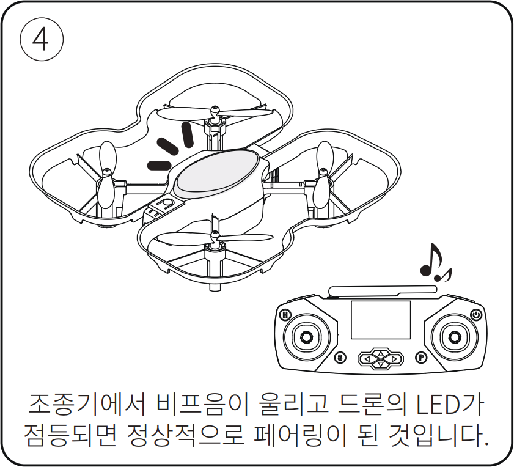

 

<h2>4. 사용시 주의사항</h2>

 
1) 드론 비행 전에 주변에 사람이나 장애물이 있는지 반드시 확인하고, 안전거리를 확보한 후 비행합니다. 
2) 배터리가 방전되면 즉시 착륙하여 충전이 완료된 배터리와 교체해서 사용합니다. 
3) 항상 최신 펌웨어를 설치합니다. 
- [펌웨어 프로그램 다운로드](http://dev.byrobot.co.kr/documents/kr/products/coding_drone/log/updates/firmware/) 
- [펌웨어 업데이트 매뉴얼](http://dev.byrobot.co.kr/documents/kr/products/coding_drone/manual/update/drone4autoupdaterlight/)  
4) 드론과 조종기에 심한 충격을 가하면 고장의 원인이 되므로 주의합니다. 

---

 

    <h1>[정리하기]</h1>

 

코딩드론이 무엇인지 잘 알 수 있었나요? 빨리 날려보고 싶다고요?  
다음 강의에서 코딩드론을 마음껏 날려보도록 해요! 
혹시 사용 중 문제가 발생하였는데 해결하기 어려운 경우에는 바이로봇 AS센터(031–227–9675, help@byrobot.co.kr)로 연락바랍니다.

        <table>
        <tr>
            <td>
                

                    1) 코딩드론은 코딩교육용 드론으로서 언플러그드 코딩과 플러그드 코딩이 모두 가능하여 코딩 학습에 최적화되어 있습니다. 
                    2) 코딩드론는 배터리는 충전을 완료하는데 약 60분 소요되며, 약 8분동안 비행할 수 있습니다. 
                    3) 배터리가 방전되면 즉시 드론을 안전하게 착륙시키고 충전이 완료된 배터리와 교체하여 사용합니다. 
                    4) 드론과 조종기는 한 번만 페어링을 해주면 페어링 상태가 유지되며, 다시 페어링을 해야 하는 경우에는 드론을 리셋시킨 후 페어링을 실시합니다. 
                

            </td>
        </tr>
    </table>

 

 

---

### [드론으로 코딩해요](../)

 1. **코딩드론과 친구해요**
 2. [코딩드론을 날려보아요](../lesson2)
 3. [코딩드론으로 카드코딩해요(1)](../lesson3)
 4. [코딩드론으로 카드코딩해요(2)](../lesson4)
 5. [코딩드론으로 카드코딩해요(3)](../lesson5)
 6. [코딩드론으로 모션코딩해요](../lesson6)
 7. [코딩드론으로 블록코딩해요(1)](../lesson7)
 8. [코딩드론으로 블록코딩해요(2)](../lesson8)

---

Modified : 2020.12.21