 

    <h1>Lesson 2. 코딩드론을 날려보아요</h1>

 

---

 

    <h1>[들어가기]</h1>

 

이번 강의에서는 코딩드론 조종법을 배워보고 직접 날려보도록 해요. 
조종법을 배우기에 앞서 먼저 드론이 어떻게 비행을 하는지 비행 원리에 대해 알아보아요. 
드론은 어떻게 전후, 좌우로 비행하고 이착륙을 할까요?  
드론의 비행 원리를 알기 위해서는 먼저 드론의 프로펠러가 어떻게 구성되어 있는지 알아야 합니다. 다음 그림을 보면서 알아볼까요?

 

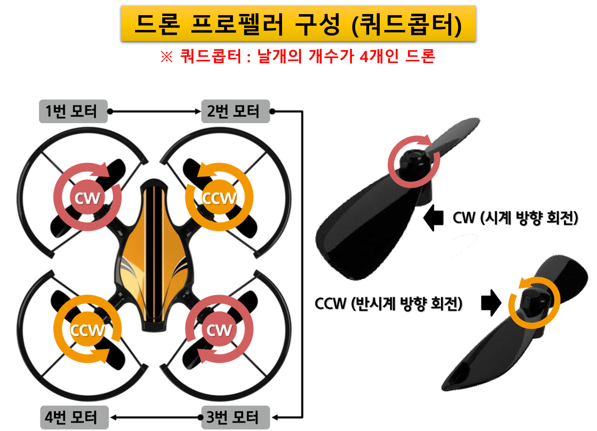

 

다음으로 드론이 어떻게 전진, 후진하고 회전 비행을 할 수 있는지 비행 원리에 대해 알아보아요. 
드론의 비행 원리는 <b>각 모터의 속도를 조절하여 프로펠러의 회전 속도를 다르게 한다</b>는 사실만 알면 쉽게 이해할 수 있어요.

 

    <table>
        <tr>
            <td>
                
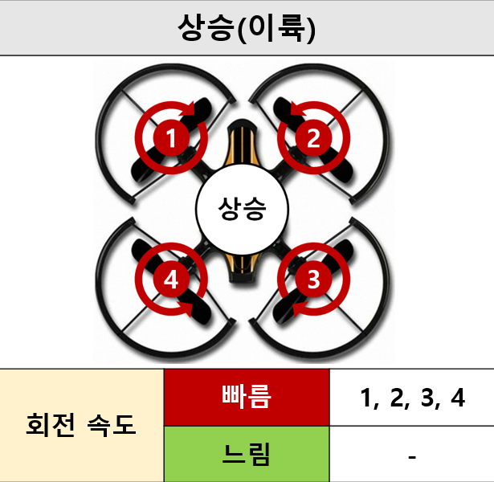

            </td>
            <td>
                
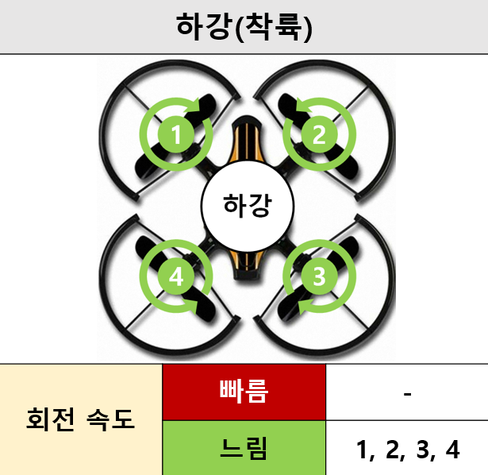

            </td>
        </tr>
        <tr>
            <td>
                
모든 프로펠러를 같은 속도로 빠르게 회전시켜 큰 양력을 발생시키고, 양력이 중력보다 크게 되면 상승하게 됩니다.  이륙할 때에도 같은 방법으로 이륙하게 됩니다.

            </td>
            <td>
                
모든 프로펠러를 같은 속도로 느리게 회전시켜 양력을 감소시키고, 양력이 중력보다 작게 되면 하강하게 됩니다.  착륙할 때에도 같은 방법으로 착륙하게 됩니다.

            </td>
        </tr>
        <tr>
            <td>
                
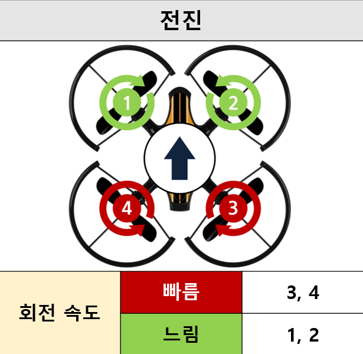

            </td>
            <td>
                
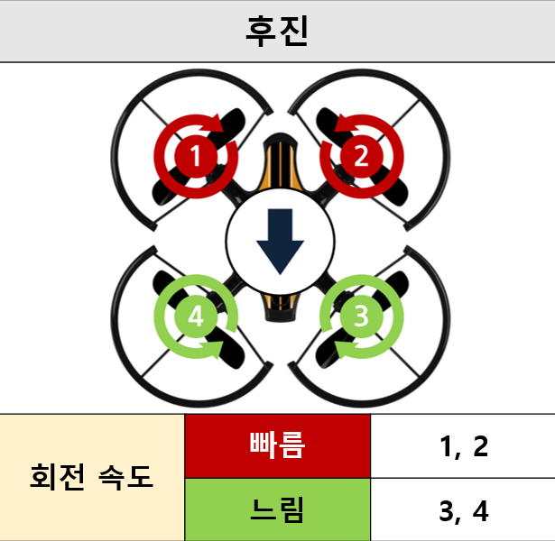

            </td>
        </tr>
        <tr>
            <td>
                
3, 4번 프로펠러는 빠르게, 1, 2번 프로펠러는 상대적으로 느리게 회전시키면, 드론의 뒤쪽 양력이 더 커져 위로 들리면서 앞쪽으로 기울어집니다. 이때 앞쪽으로 추진력이 발생하여 전진하게 됩니다.

            </td>
            <td>
                
1, 2번 프로펠러는 빠르게, 3, 4번 프로펠러는 상대적으로 느리게 회전시키면, 드론의 앞쪽 양력이 더 커져 위로 들리면서 뒤쪽으로 기울어집니다. 이때 뒤쪽으로 추진력이 발생하여 후진하게 됩니다.

            </td>
        </tr>
        <tr>
            <td>
                
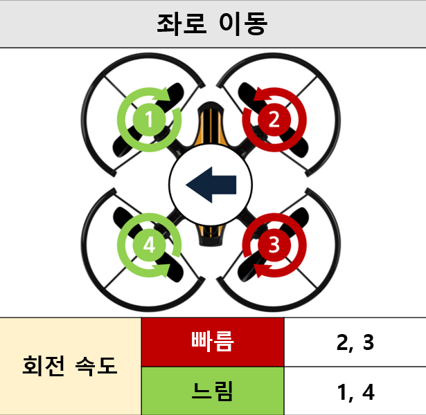

            </td>
            <td>
                
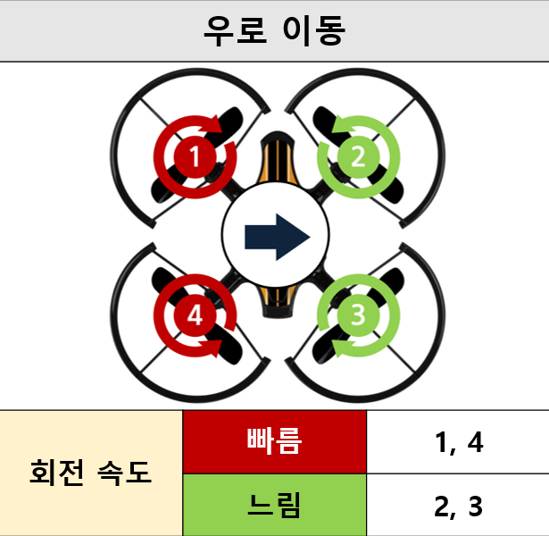

            </td>
        </tr>
        <tr>
            <td>
                
2, 3번 프로펠러는 빠르게, 1, 4번은 상대적으로 느리게 회전시키면, 드론의 오른쪽 양력이 더 커져 위로 들리면서 왼쪽으로 기울어집니다. 이때 왼쪽으로 추진력이 발생하여 좌로 이동하게 됩니다.

            </td>
            <td>
                
1, 4번 프로펠러는 빠르게, 2, 3번은 상대적으로 느리게 회전시키면, 드론의 왼쪽 양력이 더 커져 위로 들리면서 오른쪽으로 기울어집니다. 이때 오른쪽으로 추진력이 발생하여 우로 이동하게 됩니다.

            </td>
        </tr>
        <tr>
            <td>
                
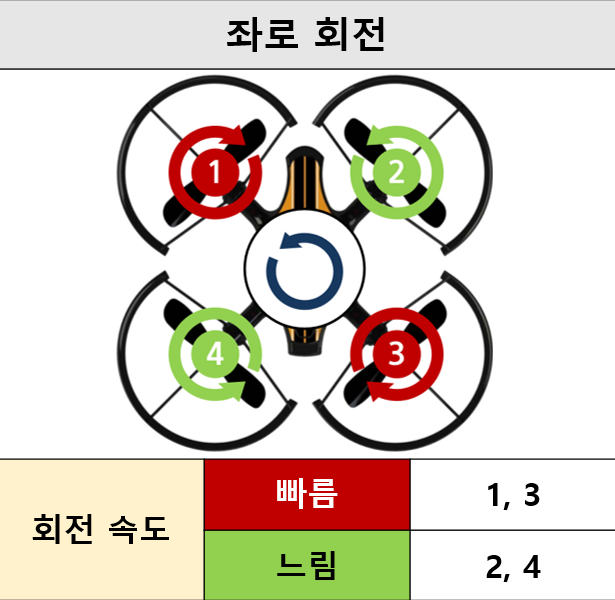

            </td>
            <td>
                
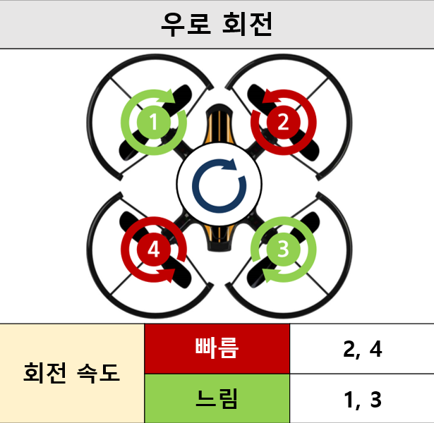

            </td>
        </tr>
        <tr>
            <td>
                
1, 3번 프로펠러는 빠르게, 2, 4번은 상대적으로 느리게 회전시키면, 1, 3번(프로펠러가 시계 방향으로 회전)의 토크가 2, 4번보다 커져서 드론이 반시계 방향(좌)으로 회전하게 됩니다.

            </td>
            <td>
                
2, 4번 프로펠러는 빠르게, 1, 3번은 상대적으로 느리게 회전시키면, 2, 4번(프로펠러가 반시계 방향으로 회전)의 토크가 1, 3번보다 커져서 드론이 시계 방향(우)으로 회전하게 됩니다.

            </td>
        </tr>
    </table>

 

<B>용어사전</b>

    <table>
        <tr>
            <td>
                
양력

            </td>
            <td>
                
항공기가 공중에 뜰 수 있게 해주는 힘입니다.

            </td>
        </tr>
        <tr>
            <td>
                
토크

            </td>
            <td>
                
회전하려는 힘으로서 기체는 프로펠러가 도는 방향과 반대로 회전하려는 성질이 있습니다.

            </td>
        </tr>
    </table>

 

지금까지 드론이 어떻게 정해진 방향으로 비행할 수 있는지 비행 원리에 대해 알아보았어요. 
그럼 이제 코딩드론 조종법을 배워볼까요? 

 

---

 

    <h1>[알아두기]</h1>

 

코딩드론 조종법에 대해 알아보아요. 드론의 조종모드는 4가지인데 코딩드론의 기본 조종모드는 모드2입니다.

 

    <table>
        <tr>
            <td colspan="4">
                
<h3>드론 조종모드</h3>

            </td>
        </tr>
        <tr>
            <td>
                
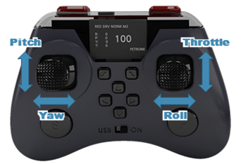

            </td>
            <td>
                
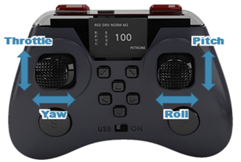

            </td>
            <td>
                
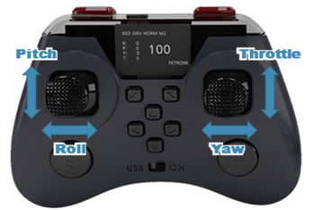

            </td>
            <td>
                
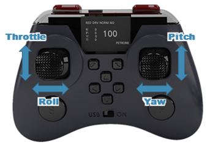

            </td>
        </tr>
        <tr>
            <td>
                
모드1

            </td>
            <td>
                
모드2

            </td>
            <td>
                
모드3

            </td>
            <td>
                
모드4

            </td>
        </tr>
    </table>

    <table>
        <tr>
            <td>
                
<h3>용어</h3>

            </td>
            <td>
                
<h3>비행 동작</h3>

            </td>
            <td>
                
<h3>내용</h3>

            </td>
        </tr>
        <tr>
            <td>
                
PITCH (피치)

            </td>
            <td>
                
전진/후진

            </td>
            <td>
                
드론이 전진/후진하는 동작 
(=드론이 앞/뒤로 기울어지는 동작)

            </td>
        </tr>
        <tr>
            <td>
                
ROLL (롤)

            </td>
            <td>
                
좌/우 이동

            </td>
            <td>
                
드론이 좌/우로 이동하는 동작 
(=드론이 좌/우로 기울어지는 동작)

            </td>
        </tr>
        <tr>
            <td>
                
THROTTLE (스로틀)

            </td>
            <td>
                
상승/하강

            </td>
            <td>
                
드론이 상승/하강하는 동작

            </td>
        </tr>
        <tr>
            <td>
                
YAW (요)

            </td>
            <td>
                
좌/우 회전

            </td>
            <td>
                
드론이 좌/우로 회전하는 동작 
(=드론이 수직축을 기준으로 좌/우로 회전하는 동작)

            </td>
        </tr>
    </table>

 

그럼 먼저 이륙과 착륙하는 방법부터 알아볼까요? 
코딩드론의 이착륙 방법은 2가지가 있습니다. 자동 이착륙과 수동 이착륙입니다.

 

<h2>1. 자동 이착륙</h2>

    <table>
        <tr>
            <td rowspan="2">
                
<h3>이륙</h3>

            </td>
            <td>
                
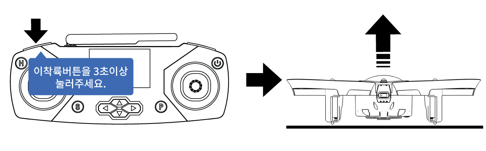

            </td>
        </tr>
        <tr>
            <td>
                
드론이 착륙한 상태에서 조종기의 자동 이착륙 버튼(왼쪽 레버 앞 L1 버튼)을 3초 이상 누르면 드론이 그 자리에서 이륙합니다.  
                자동 고도유지 기능이 작동하기 때문에 일정 높이까지 상승 후 제자리 비행을 합니다.

            </td>
        </tr>
        <tr>
            <td rowspan="2">
                
<h3>착륙</h3>

            </td>
            <td>
                
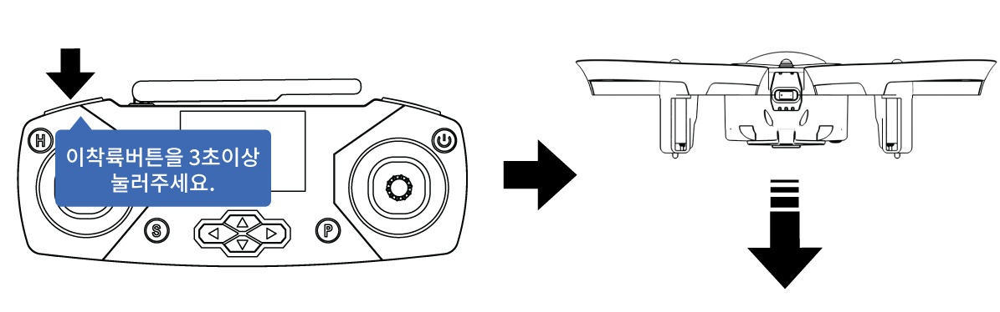

            </td>
        </tr>
        <tr>
            <td>
                
드론이 비행 중일 때, 조종기의 자동 이착륙 버튼(왼쪽 레버 앞 L1 버튼)을 3초 이상 누르면 드론이 그 자리에서 천천히 내려오며 착륙합니다.

            </td>
        </tr>
    </table>

 

<h2>2. 수동 이착륙</h2>

 

    <table>
        <tr>
            <td rowspan="2">
                
<h3>시동</h3>

            </td>
            <td>
                
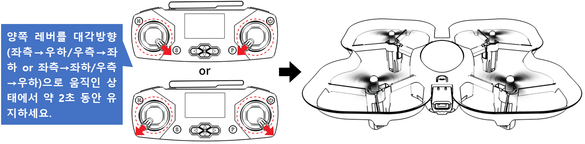

            </td>
        </tr>
        <tr>
            <td>
                
위 그림과 같이 조종기의 양쪽 레버를 대각방향(좌측→우하/우측→좌하 or 좌측→좌하/우측→우하)으로 움직인 상태에서 약 2초 동안 유지하면 모터에 시동이 걸리고 드론의 모든 프로펠러가 회전합니다.  
                그리고 레버를 다시 중립 상태로 원위치시킵니다. 모터에 시동을 거는 것만으로 드론이 이륙하지 않습니다. 
                <b>※ 모터에 시동이 걸려있는 상태에서 같은 방법으로 조종기의 레버를 움직이면, 모터의 시동이 꺼지면서 모든 프로펠러가 회전을 멈춥니다.  
                ※ 모터 시동과 중지는 드론이 착륙한 상태에서만 작동 가능합니다. </b>
                

            </td>
        </tr>
        <tr>
            <td rowspan="2">
                
<h3>이륙</h3>

            </td>
            <td>
                
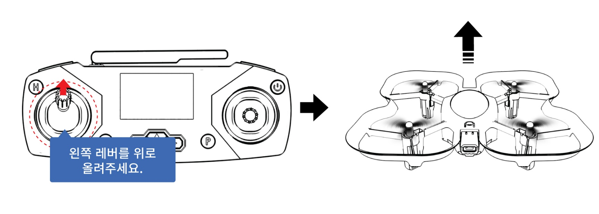

            </td>
        </tr>
        <tr>
            <td>
                
조종기의 왼쪽 레버를 위로 천천히 올리면 드론이 이륙합니다. 드론의 움직임을 보면서 레버를 조금씩 천천히 올리고, 원하는 높이까지 드론이 이륙하면 레버를 다시 중립 위치에 놓습니다.  
                이때, 레버를 너무 빠르게 또는 위로 많이 올리면 드론이 갑자기 위로 솟구치게 되므로 주의합니다.

            </td>
        </tr>
        <tr>
            <td rowspan="2">
                
<h3>착륙</h3>

            </td>
            <td>
                
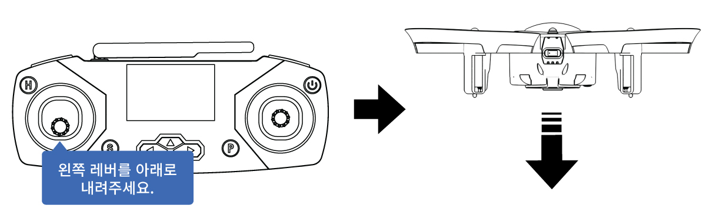

            </td>
        </tr>
        <tr>
            <td>
                
드론이 비행 중일 때, 조종기의 왼쪽 레버를 천천히 아래로 내리면 드론이 하강하기 시작합니다. 드론이 바닥에 닿은 후 레버를 가장 아래로 내리면, 모든 모터가 정지하며 착륙하게 됩니다.

            </td>
        </tr>
    </table>

 

코딩드론은 <b>비상정지</b> 기능이 있어요! 비상정지 기능은 긴급 상황이 발행하였을 때 드론의 모터를 정지시켜서 안전 사고를 예방할 수 있는 기능입니다.

 

    <table>
        <tr>
            <td>
                
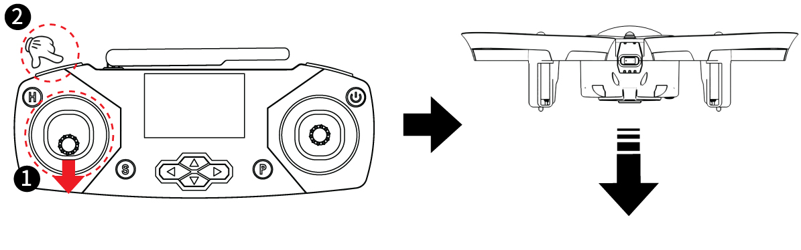

            </td>
        </tr>
        <tr>
            <td>
                
조종기의 왼쪽 레버를 아래로 내리면서(①) 왼쪽 레버 앞쪽 L1 버튼을 누르면(②) 드론의 모터가 정지합니다. <b>모든 모터가 정지하기 때문에 드론이 공중에 떠 있는 상태라면 바닥으로 추락하므로 주의해야 하며,</b> 모든 모터를 긴급하게 정지시켜야 하는 비상시에 사용합니다. 착륙시킬 때 사용하려면 드론이 바닥에 닿을 때까지 기다렸다가 L1 버튼을 누릅니다.

            </td>
        </tr>
    </table>

 

<h2>3. 기본 조종법</h2>

 

다음으로 코딩드론의 기본 조종법을 알아보아요.

 

    <table>
        <tr>
            <td rowspan="2">
                
<h3>상승 / 하강</h3>

            </td>
            <td>
                
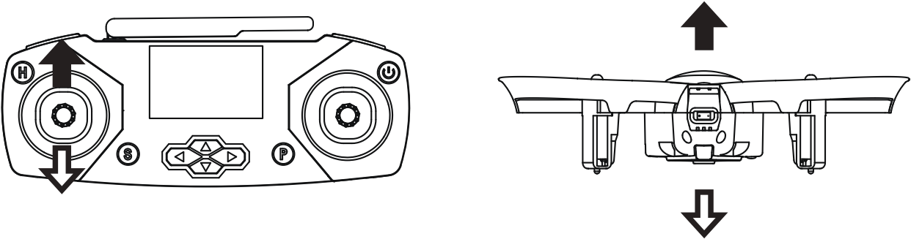

            </td>
            <td rowspan="2">
                
<h3>전진 / 후진</h3>

            </td>
            <td>
                
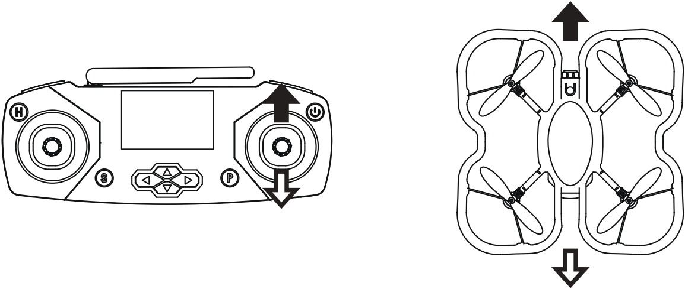

            </td>
        </tr>
        <tr>
            <td>
                
①	상승 : 왼쪽 레버를 위로 올리면 드론이 상승합니다. 
② 하강 : 왼쪽 레버를 아래로 내리면 드론이 하강합니다. 
<b>※ 상승/하강은 이륙/착륙과 같은 레버와 방향으로 조종합니다.</b>

            </td>
            <td>
                
①	전진 : 오른쪽 레버를 위로 올리면 드론이 전진합니다. 
② 후진 : 오른쪽 레버를 아래로 내리면 드론이 후진합니다.

            </td>
        </tr>
        <tr>
            <td rowspan="2">
                
<h3>좌회전 / 우회전</h3>

            </td>
            <td>
                
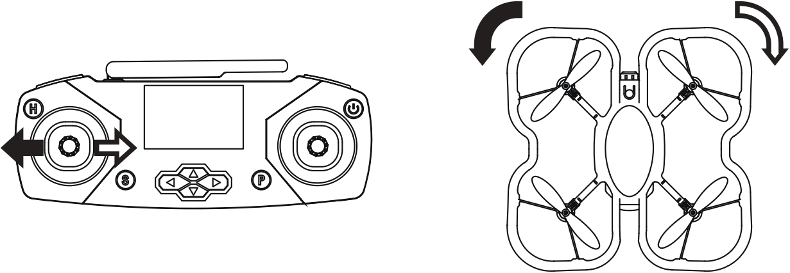

            </td>
            <td rowspan="2">
                
<h3>좌이동 / 우이동</h3>

            </td>
            <td>
                
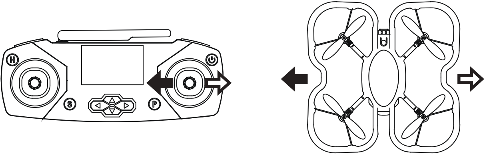

            </td>
        </tr>
        <tr>
            <td>
                
①	좌로 회전 : 왼쪽 레버를 좌로 움직이면 드론이 좌로 회전합니다. 
② 우로 회전 : 왼쪽 레버를 우로 움직이면 드론이 우로 회전합니다.

            </td>
            <td>
                
①	좌로 이동 : 오른쪽 레버를 좌로 움직이면 드론이 좌로 이동합니다. 
② 우로 이동 : 오른쪽 레버를 우로 움직이면 드론이 우로 이동합니다.

            </td>
        </tr>
    </table>

---

 

    <h1>[비행하기]</h1>

 

조종법을 배웠으니 이제 코딩드론을 날려볼까요? 비행하기 전에 다음 사항을 꼭 먼저 확인해주세요.
 

    <table>
        <tr>
            <td>
                
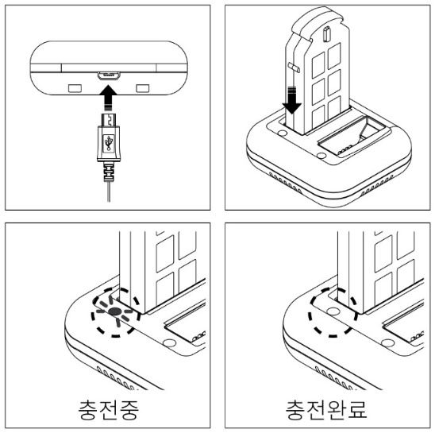

            </td>
            <td>
                
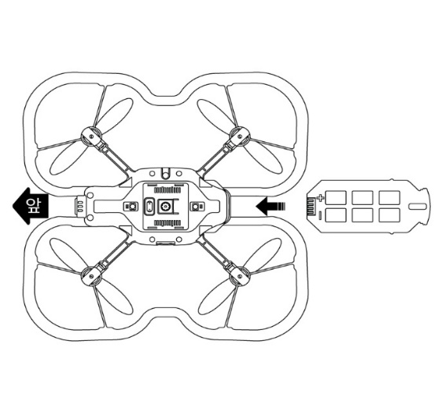

            </td>
            <td>
                
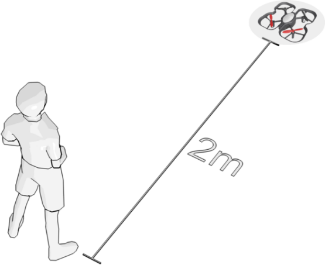

            </td>
            <td>
                
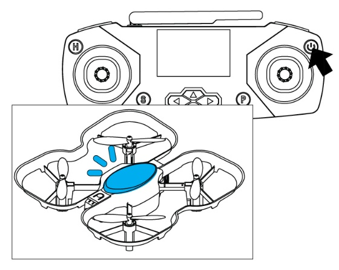

            </td>
        </tr>
        <tr>
            <td>
                
배터리는 전용 충전기를 이용해 충전이 완료된 것을 사용해요.

            </td>
            <td>
                
드론에 배터리를 연결해요. 
<b>※ 조종기는 전원 OFF 상태</b>

            </td>
            <td>
                
드론과 2m 정도의 안전거리를 확보하고, 주변에 사람이나 장애물이 없는지 확인해요.

            </td>
            <td>
                
조종기의 전원 버튼을 3초 이상 눌러서 전원을 켜요. 조종기에서 부저음이 들리고 드론의 LED가 점등되면 정상적으로 페어링된 상태입니다.

            </td>
        </tr>
    </table>

 

모든 사항을 확인하여 문제가 없다면 앞에서 배운 조종법을 잘 기억하면서 코딩드론을 날려보아요.

 

    <table>
        <tr>
            <td>
                
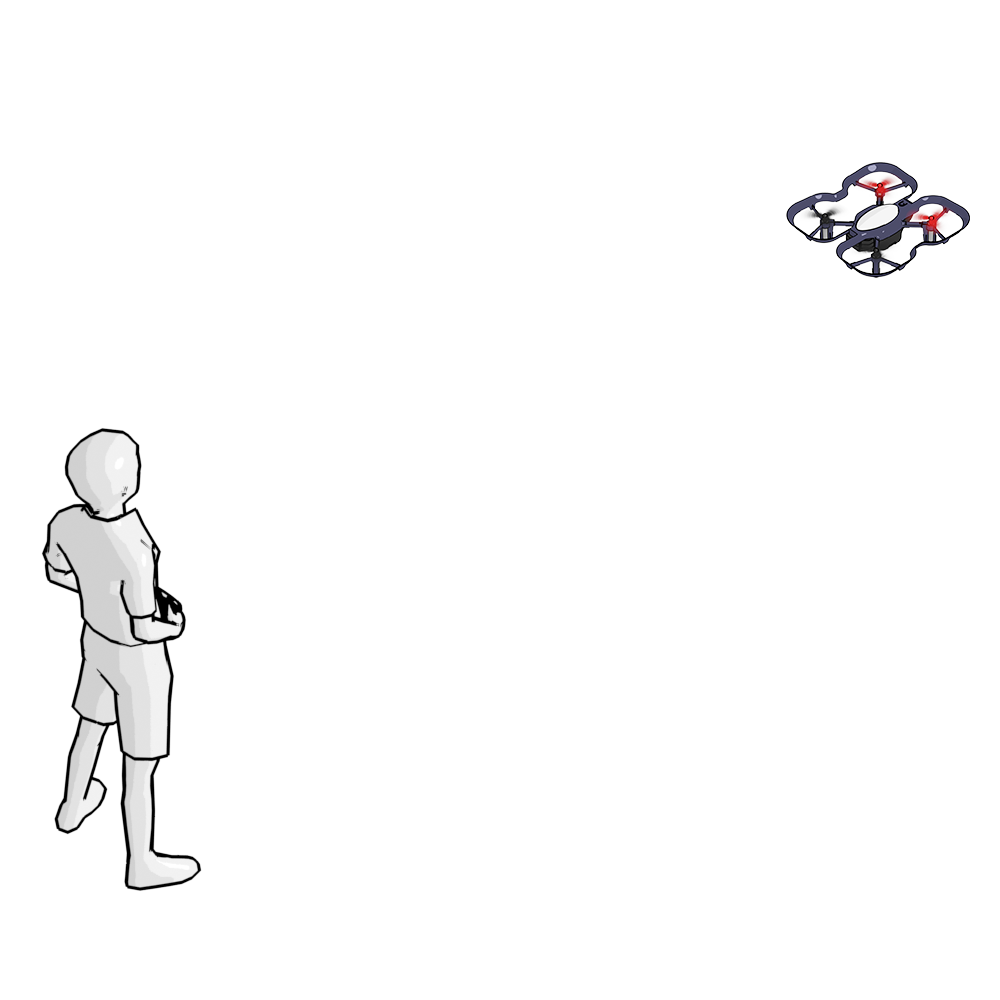

            </td>
        </tr>
    </table>

 

---

 

    <h1>[정리하기]</h1>

 

코딩드론을 직접 날려보니 재미있었나요?  
처음에는 드론을 조종하는 것이 어려울 수 있지만 조금만 연습하면 쉽게 날릴 수 있을거예요.  
그리고 코딩드론을 조종하면서 속도를 변경하거나 메인 LED의 색상도 변경할 수 있습니다. 
매뉴얼을 잘 보고 따라해보세요.

        <table>
        <tr>
            <td>
                

                    1) 드론의 프로펠러는 2가지 종류로 구분되고(시계 방향 회전/반시계 방향 회전), 서로 한 개씩 번갈아가며 조립되어 있습니다. 
                    2) 드론의 비행 원리는 각 프로펠러의 회전 속도를 다르게 하여 원하는 방향으로 드론을 이동시킵니다. 
                    3) 드론의 조종모드는 모드1부터 모드4까지 있으며, 코딩드론의 기본 조종모드는 모드2입니다. 
                    4) 코딩드론의 이착륙 방법은 자동과 수동, 2가지가 있습니다. 
                    5) 비행 중 긴급 상황 발생 시, 비상 정지 기능을 사용하여 코딩드론의 모든 모터를 즉시 정지시킬 수 있습니다. 
                    6) 드론을 조종하기 전에 배터리와 페어링 상태, 안전거리 확보, 주변 장애물 등을 먼저 확인합니다. 
                

            </td>
        </tr>
    </table>

 

---

### [드론으로 코딩해요](../)

 1. [코딩드론과 친구해요](../lesson1)
 2. **코딩드론을 날려보아요**
 3. [코딩드론으로 카드코딩해요(1)](../lesson3)
 4. [코딩드론으로 카드코딩해요(2)](../lesson4)
 5. [코딩드론으로 카드코딩해요(3)](../lesson5)
 6. [코딩드론으로 모션코딩해요](../lesson6)
 7. [코딩드론으로 블록코딩해요(1)] - 업데이트 예정
 8. [코딩드론으로 블록코딩해요(2)] - 업데이트 예정

---

Modified : 2020.12.22