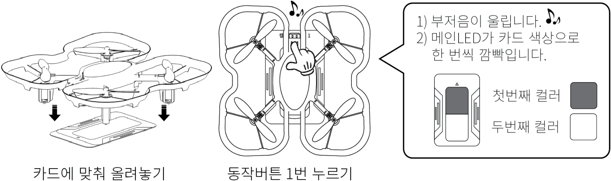

 

    <h1>Lesson 3. 코딩드론으로 카드코딩해요(1)</h1>

 

---

 

    <h1>[들어가기]</h1>

 

코딩드론은 세계 최초로 조종기 없이 코딩카드만으로 비행이 가능한 언플러그드 방식의 코딩 기능이 탑재되어 있습니다.  
이번 강의에서는 코딩드론으로 언플러그드 코딩하는 방법을 배워보고, 언플러그드 코딩 기능 중 하나인 카드코딩으로 간단히 비행을 해보려고 합니다.  

 

그럼 먼저 카드코딩이 무엇인지 알아볼까요?

 

    <table>
        <tr>
            <td>
                
<h3>카드 코딩이란?</h3>

            </td>
        </tr>
        <tr>
            <td>
                
카드코딩은 카드를 사용하여 코딩 학습을 할 수 있는 언플러그드 코딩 방식의 한 종류입니다. 활용하는 교구재와 카드에 따라서 카드코딩에도 다양한 방식들이 있는데, 코딩드론을 활용한 카드코딩 방식은 다음과 같습니다.  
☞	카드별로 색상(상/하 2가지 색상)이 있고 코딩드론에 내장된 컬러센서로 카드의 색상을 인식하여 카드를 읽을 수 있습니다. 카드를 읽으면 해당 카드에 입력된 명령을 코딩드론이 수행하게 됩니다. 

            </td>
        </tr>
    </table>

 

코딩카드는 기본으로 43장 제공되며, 총 8개의 카테고리로 구성되어 있습니다.

 

    <table>
        <tr>
            <td>
<b>카테고리</b>
</td>
            <td>
<b>코딩카드(명령) 종류</b>
</td>
        </tr>
        <tr>
            <td>
                
캘리브레이션

            </td>
            <td>
                컬러 캘리브레이션 1/5, 2/6, 3/7, 4/8
            </td>
        </tr>
        <tr>
            <td>
                
모드

            </td>
            <td>
                카드코딩 모드, 모션코딩 모드
            </td>
        </tr>
        <tr>
            <td>
                
코딩

            </td>
            <td>
                코딩 시작, 코딩 끝
            </td>
        </tr>
        <tr>
            <td>
                
동작

            </td>
            <td>
                1초 기다림
            </td>
        </tr>
        <tr>
            <td>
                
라이트

            </td>
            <td>
                메인전등 빨간색 켜기, 메인전등 노란색 켜기, 메인전등 녹색 켜기, 메인전등 파란색 켜기, 메인전등 끄기
            </td>
        </tr>
        <tr>
            <td>
                
이동

            </td>
            <td>
                이륙, 착륙, 전진, 후진, 왼쪽, 오른쪽, 상승, 하강, 좌회전, 우회전
            </td>
        </tr>
        <tr>
            <td>
                
설정

            </td>
            <td>
                0.3미터, 0.5미터, 1미터, 30도, 45도, 90도
            </td>
        </tr>
        <tr>
            <td>
                
조건

            </td>
            <td>
                앞쪽 장애물 발견하면, 빨간색 바닥 발견하면, 노란색 바닥 발견하면, 녹색 바닥 발견하면, 파란색 바닥 발견하면, 조건이 맞지 않으면, 조건 끝
            </td>
        </tr>
        <tr>
            <td>
                
반복

            </td>
            <td>
                무한 반복, 2회 반복, 3회 반복, 4회 반복, 반복 나가기, 반복 끝
            </td>
        </tr>
    </table>

 

코딩카드는 다음과 같이 디자인되어 있습니다. 
컬러 캘리브레이션용 코딩카드는 앞면과 뒷면에 각각 다른 색상이 그려져 있습니다. 그리고 나머지 코딩카드는 앞면에 명령어와 아이콘이 표시되어 있고, 뒷면에 색상이 그려져 있습니다.  
색상이 그려져 있는 면에는 좌우 양쪽에 드론 가드 문양이 그려져 있어서 코딩카드를 읽을 때 드론을 놓아야 할 위치를 알려줍니다. 

 

    <table>
        <tr>
            <td colspan="2">
                
<h3>컬러 캘리브레이션용 코딩카드</h3>

            </td>
            <td colspan="2">
                
<h3>기타 코딩카드</h3>

            </td>
        </tr>
        <tr>
            <td>
                

            </td>
            <td>
                

            </td>
            <td>
                

            </td>
            <td>
                

            </td>
        </tr>
        <tr>
            <td>
                
앞면

            </td>
            <td>
                
뒷면

            </td>
            <td>
                
앞면

            </td>
            <td>
                
뒷면

            </td>
        </tr>
    </table>

 

---

 

    <h1>[알아두기]</h1>

 

<h3>1. 코딩카드 읽기</h3> 
코딩카드를 읽는 방법은 다음과 같습니다. 

① 드론을 카드 위에(색상이 그려져 있는 면) 올려놓습니다. 이때, 카드의 드론 가드 문양에 맞춰 드론을 잘 올려놓습니다. 
② 드론 위쪽 앞부분의 동작버튼을 1번 누릅니다. 
<b>※ 동작버튼을 누를 때 너무 힘을 많이 주어 누르면 코딩드론이 손상될 수 있으므로 주의합니다.</b> 
③ 부저음이 울리면서 메인 LED가 카드 색상(상, 하 2가지 색상)으로 한 번씩 깜빡이면 정상적으로 카드를 읽은 것입니다. 
<b>※ 부저음과 메인 LED 색상은 카드별로 상이</b>
 

    <table>
        <tr>
            <td>
                
            </td>
        </tr>
    </table>

 

<h3>2. 컬러 캘리브레이션</h3> 
코딩드론의 컬러센서를 사용하여 코딩카드의 색상을 잘 인식하기 위해서는 컬러센서의 보정 작업이 필요합니다. 이 작업이 바로 컬러 캘리브레이션입니다. 컬러 캘리브레이션은 다음의 경우에 실시합니다. 

① 코딩드론으로 색상 인식이 잘 되지 않을 때 
② 코딩카드가 아닌 다른 인쇄물을 사용하여 코딩을 할 때 
 
컬러 캘리브레이션 하는 방법은 다음과 같습니다. 

    <table>
        <tr>
            <td>
                
<h3>준비물</h3>

            </td>
        </tr>
        <tr>
            <td>
                

            </td>
        </tr>
    </table>

    <table>
        <tr>
            <td>
                
<h3>컬러 켈리브레이션 방법</h3>

            </td>
        </tr>
        <tr>
            <td>
                

            </td>
        </tr>
        <tr>
            <td>
                

            </td>
        </tr>
        <tr>
            <td>
                

            </td>
        </tr>
    </table>

 
<h3>3. 기능별 모드 설정 방법</h3> 

    <table>
        <tr>
            <td>
                ① 언플러그드 모드의 기능별로 모드 카드(카드코딩/모션코딩)가 존재합니다. 동작버튼을 한 번 눌러서 모드 카드를 읽으면 해당 모드로 설정됩니다. 
② 모드 카드는 처음 한 번만 읽으면 되고 코딩드론의 전원을 끄거나 다른 모드로 전환하기 전까지 해당 모드를 유지합니다. 
③ 다른 모드로 전환하는 방법은 전환할 모드 카드를 읽으면 해당 모드로 전환됩니다.  
<b>※ 모드 카드를 읽으면 모드별로 다른 부저음이 울리고 메인 전등 색상이 달라지기 때문에 구분하기가 쉽습니다.</b> 

            </td>
        </tr>
    </table>

 
<h3>4. 코딩드론 정지시키는 방법</h3> 

언플러그드 코딩 활동을 하면서 드론이 비행 중일 때, 갑자기 멈춰야 하는 상황이 발생하면 조종기의 전원을 켠 후 조종모드로 변환하여 착륙시키면 됩니다.  조종기와 드론은 페어링이 되어있는 상태여야 하고, 조종기의 레버를 움직이면 바로 조종모드로 변환됩니다.  다시 언플러그드 코딩 모드로 전환하려면 전환하고 싶은 모드 카드를 읽어주면 됩니다.  

 

---

    <h1>[카드코딩 방법]</h1>

 
카드코딩은 다음 순서대로 실시합니다.
 

    <table>
        <tr>
            <td>

 
                ① 카드코딩 실행 방법은 코딩드론을 평평한 곳에 놓고 동작버튼을 2번 연속으로 누르면 약 2~3초 후 부저음(띠리릭)이 울리면서 자동으로 실행됩니다. 
                <b>※실행 후 즉시 드론으로부터 안전거리만큼 떨어집니다. 안전사고 주의!</b> 
② 한 번 입력된 코딩 명령은 메모리에 저장되어 계속 실행할 수 있습니다. 단, “코딩 시작” 카드를 다시 읽으면 초기화됩니다. 
<b>※코딩드론의 전원을 꺼도 저장되어 있습니다. (저장 가능한 최대 카드 개수 : 120장)</b> 
            </td>
        </tr>
    </table>

 

---

    <h1>[코드 생각하기]</h1>

 

지금부터는 직접 코딩해서 코딩드론을 날려보기로 해요.  
먼저 코딩하기 전에 코딩드론을 어떻게 비행시킬지 생각하여 코드를 만들어보아요. 
이번 강의에서는 기본 이동(전진/후진, 좌/우 이동, 상승/하강, 좌/우 회전)을 해볼거예요.

 

<h2>1. 전진/후진</h2>

 

먼저 전진과 후진 비행을 하려면 어떻게 코드를 짜야 할지 생각해봅시다. 다음과 같이 코드를 생각해보았어요.

    <table>
        <tr>
            <td>
                
동작 순서

            </td>
            <td>
                
시작 → 이륙 → 1칸 전진 → 1칸 후진 → 착륙 → 끝

            </td>
        </tr>
        <tr>
            <td>
                
카드 순서

            </td>
            <td>
                
            </td>
        </tr>
    </table>

 

<b>※ 이동 명령의 기본 이동 거리는 1m입니다</b>

 

<h2>2. 좌/우 이동</h2>

 

다음은 좌/우 이동 비행입니다. 1칸 좌로 이동 후 1칸 우로 이동하려면 어떻게 코드를 짜야 할지 생각해보아요.

    <table>
        <tr>
            <td>
                
동작 순서

            </td>
            <td>
                
시작 → 이륙 → 1칸 좌로 이동 → 1칸 우로 이동 → 착륙 → 끝

            </td>
        </tr>
        <tr>
            <td>
                
카드 순서

            </td>
            <td>
                
            </td>
        </tr>
    </table>

 

<h2>3. 상승/하강</h2>

 

다음은 상승/하강 비행입니다. 1칸 상승 후 1칸 하강하려면 어떻게 코드를 짜야 할지 생각해보아요.

    <table>
        <tr>
            <td>
                
동작 순서

            </td>
            <td>
                
시작 → 이륙 → 1칸 상승 → 1칸 하강 → 착륙 → 끝

            </td>
        </tr>
        <tr>
            <td>
                
카드 순서

            </td>
            <td>
                
            </td>
        </tr>
    </table>

 
<h2>4. 좌/우 회전</h2>

 

다음은 좌/우 회전 비행입니다. 90도 좌로 회전 후 90도 우로 회전하려면 어떻게 코드를 짜야 할지 생각해보아요.

    <table>
        <tr>
            <td>
                
동작 순서

            </td>
            <td>
                
시작 → 이륙 → 90도 좌회전 → 90도 우회전 → 착륙 → 끝

            </td>
        </tr>
        <tr>
            <td>
                
카드 순서

            </td>
            <td>
                
            </td>
        </tr>
    </table>

<b>※ 회전 명령의 기본 회전 각도는 90도입니다.</b>

 

---

 

    <h1>[코딩 및 실행하기]</h1>

 

이제 생각한 코드를 바탕으로 직접 코딩한 후 실행해보아요. 위에서 배웠던 카드코딩 방법 잊지 않았죠? 다음 순서대로 차근차근 따라해보세요. 

<h2>1. 전진/후진</h2>

 

    <table>
        <tr>
            <td rowspan="3">
                
<h3>1단계</h3>

            </td>
            <td colspan="2">
                
<h3>코딩카드 준비하기</h3>

            </td>
        </tr>
        <tr>
            <td colspan="2">
                

            </td>
        </tr>
        <tr>
            <td colspan="2">
            
카드코딩에 필요한 코딩카드들을 준비해보아요.

            </td>
        </tr>
        <tr>
            <td rowspan="4">
                
<h3>2단계</h3>

            </td>
            <td colspan="2">
                
<h3>코딩카드 준비하기</h3>

            </td>
        </tr>
        <tr>
            <td>
                
동작순서

            </td>
            <td>
                
이륙 → 1칸 전진 → 1칸 후진 → 착륙
<b>※ 1칸 이동 거리 = 1m</b>

            </td>
        </tr>
        <tr>
            <td colspan="2">
                

            </td>
        </tr>
        <tr>
            <td colspan="2">
            
동작 순서에 맞게 카드를 배열해 보아요. 코딩의 시작과 끝에는 항상 “코딩시작”과 “코딩끝” 카드가 온다는 것을 잊지 마세요!

            </td>
        </tr>
        <tr>
            <td rowspan="3">
                
<h3>3단계</h3>

            </td>
            <td colspan="2">
                
<h3>코딩카드 읽기</h3>

            </td>
        </tr>
        <tr>
            <td colspan="2">
                

            </td>
        </tr>
        <tr>
            <td colspan="2">
            
코딩드론에 배터리를 장착하여 전원을 켜고 코딩카드를 읽습니다.  코딩카드가 잘 읽히도록 올바른 위치에 코딩드론을 올려놓고(드론의 가드와 코딩카드의 가드 문양이 일치되게 합니다.) 카드 순서대로 동작버튼을 1번 눌러서 카드를 읽어주세요.  만약, 중간에 카드를 잘못 읽었다면 처음부터(=”코딩시작” 카드부터) 다시 시작합니다. 
            <b>※ “카드코딩 모드” 카드는 카드코딩을 시작할 때 한 번만 읽습니다.</b>

            </td>
        </tr>
    </table>

    <table>
        <tr>
            <td> 
<b><h3>1단계 코딩카드 준비하기</h3> </b>
</td>
        </tr>
        <tr>
            <td>
                

                     
                    카드코딩에 필요한 코딩카드들을 준비해보아요 
                    <b>※ “카드코딩 모드” 카드는 생략</b>
                

            </td>
        </tr>
        <tr>
            <td>
<b> <h3>2단계 코딩카드 배열하기</h3> 
            (1칸 전진 → 90도 좌회전) x 4번 반복</b>
</td>
        </tr>
        <tr>
            <td>
                

                     
                    동작 순서에 맞게 카드를 배열해 보아요. 코딩의 시작과 끝에는 항상 “코딩시작”과 “코딩끝” 카드가 온다는 것을 잊지 마세요
                

            </td>
        </tr>
        <tr>
            <td>
<b> <h3>3단계 코딩카드 읽기</h3> </b>
</td>
        </tr>
        <tr>
            <td>
                

                     
                    GoCar의 전원을 켜고 코딩카드를 읽습니다.  코딩카드가 잘 읽히도록 올바른 위치에 GoCar를 올려놓고 카드 순서대로 메인 전등 부분을 1번 눌러서 카드를 읽어주세요.  만약, 중간에 카드를 잘못 읽었다면 처음부터(=”코딩시작” 카드부터) 다시 시작합니다.  
                

            </td>
        </tr>
        <tr>
            <td>
<b> <h3>4단계 코딩 실행하기</h3> </b>
</td>
        </tr>
        <tr>
            <td>
                

                     
                    GoCar를 평평한 바닥에 놓고 메인 전등 부분을 연속으로 2번 눌러서 코딩을 실행합니다.  약 3초 후 GoCar가 자동으로 코딩한 명령을 수행합니다.  GoCar가 잘 주행할 수 있도록 매끄럽고 평평한 바닥에서 실행해주세요.  
                

            </td>
        </tr>
    </table>

 

다음은 반복문을 사용한 코드를 실행해보아요.

 

<h2>2. 사각형 패턴 주행(반복문 사용)</h2>

 

    <table>
        <tr>
            <td>
<b> <h3>1단계 코딩카드 준비하기</h3> </b>
</td>
        </tr>
        <tr>
            <td>
                

                     
                    카드코딩에 필요한 코딩카드들을 준비해보아요. 
                    <b>※ “카드코딩 모드” 카드는 생략</b>
                

            </td>
        </tr>
        <tr>
            <td>
<b> <h3>2단계 코딩카드 배열하기</h3>  
            동작순서 : (1칸 전진 → 90도 좌회전) x 4번 반복  </b>
</td>
        </tr>
        <tr>
            <td>
                

                     
                    동작 순서에 맞게 카드를 배열해 보아요. 코딩의 시작과 끝에는 항상 “코딩시작”과 “코딩끝” 카드가 온다는 것을 잊지 마세요!
                

            </td>
        </tr>
        <tr>
            <td>
<b> <h3>3단계 코딩카드 읽기</h3> </b>
</td>
        </tr>
        <tr>
            <td>
                

                     
                    GoCar의 전원을 켜고 코딩카드를 읽습니다.  코딩카드가 잘 읽히도록 올바른 위치에 GoCar를 올려놓고 카드 순서대로 메인 전등 부분을 1번 눌러서 카드를 읽어주세요.  만약, 중간에 카드를 잘못 읽었다면 처음부터(=”코딩시작” 카드부터) 다시 시작합니다.  
                

            </td>
        </tr>
        <tr>
            <td>
<b> <h3>4단계 코딩 실행하기</h3> </b>
</td>
        </tr>
        <tr>
            <td>
                

                     
                    GoCar를 평평한 바닥에 놓고 메인 전등 부분을 연속으로 2번 눌러서 코딩을 실행합니다. 
                    약 3초 후 GoCar가 자동으로 코딩한 명령을 수행합니다.  
                    GoCar가 잘 주행할 수 있도록 매끄럽고 평평한 바닥에서 실행해주세요. 
                

            </td>
        </tr>
    </table>

 

---

 

    <h1>[정리하기]</h1>

 

이번 강의에서는 GoCar로 사각형 패턴 주행하는 코딩을 해보았습니다.  
사각형 외에 다른 패턴들도 어떻게 코드를 짜야 할지 고민해보고 코딩해서 주행시켜보아요.  
반복되는 패턴은 반복문을 활용하면 더욱 쉽게 코드를 만들 수 있다는 것을 꼭 알아 두어요.

1. 패턴 주행이란 일정한 형태의 루트로 주행하는 것을 말하는데, 사각형, 원형, 8자 모양 등을 예로 들 수 있습니다.

2. 패턴 주행은 루트가 정형화되어 있기 때문에 일부 패턴이 반복되는 경우가 있는데, 이 경우에는 반복 카드를 사용할 수 있습니다.

3. 코딩에서 반복문을 활용하면 코드를 좀 더 간결하게 만들 수 있어서 코딩을 더욱 쉽게 할 수 있습니다.

 

---

### [코딩카드로 자율주행해요](../)

 1. [GoCar와 친구해요!](../lesson1)
 2. [GoCar로 카드코딩해요(1)](../lesson2)
 3. **GoCar로 카드코딩해요(2)**
 4. [GoCar로 카드코딩해요(3)](../lesson4)
 5. [GoCar로 카드코딩해요(4)](../lesson5)
 6. [GoCar로 라인코딩해요](../lesson6)
 7. [GoCar로 모션코딩해요](../lesson7)
 8. [GoCar로 따라가기해요](../lesson8)

---

Modified : 2020.6.26