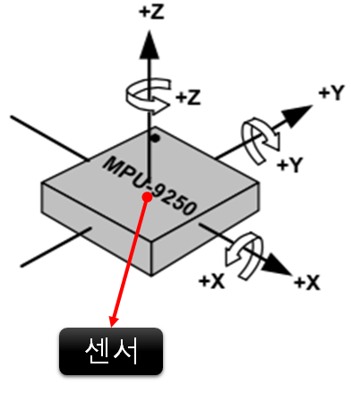
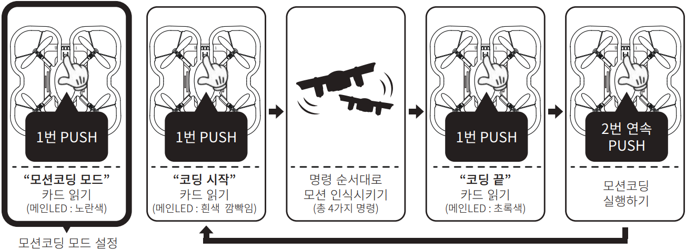
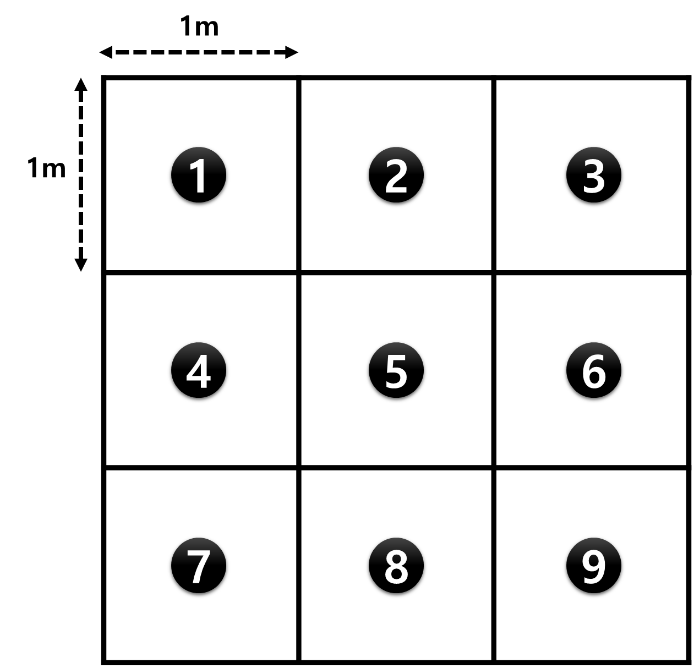
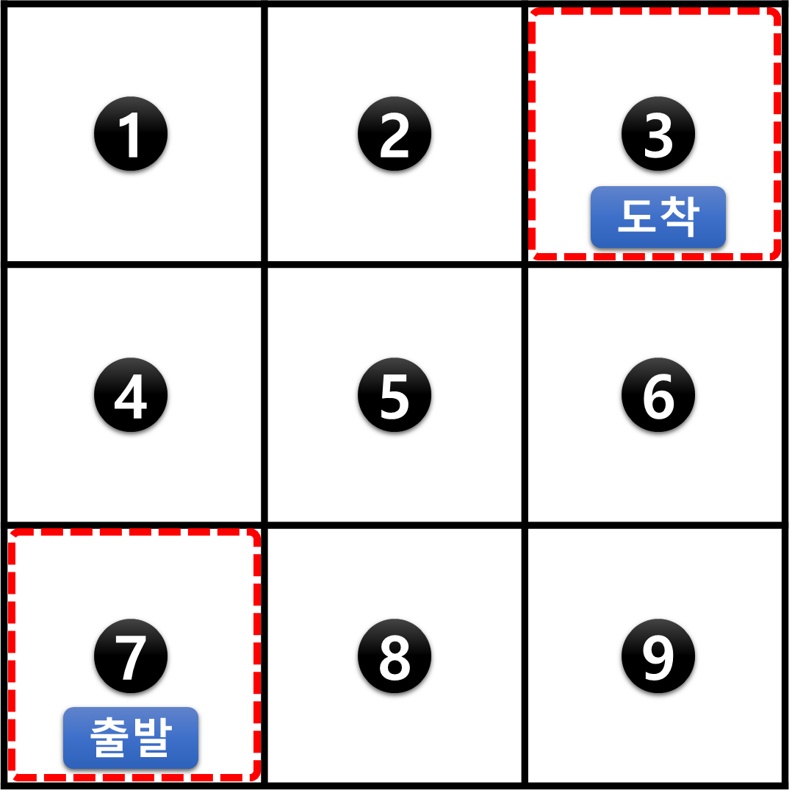
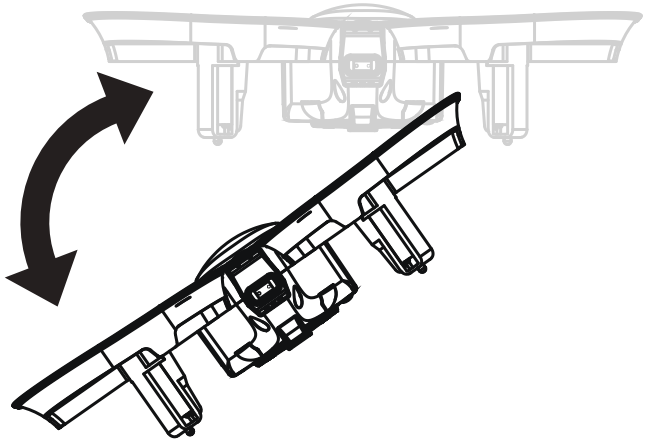
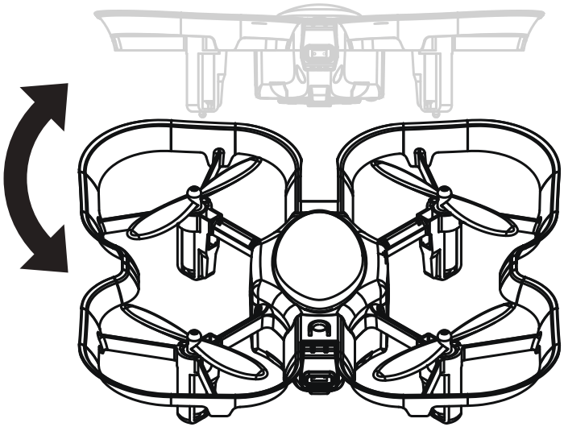
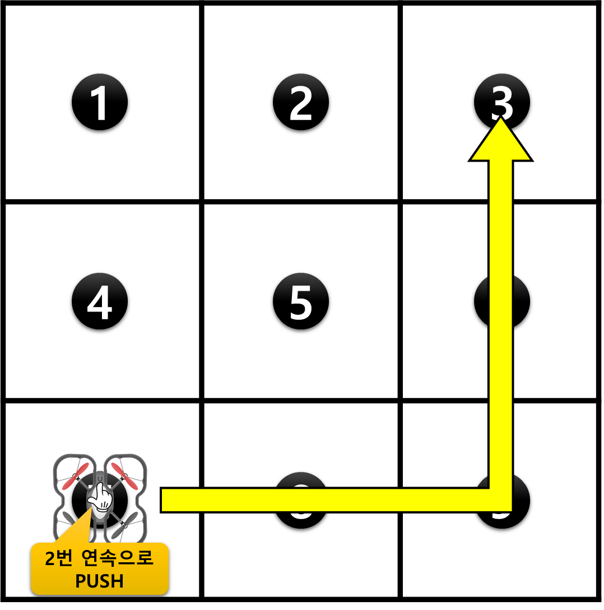

 

    <h1>Lesson 6. GoCar로 라인코딩해요</h1>

 

---

 

    <h1>[들어가기]</h1>

 

이번 강의에서는 GoCar로 2번째 언플러그드 코딩 기능인 라인코딩을 해보려고 합니다.  
먼저 라인코딩이 무엇인지 알아볼까요?

 

    <table>
        <tr>
            <td>
                
<b>라인코딩이란?</b>

            </td>
        </tr>
        <tr>
            <td>
                
☞	검은색(흰색 바탕) 또는 흰색(검은색 바탕) 라인을 따라서 주행하는 것을 라인코딩이라고 합니다.  
                GoCar의 하부에 장착된 컬러센서가 검은색과 흰색을 인식하여 라인을 따라 주행할 수 있습니다.
                

            </td>
        </tr>
        <tr>
            <td>
                

                    
                

            </td>
        </tr>
    </table>

 

그럼 이제 라인코딩을 하러 가볼까요?

 

---

 

    <h1>[라인코딩 방법]</h1>

 

라인코딩은 다음 순서로 실시합니다.

 

    <table>
        <tr>
            <td>
                

            </td>
        </tr>
        <tr>
            <td>
                
① 라인코딩 실행 방법은 GoCar를 라인 위에 올려놓고 메인 전등 부분을 2번 연속으로 누르면 약 2~3초 후 부저음(띠리릭)이 울리면서 자동으로 실행됩니다. 
                ② 라인코딩 정지 방법은 GoCar를 손으로 잡고 들어서 뒤집으면 모터가 정지합니다. 이렇게 정지하더라도 라인코딩 모드는 유지됩니다.
                

            </td>
        </tr>
    </table>

 

---

 

    <h1>[코딩 실행하기]</h1>

 

아래 라인코딩 실습판을 활용하여 GoCar로 라인코딩을 해볼 거예요. 가운데 ∞ 모양의 라인을 따라 주행합니다.

 

    <table>
        <tr>
            <td>
                
라인코딩 실습판

            </td>
            <td>
                
 
                

            </td>
        </tr>
    </table>

 

    <table>
        <tr>
            <td>
                
코딩 실행하기
                

            </td>
        </tr>
        <tr>
            <td>
                

            </td>
        </tr>
        <tr>
            <td>
                
“라인코딩 모드” 카드를 읽은 후 GoCar를 라인 위에 올려놓고 메인 전등 부분을 2번 연속으로 누릅니다.  
                약 2~3초간 좌우로 움직이면서 길을 찾은 후 출발합니다.  
                GoCar를 멈추게 하려면 손으로 잡고 들어서 뒤집으면 모터가 정지합니다.
                

            </td>
        </tr>
    </table>

GoCar가 라인을 따라 잘 주행하나요? 그렇다면 여러가지 다른 모양의 라인을 그려서 라인코딩을 해보세요.

 

---

 

    <h1>[더 알아보기]</h1>

 

라인코딩은 추가로 라인 위의 색상을 인식하여 특정 명령을 수행하는 기능이 있습니다.  인식할 수 있는 색상은 총 4가지이고 각각 다음과 같은 명령을 수행합니다.

 

    <table>
        <tr>
            <td bgcolor="red">
                
<b>빨간색</b>

            </td>
            <td bgcolor="magenta">
                
<b>보라색</b>

            </td>
            <td bgcolor="green">
                
<b>초록색</b>

            </td>
            <td bgcolor="yellow">
                
<b>노란색</b>

            </td>
        </tr>
        <tr>
            <td>
                

                

            </td>
            <td>
                

                
                

            </td>
            <td>
                

                
                

            </td>
            <td>
                

                
                

            </td>
        </tr>
        <tr>
            <td rowspan="2">색상을 인식한 위치에서 3초간 정지 후 다시 전진합니다.
            </td>
            <td rowspan="2">색상을 인식한 위치에서 U턴(좌로 180도 회전)한 후 다시 전진합니다.
            </td>
            <td>색상을 인식한 위치에서 좌회전합니다.
            </td>
            <td>색상을 인식한 위치에서 우회전합니다.
            </td>
        </tr>
        <tr>
            <td colspan="2"><b>※ 십자형(+) 교차로에서 2가지 색상(초록색, 노란색)이 모두 없으면 직진합니다.</b>
            </td>
        </tr>
    </table>

 

라인 위에 위 4가지 색상을 그려서 라인코딩을 해보아요.  
여러 개의 라인을 그린 후 4가지 색상을 사용하여 출발지에서 도착지까지 길을 찾아가는 놀이를 해보아도 좋을 것 같아요.

 

<b>※ 만약, GoCar가 라인 또는 라인 위의 4가지 색상을 잘 인식하지 못한다면 컬러 캘리브레이션 작업을 실시한 후 다시 실행해보세요.</b>

 

---

 

    <h1>[정리하기]</h1>

 

이번 강의에서는 GoCar의 2번째 언플러그드 코딩 기능인 라인코딩을 해보았습니다.  
검은색(또는 흰색)으로 그린 라인을 따라서 GoCar가 주행하는 모습이 귀엽지 않나요? 

여러 가지 다른 모양의 라인과 라인 위 4가지 색상(빨간색, 보라색, 초록색, 노란색)을 활용하여 라인코딩의 재미를 더 느껴보세요.

1. GoCar로 “라인코딩 모드” 카드를 읽으면 라인코딩 모드로 설정됩니다.

2. GoCar의 하부에 장착된 컬러센서가 검은색과 흰색을 인식하여 라인을 따라 주행할 수 있습니다.

3. 라인 위 4가지 색상을 인식하여 각각 설정된 명령을 수행할 수 있습니다. 
    ☞	빨간색 : 일시정지 / 보라색 : U턴 / 초록색 : 좌회전 / 노란색 : 우회전

4. 라인 위를 주행 중인 GoCar를 정지시키는 방법은 손으로 잡고 들어서 뒤집으면 모터가 정지합니다. 이때, 라인코딩 모드는 유지됩니다.

 

---

### [코딩카드로 자율주행해요](../)

 1. [GoCar와 친구해요!](../lesson1)
 2. [GoCar로 카드코딩해요(1)](../lesson2)
 3. [GoCar로 카드코딩해요(2)](../lesson3)
 4. [GoCar로 카드코딩해요(3)](../lesson4)
 5. [GoCar로 카드코딩해요(4)](../lesson5)
 6. **GoCar로 라인코딩해요**
 7. [GoCar로 모션코딩해요](../lesson7)
 8. [GoCar로 따라가기해요](../lesson8)

---

Modified : 2020.7.2