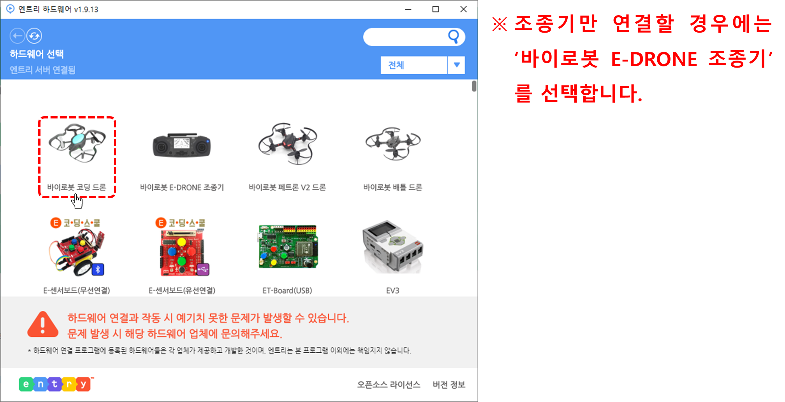

 

    <h1>Lesson 7. 코딩드론으로 블록코딩해요(1)</h1>

 

---

 

    <h1>[들어가기]</h1>

 

코딩드론은 언플러그드 코딩 뿐만 아니라 플러그드 코딩 기능도 지원합니다.  
현재 사용 가능한 플러그드 코딩 프로그램은 “엔트리”와 “파이썬”이 있습니다.  
이번 강의에서는 코딩드론과 엔트리를 어떻게 연결하고 코딩하는지 알아보기로 해요.

    <table>
        <tr>
            <td>
<h3>플러그드 코딩이란?</h3> 
</td>
        </tr>
        <tr>
            <td>
                
플러그드(Plugged)란 전기 플러그가 꽂혀있다는 뜻으로 전자제품인 컴퓨터, 모바일 기기 등을 사용하여 코딩 활동을 하는 것을 플러그드 코딩이라고 합니다.  
                플러그드 코딩의 한가지 예로 블록코딩을 들 수 있는데, 블록코딩은 교육용 프로그래밍 언어(EPL, Educational Programming Language)를 사용한 코딩 학습 활동입니다.  
                컴퓨터, 태블릿 등을 활용하여 블록 모양의 명령어를 순서대로 나열하면서 프로그램을 만들 수 있습니다. 
                대표적인 교육용 프로그래밍 언어로는 엔트리, 스크래치 등이 있습니다. 

            </td>
        </tr>
        <tr>
            <td>
                

                    
                

            </td>
        </tr>
    </table>

 

<b>※엔트리의 기본적인 사용법을 알고 있으면 좀 더 쉽게 이해할 수 있습니다. 
엔트리 홈페이지(https://playentry.org/)에서 엔트리를 학습해보세요..</b>

 

---

 

    <h1>[연결하기]</h1>

 

<h2> 1. 엔트리에 코딩드론 연결하기</h2>
 

다음과 같이 엔트리에 코딩드론을 연결합니다.

1) 준비물: PC, USB 케이블, 코딩드론, 스마트 조종기

2) 코딩드론에 배터리를 장착합니다.

3) 조종기를 USB 모드로 설정하고 USB 케이블을 이용하여 PC와 연결합니다.

<b>※드론과 조종기는 페어링이 되어있는 상태여야 합니다.</b> 
 

    
     

4) 엔트리 사이트(http://playentry.org)에 접속합니다.
 

    
     

<b>※엔트리는 PC에 프로그램을 설치하여 오프라인에서도 사용 가능합니다.</b> 
 

    
     

 

    < PC 최소 요구사항 > 
    <b>디스크 여유 공간 500MB 이상, windows7 혹은 MAC OS 10.8 이상</b>

 
5) 메인 메뉴에서 ‘만들기’를 클릭합니다.

    
     

6)	블록꾸러미에서 ‘하드웨어’ 카테고리를 클릭합니다.

    
     

7)	‘연결 프로그램 다운로드’ 버튼을 클릭하여 하드웨어 연결 프로그램 설치 파일을 다운로드한 후, 실행하여 프로그램을 설치합니다. 
<b>※ 오프라인 프로그램을 사용하는 경우에는 하드웨어 연결 프로그램이 기본적으로 포함되어 있으므로 별도로 설치할 필요가 없습니다.</b> 

    
     

8)	‘연결 프로그램 열기’ 버튼을 클릭합니다.

    
     

9)	상단에 뜨는 팝업창에서 ‘Entry_HW 열기’ 버튼을 클릭합니다.

    
     

10)	하드웨어 연결 프로그램의 하드웨어 목록 중에서 ‘바이로봇 코딩드론’을 클릭합니다.

    
     

11)	‘연결 성공’ 메시지가 나오면 정상적으로 연결된 것입니다.

    
     

12)	엔트리에서 코딩드론용 블록이 생성된 것을 확인할 수 있습니다.

    
     

 
<h2> 2. 연결 오류 발생 시 조치 방법</h2>
 
1) 연결 성공 후 코딩드론용 블록이 보이지 않는 경우  
    ①F5키를 눌러서 새로고침을 합니다. 
    ②블록꾸러미의 하드웨어 카테고리에서 ‘하드웨어 연결하기’ 버튼을 클릭합니다. 

    
     

 
2) 하드웨어 연결 프로그램에서 계속 ‘연결 중’으로 표시되는 경우 

    
     

    <table>
        <tr>
            <td>
                

                    ①	(1)	조종기가 USB 모드인지 확인합니다. USB 모드는 조종기 화면에 “LINK” 문구가 표시됩니다.
                     
                

            </td>
            <td>
                

                    ②	코딩드론과 컴퓨터의 연결이 정상인지 확인합니다
                     
                

            </td>
        </tr>
    </table>

3) 코딩드론과 컴퓨터의 연결이 정상적이지 않은 경우

    
     

①	컴퓨터의 USB 포트가 접촉 불량일 수도 있으므로 다른 USB 포트에 연결해봅니다. 
②	USB 케이블이 불량일 수도 있으므로 USB 케이블을 교체해봅니다. 
 

---

 

    <h1>[알아두기]</h1>

 

<h2>1. 코딩드론용 엔트리 블록</h2> 
<b>※엔트리 블록에 대한 자세한 설명은 블록 매뉴얼 자료를 참조해주세요.</b> 
<h4>1) 드론 센서 블록</h4>

    <table>
        <tr>
            <td>
                

                     
                

            </td>
            <td>
                - 코딩드론의 여러 가지 센서들의 측정값을 확인할 수 있습니다. 
            </td>
        </tr>
    </table>

<h4>2) 조종기 버튼/조이스틱(레버) 판단 블록</h4>

    <table>
        <tr>
            <td>
                

                     
                

            </td>
            <td>
                - 조종기의 버튼 및 조이스틱(레버) 동작을 판단하는 블록으로 조건문 블록에 조건 사항으로 사용합니다.  
                - 조종기 동작 신호를 발생시켜서 특정 명령을 수행하도록 할 수 있습니다. 
            </td>
        </tr>
    </table>

<h4>3) 드론 비행 블록</h4>

    <table>
        <tr>
            <td>
                

                     
                

            </td>
            <td>
                - 드론 모드 설정을 할 수 있습니다. 
                - 드론을 이륙/착륙 및 비행시킬 수 있습니다. 
            </td>
        </tr>
    </table>

<h4>4) 드론 모터 블록</h4>

    <table>
        <tr>
            <td>
                

                     
                

            </td>
            <td>
                - 드론 모터를 개별적으로 회전시킬 수 있습니다. 
            </td>
        </tr>
    </table>

<h4>5) 드론 LED 블록</h4>

    <table>
        <tr>
            <td>
                

                     
                

            </td>
            <td>
                - 드론의 LED를 다양한 색상으로 꾸밀 수 있습니다. 
            </td>
        </tr>
    </table>

<h4>6) 조종기 LED 블록</h4>

    <table>
        <tr>
            <td>
                

                     
                

            </td>
            <td>
                - 조종기의 LED를 다양한 색상으로 꾸밀 수 있습니다. 
            </td>
        </tr>
    </table>

<h4>7) 조종기 화면 그리기 블록</h4>

    <table>
        <tr>
            <td>
                

                     
                

            </td>
            <td>
                - 조종기의 LCD 화면에 점, 선, 도형을 그리고 문자를 표시할 수 있습니다. 
            </td>
        </tr>
    </table>

<h4>8) 드론/조종기 버저 블록</h4>

    <table>
        <tr>
            <td>
                

                     
                

            </td>
            <td>
                - 드론/조종기의 버저(Buzzer)음으로 음계를 연주할 수 있습니다. 
            </td>
        </tr>
    </table>

<h4>9) 조종기 진동 블록</h4>

    <table>
        <tr>
            <td>
                

                     
                

            </td>
            <td>
                - 조종기의 진동을 켜고 끌 수 있습니다. 
            </td>
        </tr>
    </table>

 
<h2> 2. 사용 시 주의사항</h2>

1) 드론의 배터리가 완전히 충전된 상태에서 사용해주시고, 배터리 잔량이 50% 미만이면 비행 퍼포먼스에 영향을 줄 수 있습니다. 30% 미만이 되면 배터리를 교체합니다.

2) 배터리 잔량과 모터, 프로펠러 등 부품의 상태(모터 성능, 프로펠러 결함 여부 등)에 따라 비행 상태에 좋고 나쁨의 차이가 발생할 수 있습니다.

3) 드론과 조종기는 항상 최신 펌웨어를 설치합니다.

4) 프로그램 오류 등으로 인해 드론에 오작동이 발생할 수 있으니 가급적 넓은 공간에서 사용해주시고, 주변에 사람이나 장애물이 없는지 확인합니다.

 

<h2> 3. 드론을 강제로 멈추는 방법</h2>
 
<b>※엔트리에서 코딩드론 사용 중에 오류가 발생하거나 드론이 원하는 방향으로 비행하지 않게 되면 드론을 강제로 멈춰야 합니다.</b> 

1) 실행 중인 엔트리 화면을 마우스로 클릭하여 실행을 종료시키면 드론이 현재 위치에서 바로 착륙합니다.

2) 엔트리 코드에 비상시 착륙할 수 있도록 착륙용 코드를 만들어서 사용합니다. 키보드의 특정 키를 눌렀을 때 드론이 착륙하도록 합니다. 아래 코드는 한가지 예시입니다.

    <table>
        <tr>
            <td>
                

                     
                

            </td>
            <td>
                - 스페이스 키를 누르면 드론을 착륙 시킵니다. “비행 동작 상태”란 코딩드론의 여러 가지 동작을 코드화 시켜서 코딩 시 활용할 수 있게 만든 블록입니다. 
                

                <table>
                    <tr>
                        <td>
                            

                                비행모드
                            

                        </td>
                        <td>
                            

                                코드
                            

                        </td>
                    </tr>
                    <tr>
                        <td>
                            

                                대기(Ready)
                            

                        </td>
                        <td>
                            

                                16
                            

                        </td>
                    </tr>
                    <tr>
                        <td>
                            

                                시동(Start)
                            

                        </td>
                        <td>
                            

                                17
                            

                        </td>
                    </tr>
                    <tr>
                        <td>
                            

                                이륙(Take off)
                            

                        </td>
                        <td>
                            

                                18
                            

                        </td>
                    </tr>
                    <tr>
                        <td>
                            

                                비행(Flight)
                            

                        </td>
                        <td>
                            

                                19
                            

                        </td>
                    </tr>
                    <tr>
                        <td>
                            

                                착륙(Landing)
                            

                        </td>
                        <td>
                            

                                20
                            

                        </td>
                    </tr>
                    <tr>
                        <td>
                            

                                정지(Stop)
                            

                        </td>
                        <td>
                            

                                32
                            

                        </td>
                    </tr>
                </table>
                

            </td>
        </tr>
    </table>

---

 

    <h1>[코드 생각하기]</h1>

코딩드론과 엔트리 연결에 성공하였다면 직접 블록코딩하여 간단한 비행을 한 번 해볼까요? 
이번 시간에는 드론이 이륙해서 1m 전진한 후 착륙하는 비행을 해보도록 해요. 

 

    <table>
        <tr>
            <td rowspan="2">
                

            </td>
            <td>
                

                동작 순서
                

            </td>
        </tr>
        <tr>
            <td>
                

                ① 드론이 이륙합니다. 
                ② 드론이 1m 전진한 후 호버링합니다. 
                ③ 드론이 착륙합니다. 
                

            </td>
        </tr>
    </table>

 

먼저 이륙, 착륙, 그리고 전진 명령에 사용되는 블록들이 무엇인지 알아볼까요? 

    <table>
        <tr>
            <td>
                
블록

            </td>
            <td colspan="2">
                

                설명
                

            </td>
        </tr>
        <tr>
            <td>
                

            </td>
            <td colspan="2">
                
드론이 착륙해 있는 상태에서 이륙합니다. 일정 고도(약 1m)까지 상승 후 호버링합니다.

            </td>
        </tr>
        <tr>
            <td>
                

            </td>
            <td colspan="2">
                
드론이 비행 중인 상태에서 착륙합니다.   
                착륙하여 모터가 완전히 멈출 때까지 기다려주세요.  
                드론이 너무 높이 있거나 또는 낮게 있을 때 착륙 명령을 사용하지 않습니다.  
                (1m 높이 정도가 적당합니다.)

            </td>
        </tr>
        <tr>
            <td rowspan="4">
                

            </td>
            <td colspan="2">
                
다음 옵션의 설정값에 따라 드론이 기본 비행합니다. 
                <b>※ 기본 비행: 전진, 후진, 좌로 이동, 우로 이동, 상승, 하강</b>
                

            </td>
        </tr>
        <Tr>
            <td>
                
옵션1

            </td>
            <td>
                
기본 비행 방향을 설정합니다. 
                ① 앞 = 전진 
                ② 뒤 = 후진 
                ③ 왼쪽 = 좌로 이동 
                ④ 오른쪽 = 우로 이동 
                ⑤ 위 = 상승 
                ⑥ 아래 = 하강
                

            </td>
        </tr>
        <Tr>
            <td>
                
옵션2

            </td>
            <td>
                
이동할 거리를 설정합니다. 
                (단위: m, 소수점 사용 가능)

            </td>
        </tr>
        <Tr>
            <td>
                
옵션3

            </td>
            <td>
                
이동 속도를 설정합니다. 
                (단위: m/s, 소수점 사용 가능)
                

            </td>
        </tr>
    </table>

 

그럼 이제 위 블록들을 사용하여 어떻게 코드를 짜면 될지 생각해보아요. 다음과 같이 코드를 생각해보았어요.

 

    <table>
        <tr>
            <td colspan="2">
                
코드

            </td>
        </tr>
        <tr>
            <td>
                

                동작순서
                

            </td>
            <td>
                

                이륙 → 5초간 기다리기(=호버링) → 1m 전진 → 착륙
                

            </td>
        </tr>
        <tr>
            <td colspan="2">
                

                

            </td>
        </tr>
    </table>

 

    <table>
        <tr>
            <td>
                

            </td>
            <td>
                

                이륙 및 이동 명령 사이에 기다리기 명령을 사용하여 이동 후 드론이 위치를 잡고 안정적인 자세를 유지할 수 있는 시간을 주세요.
                

            </td>
        </tr>
    </table>

 

---

 

    <h1>[코딩 및 실행하기]</h1>

 

<h2> 1. 코딩하기</h2>

 

 

<h2> 2. 실행하기</h2>

 

코드를 모두 만들었다면 시작하기 버튼을 클릭하여 실행해보아요. 
실행하기 전에 다음 사항을 먼저 확인합니다. 

    <table>
        <tr>
            <td>
                

            </td>
            <td>
                
<b>
                잠깐! 엔트리에서 드론 자율비행 코드를 실행하기 전에 한 번 더 확인해봐요!</b>  
                1) 드론과의 안전거리(2m 이상)를 확보합니다. 
                2) 드론 주변에 사람이나 장애물이 없는지 확인합니다. 
                ☞ 코드의 드론 이동 방향과 거리를 예측하여 경로에 사람이나 장애물이 없는지 확인합니다. 
                3) 드론의 오작동이나 엔트리 오류 발생 시 드론을 강제로 멈추는 방법을 확인합니다.
                

            </td>
        </tr>
    </table>

 

자 그럼, 준비되었다면 실행해볼까요?  
드론이 동작 순서대로 비행하나요?  
만약 자신이 생각한대로 비행하지 않는다면 어느 부분이 잘못되었는지 확인하여 수정한 후 다시 실행해보세요. 

 

---

 

    <h1>[정리하기]</h1>

 

이번 강의에서는 코딩드론의 새로운 코딩 기능인 플러그드 코딩이 무엇인지 배우고 엔트리를 사용하여 직접 블록코딩도 해보았습니다.  
엔트리에서는 카드코딩보다 다양하고 수준 높은 코딩을 할 수 있습니다.  
코딩드론의 여러가지 블록을 사용하여 코딩해보면서 자율비행의 재미에 빠져보아요! 

    <table>
        <tr>
            <td>
                

                    1) 플러그드(Plugged)란 전기 플러그가 꽂혀있다는 뜻으로 전자제품인 컴퓨터, 모바일 기기 등을 사용하여 코딩 활동을 하는 것을 플러그드 코딩이라고 합니다 
                    2) 블록코딩은 플러그드 코딩의 한가지 예로서 교육용 프로그래밍 언어(EPL, Educational Programming Language)를 사용한 코딩 학습 활동입니다. 
                    ☞ 교육용 프로그래밍 언어: 엔트리, 스크래치 등 
                    3)코딩드론과 엔트리 연결 방법은 PC와 조종기를 USB 케이블로 연결한 후 엔트리를 실행하여 코딩드론과 하드웨어 연결을 합니다. 
                    4)코딩드론용 엔트리 블록은 센서, 비행, LED, 버저 등 다양한 카테고리로 구성되어 있습니다. 
                    5)엔트리에서 코딩드론 사용 중에 오류가 발생하거나 드론이 원하는 방향으로 비행하지 않게 되면 드론을 강제로 멈춰야 하는데, 방법은 다음과 같습니다. 
                    (1)	실행 중인 엔트리 화면을 마우스로 클릭하여 실행을 종료시키면 드론이 현재 위치에서 바로 착륙합니다. 
                    (2)	엔트리 코드에 비상시 착륙할 수 있도록 착륙용 코드를 만들어서 사용합니다. 
                    6)엔트리에서 코딩드론으로 자율비행 코딩을 실행하기 전에 안전 수칙을 먼저 확인합니다.
                

            </td>
        </tr>
    </table>

 

---

### [드론으로 코딩해요](../)

 1. [코딩드론과 친구해요](../lesson1)
 2. [코딩드론을 날려보아요](../lesson2)
 3. [코딩드론으로 카드코딩해요(1)](../lesson3)
 4. [코딩드론으로 카드코딩해요(2)](../lesson4)
 5. [코딩드론으로 카드코딩해요(3)](../lesson5)
 6. [코딩드론으로 모션코딩해요](../lesson6)
 7. **코딩드론으로 블록코딩해요(1)**
 8. [코딩드론으로 블록코딩해요(2)] - 업데이트 예정

---

Modified : 2021.1.22