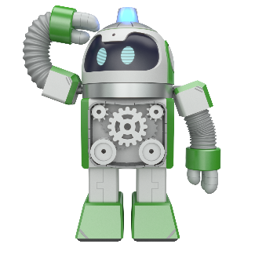

 

    <h1>Lesson 8. 코딩드론으로 블록코딩해요(2)</h1>

 

---

 

    <h1>[들어가기]</h1>

 

이번 강의에서는 조종기의 버튼을 눌러서 드론을 조종하는 코딩을 해보도록 해요.  
조종기의 레버를 이용하여 드론을 조종하는 것이 아니라 버튼을 눌러서 조종한다고 생각하니 신기하지 않나요?   
코딩드론용 블록 중에서 조종기 버튼 이벤트 블록을 사용하면 버튼별로 이동 명령을 줄 수 있습니다. 
여기서는 이륙 및 착륙과 기본 비행(전진, 후진, 좌로 이동, 우로 이동)을 해볼거예요.  
 
그럼 시작해볼까요?

 

---

    <h1>[코드 생각하기]</h1>

 
엔트리에서 조종기 버튼과 레버 관련 블록은 2가지 종류가 있습니다.
 

    <table>
        <tr>
            <td>
                

                    조종기 버튼 이벤트 블록
                

            </td>
            <td colspan="2">
                

                    ▶ 조종기의 버튼을 눌렀을 때 신호를 발생시켜 True 값을 반환합니다.
                

            </td>
        </tr>
        <tr>
            <td>
                

                    
                

            </td>
            <td>
                

                    <b>버튼 종류</b>
                

            </td>
            <td>
                

                    1. 전면 왼쪽 상단/하단 버튼 
                    2. 전면 오른쪽 상단/하단 버튼 
                    3. 상단 왼쪽/오른쪽 버튼 
                    4. 하단 왼쪽/오른쪽 버튼 
                    5. 중앙 위쪽/아래쪽/왼쪽/오른쪽 버튼(=트림 버튼)
                

            </td>
        </tr>
        <tr>
            <td>
                

                    조종기 조이스틱(레버) 이벤트 블록
                

            </td>
            <td colspan="2">
                

                    ▶ 조종기의 조이스틱(레버)을 특정 방향으로 움직였을 때 신호를 발생시켜 True 값을 반환합니다.
                

            </td>
        </tr>
        <tr>
            <td>
                

                    
                

            </td>
            <td>
                

                    <b>조이스틱(레버) 방향(왼쪽/오른쪽 공통)</b>
                

            </td>
            <td>
                

                    총 9방향 : 상, 좌상, 우상, 하, 좌하, 우하, 좌, 우, 센터
                

            </td>
        </tr>
        <tr>
            <td colspan="3">
                

                    다음과 같이 엔트리의 조건문 블록에 판단 블록으로 조립하여 사용합니다.  
                

                

                    
                

            </td>
        </tr>
    </table>

 

조종기 버튼에 따라 드론이 다음과 같이 동작하는 코딩을 해보아요.

    <table>
        <tr>
            <td>
                

                    
                

            </td>
            <td>
                

                    
                

            </td>
        </tr>
        <tr>
            <td>
                

                    이륙하기 : 하단 왼쪽 버튼
                

            </td>
            <td>
                

                    착륙하기 : 하단 오른쪽 버튼
                

            </td>
        </tr>
        <tr>
            <td>
                

                    
                

            </td>
            <td>
                

                    
                

            </td>
        </tr>
        <tr>
            <td>
                

                    1m 전진하기 : 중앙 위 버튼
                

            </td>
            <td>
                

                    1m 후진하기 : 중앙 아래 버튼
                

            </td>
        </tr>
        <tr>
            <td>
                

                    
                

            </td>
            <td>
                

                    
                

            </td>
        </tr>
        <tr>
            <td>
                

                    1m 좌로 이동하기 : 중앙 왼쪽 버튼
                

            </td>
            <td>
                

                    1m 우로 이동하기 : 중앙 오른쪽 버튼
                

            </td>
        </tr>
    </table>

 

 

그럼 먼저 각 명령별로 코드를 어떻게 만들어야 할지 생각해보아요.

 

    <table>
        <tr>
            <td>
                

                    명령
                

            </td>
            <td>
                

                    코드
                

            </td>
            <td>
                

                    설명
                

            </td>
        </tr>
        <tr>
            <td>
                

                    이륙하기
                

            </td>
            <td>
                

                    
                

            </td>
            <td>
                

                    조종기의 하단 왼쪽 버튼(=S버튼)을 누르면 드론이 이륙한 후 3초간 호버링 합니다.
                

            </td>
        </tr>
        <tr>
            <td>
                

                    착륙하기
                

            </td>
            <td>
                

                    
                

            </td>
            <td>
                

                    조종기의 하단 오른쪽 버튼(=P버튼)을 누르면 드론이 3초간 호버링 후 착륙합니다.
                

            </td>
        </tr>
        <tr>
            <td>
                

                    1m 전진하기
                

            </td>
            <td>
                

                    
                

            </td>
            <td>
                

                    조종기의 중앙 위 버튼(=트림 ▲버튼)을 누르면 드론이 1m 전진한 후 3초간 호버링합니다.
                

            </td>
        </tr>
        <tr>
            <td>
                

                    1m 후진하기
                

            </td>
            <td>
                

                    
                

            </td>
            <td>
                

                    조종기의 중앙 아래쪽 버튼(=트림 ▼버튼)을 누르면 드론이 1m 후진한 후 3초간 호버링합니다.
                

            </td>
        </tr>
        <tr>
            <td>
                

                    1m 좌로 이동하기
                

            </td>
            <td>
                

                    
                

            </td>
            <td>
                

                    조종기의 중앙 위 버튼(=트림 ◀버튼)을 누르면 드론이 1m 좌로 이동한 후 3초간 호버링합니다.
                

            </td>
        </tr>
        <tr>
            <td>
                

                    1m 우로 이동하기
                

            </td>
            <td>
                

                    
                

            </td>
            <td>
                

                    조종기의 중앙 위 버튼(=트림 ▶버튼)을 누르면 드론이 1m 우로 이동한 후 3초간 호버링합니다.
                

            </td>
        </tr>
    </table>

 

이제 위 코드들을 합쳐서 하나의 코드로 만들어볼까요?

 

    <table>
        <tr>
            <td>
                

                    코드
                

            </td>
            <td>
                

                    설명
                

            </td>
        </tr>
        <tr>
            <td>
                

                    
                

            </td>
            <td>
                

                    각 명령별 코드를 모두 계속 반복하기 블록 안에 넣어 하나의 코드로 조립합니다.  
                    엔트리는 순차적 코딩 프로그램이기 때문에 블록이 순차적으로 1번씩만 실행됩니다. 
                    그러므로 계속 반복하기 블록을 사용해야 조종기의 버튼 동작 신호를 지속적으로 감지하여 명령을 실행할 수 있습니다.
                

            </td>
        </tr>
    </table>

 

---

 

    <h1>[코딩 및 실행하기]</h1>

 

<h2> 1. 코딩하기</h2>
 

엔트리에서 블록들을 조립하여 코드를 만들어보아요

 

    

 

<h2> 2. 실행하기</h2>

 

코드를 모두 만들었다면 시작하기 버튼을 클릭하여 실행해보아요. 
실행하기 전에 다음 사항을 먼저 확인합니다. 

    <table>
        <tr>
            <td>
                

            </td>
            <td>
                
<b>
                잠깐! 엔트리에서 드론 자율비행 코드를 실행하기 전에 한 번 더 확인해봐요!</b>  
                1) 드론과의 안전거리(2m 이상)를 확보합니다. 
                2) 드론 주변에 사람이나 장애물이 없는지 확인합니다. 
                ☞ 코드의 드론 이동 방향과 거리를 예측하여 경로에 사람이나 장애물이 없는지 확인합니다. 
                3) 드론의 오작동이나 엔트리 오류 발생 시 드론을 강제로 멈추는 방법을 확인합니다.
                

            </td>
        </tr>
    </table>

 

준비가 되었다면 코드를 실행하고 조종기의 하단 왼쪽 버튼(=S버튼)을 눌러보아요.  
드론이 이륙하나요? 그럼 다음으로 중앙 위, 아래, 왼쪽, 오른쪽 버튼(=트림 버튼)을 차례대로 누르면서 명령대로 드론이 비행하는지 확인합니다.  
만약 자신이 생각한대로 비행하지 않는다면 어느 부분이 잘못되었는지 확인하여 수정한 후 다시 실행해보세요. 

 

---

 

    <h1>[정리하기]</h1>

이번 강의에서는 조종기의 버튼을 눌러서 드론을 조종하는 코딩을 해보았습니다.  
조종기의 레버 대신에 버튼으로 드론을 조종해보니 재미있지 않나요?  
이처럼 조종기 버튼과 레버 이벤트 블록을 이용하면 실제 조종하는 것처럼 드론을 비행시킬 수 있을 뿐만 아니라, 실제 조종법과 다르게 드론이 동작하도록 코딩하여 나만의 조종기를 만들 수도 있습니다.

    <table>
        <tr>
            <td>
                

                    1) 조종기의 버튼을 누르거나 조이스틱(레버)를 움직였을 때, 조종기 이벤트 블록을 사용하여 드론이 특정 명령을 수행하도록 할 수 있습니다. 
                    2) 조종기 이벤트 블록은 2가지 종류(버튼 이벤트 블록, 조이스틱(레버) 이벤트 블록)가 있고, 조건문 블록의 판단 블록으로 사용합니다. 
                    3)조종기 이벤트 블록은 버튼이나 조이스틱(레버)의 동작 신호가 발생하였는지 지속적으로 확인해야 하기 때문에 계속 반복하기 블록을 같이 사용합니다. 
                

            </td>
        </tr>
    </table>

---

### [드론으로 코딩해요](../)

 1. [코딩드론과 친구해요](../lesson1)
 2. [코딩드론을 날려보아요](../lesson2)
 3. [코딩드론으로 카드코딩해요(1)](../lesson3)
 4. [코딩드론으로 카드코딩해요(2)](../lesson4)
 5. [코딩드론으로 카드코딩해요(3)](../lesson5)
 6. [코딩드론으로 모션코딩해요](../lesson6)
 7. [코딩드론으로 블록코딩해요(1)](../lesson7)
 8. **코딩드론으로 블록코딩해요(2)**
---

Modified : 2021.2.1