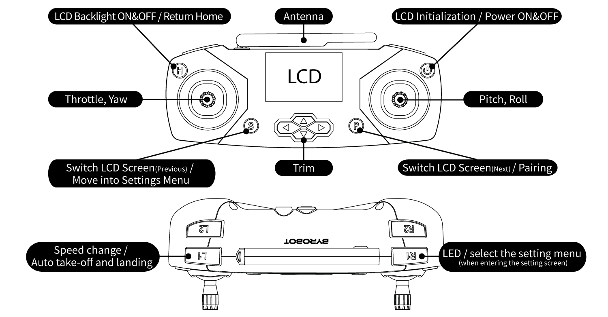

 

    <h1>Lesson 1. Make friends with Coding Drone!</h1>

 

---

 

    <h1>[Outline]</h1>

 

The Coding Drone (BRC-105) is the world's first drone for coding education capable of unplugged coding. 
By mounting a color sensor on the bottom of the drone, unplugged coding can be done with a coding card composed of 8 colors. 
In addition, not only unplugged coding, but also coding activities with Entry and Python by connecting to a PC are possible.  
As such, Coding Drone is designed to provide various coding methods so that you can easily enjoy drone coding anytime, anywhere. 

Through this lecture,
1. You can learn the basic concepts of coding through various types of coding activities.
2. You can directly experience the autonomous flight of the coding drone.
3. By combining coding and drones, which are the core fields of the 4th industry, you can develop integrated & convergence thinking skills required for STEAM education.
4. You can develop the capabilities of creative convergence talents that are essential for the future society.

 

---

 

    <h3>The coding drone looks like this!</h3>

 

        <table>
        <tr>
            <td>
                

                     
                

            </td>
            <td>
                

                     
                

            </td>
            <td>
                

                     
                

            </td>
        </tr>
    </table>

 

     <h3>Spec</h3>
      
     <h3>Main</h3>
      
     <h3>Package</h3>
      
     <h3>Part name</h3>
      
     <h3>Remote</h3>

 

---

 

    <h1>[Note]</h1>

 

<h2>1. Charging the battery</h2>

Learn how to charge your battery. Be sure to charge the battery using a dedicated charger and use a fully charged battery.
 

        <table>
        <tr>
            <td>
                

                    
                

            </td>
        </tr>
        <tr>
            <td>
                

                1) Connect the dedicated charger to a device that can be charged (chargeable adapter, PC, etc.). 
                2) In charging standby mode, the LED on the charger blinks red. 
                3) Insert the battery to be charged into the charger according to the direction of the connector. 
                4) The charging status is judged by the LED light of the charger. 
                    ① Charging: LED lights red. 
                    ② Charging complete: The LED light turns off. 
                

            </td>
        </tr>
    </table>

 
<b>※It takes about 60 minutes to complete charging, and the drone can fly for about 8 minutes on a charged battery. Flight times may vary depending on the surrounding environment (eg temperature, wind, etc.).</b>

 

<h2>2. Installing the battery</h2>

To install batteries on the drone and remote controller, follow these steps.

        <table>
        <tr>
            <td>
                

                    <h3>drone</h3>
                

            </td>
            <td>
                

                    <h3>remote controller</h3>
                

            </td>
        </tr>
        <tr>
            <td>
                

                    
                

            </td>
            <td>
                

                    
                

            </td>
        </tr>
        <tr>
            <td>
                

                Insert the battery by pushing it into the battery frame on the back of the drone with the connector part facing down. 
                

            </td>
            <td>
                

                The remote controller uses 2 AA size batteries as batteries. Open the battery cap on the back of the remote controller and insert one by one according to the polarity direction.
                

            </td>
        </tr>
    </table>

 

<b>※ What if the battery runs out?!</b>

 

        <table>
        <tr>
            <td rowspan="2">
                

                    
                

            </td>
            <td>
                

                If the drone's battery is discharged during flight, the main LED blinks with a buzzer sound and the remote controller vibrates continuously.  
                In this case, immediately land the drone and replace the discharged battery with a fully charged battery.
                

            </td>
        </tr>
        <tr>
            <td>
                

                [Battery charge time = <b>about 60 minutes</b> / Flight time (on one full charge) = <b>about 8 minutes</b>]
                

            </td>
        </tr>
    </table>

<h2>3. Reset and pair</h2>

Try pairing the drone with the remote controller.  
Coding drones are maintained once paired, but if pairing is lost for some reason or you need to pair with another drone or remote controller, you need to pair them again after resetting. 

 

    

 

<h2>4. Precautions for use</h2>

 
1) Before flying the drone, make sure that there are no people or obstacles around it, and secure a safe distance before flying. 
2) When the battery runs out, it lands immediately and replaces it with a fully charged battery. 
3) Always install the latest firmware. 
- [Download firmware program ](http://dev.byrobot.co.kr/documents/kr/products/coding_drone/log/updates/firmware/) 
- [Firmware Update Manual ](http://dev.byrobot.co.kr/documents/kr/products/coding_drone/manual/update/drone4autoupdaterlight/) 
4) Be careful as applying severe impact to the drone and remote controller may cause malfunction.  

---

 

    <h1>[Organize]</h1>

 

Did you know what a coding drone is? Want to fly fast? Let's fly the coding drone to our heart's content in the next lecture!  
If a problem occurs during use and it is difficult to solve, please contact the ByRobot AS Center (help@byrobot.co.kr).

        <table>
        <tr>
            <td>
                

                    1) Coding drone is a drone for coding education and is optimized for coding learning as both unplugged and plugged coding are possible. 
                    2) The coding drone takes about 60 minutes to fully charge the battery and can fly for about 8 minutes. 
                    3) When the battery is discharged, immediately land the drone safely and replace it with a fully charged battery. 
                    4) If the drone and the remote controller are paired only once, the pairing status is maintained. If pairing is required again, reset the drone and then perform pairing 
                

            </td>
        </tr>
    </table>

 

 

---

### [Coding with a coding drone (English)](../)

 1. **Make friends with Coding Drone!**
 2. [Let's fly a coding drone](../lesson2)
 3. [I code cards with a coding drone (1)] - fifth week of July
 4. [I code cards with a coding drone (2)] - fifth week of July
 5. [I code cards with a coding drone (3)] - first week of August
 6. [Motion coding with a coding drone] -first week of August
 7. [Block coding with a coding drone(1)](../lesson7)
 8. [Block coding with a coding drone(2)](../lesson8)

---

Modified : 2021.7.22