 

    <h1>Lesson 2. Let's fly a coding drone</h1>

 

---

 

    <h1>[Outline]</h1>

 

In this lecture, you will learn how to control a coding drone and fly it yourself. 
Before learning how to fly, let's learn how a drone flies and the principles of flight. 
How do drones fly forward, backward, left and right, and take off and land? To understand the flying principle of a drone, you must first understand how the drone's propeller is constructed.  
Let's find out by looking at the following picture.

 

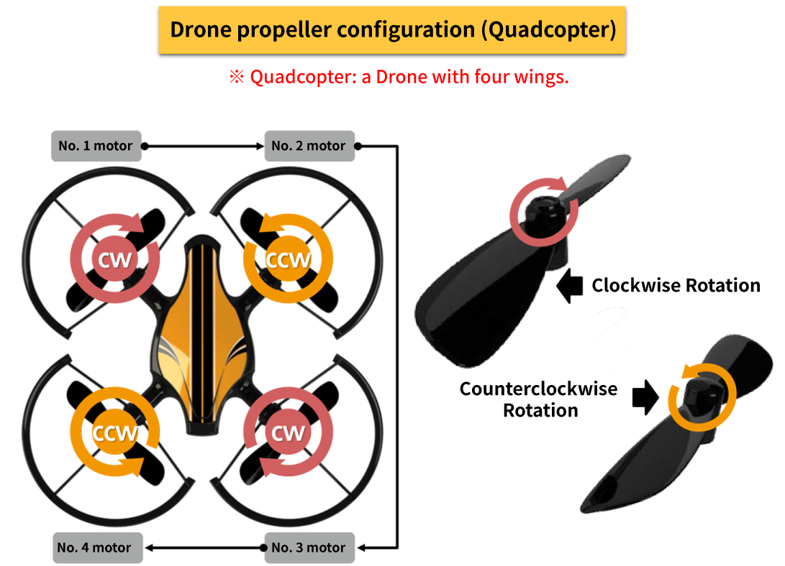

 

Next, let's learn about the flying principle of how a drone can fly forward, backward, and rotate. 
How drones fly <b> By adjusting the speed of each motor, the rotation speed of the propeller is different.</b> It is easy to understand if you know the facts

 

    <table>
        <tr>
            <td>
                
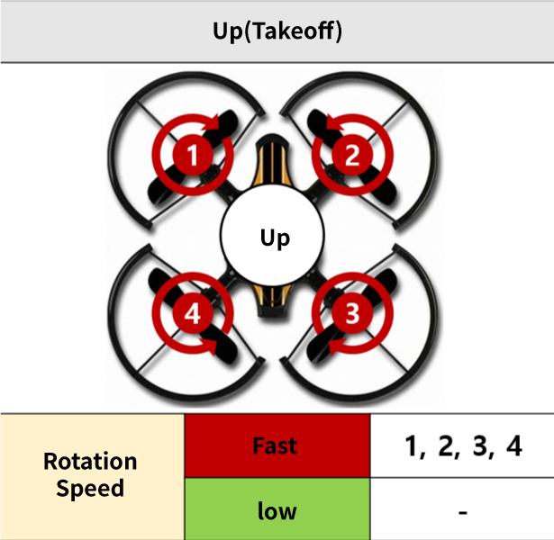

            </td>
            <td>
                
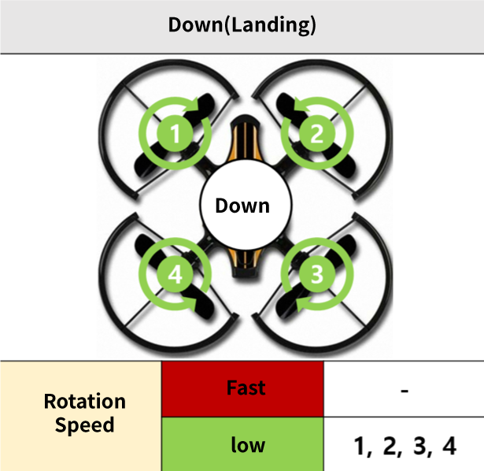

            </td>
        </tr>
        <tr>
            <td>
                
All propellers rotate rapidly at the same speed to generate a large lift, and when the lift is greater than gravity, it rises. When taking off, take off in the same way.

            </td>
            <td>
                
lowly rotate all propellers at the same speed to reduce lift, and when lift is less than gravity, you will descend. When you land, you land in the same way.

            </td>
        </tr>
        <tr>
            <td>
                
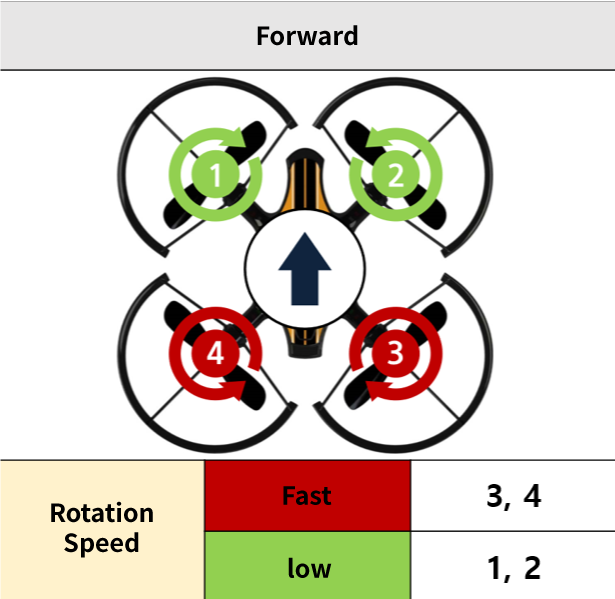

            </td>
            <td>
                
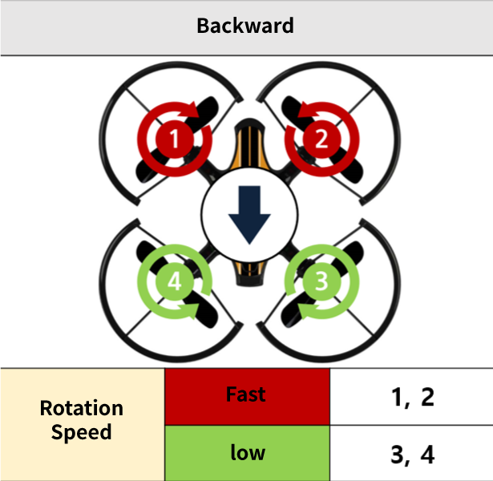

            </td>
        </tr>
        <tr>
            <td>
                
If propellers 3 and 4 are rotated fast and propellers 1 and 2 are relatively slow, the rear lift of the drone will increase and it will be lifted up and tilted forward. At this time, the thrust is generated forward and it moves forward.

            </td>
            <td>
                
If propellers 1 and 2 are rotated fast and propellers 3 and 4 are relatively slow, the front lift of the drone will increase, so it will lift upwards and tilt backwards. At this time, thrust is generated backwards and the vehicle moves backward.

            </td>
        </tr>
        <tr>
            <td>
                
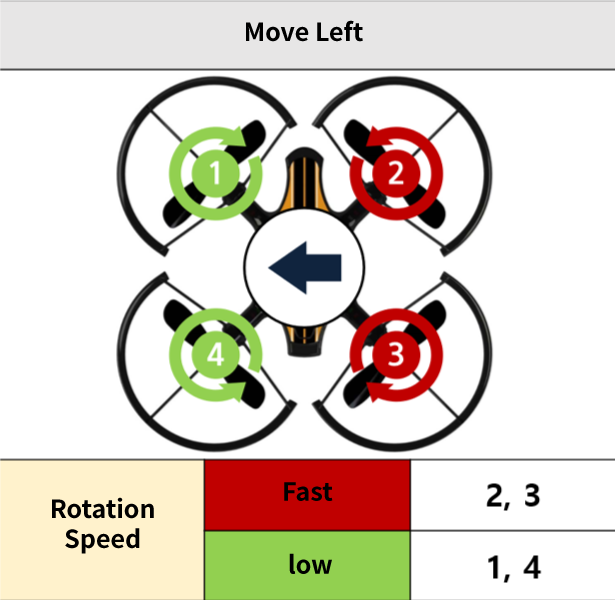

            </td>
            <td>
                
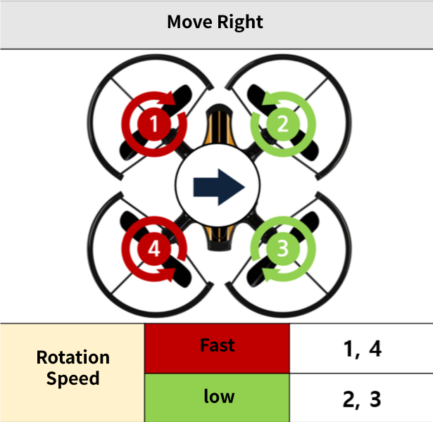

            </td>
        </tr>
        <tr>
            <td>
                
If propellers 2 and 3 are rotated quickly, and propellers 1 and 4 are relatively slow, the right lift of the drone will increase and it will tilt to the left while lifting upwards. At this time, momentum is generated to the left and it moves to the left.

            </td>
            <td>
                
If propellers 1 and 4 are rotated quickly and propellers 2 and 3 are relatively slow, the left lift of the drone will increase and it will be lifted up and tilted to the right. At this time, momentum is generated to the right and it moves to the right.

            </td>
        </tr>
        <tr>
            <td>
                
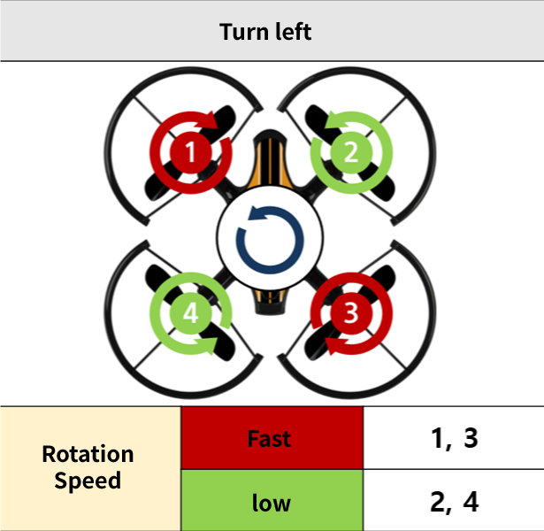

            </td>
            <td>
                
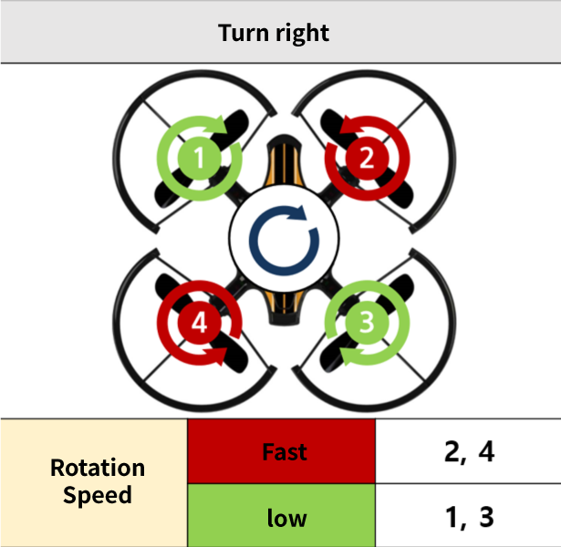

            </td>
        </tr>
        <tr>
            <td>
                
If propellers 1 and 3 are rotated fast and propellers 2 and 4 are relatively slow, the torque of 1 and 3 (the propeller rotates clockwise) will be greater than 2 and 4, causing the drone to rotate counterclockwise (left). It's possible.

            </td>
            <td>
                
If propellers 2 and 4 are rotated quickly and propellers 1 and 3 are relatively slow, the torque of 2 and 4 (the propeller rotates counterclockwise) becomes greater than 1 and 3, causing the drone to rotate clockwise (right). It's possible.

            </td>
        </tr>
    </table>

 

<B>glossary</b>

    <table>
        <tr>
            <td>
                
lift

            </td>
            <td>
                
It is the force that allows an aircraft to float in the air.

            </td>
        </tr>
        <tr>
            <td>
                
torque

            </td>
            <td>
                
As a force to rotate, the aircraft tends to rotate in the opposite direction to the direction in which the propeller rotates.

            </td>
        </tr>
    </table>

 

So far, we have discussed the flying principle of how a drone can fly in a fixed direction. 
Now, shall we learn how to fly a coding drone? 

 

---

 

    <h1>[Note]</h1>

 

Learn how to control a coding drone. There are 4 control modes of the drone, but the basic control mode of the coding drone is mode 2.

 

    <table>
        <tr>
            <td colspan="4">
                
<h3>drone control mode</h3>

            </td>
        </tr>
        <tr>
            <td>
                
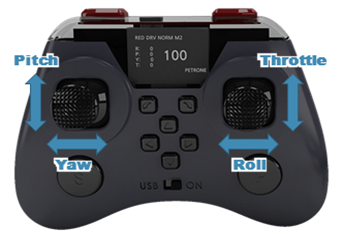

            </td>
            <td>
                
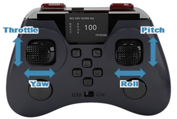

            </td>
            <td>
                
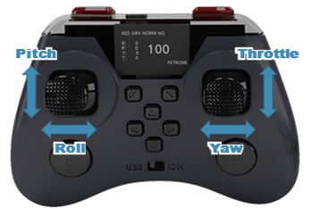

            </td>
            <td>
                
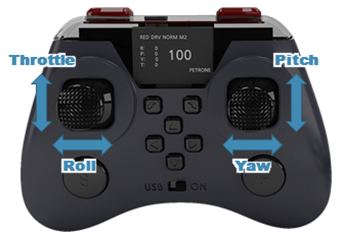

            </td>
        </tr>
        <tr>
            <td>
                
mode 1

            </td>
            <td>
                
mode 2

            </td>
            <td>
                
mode 3

            </td>
            <td>
                
mode 4

            </td>
        </tr>
    </table>

    <table>
        <tr>
            <td>
                
<h3>Terms</h3>

            </td>
            <td>
                
<h3>flight action</h3>

            </td>
            <td>
                
<h3>Contents</h3>

            </td>
        </tr>
        <tr>
            <td>
                
PITCH

            </td>
            <td>
                
forward/backward

            </td>
            <td>
                
Drone moving forward/backward 
(= motion of the drone tilting forward/backward)

            </td>
        </tr>
        <tr>
            <td>
                
ROLL

            </td>
            <td>
                
move left/right

            </td>
            <td>
                
Drone movement left/right 
(= motion of the drone tilting left/right)

            </td>
        </tr>
        <tr>
            <td>
                
THROTTLE

            </td>
            <td>
                
Rise and fall

            </td>
            <td>
                
Drone ascending/descending motion

            </td>
        </tr>
        <tr>
            <td>
                
YAW

            </td>
            <td>
                
turn left/right

            </td>
            <td>
                
Drone rotation left/right 
(= The motion of the drone rotating left/right based on the vertical axis)

            </td>
        </tr>
    </table>

 

So, let's learn how to take off and land first. 
There are two methods for taking off and landing of the coding drone. Automatic take-off and landing and manual take-off and landing.
 

<h2>1. Automatic take-off and landing</h2>

    <table>
        <tr>
            <td rowspan="2">
                
<h3>take-off</h3>

            </td>
            <td>
                
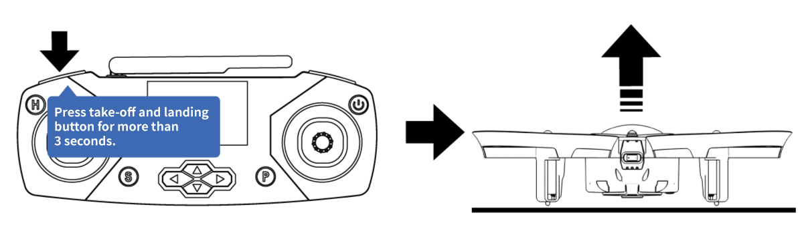

            </td>
        </tr>
        <tr>
            <td>
                
When the drone has landed, press the auto takeoff and landing button on the remote controller (L1 button in front of the left lever) for more than 3 seconds to take off the drone. Because the automatic altitude hold function works, it ascends to a certain height and then flies in place.

            </td>
        </tr>
        <tr>
            <td rowspan="2">
                
<h3>landing</h3>

            </td>
            <td>
                
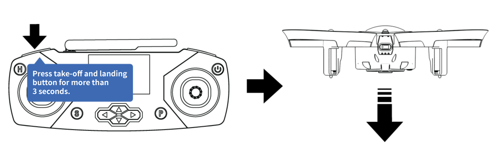

            </td>
        </tr>
        <tr>
            <td>
                
When the drone is in flight, press and hold the Auto Takeoff and Landing button (L1 button in front of the left lever) on the remote controller for more than 3 seconds to slowly descend from the spot and land.

            </td>
        </tr>
    </table>

 

<h2>2. Manual takeoff and landing</h2>

 

    <table>
        <tr>
            <td rowspan="2">
                
<h3>boot</h3>

            </td>
            <td>
                
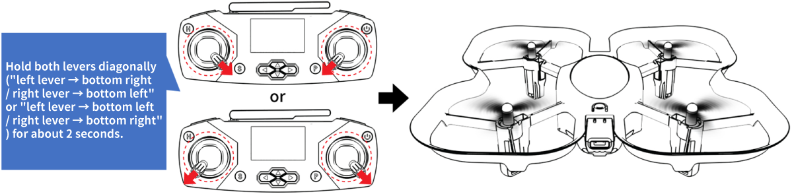

            </td>
        </tr>
        <tr>
            <td>
                
As shown in the figure above, if both levers of the remote controller are moved in a diagonal direction (left → lower right/right → lower left or left → lower left/right → lower right) for about 2 seconds, the motor starts and all propellers of the drone rotate. do. Then return the lever back to the neutral position. The drone does not take off just by starting the motor. 
                <b>※ If you move the lever of the remote controller in the same way while the motor is running, the motor turns off and all propellers stop rotating. 
                ※ Starting and stopping the motor can only be operated when the drone has landed.
</b>
                

            </td>
        </tr>
        <tr>
            <td rowspan="2">
                
<h3>take-off</h3>

            </td>
            <td>
                
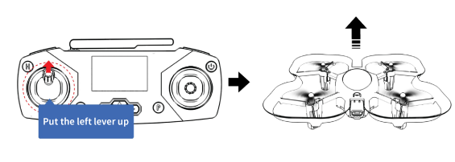

            </td>
        </tr>
        <tr>
            <td>
                
Slowly raise the left lever on the remote controller to take off the drone. While watching the drone move, slowly raise the lever little by little, and when the drone takes off to the desired height, return the lever to the neutral position. At this time, be careful as if you raise the lever too quickly or too much, the drone will suddenly take off.

            </td>
        </tr>
        <tr>
            <td rowspan="2">
                
<h3>landing</h3>

            </td>
            <td>
                
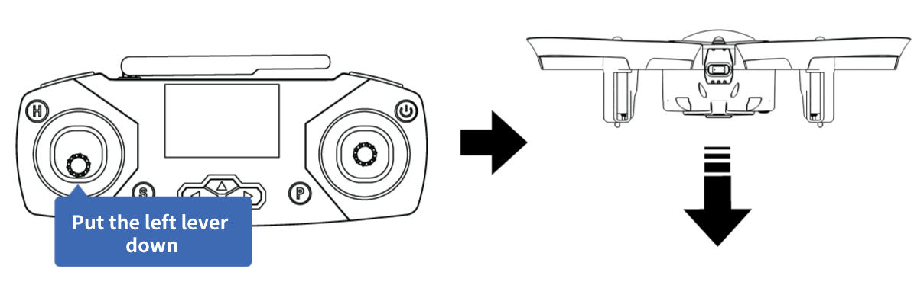

            </td>
        </tr>
        <tr>
            <td>
                
While the drone is in flight, slowly lower the left lever on the remote controller to start descending. If you lower the lever to the lowest position after the drone touches the ground, all motors stop and land.

            </td>
        </tr>
    </table>

 

coding drone <b>emergency stop</b> There is a function! The emergency stop function is a function that can prevent safety accidents by stopping the motor of the drone when an emergency situation occurs.

 

    <table>
        <tr>
            <td>
                
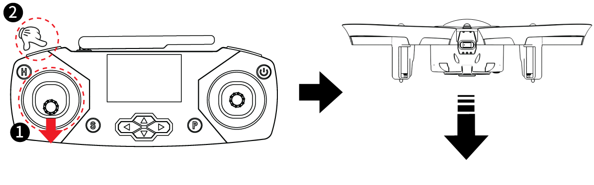

            </td>
        </tr>
        <tr>
            <td>
                
While pushing down the left lever of the remote controller (①), press the L1 button in front of the left lever (②) to stop the drone's motor.<b>All motors are stopped, so if the drone is in the air, it will fall to the floor, so be careful., </b> It is used in an emergency where all motors need to be stopped urgently. To use it to land, wait until the drone hits the ground and press the L1 button.

            </td>
        </tr>
    </table>

 

<h2>3. Basic controls</h2>

 

Next, let's learn the basics of flying a coding drone.

 

    <table>
        <tr>
            <td rowspan="2">
                
<h3>Increase / descent
</h3>

            </td>
            <td>
                
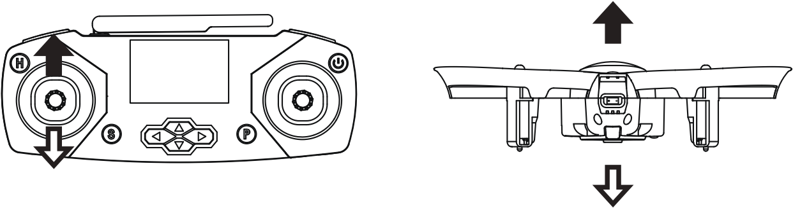

            </td>
            <td rowspan="2">
                
<h3>Advance / junior</h3>

            </td>
            <td>
                
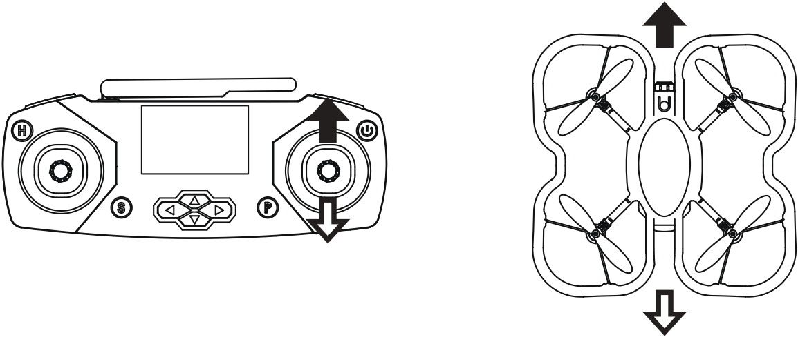

            </td>
        </tr>
        <tr>
            <td>
                
①	Raise: Raise the left lever upwards to raise the drone. 
                ② Descending: When the left lever is pushed down, the drone descends. 
<b>※ Ascent/descent is steered with the same lever and direction as takeoff/landing.</b>

            </td>
            <td>
                
①	Forward: Move the right lever upwards to move the drone forward. 
                ② Reverse: Move the right lever down to move the drone backwards.

            </td>
        </tr>
        <tr>
            <td rowspan="2">
                
<h3>turn left / turn right</h3>

            </td>
            <td>
                
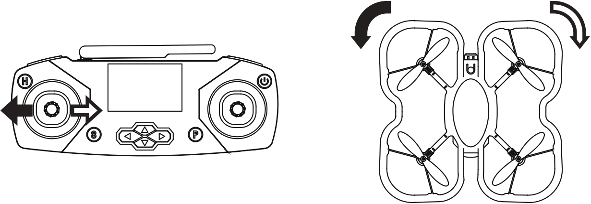

            </td>
            <td rowspan="2">
                
<h3>move left / move right</h3>

            </td>
            <td>
                
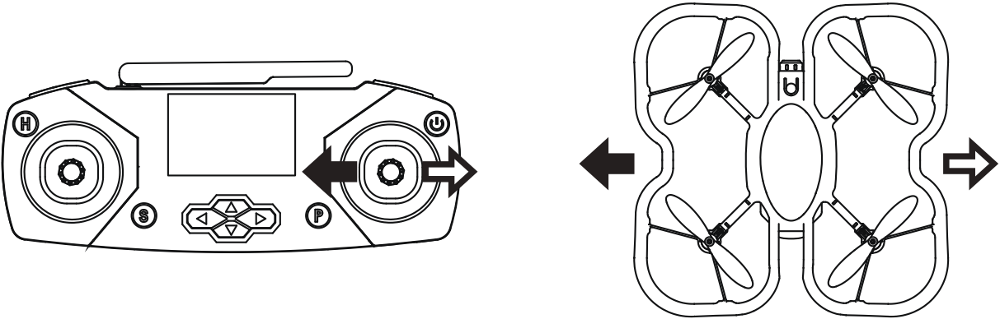

            </td>
        </tr>
        <tr>
            <td>
                
①	Rotate Left: Move the left lever to the left to rotate the drone to the left. 
                ② Rotate Right: Move the left lever to the right to rotate the drone right.

            </td>
            <td>
                
①	Move Left: Move the right lever to the left to move the drone to the left. 
                ② Move Right: Move the right lever to the right to move the drone to the right.

            </td>
        </tr>
    </table>

---

 

    <h1>[Fly]</h1>

 

Now that you've learned how to fly, let's fly the coding drone. Please check the following before flying.
 

    <table>
        <tr>
            <td>
                
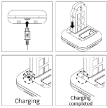

            </td>
            <td>
                
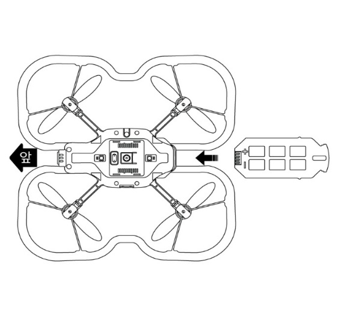

            </td>
            <td>
                
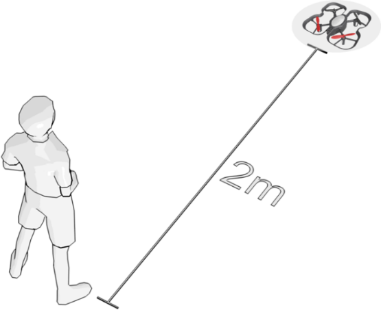

            </td>
            <td>
                
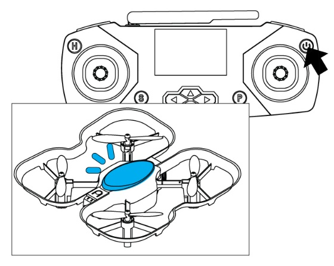

            </td>
        </tr>
        <tr>
            <td>
                
Use a battery that has been fully charged using a dedicated charger.

            </td>
            <td>
                
Connect the battery to the drone. 
<b>※ The remote controller is powered off</b>

            </td>
            <td>
                
Secure a safe distance of about 2m from the drone, and check that there are no people or obstacles around.

            </td>
            <td>
                
Press and hold the power button on the remote controller for more than 3 seconds to turn on the power. If you hear a buzzer sound from the remote controller and the LED of the drone lights up, pairing is normal.

            </td>
        </tr>
    </table>

 

If there is no problem by checking everything, try flying the coding drone while remembering the control method you learned earlier.

 

    <table>
        <tr>
            <td>
                
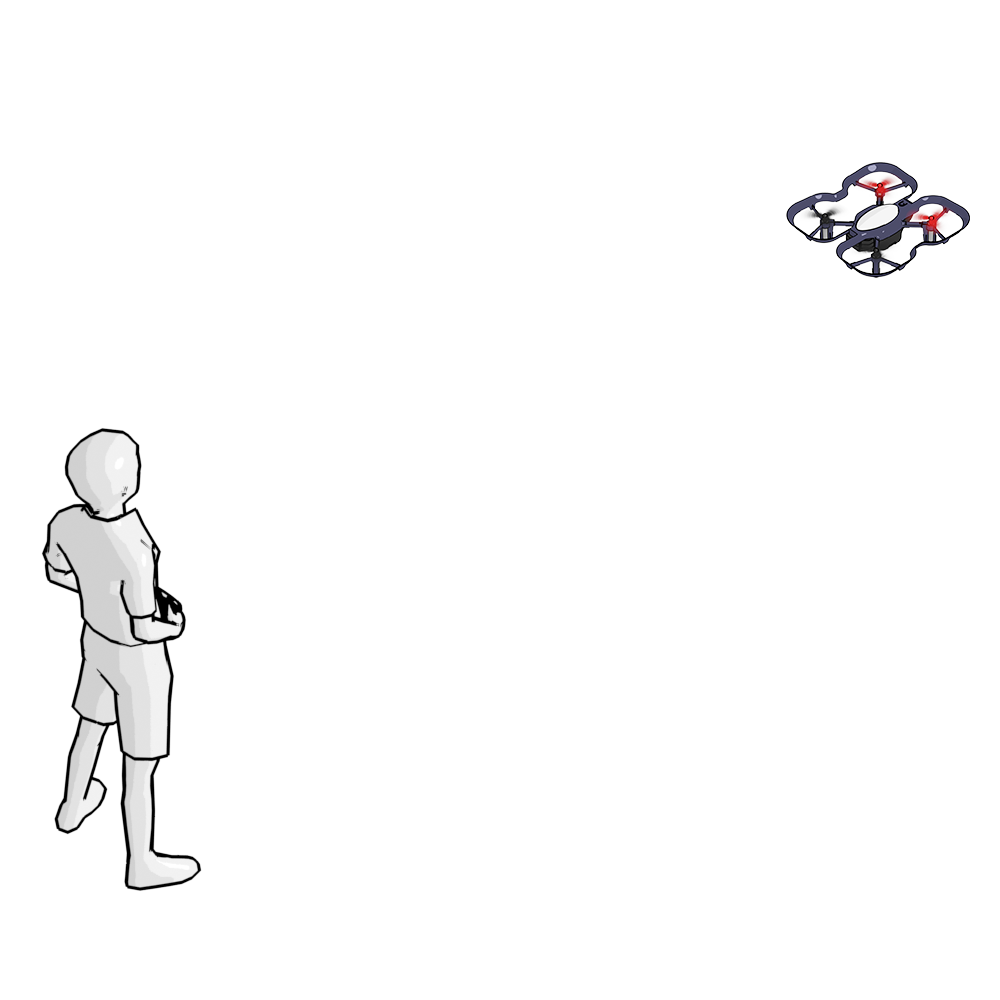

            </td>
        </tr>
    </table>

 

---

 

    <h1>[Organize]</h1>

 

Was it fun to fly the coding drone yourself?  
Flying the drone can be difficult at first, but with a little practice you will be able to fly it easily.  
And while controlling the coding drone, you can change the speed or change the color of the main LED. 
Please read the manual carefully and follow it.

        <table>
        <tr>
            <td>
                

                    1) The drone's propellers are divided into two types (clockwise rotation / counterclockwise rotation), and are assembled alternately one by one. 
                    2) The flying principle of a drone is Move the drone in the desired direction by varying the rotation speed of each propeller. 
                    3) The control mode of the drone is from Mode 1 to Mode 4, and the basic control mode of the coding drone is Mode 2. 
                    4) There are two types of takeoff and landing methods for coding drones: automatic and manual. 
                    5) In the event of an emergency during flight, all motors of the coding drone can be stopped immediately using the emergency stop function. 
                    6) Before controlling the drone, first check the battery and pairing status, secure a safe distance, and nearby obstacles. 
                

            </td>
        </tr>
    </table>

 

---

### [Coding with a coding drone (English)](../)

 1. [Make friends with Coding Drone!](../lesson1)
 2. **Let's fly a coding drone**
 3. [I code cards with a coding drone (1)] - fifth week of July
 4. [I code cards with a coding drone (2)] - fifth week of July
 5. [I code cards with a coding drone (3)] - first week of August
 6. [Motion coding with a coding drone] -first week of August
 7. [Block coding with a coding drone(1)](../lesson7)
 8. [Block coding with a coding drone(2)](../lesson8)

---

Modified : 2021.7.23