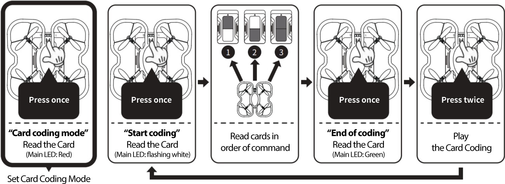
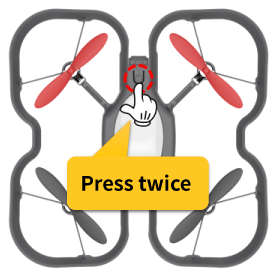
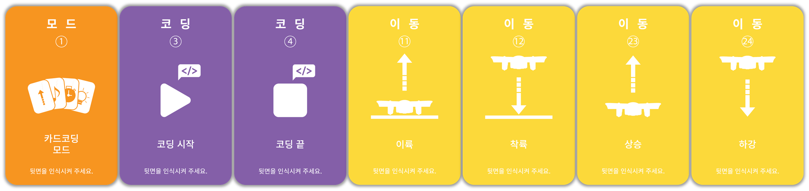
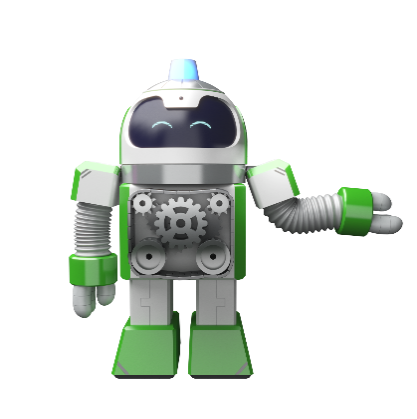

 

    <h1>Lesson 3. I code cards with a coding drone (1)</h1>

 

---

 

    <h1>[Outline]</h1>

 

The coding drone is equipped with the world's first unplugged coding function that can fly only with a coding card without a remote controller.  
In this lecture, we will learn how to unplug coding with a coding drone, and try to fly with card coding, which is one of the unplugged coding functions.   

So, first, let's find out what card coding is. 

 

    <table>
        <tr>
            <td>
                
<h3>What is card coding?</h3>

            </td>
        </tr>
        <tr>
            <td>
                
Card coding is a kind of unplugged coding method that allows you to learn coding using cards. There are various methods for card coding depending on the teaching materials and cards used. The card coding method using a coding drone is as follows.  
☞ Each card has a color (two colors, top/bottom), and the color sensor built into the coding drone recognizes the card's color and allows you to read the card. When the card is read, the coding drone executes the commands entered on the card. 

            </td>
        </tr>
    </table>

 

By default, 43 coding cards are provided and consist of a total of 8 categories.

 

    <table>
        <tr>
            <td>
<b>category</b>
</td>
            <td>
<b>Coding card (command) type</b>
</td>
        </tr>
        <tr>
            <td>
                
calibration

            </td>
            <td>
                Color Calibration 1/5, 2/6, 3/7, 4/8
            </td>
        </tr>
        <tr>
            <td>
                
mode

            </td>
            <td>
                Card coding mode, motion coding mode
            </td>
        </tr>
        <tr>
            <td>
                
coding

            </td>
            <td>
                Start coding, end coding
            </td>
        </tr>
        <tr>
            <td>
                
action

            </td>
            <td>
                wait 1 second
            </td>
        </tr>
        <tr>
            <td>
                
light

            </td>
            <td>
                Main light red on, main light yellow on, main light green on, main light blue on, main light off
            </td>
        </tr>
        <tr>
            <td>
                
move

            </td>
            <td>
                Takeoff, Landing, Forward, Backward, Left, Right, Rise, Descend, Turn Left, Turn Right
            </td>
        </tr>
        <tr>
            <td>
                
Set

            </td>
            <td>
                0.3 meter, 0.5 meter, 1 meter, 30 degree, 45 degree, 90 degree
            </td>
        </tr>
        <tr>
            <td>
                
Condition

            </td>
            <td>
                When an obstacle is found in front, when a red floor is found, when a yellow floor is found, when a green floor is found, when a blue floor is found, the condition is not met, the condition is over
            </td>
        </tr>
        <tr>
            <td>
                
repeat

            </td>
            <td>
                Infinite Repeat, Repeat 2x, Repeat 3x, Repeat 4x, Exit Repeat, End Repeat
            </td>
        </tr>
    </table>

 

The coding card is designed as follows.  
Coding cards for color calibration have different colors drawn on the front and back.  
And the rest of the coding cards have commands and icons on the front and colors on the back.  
The drone guard pattern is drawn on the left and right sides of the colored side, indicating where to place the drone when reading the coding card. 

 

    <table>
        <tr>
            <td colspan="2">
                
<h3>Coding card for color calibration</h3>

            </td>
            <td colspan="2">
                
<h3>Other coding cards</h3>

            </td>
        </tr>
        <tr>
            <td>
                

            </td>
            <td>
                

            </td>
            <td>
                

            </td>
            <td>
                

            </td>
        </tr>
        <tr>
            <td>
                
obverse

            </td>
            <td>
                
The back

            </td>
            <td>
                
obverse

            </td>
            <td>
                
The back

            </td>
        </tr>
    </table>

 

---

 

    <h1>[Note]</h1>

 

<h3>1. Reading the coding card</h3> 
Here's how to read the coding card.  

① Place the drone on the card (the colored side). At this time, place the drone well according to the drone guard pattern on the card. 
② Press the operation button on the top of the drone once. 
<b>※ Be careful as the coding drone may be damaged if you press the operation button with too much force.</b> 
③ When the buzzer sounds and the main LED blinks once in the color of the card (top and bottom 2 colors), the card has been read normally. 
<b>※ Buzzer sound and main LED color are different for each card</b>
 

    <table>
        <tr>
            <td>
                
            </td>
        </tr>
    </table>

 

<h3>2. Color Calibration</h3> 
In order to recognize the color of the coding card well using the color sensor of the coding drone, it is necessary to calibrate the color sensor. This is color calibration. Color calibration is performed in the following cases.  

① When the color recognition is not good with the coding drone 
② When coding using a print other than a coding card 
 
The method of color calibration is as follows. 

    <table>
        <tr>
            <td>
                
<h3>materials</h3>

            </td>
        </tr>
        <tr>
            <td>
                

            </td>
        </tr>
    </table>

    <table>
        <tr>
            <td>
                
<h3>How to calibrate color</h3>

            </td>
        </tr>
        <tr>
            <td>
                

            </td>
        </tr>
        <tr>
            <td>
                

            </td>
        </tr>
        <tr>
            <td>
                

            </td>
        </tr>
    </table>

 
<h3>3. How to set mode by function</h3> 

    <table>
        <tr>
            <td>
                ① There are mode cards (card coding/motion coding) for each function of the unplugged mode. If you press the operation button once and read the mode card, the mode is set. 
② The mod card only needs to be read the first time, and it will remain in that mode until the coding drone is powered off or switched to another mode. 
③ The way to switch to another mode is to read the mode card to switch to, then it will switch to that mode.  
<b>※ Reading the mod card makes it easy to tell them apart because each mod sounds a different buzzer and the main light color changes.</b> 

            </td>
        </tr>
    </table>

 
<h3>4. How to stop the coding drone</h3> 

During unplugged coding activities, if the drone needs to stop suddenly while it is in flight, turn on the power of the remote controller, then switch to the control mode and land.  
The remote controller and the drone must be paired, and when you move the lever of the remote controller, it immediately switches to the control mode.  
To switch back to the unplugged coding mode, just read the mod card you want to switch to.  

 

---

    <h1>[Card coding method]</h1>

 
Card coding is performed in the following order.
 

    <table>
        <tr>
            <td>

 
                ① To run the card coding, place the coding drone on a flat surface and press the operation button 2 times in a row, after about 2 to 3 seconds, a buzzer sound (tiri-rik) is automatically executed. 
                <b>※Immediately after running, you will move away from the drone by a safe distance. Beware of accidents!</b> 
② Coding instructions entered once are stored in memory and can be executed continuously. However, if you read the “Start Coding” card again, it will be reset. 
<b>※ It is saved even when the power of the coding drone is turned off. (Maximum number of storable cards: 120)</b> 
            </td>
        </tr>
    </table>

 

---

    <h1>[Thinking of code]</h1>

 

From now on, I'm going to code myself and fly a coding drone. Before coding, think about how to fly the coding drone and make the code.  
In this lesson, we will do basic movements (forward/backward, left/right movement, up/down, left/right rotation). 

 

<h2>1. Forward/Reverse</h2>

 

First, let's think about how we're going to write the code to fly forward and backward. I thought of the code like this:

    <table>
        <tr>
            <td>
                
action sequence

            </td>
            <td>
                
Start → Takeoff → Forward 1 square → Back 1 square → Landing → End

            </td>
        </tr>
        <tr>
            <td>
                
card order

            </td>
            <td>
                
            </td>
        </tr>
    </table>

 

<b>※ The basic movement distance of the movement command is 1m.</b>

 

<h2>2. Move left/right</h2>

 

Next is left/right movement flight. Think about how to write the code to move one space to the left and then one space to the right.

    <table>
        <tr>
            <td>
                
action sequence

            </td>
            <td>
                
Start → Takeoff → Move 1 square left → Move 1 square right → Landing → End

            </td>
        </tr>
        <tr>
            <td>
                
card order

            </td>
            <td>
                
            </td>
        </tr>
    </table>

 

<h2>3. Rise/Descent</h2>

 

Next up is the ascend/descent flight. Think about how to write the code to go up 1 space and then go down 1 space.

    <table>
        <tr>
            <td>
                
action sequence

            </td>
            <td>
                
Start → Takeoff → Rise by 1 square → Fall by 1 square → Landing → End

            </td>
        </tr>
        <tr>
            <td>
                
card order

            </td>
            <td>
                
            </td>
        </tr>
    </table>

 
<h2>4. Rotate left/right</h2>

 

Next up is a left/right turn flight. Think about how to write the code to rotate 90 degrees left and then 90 degrees right.

    <table>
        <tr>
            <td>
                
action sequence

            </td>
            <td>
                
Start → Takeoff → Turn 90 degrees left → Turn right 90 degrees → Landing → End

            </td>
        </tr>
        <tr>
            <td>
                
card order

            </td>
            <td>
                
            </td>
        </tr>
    </table>

<b>※ The default rotation angle of the rotation command is 90 degrees.</b>

 

---

 

    <h1>[Coding and running]</h1>

 

Now, based on the code you thought of, try to code it yourself and run it. Did you not forget the card coding method you learned above? Follow these steps step by step. 

<h2>1. Forward/Reverse</h2>

 

    <table>
        <tr>
            <td colspan="2">
                
<h3>Step 1 - Prepare your coding card</h3>

            </td>
        </tr>
        <tr>
            <td colspan="2">
                

            </td>
        </tr>
        <tr>
            <td colspan="2">
            
Prepare the coding cards necessary for card coding.

            </td>
        </tr>
    </table>
     
    <table>
        <tr>
            <td colspan="2">
                
<h3>Step 2 - Arrange the coding cards</h3>

            </td>
        </tr>
        <tr>
            <td>
                
action sequence

            </td>
            <td>
                
Takeoff → Forward 1 space → Backward 1 space → Landing
<b>※ OneKhan travel distance = 1m</b>

            </td>
        </tr>
        <tr>
            <td colspan="2">
                

            </td>
        </tr>
        <tr>
            <td colspan="2">
            
Arrange the cards in the order of action. Don't forget that there are always “Coding Start” and “End Coding” cards at the beginning and end of coding!

            </td>
        </tr>
    </table>
     
    <table>
        <tr>
            <td colspan="2">
                
<h3>Step 3 - read the coding card</h3>

            </td>
        </tr>
        <tr>
            <td colspan="2">
                

            </td>
        </tr>
        <tr>
            <td colspan="2">
            
Put the battery in the coding drone, turn it on, and read the coding card.  
            Place the coding drone in the correct position to read the coding card (make sure the guard pattern of the drone and the guard pattern of the coding card match) and press the operation button once in the order of the card to read the card.  
            If you read the card incorrectly in the middle, start over from the beginning (=“Start coding” card). 
            <b>※ “Card coding mode” The card is read only once when you start coding the card.</b>

            </td>
        </tr>
    </table>
     
    <table>
        <tr>
            <td colspan="2">
                
<h3>Step 4 - run the code</h3>

            </td>
        </tr>
        <tr>
            <td>
                

            </td>
            <td>
                

            </td>
        </tr>
        <tr>
            <td colspan="2">
            
Place the coding drone on a flat surface with no people or obstacles nearby.  
            And press the action button twice in succession to execute the coding.  
            After about 3 seconds, the coding drone automatically executes the coded command. 
            <b>※ After pressing the action button, immediately move away from the drone by a safe distance. (Beware of safety accidents!)</b>

            </td>
        </tr>
    </table>

 

<iframe width="560" height="315" src="https://www.youtube.com/embed/EDsZJTQVpDA" title="YouTube video player" frameborder="0" allow="accelerometer; autoplay; clipboard-write; encrypted-media; gyroscope; picture-in-picture" allowfullscreen></iframe>

 

<h2>2. Move left/right</h2>

 

    <table>
        <tr>
            <td colspan="2">
                
<h3>Step 1 - Prepare your coding card</h3>

            </td>
        </tr>
        <tr>
            <td colspan="2">
                

            </td>
        </tr>
        <tr>
            <td colspan="2">
            
Prepare the coding cards necessary for card coding.

            </td>
        </tr>
    </table>
     
    <table>
        <tr>
            <td colspan="2">
                
<h3>Step 2 - Arrange the coding cards</h3>

            </td>
        </tr>
        <tr>
            <td>
                
action sequence

            </td>
            <td>
                
Takeoff → Move 1 space left → Move 1 space right → Landing
<b>※ OneKhan travel distance = 1m</b>

            </td>
        </tr>
        <tr>
            <td colspan="2">
                

            </td>
        </tr>
        <tr>
            <td colspan="2">
            
Arrange the cards in the order of action. Don't forget that there are always “Coding Start” and “End Coding” cards at the beginning and end of coding!

            </td>
        </tr>
    </table>
     
    <table>
        <tr>
            <td colspan="2">
                
<h3>Step 3 - read the coding card</h3>

            </td>
        </tr>
        <tr>
            <td colspan="2">
                

            </td>
        </tr>
        <tr>
            <td colspan="2">
            
Put the battery in the coding drone, turn it on, and read the coding card. 
             Place the coding drone in the correct position to read the coding card (make sure the guard pattern of the drone and the guard pattern of the coding card match) and press the operation button once in the order of the card to read the card.  
             If you read the card incorrectly in the middle, start over from the beginning (=“Start coding” card). 
            <b>※ “Card coding mode” The card is read only once when you start coding the card.</b>

            </td>
        </tr>
    </table>
     
    <table>
        <tr>
            <td colspan="2">
                
<h3>Step 4 - run the code</h3>

            </td>
        </tr>
        <tr>
            <td>
                

            </td>
            <td>
                

            </td>
        </tr>
        <tr>
            <td colspan="2">
            
Place the coding drone on a flat surface with no people or obstacles nearby.  
            And press the action button twice in succession to execute the coding.  
            After about 3 seconds, the coding drone automatically executes the coded command. 
            <b>※ After pressing the action button, immediately move away from the drone by a safe distance. (Beware of safety accidents!)</b>

            </td>
        </tr>
    </table>

 

<iframe width="560" height="315" src="https://www.youtube.com/embed/CcfkKOOidew" title="YouTube video player" frameborder="0" allow="accelerometer; autoplay; clipboard-write; encrypted-media; gyroscope; picture-in-picture" allowfullscreen></iframe>
 

<h2>3. Rise/Descent</h2>

 

    <table>
        <tr>
            <td colspan="2">
                
<h3>Step 1 - Prepare your coding card</h3>

            </td>
        </tr>
        <tr>
            <td colspan="2">
                

            </td>
        </tr>
        <tr>
            <td colspan="2">
            
Prepare the coding cards necessary for card coding.

            </td>
        </tr>
    </table>
     
    <table>
        <tr>
            <td colspan="2">
                
<h3>Step 2 - Arrange the coding cards</h3>

            </td>
        </tr>
        <tr>
            <td>
                
action sequence

            </td>
            <td>
                
Takeoff → Rise 1 square → Fall 1 square → Land
<b>※ OneKhan travel distance = 1m</b>

            </td>
        </tr>
        <tr>
            <td colspan="2">
                

            </td>
        </tr>
        <tr>
            <td colspan="2">
            
Arrange the cards in the order of action. Don't forget that there are always “Coding Start” and “End Coding” cards at the beginning and end of coding!

            </td>
        </tr>
    </table>
     
    <table>
        <tr>
            <td colspan="2">
                
<h3>Step 3 - read the coding card</h3>

            </td>
        </tr>
        <tr>
            <td colspan="2">
                

            </td>
        </tr>
        <tr>
            <td colspan="2">
            
Put the battery in the coding drone, turn it on, and read the coding card. 
            Place the coding drone in the correct position to read the coding card (make sure the guard pattern of the drone and the guard pattern of the coding card match) and press the operation button once in the order of the card to read the card.  
            If you read the card incorrectly in the middle, start over from the beginning (=“Start coding” card). 
            <b>※ “Card coding mode” The card is read only once when you start coding the card.</b>

            </td>
        </tr>
    </table>
     
    <table>
        <tr>
            <td colspan="2">
                
<h3>Step 4 - run the code</h3>

            </td>
        </tr>
        <tr>
            <td>
                

            </td>
            <td>
                

            </td>
        </tr>
        <tr>
            <td colspan="2">
            
Place the coding drone on a flat surface with no people or obstacles nearby.  
            And press the action button twice in succession to execute the coding.  
            After about 3 seconds, the coding drone automatically executes the coded command. 
            <b>※ After pressing the action button, immediately move away from the drone by a safe distance. (Beware of safety accidents!)</b>

            </td>
        </tr>
    </table>

 

<iframe width="560" height="315" src="https://www.youtube.com/embed/viflqCxy5tU" title="YouTube video player" frameborder="0" allow="accelerometer; autoplay; clipboard-write; encrypted-media; gyroscope; picture-in-picture" allowfullscreen></iframe>
 

<h2>4. Rotate left/right</h2>

 

    <table>
        <tr>
            <td colspan="2">
                
<h3>Step 1 - Prepare your coding card</h3>

            </td>
        </tr>
        <tr>
            <td colspan="2">
                

            </td>
        </tr>
        <tr>
            <td colspan="2">
            
Prepare the coding cards necessary for card coding.

            </td>
        </tr>
    </table>
     
    <table>
        <tr>
            <td colspan="2">
                
<h3>Step 2 - Arrange the coding cards</h3>

            </td>
        </tr>
        <tr>
            <td>
                
action sequence

            </td>
            <td>
                
Takeoff → Left Turn → Right Turn → Landing
<b>※ Rotation angle per rotation command = 90 degrees</b>

            </td>
        </tr>
        <tr>
            <td colspan="2">
                

            </td>
        </tr>
        <tr>
            <td colspan="2">
            
Arrange the cards in the order of action. Don't forget that there are always “Coding Start” and “End Coding” cards at the beginning and end of coding!

            </td>
        </tr>
    </table>
     
    <table>
        <tr>
            <td colspan="2">
                
<h3>Step 3 - read the coding card</h3>

            </td>
        </tr>
        <tr>
            <td colspan="2">
                

            </td>
        </tr>
        <tr>
            <td colspan="2">
            
Put the battery in the coding drone, turn it on, and read the coding card.  
            Place the coding drone in the correct position to read the coding card (make sure the guard pattern of the drone and the guard pattern of the coding card match) and press the operation button once in the order of the card to read the card.  
            If you read the card incorrectly in the middle, start over from the beginning (=“Start coding” card). 
            <b>※ “Card coding mode” The card is read only once when you start coding the card.</b>

            </td>
        </tr>
    </table>
     
    <table>
        <tr>
            <td colspan="2">
                
<h3>Step 4 - run the code</h3>

            </td>
        </tr>
        <tr>
            <td>
                

            </td>
            <td>
                

            </td>
        </tr>
        <tr>
            <td colspan="2">
            
Place the coding drone on a flat surface with no people or obstacles nearby.  
            And press the action button twice in succession to execute the coding.  
            After about 3 seconds, the coding drone automatically executes the coded command.  
            <b>※ After pressing the action button, immediately move away from the drone by a safe distance. (Beware of safety accidents!)</b>

            </td>
        </tr>
    </table>

 

<iframe width="560" height="315" src="https://www.youtube.com/embed/wky0r9UjdiI" title="YouTube video player" frameborder="0" allow="accelerometer; autoplay; clipboard-write; encrypted-media; gyroscope; picture-in-picture" allowfullscreen></iframe>
 

    <table>
        <tr>
            <td>
                
<h3>I know</h3>

            </td>
            <td>
                
<h3>1 second wait command</h3>

            </td>
        </tr>
        <tr>
            <td>
                

            </td>
            <td>
                
Among the coding cards, there is a card called <b>“Wait for 1 second”</b>.  
                This is a command to maintain the current state for 1 second, but when the drone is in flight, it will hover for 1 second.  
                Execute this command after the move command to give the drone time to stabilize after moving.  
                During that time, the drone's sensors and attitude are stabilized so that the next command can be performed more accurately.  
                The waiting time increases by 1 second for the number of times the card is read, and you can enter an appropriate time according to the situation.

            </td>
        </tr>
        <tr>
            <td>
                
<h3>Usage example</h3>

            </td>
            <td>
                

            </td>
        </tr>
    </table>

 

---

 

    <h1>[Organize]</h1>

 

In this lecture, I learned what card coding is among the unplugged coding functions, and I flew a coding drone by coding the card myself.  
Isn't it surprising and surprising that you can fly a drone using a coding card without a remote controller or PC? Practice flying different courses by combining basic flight commands.

    <table>
        <tr>
            <td>
                

                    1) Card coding is a kind of unplugged coding method that allows you to learn coding using cards. 
                    2) The card can be read by recognizing the color of the card with the built-in color sensor of the coding drone, and the coding drone executes the commands entered in the card. 
                    3) Color Calibration is the task of calibrating the color sensor of the coding drone so that it can recognize the color of the coding card. 
                    4) The card coding method is as follows. 
                         ▶ “Read “Card Coding Mode”→ “Read “Start Coding”→ read cards in command order → “end of coding” read → Execute (with action buttons in a row) 2press once. 
                    5) Before executing card coding, check that there are no people or obstacles around, and immediately move away from the drone by a safe distance after executing it. 
                

            </td>
        </tr>
    </table>

 

---

### [Coding with a coding drone (English)](../)

 1. [Make friends with Coding Drone!](../lesson1)
 2. [Let's fly a coding drone](../lesson2)
 3. **I code cards with a coding drone (1)**
 4. [I code cards with a coding drone (2)](../lesson4)
 5. [I code cards with a coding drone (3)](../lesson5)
 6. [Motion coding with a coding drone](../lesson6)
 7. [Block coding with a coding drone(1)](../lesson7)
 8. [Block coding with a coding drone(2)](../lesson8)

---

Modified : 2021.7.30