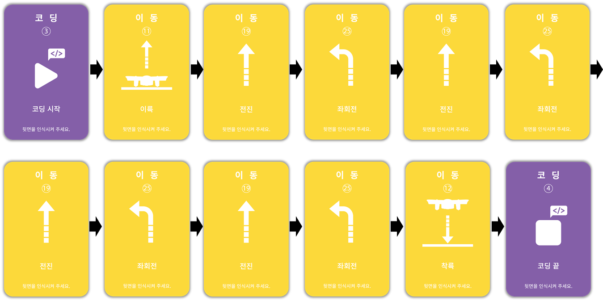

 

    <h1>Lesson 4. I code cards with a coding drone (2)</h1>

 

---

 

    <h1>[Outline]</h1>

 

In this lecture, I am going to try coding a card that makes a pattern flight with a coding drone. 
Pattern flight refers to flying in a certain form of route, such as triangles, squares, circles, and spirals.  
This pattern flight is used when drones are utilized in various industries such as filming, agriculture, and surveying. Here, we are going to do a square pattern flight.  
And in the pattern flight, some patterns are repeated because the route is standardized.  
In this case, you can simplify your code by using loops when coding.  
In this lesson, we will learn what looping statements are and how to use them through pattern flight. 

 

    <h1>[Thinking of code]</h1>

 

The square pattern flight sequence repeats 1 space forward and left turn 4 times.

<b>repeat 4 times</b>

    <table>
        <tr>
            <td>
                
① advance 1 space

            </td>
            <td>
                
② turn left

            </td>
        </tr>
    </table>

 

So let's think about how to write the code to fly like the one above. First, let's create the code without using a loop.

 

<h2>1. Rectangular pattern flight (without loops)</h2>

    <table>
        <tr>
            <td>
                
action sequence

            </td>
            <td>
                
Start → Takeoff → (Go forward 1 space → Turn left 90 degrees) x 4 → Landing → End

            </td>
        </tr>
        <tr>
            <td>
                
card order

            </td>
            <td>
                
            </td>
        </tr>
    </table>

 

Next, let's create code using loops. First, let's figure out what a loop is.
 

    <table>
        <tr>
            <td>
                

                    <h3>easy-to-understand coding</h3>
                

            </td>
            <td>
                

                    <H3>loop</h3>
                

            </td>
        </tr>
        <tr>
            <td>
                

                    
                

            </td>
            <td>
                

                    A loop is one of the main grammars of coding and is used to repeat the same or similar commands. By using loops, it not only reduces the length of the code, making it easier to understand, but also allows for more diverse and efficient coding implementations.  
                    There are several types of loops, such as repeating until a specific condition is satisfied, repeating the specified number of times, and repeating infinitely.
                

            </td>
        </tr>
    </table>

 

There are a total of 4 loops that are basically provided in card coding.

 

    <table>
        <tr>
            <td>
                
① infinite loop

            </td>
            <td>
                
② 2 repetitions

            </td>
            <td>
                
③ 3 repetitions

            </td>
            <td>
                
④ 4 reps

            </td>
        </tr>
        <tr>
            <td>
                
            </td>
            <td>
                
            </td>
            <td>
                
            </td>
            <td>
                
            </td>
        </tr>
    </table>

 

Here's how to use the loop:

 

    <table>
        <tr>
            <td>
                
            </td>
        </tr>
        <tr>
            <td>
                
☞ Repeat command is input by reading the command cards to be repeated between the repeat start card (infinite repeat, repeat 2 times, repeat 3 times, repeat 4 times) and the end of the repeat in sequence.

            </td>
        </tr>
    </table>

 
Now, let's make a square pattern flight code using a loop. Compare how it differs from the code without the loop.
 

 

<h2>2. Flying a square pattern (using loops)</h2>

    <table>
        <tr>
            <td>
                
action sequence

            </td>
            <td>
                
Start → Takeoff → (Go forward 1 space → Turn left 90 degrees) x 4 → Landing → End

            </td>
        </tr>
        <tr>
            <td>
                
card order

            </td>
            <td>
                
            </td>
        </tr>
    </table>

 

You can see that it's a lot more simplified than the code without loops.  
When performing the action of repeating a specific command like this, using a loop can make the code more concise and easier. Now let's run the code.

---

 

    <h1>[Coding and running]</h1>

 

<h2>1. Rectangular pattern flight (without loops)</h2>

 

    <table>
        <tr>
            <td> 
<b><h3>Step 1 - Prepare your coding card</h3> </b>
</td>
        </tr>
        <tr>
            <td>
                

                     
                    Prepare the coding cards necessary for card coding. 
                    <b>※ “Card coding mode” card omitted</b>
                

            </td>
        </tr>
        <tr>
            <td>
<b> <h3>Step 2 - Arrange the coding cards</h3> 
            take off → (Go forward 1 space → Turn left 90 degrees) x Repeat 4 times→ landing</b>
</td>
        </tr>
        <tr>
            <td>
                

                     
                    Arrange the cards in the order of action. Don't forget that there are always “Coding Start” and “End Coding” cards at the beginning and end of coding!
                

            </td>
        </tr>
        <tr>
            <td>
<b> <h3>Step 3 - read the coding card</h3> </b>
</td>
        </tr>
        <tr>
            <td>
                

                     
                    Put the battery in the coding drone, turn it on, and read the coding card.  
                    Place the coding drone in the correct position to read the coding card (make sure the guard pattern of the drone and the guard pattern of the coding card match) and press the operation button once in the order of the card to read the card.  
                    If you read the card incorrectly in the middle, start over from the beginning (=“Start coding” card).  
                

            </td>
        </tr>
        <tr>
            <td>
<b> <h3>Step 4 - run the code</h3> </b>
</td>
        </tr>
        <tr>
            <td>
                

                     
                    Place the coding drone on a flat surface with no people or obstacles nearby.  
                    And press the action button twice in succession to execute the coding.  
                    After about 3 seconds, the coding drone automatically executes the coded command  
                    <b>※ After pressing the action button, immediately move away from the drone by a safe distance. (Beware of safety accidents!)</b>
                

            </td>
        </tr>
    </table>

 

Next, try running the code using the loop.

 

<h2>2. Rectangular pattern driving (using loops)</h2>

 

    <table>
        <tr>
            <td>
<b> <h3>Step 1 - Prepare your coding card</h3> </b>
</td>
        </tr>
        <tr>
            <td>
                

                     
                    Prepare the coding cards necessary for card coding. 
                    <b>※ “Card coding mode” card omitted</b>
                

            </td>
        </tr>
        <tr>
            <td>
<b> <h3>Step 2 - Arrange the coding cards</h3>  
            take off → (Go forward 1 space → Turn left 90 degrees) x Repeat 4 times→ landing  </b>
</td>
        </tr>
        <tr>
            <td>
                

                     
                    Arrange the cards in the order of action. Don't forget that there are always “Coding Start” and “End Coding” cards at the beginning and end of coding!
                

            </td>
        </tr>
        <tr>
            <td>
<b> <h3>Step 3 - read the coding card</h3> </b>
</td>
        </tr>
        <tr>
            <td>
                

                     
                    Put the battery in the coding drone, turn it on, and read the coding card.  
                    Place the coding drone in the correct position to read the coding card (make sure the guard pattern of the drone and the guard pattern of the coding card match) and press the operation button once in the order of the card to read the card.  
                    If you read the card incorrectly in the middle, start over from the beginning (=“Start coding” card).  
                

            </td>
        </tr>
        <tr>
            <td>
<b> <h3>Step 4 - run the code기</h3> </b>
</td>
        </tr>
        <tr>
            <td>
                

                     
                    Place the coding drone on a flat surface with no people or obstacles nearby.  
                    And press the action button twice in succession to execute the coding. After about 3 seconds, the coding drone automatically executes the coded command.  
                    <b>※ After pressing the action button, immediately move away from the drone by a safe distance. (Beware of safety accidents!)</b>
                

            </td>
        </tr>
    </table>

---

 

    <h1>[Organize]</h1>

 

In this lecture, I tried to fly a square pattern by coding a card with a coding drone.  
And I also learned that the same repeating pattern can be coded more easily by using a loop.  
Now, think about how to code other patterns besides squares, and try coding the cards and flying them.

    <table>
        <tr>
            <td>
                

                    1) Pattern flight refers to flying in a certain form of route, such as triangles, squares, circles, and spirals. 
                    2) Because pattern flight has a standardized route, there are cases where some patterns are repeated, in which case you can use a repeating card. 
                    3) Using loops in coding can make your code more concise, making it easier to code. 
                

            </td>
        </tr>
    </table>

 

---

### [Coding with a coding drone (English)](../)

 1. [Make friends with Coding Drone!](../lesson1)
 2. [Let's fly a coding drone](../lesson2)
 3. [I code cards with a coding drone (1)](../lesson3)
 4. **I code cards with a coding drone (2)**
 5. [I code cards with a coding drone (3)] - first week of August
 6. [Motion coding with a coding drone] -first week of August
 7. [Block coding with a coding drone(1)](../lesson7)
 8. [Block coding with a coding drone(2)](../lesson8)

---

Modified : 2021.7.30