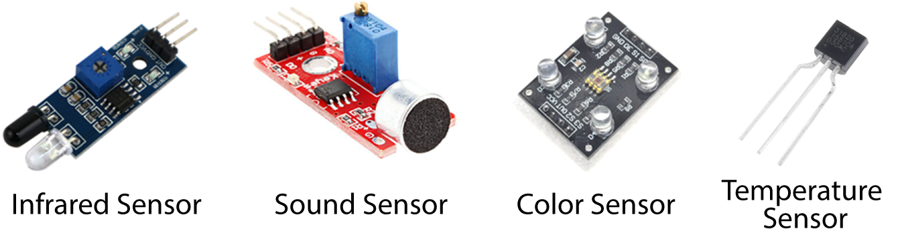

 

    <h1>Lesson 5. I code cards with a coding drone (3)</h1>

 

---

 

    <h1>[Outline]</h1>

 

Drones are equipped with several sensors.  
These sensors collect information and inform the drone, and the drone will operate according to the situation.  
Coding drones are also equipped with advanced sensors such as forward obstacle detection sensor (infrared sensor), color sensor, attitude sensor, barometric pressure sensor, and optical flow sensor to perform various functions. 

 

    <table>
        <tr>
            <td>
                
What is a Sensor?

            </td>
        </tr>
        <tr>
            <td>
                
▶	Sensor means to feel something and to know something from that sensation. <b>A device that collects sensory signals such as light, sound, chemicals, temperature, etc., analyzes these signals in a scientific way, and determines the state</b> are collectively referred to as sensors.  

▶ Sensors are used in various ways in our daily life. For example, when a person stands in front of an automatic door, a sensor detects it and signals the door to open. And if there is a sudden fire, the sensor will figure it out and signal the fire extinguisher to work, both of which are where sensors are used.  

▶ The sensors used in the coding drone are obstacle detection (infrared) sensors, color sensor, posture sensor (acceleration, gyroscope) etc.  
① Obstacle detection (infrared) sensor: By using infrared, the distance between the sensor and the obstacle can be measured, and autonomous flight is possible while detecting the obstacle. 
② Color sensor: By recognizing the color of the coding card, you can code the card and drive along the black or white line. 
③ Posture sensor: The coding drone can fly while maintaining the level, and motion coding that can give commands according to the tilt of the coding drone is possible. 

            </td>
        </tr>
        <tr>
            <td>several sensors
            </td>
        </tr>
        <tr>
            <td>
            </td>
        </tr>
    </table>

 

In this lecture, I am going to try obstacle avoidance flight with card coding using the front obstacle detection sensor (infrared sensor) among various sensors of the coding drone.  
Coding using sensors requires the use of a command called a conditional statement, which can give a command how to operate under a specific condition.  
It may seem difficult because there are a lot of coding cards used, but if you follow it step by step, you will be able to do it easily. So shall we start?

 

---

 

    <h1>[Thinking of code]</h1>

 

The coding drone works as follows.  
If there are no obstacles, it will continue to fly forward.  
If there are obstacles, it will stop flying and land after a U-turn.

    <table>
        <tr>
            <td>
                
① If there is an obstacle in front, stop flying, make a U-turn and land

            </td>
        </tr>
        <tr>
            <td>
                
② If there are no obstacles ahead, keep flying forward

            </td>
        </tr>
    </table>

 

To make the code that works as above, you need to use conditional statements that give different commands depending on whether there are obstacles or not. So, first, let's see what a conditional statement is.
 

    <table>
        <tr>
            <td>
                

                    easy-to-understand coding
                

            </td>
            <td>
                

                    conditional
                

            </td>
        </tr>
        <tr>
            <td>
                

                    
                

            </td>
            <td>
                

                    A conditional statement is one of the main grammars of coding, and is used when a specific condition is given and different commands need to be executed according to the condition.  
                    We often use the phrase “if ~, I will ~”, but it can be seen as a coding expression of this situation.  
                    We can determine whether a given condition is true or false, allowing instruction A to be executed if true and instruction B to be executed if false.  
                    Also, different commands can be given in various cases without distinguishing between true and false cases only.
                

            </td>
        </tr>
    </table>

 

Next, we will learn how to use conditional statements.

 

    <table>
        <tr>
            <td>
                <b>1. Execute a specific command only if the condition is true</b>
            </td>
        </tr>
        <tr>
            <td>
                

            </td>
        </tr>
        <tr>
            <td>
                <b>2. Execute a specific command both if the condition is true and if it is false</b>
            </td>
        </tr>
        <tr>
            <td>
                
            </td>
        </tr>
        <tr>
            <td>
                ☞ If you want to execute a specific instruction only if the condition is true, read the instruction card to perform between the condition start card and condition end card.  
                 And if you want to execute different commands if the condition is true and false, <b>“If the conditions are not met,”</b> Use cards to separate them. So, if the condition is not met, the command card to be executed is read between the card when the condition is not met, and the command card to be executed between the card and the condition end card if the condition is not met is read. always at the end <b>“End of condition”</b> Don't forget to read the cards!
            </td>
        </tr>
    </table>

 

If you need to continuously check the condition without checking it only once, you can use the loop learned in the last lecture.  
The condition is to repeatedly check the condition by putting the conditional statement inside the loop.

 

    <table>
        <tr>
            <td>
                <b>When using loop and conditional statements together</b>
            </td>
        </tr>
        <tr>
            <td>
                

            </td>
        </tr>
        <tr>
            <td>
                
            </td>
        </tr>
        <tr>
            <td>
                ☞ When the code is executed, the condition is repeatedly checked for the number of iterations, and the coded instruction is executed according to true or false.  
                If infinite loop is used, it will not end because this process is repeated over and over again.  
                To finish coding and stop the coding drone, use the remote controller to switch to the control mode and then stop it. or  <b>"repeat exit</b> exitYou can use the" card to break out of the loop.  
                 Using the Exit Iteration card as an instruction card to be executed when a condition is true or false, you can interrupt the iteration and exit when the condition is met.
            </td>
        </tr>
    </table>

 
Now that you know how to use conditional statements, let's think about how to write code.
 

    <table>
        <tr>
            <td rowspan="2">
                
action sequence

            </td>
            <td>
                
take off →  (<b>If you find an obstacle ahead</b>) → U-turn (90 degree left turn x 2) → Repeat exit → Landing

            </td>
        </tr>
        <tr>
            <td>
                
take off → ((<b>If you can't find an obstacle ahead</b>) <b>1m forward</b>) x infinite loop

            </td>
        </tr>
        <tr>
            <td>
                
card order

            </td>
            <td>
                

                 
                

            </td>
        </tr>
    </table>

 

A conditional statement was used in the infinite loop (between infinite loop - repeat end card) so that if there is no obstacle in front (if the condition is not met - between the condition end card), the condition can be checked while advancing by 1m continuously.  
And when it finds an obstacle in front (if it finds an obstacle in front - between cards if conditions are not met), make a U-turn (turn 180 degrees left) and exit the loop (use a repeat exit card).   
Upon exiting the loop, it immediately lands and finishes coding.

 

---

 

    <h1>[Coding and running]</h1>

 

    <table>
        <tr>
            <td> 
<b><h3>Step 1 - Prepare your coding card</h3> </b>
</td>
        </tr>
        <tr>
            <td>
                

                     
                    Prepare the coding cards necessary for card coding. 
                    <b>※ “Card coding mode” card omitted</b>
                

            </td>
        </tr>
    </table>

 

    <table>
        <tr>
            <td colspan="2">
<b> <h3>Step 2 - Arrange the coding cards</h3></b> 

            </td>
        </tr>
        <tr>
            <td rowspan="2">
                
action sequence

            </td>
            <td>
                
take off → (<b>If you find an obstacle ahead</b>) → U-turn (90 degree left turn x 2) → Repeat exit → Landing

            </td>
        </tr>
        <tr>
            <td>
                
take off → ((<b>If you can't find an obstacle ahead</b>) <b>1m forward</b>) x infinite loop

            </td>
        </tr>
        <tr>
            <td colspan="2">
                

                 
                

            </td>
        </tr>
        <tr>
            <td colspan="2">
                
Arrange the cards in the order of action. Don't forget that there are always “Coding Start” and “End Coding” cards at the beginning and end of coding!

            </td>
        </tr>
    </table>

 

    <table>
        <tr>
            <td>
<b> <h3>Step 3 - read the coding card</h3> </b>
</td>
        </tr>
        <tr>
            <td>
                

                    
                

            </td>
        </tr>
        <tr>
            <td>
                

                    Put the battery in the coding drone, turn it on, and read the coding card.  
                    Place the coding drone in the correct position to read the coding card (make sure the guard pattern of the drone and the guard pattern of the coding card match) and press the operation button once in the order of the card to read the card.  
                    If you read the card incorrectly in the middle, start over from the beginning (=“Start coding” card).
                

            </td>
        </tr>
    </table>

 

    <table>
        <tr>
            <td colspan="2">
<b> <h3>Step 4 - run the code</h3> </b>
</td>
        </tr>
        <tr>
            <td rowspan="4">
                

                    
                

            </td>
            <td>
                

                    ① If there is an obstacle in front
                

            </td>
        </tr>
        <tr>
            <td>
                

                    
                

            </td>
        </tr>
        <tr>
            <td>
                

                    ② If there is no obstacle in front
                

            </td>
        </tr>
        <tr>
            <td>
                

                    
                

            </td>
        </tr>
        <tr>
            <td colspan="2">
                
Place the coding drone on a flat surface with no people or obstacles nearby. And press the action button twice in succession to execute the coding.  
                After about 3 seconds, the coding drone automatically executes the coded command.  
                <b>※ After pressing the action button, immediately move away from the drone by a safe distance. (Beware of safety accidents!)</b>

            </td>
        </tr>
    </table>

 

<iframe width="560" height="315" src="https://www.youtube.com/embed/JeULkowDo_I" title="YouTube video player" frameborder="0" allow="accelerometer; autoplay; clipboard-write; encrypted-media; gyroscope; picture-in-picture" allowfullscreen></iframe>
 

---

 

    <h1>[Organize]</h1>

 

In this lecture, I tried card coding using the sensor of the coding drone.  
With the coding drone's front obstacle detection sensor (infrared sensor), it was possible to check the presence of obstacles and fly while avoiding obstacles.  
In this way, coding using sensors is the basis for autonomous flight.  
And we learned what conditional statements are and how to use them. Don't forget that you must use a conditional card for card coding using sensors!

    <table>
        <tr>
            <td>
                

                    1) What is a Sensor? It is a device that collects sensory signals such as light, sound, chemicals, temperature, etc., analyzes these signals in a scientific way, and determines the state.is. 
                    2) The coding drone has a forward obstacle detection sensor (infrared sensor), color sensor, posture sensor, barometric pressure sensor, optical flow sensor It is equipped with state-of-the-art sensors and performs various functions. 
                    3) Using the coding drone's front obstacle detection sensor, check the presence of obstacles in front and of You can code to dodge and autonomously fly. 
                    4) For coding using sensors, use condition cards. 
                    5) When a conditional statement is used with a loop, the condition is true, Judging falsehoods and acting on them can be performed repeatedly. 
                    6) If you use the remote controller to switch to the control mode during card coding, the coding drone can be stopped. Also, if you use an infinite loop, “repeat exit” Cards allow you to break the loop and exit the loop.
                

            </td>
        </tr>
    </table>

 

---

### [Coding with a coding drone (English)](../)

 1. [Make friends with Coding Drone!](../lesson1)
 2. [Let's fly a coding drone](../lesson2)
 3. [I code cards with a coding drone (1)](../lesson3)
 4. [I code cards with a coding drone (2)](../lesson4)
 5. **I code cards with a coding drone (3)**
 6. [Motion coding with a coding drone](../lesson6)
 7. [Block coding with a coding drone(1)](../lesson7)
 8. [Block coding with a coding drone(2)](../lesson8)

---

Modified : 2021.8.4