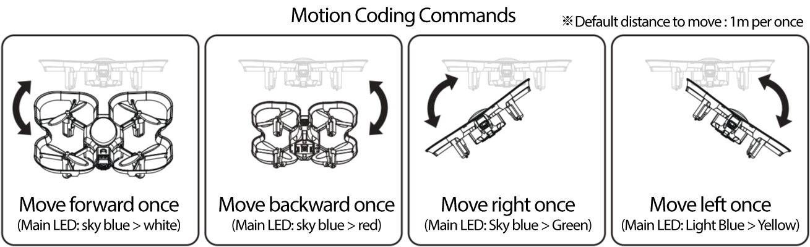

 

    <h1>Lesson 6. Motion coding with a coding drone</h1>

 

---

 

    <h1>[Outline]</h1>

 

In this lecture, I am going to try motion coding, which is the second function of unplugged coding with a coding drone.  
First, let's see what motion coding is.

 

    <table>
        <tr>
            <td>
                
<b>What is motion coding?</b>

            </td>
        </tr>
        <tr>
            <td>
                
☞	Coding This is a coding method that allows you to input flight commands according to the tilting direction by tilting the drone's body. There are a total of 4 flight commands: tilt forward to move forward 1m, tilt backward to move back 1m, tilt left to move 1m to the left, and tilt right to move 1m to the right.  
                ☞ The coding drone has an internal motherboard. <b>6 axis attitude sensor </b>is equipped, this attitude sensor can measure the tilted direction and angle of the coding drone.
                

            </td>
        </tr>
        <tr>
            <td>
                

                    
                

            </td>
        </tr>
    </table>

 

    <table>
        <tr>
            <td colspan="2">
                
<b>※ 6 axis attitude sensor</b>

            </td>
        </tr>
        <tr>
            <td>
                

                

            </td>
            <td>
                

                ▶ The 6-axis attitude sensor consists of a 3-axis acceleration sensor and a 3-axis gyro sensor. Here, the 3 axes refer to the X-axis (horizontal), Y-axis (vertical), and Z-axis (vertical) based on the center of the object  
                ▶ The accelerometer measures the gravitational acceleration acting on each axis to determine how much the current object is tilted in which direction.  
                ▶ The gyro sensor measures the angular velocity (the amount of change in the rotational angle) acting on each axis to determine how much and in which direction the current object is tilted.  
                ▶ Although the accelerometer and gyro sensor have the same purpose of use, more precise measurements can be made by complementing the shortcomings of each sensor.
                

            </td>
        </tr>
    </table>

 

Did you know what motion coding is? Now let's fly the coding drone with motion coding.

 

---

 

    <h1>[Motion coding method]</h1>

 

Motion coding is performed in the following order.

 

    <table>
        <tr>
            <td>
                

            </td>
        </tr>
        <tr>
            <td>
                

            </td>
        </tr>
        <tr>
            <td>
                
① The way to recognize motion is to hold the coding drone in hand and keep it in equilibrium, tilt the coding drone according to each command, and then return it to its original position.  
                If the buzzer sounds when tilted and the buzzer sounds when you put it back to its original position, the motion command has been entered normally. 
                <b>※ Tilt the GoCar at least 30 degrees when tilting it.</b>
                  
                ② ②	To execute motion coding, place the coding drone on a flat surface and press the operation button 2 times in a row, after about 2 to 3 seconds, a buzzer sound (tiri-rik) is automatically executed. 
                <b>※ Immediately after running, you will move away from the drone by a safe distance. Beware of accidents!</b>  
                ③ Coding instructions entered once are stored in memory and can be executed continuously. However, it is reset when the power of the coding drone is turned off or the “Start coding” card is read again. 
                

            </td>
        </tr>
    </table>

 

---

 

    <h1>[Coding and running]</h1>

 

We are going to play a game of finding a destination with motion coding.  
First, make an activity board on the floor as shown below. Make 9 squares with a side length of 1m and tape them to the floor as shown in the figure below, and mark each square with a number.

 

    <table>
        <tr>
            <td>
                
motion coding action board

            </td>
            <td>
                

                
                

            </td>
        </tr>
    </table>

 

    <table>
        <tr>
            <td rowspan="6">
                
<b>Step 1</b>
                

            </td>
            <td colspan="3"> 
                
 <b>Enter Coding</b>

            </td>
        </tr>
        <tr>
            <td rowspan="4">
                

            </td>
            <td>
                
 ① move 1m to the right 

            </td>
            <td>
                
 ② move 1m to the right 

            </td>
        </tr>
        <tr>
            <td>
                

                

            </td>
            <td>
                

                

            </td>
        </tr>
        <tr>
            <td>
                
 ③ 1m forward 

            </td>
            <td>
                
 ④ 1m forward 

            </td>
        </tr>
        <tr>
            <td>
                

                

            </td>
            <td>
                

                

            </td>
        </tr>
        <tr>
            <td colspan="3">
                

                    ① ①	If a friend tells you where the coding drone will depart from and the number of where it will arrive, it will think about how to fly. (ex: Start at No. 7 and go to No. 3.) 
                    <b>※ At this time, your friend will also designate which direction the front of the coding drone should be directed (choose from east, west, north and south) from the starting position. (ex: Put the front side facing north.)</b> 
                    ②②	Read the “Motion Coding Mode” card and “Start Coding” card in order, and raise the coding drone while maintaining equilibrium to enter the coding command. 
                    ③ ③	After entering all coding commands, read the “End coding” card to complete coding. 
                

            </td>
        </tr>
        <tr>
            <td rowspan="3">
                
<b>Step 2</b>
                

            </td>
            <td colspan="3"> 
                
 <b>run the code</b>

            </td>
        </tr>
        <tr>
            <td colspan="3"> 
                
 

            </td>
        </tr>
        <tr>
            <td colspan="3">
                

                    Put the coding drone on position 7 and press the operation button twice in a row to execute coding, and immediately move away from the drone by a safe distance (2m).  
                    After about 2-3 seconds, the coding drone automatically executes the coded command.  
                    Check if the coding drone moves well to position 3, and if it does not move, check which part is wrong, correct it and re-execute it.
                

            </td>
        </tr>
   </table>

 

Were you able to move the coding drone to its destination well with motion coding? There are several routes from the origin to the destination. Try flying other routes with motion coding, and enjoy the motion coding game while changing the starting point and destination with your friends. And if the drone needs to stop suddenly while in flight, you can use the remote controller to switch to the control mode and land it as we learned earlier. The remote controller and the drone must be paired, and when you move the lever of the remote controller, it immediately switches to the control mode. To switch back to motion coding mode, read the “Motion coding mode” card.

 

---

 

    <h1>[Organize]</h1>

 

In this lecture, I tried motion coding, the second unplugged coding function of the coding drone. When performing motion coding, the sensor is sensitive to the inclination of the coding drone, so it must be tilted in the correct direction while maintaining a good balance. And don't forget to read the “Coding Start” and “End Coding” cards at the beginning and end of coding just like card coding.

    <table>
        <tr>
            <td>
                

                    1) with coding drone“motion coding mode” When the card is read, it is set to motion coding mode. 
                    2) Motion coding can input coding commands by tilting the coding drone in a specific direction, The coding instruction is 4Eggplant. 
                    ☞	front : Advance / behind : junior / left : left move/ Right side : move right (travel distance =1m) 
                    3) It is installed on the internal main board of the coding drone.6The axis attitude sensor can measure the tilt direction and angle. 
                    4) When tilting the coding drone, 30It has to tilt more than one degree and return to the original position for the coding command to be entered normally. 
                

            </td>
        </tr>
    </table>

 

---

### [Coding with a coding drone (English)](../)

 1. [Make friends with Coding Drone!](../lesson1)
 2. [Let's fly a coding drone](../lesson2)
 3. [I code cards with a coding drone (1)](../lesson3)
 4. [I code cards with a coding drone (2)](../lesson4)
 5. [I code cards with a coding drone (3)](../lesson5)
 6. **Motion coding with a coding drone**
 7. [Block coding with a coding drone(1)](../lesson7)
 8. [Block coding with a coding drone(2)](../lesson8)

---

Modified : 2021.8.5