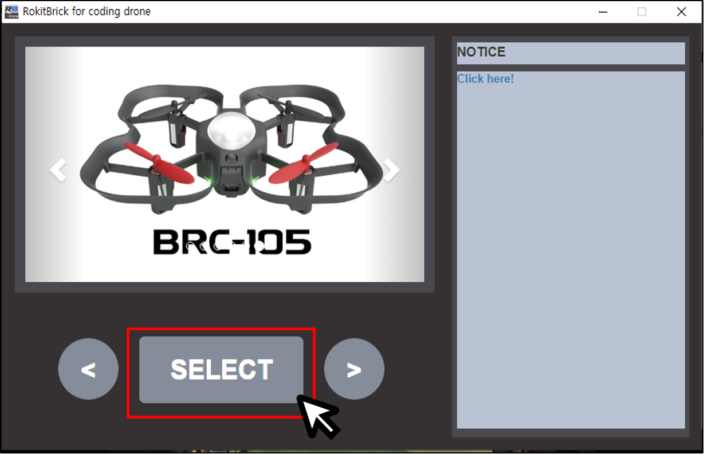

 

    <h1>Lesson 7. Block coding with a coding drone (1)</h1>

 

---

 

    <h1>[Outline]</h1>

 

Coding drone supports not only unplugged coding but also plugged coding function.  
Currently available pluggable coding programs are <b>“Rockitbrick”</b> and <b>“Python”</b>.  
In this lecture, we are going to learn how to connect and code a coding drone and a rocket brick. 

    <table>
        <tr>
            <td>
<h3>What is Plugged Coding?</h3> 
</td>
        </tr>
        <tr>
            <td>
                
Plugged means that an electric plug is plugged in. 
                 Plugged coding refers to coding activities using electronic products such as computers and mobile devices.  
                 One example of pluggable coding is block coding, which is a coding learning activity using an educational programming language (EPL).  
                 You can create a program by arranging block-shaped commands in order by using a computer, tablet, etc. Representative educational programming languages include <b>Rockitbrick</b>, Entry, and Scratch. 

            </td>
        </tr>
        <tr>
            <td>
                

                    
                

            </td>
        </tr>
    </table>

 

---

 

    <h1>[Connect]</h1>

 

<h2> 1. Connecting the Coding Drone to Rockitbrick</h2>
 

Connect the coding drone to the <B>Rockitbrick</b> as follows.

1) What you need: PC, USB cable, coding drone, remote controller

2) Install the battery in the coding drone.

3) Connect the remote controller to the PC using a USB cable.

<b>※ The drone and remote controller must be paired.</b> 
 

    
     

 
4) Download Program 
☞ [Rokitbrick Download Windows Version](https://byrobot.co.kr/bbs/download.php?bo_table=download&wr_id=11&no=0) 
☞ [Rokitbrick Download MAC OS Version](https://byrobot.co.kr/bbs/download.php?bo_table=download&wr_id=11&no=1)
  
5) Run Rockitbrick and click [SELECT]

    
     

6) [BRC-105] Click. 

    
     

7) Click [Connect to Drone] and click the corresponding port to connect to the drone.

    
     

8) [Connection successful] If a message appears, the connection is normal.

    
     

 

---

 

    <h1>[Note]</h1>

 

<h2>1. Rockitbrick Block for Coding Drone</h2> 
<h4>1) Drone sensor block</h4>

    <table>
        <tr>
            <td>
                

                     
                

            </td>
            <td>
                - You can check the real-time measurement values of various sensors of the coding drone and use it as a variable block. 
            </td>
        </tr>
    </table>

<h4>2) Remote Controller Button/Joystick (Lever) Judgment Block</h4>

    <table>
        <tr>
            <td>
                

                     
                

            </td>
            <td>
                - This is a block that determines the operation of the buttons and joystick (lever) of the remote controller and is used as a conditional in the conditional block.  
                - 	You can generate a remote controller motion signal to perform a specific command. 
            </td>
        </tr>
    </table>

<h4>3) drone flying block</h4>

    <table>
        <tr>
            <td>
                

                     
                

            </td>
            <td>
                - You can set the drone mode. 
                - Drones can take off/land and fly. 
            </td>
        </tr>
    </table>

<h4>4) Drone/Remote Controller LED Block</h4>

    <table>
        <tr>
            <td>
                

                     
                

            </td>
            <td>
                - You can decorate the drone's LED in various colors. 
            </td>
        </tr>
    </table>

<h4>5) Drone/Remote Controller Buzzer Block</h4>

    <table>
        <tr>
            <td>
                

                     
                

            </td>
            <td>
                - You can play the scale with the buzzer sound of the drone/controller. 
            </td>
        </tr>
    </table>

<h4>6) Remote Controller Vibration Block</h4>

    <table>
        <tr>
            <td>
                

                     
                

            </td>
            <td>
                - You can turn the vibration of the remote controller on/off. 
            </td>
        </tr>
    </table>

 
<h2> 2. Precautions for use</h2>

1) lease use the drone with a fully charged battery, and if the battery level is less than 50%, flight performance may be affected.

2) Depending on the battery level and the condition of parts such as motors and propellers (motor performance, whether the propeller is defective, etc.), good or bad flight conditions may occur.

3) Drones and remote controllers always have the latest firmware installed.

4) The drone may malfunction due to program errors, so use it in a wide space as much as possible, and check that there are no people or obstacles around.

 

<h2> 3. How to Force Stop the Drone</h2>
 
<b>※ If an error occurs while using the coding drone in Rockitbrick or the drone does not fly in the desired direction, the drone must be stopped by force.</b> 

☞ If you click Force Stop on the running <B>Rockitbrick</b> screen with the mouse to end the execution, the drone will land directly from the current location.

☞ It is used to make and use a landing code so that it can land in an emergency on the <b>Rockitbrick</b> code. Make the drone land when a specific key on the keyboard is pressed. The code below is an example

    <table>
        <tr>
            <td>
                

                     
                

            </td>
            <td>
                - Press the space key to land the drone. “Flying motion state” is a block made to be used during coding by coding various motions of the coding drone. 
                

                <table>
                    <tr>
                        <td>
                            

                                flight mode
                            

                        </td>
                        <td>
                            

                                code
                            

                        </td>
                    </tr>
                    <tr>
                        <td>
                            

                                Ready
                            

                        </td>
                        <td>
                            

                                READY
                            

                        </td>
                    </tr>
                    <tr>
                        <td>
                            

                                Start
                            

                        </td>
                        <td>
                            

                                START
                            

                        </td>
                    </tr>
                    <tr>
                        <td>
                            

                                Take off
                            

                        </td>
                        <td>
                            

                                TAKE OFF
                            

                        </td>
                    </tr>
                    <tr>
                        <td>
                            

                                Flight
                            

                        </td>
                        <td>
                            

                                FLIGHT
                            

                        </td>
                    </tr>
                    <tr>
                        <td>
                            

                                Landing
                            

                        </td>
                        <td>
                            

                                LANDING
                            

                        </td>
                    </tr>
                    <tr>
                        <td>
                            

                                Stop
                            

                        </td>
                        <td>
                            

                                STOP
                            

                        </td>
                    </tr>
                </table>
                

            </td>
        </tr>
    </table>

---

 

    <h1>[Thinking of code]</h1>

If you succeed in connecting the coding drone to the rocket brick, shall we try a simple flight with block coding? 
Let's try flying forward and then landing. 

 

    <table>
        <tr>
            <td rowspan="2">
                

            </td>
            <td>
                

                action sequence
                

            </td>
        </tr>
        <tr>
            <td>
                

                ① The drone takes off. 
                ② Drone 1m Hover after moving forward. 
                ③ The drone lands. 
                

            </td>
        </tr>
    </table>

 

    <table>
        <tr>
            <td>
                
block

            </td>
            <td colspan="2">
                

                Explanation
                

            </td>
        </tr>
        <tr>
            <td>
                

            </td>
            <td colspan="2">
                
The drone takes off. constant altitude (approx. 1m) And then it will hover.

            </td>
        </tr>
        <tr>
            <td>
                

            </td>
            <td colspan="2">
                
The drone lands while in flight.  
                Wait for the motor to come to a complete stop after landing.  
                Do not use the landing command when the drone is too high or too low.  
                (1m The height is appropriate.)

            </td>
        </tr>
        <tr>
            <td rowspan="4">
                

            </td>
            <td colspan="2">
                
The drone will fly by default according to the settings of the following options. 
                <b>※ Basic flight: Advance, junior, move left, move right, Increase, descent</b>
                

            </td>
        </tr>
        <Tr>
            <td>
                
option One

            </td>
            <td>
                
Sets the default flight direction. 
                ① forward = move forward 
                ② backward = move backward 
                ③ Left = move left 
                ④ Right = move right 
                ⑤ up = move up 
                ⑥ down = move down
                

            </td>
        </tr>
        <Tr>
            <td>
                
option 2

            </td>
            <td>
                
Set the movement speed. 
                (unit: m/s, decimal point available)

            </td>
        </tr>
        <Tr>
            <td>
                
option 3

            </td>
            <td>
                
Set the flight distance. 
                Street = speed x time ex) 1m/s * 1sec = 1m 
                (unit: seconds,decimal point available)
                

            </td>
        </tr>
    </table>

 

Now, how to write code using the above blocks Think about what it will be I thought of the code like this:

 

    <table>
        <tr>
            <td colspan="2">
                
code

            </td>
        </tr>
        <tr>
            <td>
                

                action sequence
                

            </td>
            <td>
                

                Takeoff → Wait 5 seconds (= hovering) → Move forward 1m → Landing
                

            </td>
        </tr>
        <tr>
            <td colspan="2">
                

                

            </td>
        </tr>
    </table>

 

    <table>
        <tr>
            <td>
                

            </td>
            <td>
                

                Use the wait command between takeoff and move commands to give the drone time to position and maintain a stable posture after moving.
                

            </td>
        </tr>
    </table>

 

---

 

    <h1>[Coding and running]</h1>

 

<h2> 1. Coding</h2>

 
Let's make code by assembling blocks in <b>Rockitbrick</b>.
 

 

<h2> 2. Running</h2>

 

When you have created all the code, press the space bar to run it. 
Before executing, first check the following: 

    <table>
        <tr>
            <td>
                

            </td>
            <td>
                
<b>
                a while! Check it out one more time before running the drone autonomous flight code on Rockitbrick!</b>  
                1) Secure a safe distance (2m or more) from the drone. 
                2) Make sure there are no people or obstacles around the drone. 
                ☞ Make sure that there are no people or obstacles in the path by predicting the direction and distance of the drone's movement in the code. 
                3) Check how to forcefully stop the drone in case of a malfunction of the drone or a rocket brick error.
                

            </td>
        </tr>
    </table>

 

So, if you're ready, let's run it.  
Do the drones fly in the order of movement?  
If it doesn't fly as expected, check which part is wrong, correct it, and try again

 

---

 

    <h1>[Organize]</h1>

 

In this lecture, I learned about plug coding, a new coding function of the coding drone, and also tried block coding myself using Entry.  
In Rockitbrick, you can do more diverse and higher-level coding than card coding.  
Let's immerse ourselves in the fun of autonomous flight by coding using various blocks of the coding drone!

    <table>
        <tr>
            <td>
                

                    1) Plugged means that an electric plug is plugged in. Plugged coding refers to coding activities using electronic products such as computers and mobile devices. 
                    2) Block coding is a coding learning activity using an Educational Programming Language (EPL) as an example of Plugged Coding.  
                    ☞ Educational programming languages: Rockitbrick, Entry, Scratch, etc 
                    3)Coding drone and rocket brick connection method is PC and the controller USB After connecting with a cable, run Rockit Brick to connect the coding drone and hardware. 
                    4)The <b>Rockitbrick</b> block for the coding drone is a sensor, flight, LED, It is composed of various categories such as buzzer. 
                    5)If an error occurs while using the coding drone in <b>Rockitbrick</b> or the drone does not fly in the desired direction, the drone must be stopped forcibly. The method is as follows. 
                    (1)	(1)	If you click Force Stop on the running <b>Rockitbrick</b> screen with the mouse to end the execution, the drone will land directly from the current location. 
                    (2)	(2)	It is used to make and use a landing code so that it can land in an emergency on the <b>Rockitbrick</b> code. 
                    6)Before execute the autonomous flight with a coding drone in <b>Rockitbrick</b>, check the safety rules first.
                

            </td>
        </tr>
    </table>

 

---

### [Coding with a coding drone (English)](../)

 1. [Make friends with Coding Drone!](../lesson1)
 2. [Let's fly a coding drone](../lesson2)
 3. [I code cards with a coding drone (1)] - fifth week of July
 4. [I code cards with a coding drone (2)] - fifth week of July
 5. [I code cards with a coding drone (3)] - first week of August
 6. [Motion coding with a coding drone] -first week of August
 7. **Block coding with a coding drone(1)**
 8. [Block coding with a coding drone (2)](../lesson8)

---

Modified : 2021.7.16