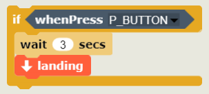

 

    <h1>Lesson 8. Block coding with a coding drone (2)</h1>

 

---

 

    <h1>[Outline]</h1>

 

In this lecture, we will code to control the drone by pressing the button on the remote controller.  
Isn't it strange to think that the drone is controlled by pressing a button instead of using the lever on the remote controller?  
If you use the remote controller button event block among the blocks for coding drones, you can give movement commands for each button.  
Here we are going to take off and land and do basic flight (forward, reverse, move left, move right). 
 So shall we start?

 

---

    <h1>[Thinking of code]</h1>

 
In <b>Rokitbrick</b>, there are two types of remote controller buttons and lever-related blocks.
 

    <table>
        <tr>
            <td>
                

                    <h3>Remote Controller Button Event Block</h3>
                

            </td>
            <td colspan="2">
                

                    ▶ Generates a signal when a button on the remote controller is pressed and returns a True value.
                

            </td>
        </tr>
        <tr>
            <td>
                

                    
                

            </td>
            <td>
                

                    <b>button type</b>
                

            </td>
            <td>
                

                    1. Front Left Top/Bottom Button 
                    2. Front right top/bottom button 
                    3. Top Left/Right Buttons 
                    4. Bottom left/right button 
                    5. Center Up/Down/Left/Right Buttons (=Trim Button)
                

            </td>
        </tr>
        <tr>
            <td>
                

                    <h3>Remote Controller Joystick (Lever) Event Block</h3>
                

            </td>
            <td colspan="2">
                

                    ▶ When the joystick (lever) of the remote controller is moved in a specific direction, it generates a signal and returns a True value.
                

            </td>
        </tr>
        <tr>
            <td>
                

                    
                

            </td>
            <td>
                

                    <b>Joystick (Lever) Direction(Common left/right)</b>
                

            </td>
            <td>
                

                    Total 9 directions: top, top left, top right, bottom, bottom left, bottom right, left, right, center
                

            </td>
        </tr>
        <tr>
            <td colspan="3">
                

                    As follows, assemble and use the conditional block of Rocket Brick as a judgment block.  
                

                

                    
                

            </td>
        </tr>
    </table>

 

Let's code the drone to operate as follows depending on the remote controller button.

    <table>
        <tr>
            <td>
                

                    
                

            </td>
            <td>
                

                    
                

            </td>
        </tr>
        <tr>
            <td>
                

                    Take off: lower left button
                

            </td>
            <td>
                

                    Landing: bottom right button
                

            </td>
        </tr>
        <tr>
            <td>
                

                    
                

            </td>
            <td>
                

                    
                

            </td>
        </tr>
        <tr>
            <td>
                

                    1m forward: button above center
                

            </td>
            <td>
                

                    Reverse 1m: button below center
                

            </td>
        </tr>
        <tr>
            <td>
                

                    
                

            </td>
            <td>
                

                    
                

            </td>
        </tr>
        <tr>
            <td>
                

                    Move 1m left: Center left button
                

            </td>
            <td>
                

                    Move 1m to the right: Center right button
                

            </td>
        </tr>
    </table>

 

 

So first, think about how to create the code for each command.

 

    <table>
        <tr>
            <td>
                

                    Command
                

            </td>
            <td>
                

                    code
                

            </td>
            <td>
                

                    Explanation
                

            </td>
        </tr>
        <tr>
            <td>
                

                    take off
                

            </td>
            <td>
                

                    
                

            </td>
            <td>
                

                    If you press the lower left button (=S button) on the remote controller, the drone will hover for 3 seconds after take off.
                

            </td>
        </tr>
        <tr>
            <td>
                

                    to land
                

            </td>
            <td>
                

                    
                

            </td>
            <td>
                

                    If you press the bottom right button (=P button) on the remote controller, the drone will hover for 3 seconds and then land.
                

            </td>
        </tr>
        <tr>
            <td>
                

                    go forward 1 m
                

            </td>
            <td>
                

                    
                

            </td>
            <td>
                

                    The button above the center of the remote controller (=trim▲button) to start the dronem Hover for 3 seconds after moving forward.
                

            </td>
        </tr>
        <tr>
            <td>
                

                    back 1m
                

            </td>
            <td>
                

                    
                

            </td>
            <td>
                

                    The lower center button on the remote controller (=Trim▼button) to start the dronem Hover for 3 seconds after reversing
                

            </td>
        </tr>
        <tr>
            <td>
                

                    move 1m to the left
                

            </td>
            <td>
                

                    
                

            </td>
            <td>
                

                    The button above the center of the remote controller (=trim◀button) to start the dronem Move left and hover for 3 seconds.
                

            </td>
        </tr>
        <tr>
            <td>
                

                    move 1m to the right
                

            </td>
            <td>
                

                    
                

            </td>
            <td>
                

                    The button above the center of the remote controller (=trim▶button) to start the dronem Move right and hover for 3 seconds.
                

            </td>
        </tr>
    </table>

 

Now let's combine the above codes to make one code.

 

    <table>
        <tr>
            <td>
                

                    code
                

            </td>
            <td>
                

                    Explanation
                

            </td>
        </tr>
        <tr>
            <td>
                

                    
                

            </td>
            <td>
                

                    Put all the code for each instruction into a repeat block and assemble it into a single code.  
                    Because RockitBrick is a sequential coding program, blocks are executed sequentially only once.  
                    Therefore, the repeat block must be used to continuously detect a button action signal from the remote controller and execute the command.
                

            </td>
        </tr>
    </table>

 

---

 

    <h1>[Coding and running]</h1>

 

<h2> 1. Coding</h2>
 

Let's make code by assembling blocks in <B>Rokitbrick</b>.

 

    

 

<h2> 2. Running</h2>

 

When you have created the code, click the Start button to run it. 
Before executing, first check the following: 

    <table>
        <tr>
            <td>
                

            </td>
            <td>
                
<b>
                A while! Check it out one more time before running the drone autonomous flight code on Rokitbrick!</b>  
                1) Secure a safe distance (2m or more) from the drone. 
                2) Make sure there are no people or obstacles around the drone. 
                ☞ Make sure that there are no people or obstacles in the path by predicting the direction and distance of the drone's movement in the code. 
                3) Check how to forcefully stop the drone in case of a malfunction of the drone or a rocket brick error.
                

            </td>
        </tr>
    </table>

 

When you are ready, run the code and press the bottom left button (=S button) on the remote controller. 
Do drones take off? Then, press the center up, down, left, and right buttons (=trim button) in sequence and check if the drone flies according to the command. 
If it doesn't fly as expected, check which part is wrong, correct it, and try again.

 

---

 

    <h1>[Organize]</h1>

In this lecture, I tried coding to control the drone by pressing the button on the remote controller.  
Isn't it fun to control the drone with buttons instead of levers on the remote controller?  
In this way, by using the remote controller button and lever event block, you can not only fly the drone as if you were actually controlling it, but you can also make your own remote controller by coding the drone to operate differently from the actual control method.

    <table>
        <tr>
            <td>
                

                    1) When you press a button on the remote controller or move the joystick (lever), you can use the remote controller event block to make the drone perform a specific command. 
                    2) There are two types of remote controller event blocks (button event block, Joystick (Lever) event block), It is used as a judgment block of the conditional block. 
                    3) Since the remote controller event block must continuously check whether a button or joystick (lever) operation signal has occurred, the repeat block is used together. 
                

            </td>
        </tr>
    </table>

 

---

### [Coding with a coding drone (English)](../)

 1. [Make friends with Coding Drone!](../lesson1)
 2. [Let's fly a coding drone](../lesson2)
 3. [I code cards with a coding drone (1)](../lesson3)
 4. [I code cards with a coding drone (2)](../lesson4)
 5. [I code cards with a coding drone (3)] - first week of August
 6. [Motion coding with a coding drone] -first week of August
 7. [Block coding with a coding drone(1)](../lesson7)
 8. **Block coding with a coding drone (2)**

---

Modified : 2021.7.16