 

    <h1>Lesson 1. 페트론 V2와 엔트리가 만났어요!</h1>

 

---

 

    <h1>[들어가기]</h1>

 

엔트리에 페트론 V2를 연결하여 코딩할 수 있습니다. 

엔트리로 코딩하여 페트론 V2를 자율비행 시킬 수도 있고, 조종기로 음악을 연주할 수도 있습니다. 
그리고 텍스트가 아닌 블록을 조립하는 순차 코딩 방식이기 때문에 누구나 쉽게 배우고 사용할 수 있습니다.

이 강의를 통해서,
1. 엔트리 블록 코딩을 통해 코딩의 기본 개념을 배울 수 있습니다.
2. 드론의 자율비행을 직접 체험해볼 수 있습니다. 
3. 4차산업의 핵심 분야인 코딩과 드론을 접목하여 STEAM 교육에 필요한 통합&융합적 사고력을 기를 수 있습니다. 
4. 다가올 미래 사회에 꼭 필요한 창의융합형 인재의 역량을 키울 수 있습니다.

엔트리에 연결하여 코딩할 수 있는 바이로봇 제품은 다음과 같습니다.

    <table>
        <tr>
            <td>
페트론 V2 
</td>
            <td>
                

                    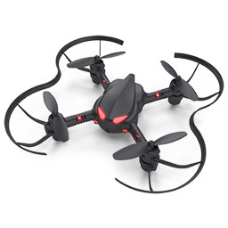 
                    페트론 V2 드론
                

            </td>
            <td>
                

                    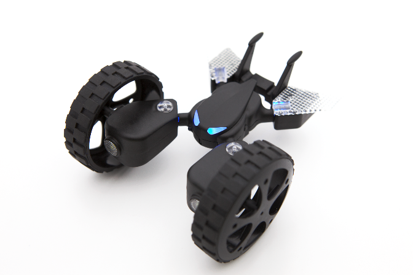 
                    페트론 V2 자동차
                

            </td>
            <td>
                

                    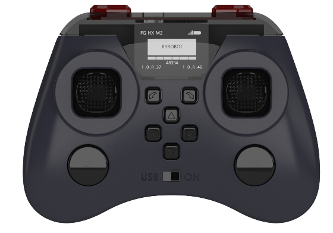 
                    페트론 V2 조종기
                

            </td>
        </tr>
        <tr>
            <td>
드론파이터 
</td>
            <td>
                

                    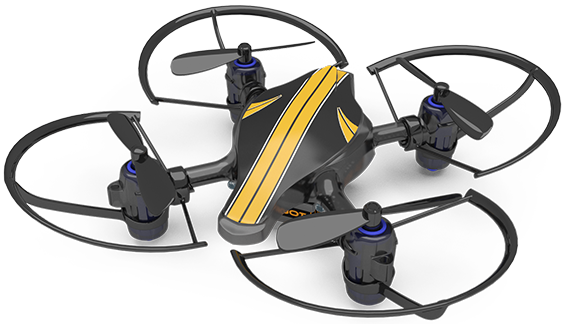 
                    드론파이터 드론
                

            </td>
            <td>
                

                    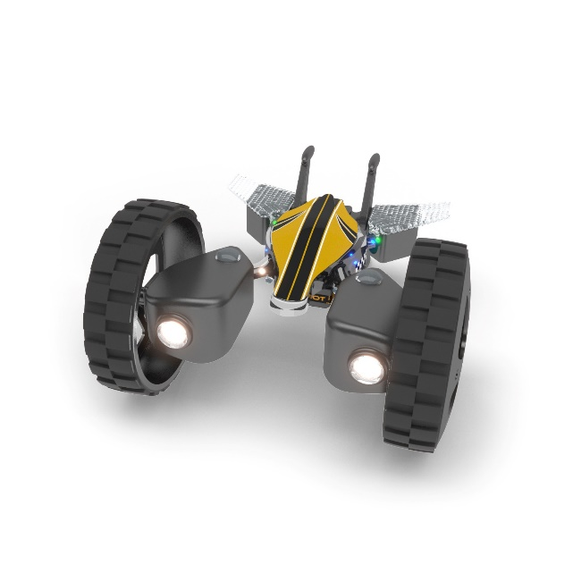 
                    드론파이터 자동차
                

            </td>
            <td>
                

                    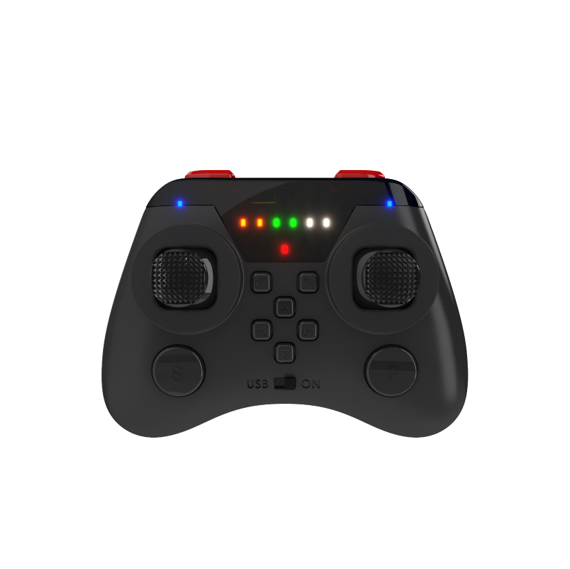 
                    드론파이터 조종기
                

            </td>
        </tr>
    </table>

 
<b>※이 강의는 페트론 V2 드론과 조종기에 관한 교육 자료입니다.</b> 

<b>※엔트리의 기본적인 사용법을 알고 있으면 좀 더 쉽게 이해할 수 있습니다. 
엔트리 홈페이지(https://playentry.org/)에서 엔트리를 학습해보세요..</b>

 

---

 

    <h1>[연결하기]</h1>

 

<h2> 1. 엔트리에 페트론 V2 연결하기</h2>
 

다음과 같이 엔트리에 페트론 V2를 연결합니다.

1) 준비물: PC, USB 케이블, 페트론 V2 드론, 조종기

2) 페트론 V2에 배터리를 장착합니다

3) 조종기를 USB 모드로 설정하고 USB 케이블을 이용하여 PC와 연결합니다.

<b>※드론과 조종기는 페어링이 되어있는 상태여야 합니다.</b> 
 

    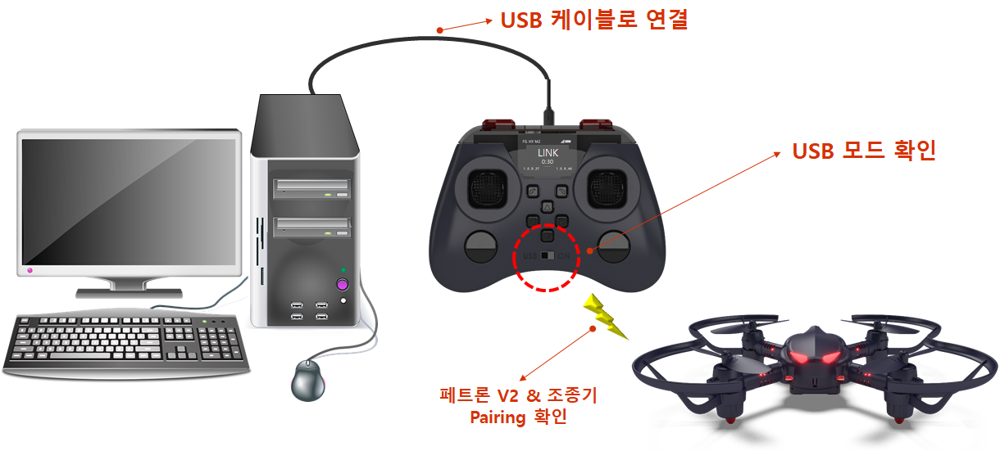
     

4) 엔트리 사이트(http://playentry.org)에 접속합니다.
 

    
     

<b>※엔트리는 PC에 프로그램을 설치하여 오프라인에서도 사용 가능합니다.</b> 
 

    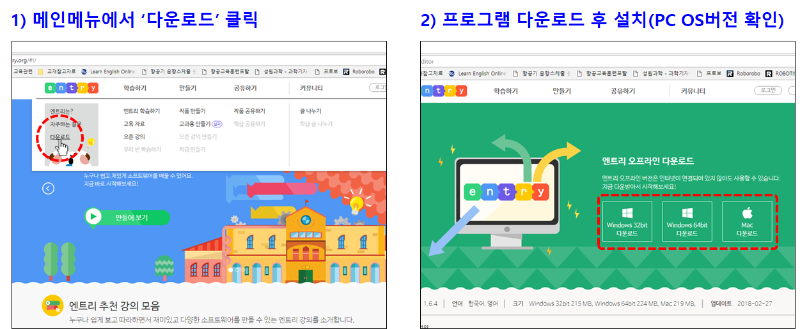
     

 

    < PC 최소 요구사항 > 
    <b>디스크 여유 공간 500MB 이상, windows7 혹은 MAC OS 10.8 이상</b>

 
5) 메인 메뉴에서 ‘만들기’를 클릭합니다.

    
     

6)	블록꾸러미에서 ‘하드웨어’ 카테고리를 클릭합니다.

    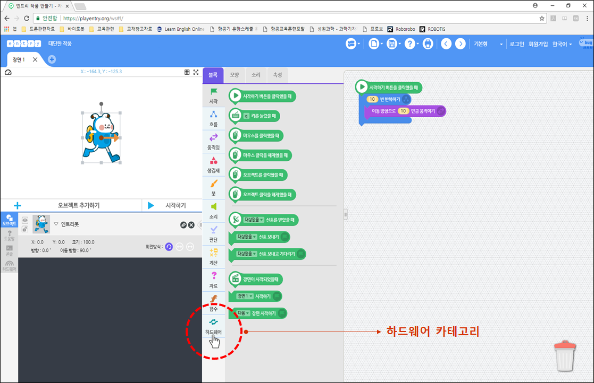
     

7)	‘연결 프로그램 다운로드’ 버튼을 클릭하여 하드웨어 연결 프로그램 설치 파일을 다운로드한 후, 실행하여 프로그램을 설치합니다.

    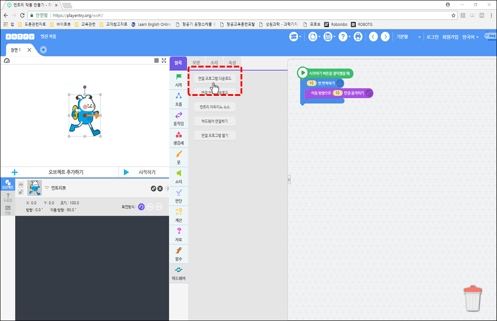
     

8)	‘연결 프로그램 열기’ 버튼을 클릭합니다.

    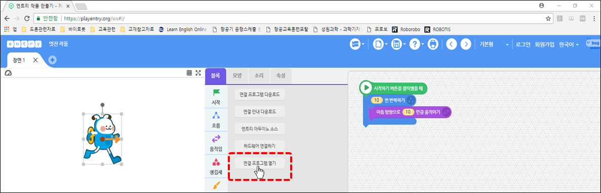
     

9)	상단에 뜨는 팝업창에서 ‘Entry_HW 열기’ 버튼을 클릭합니다.

    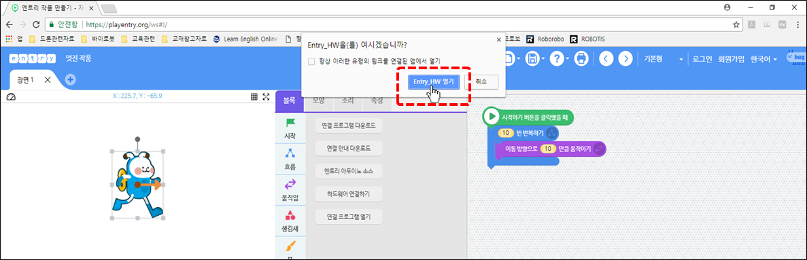
     

10)	하드웨어 연결 프로그램의 하드웨어 목록 중에서 ‘바이로봇 페트론V2 드론’을 클릭합니다.

    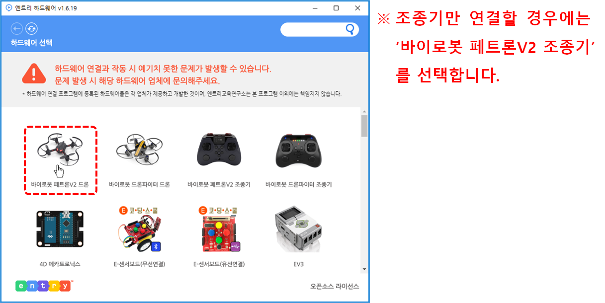
     

11)	‘연결 성공’ 메시지가 나오면 정상적으로 연결된 것입니다.

    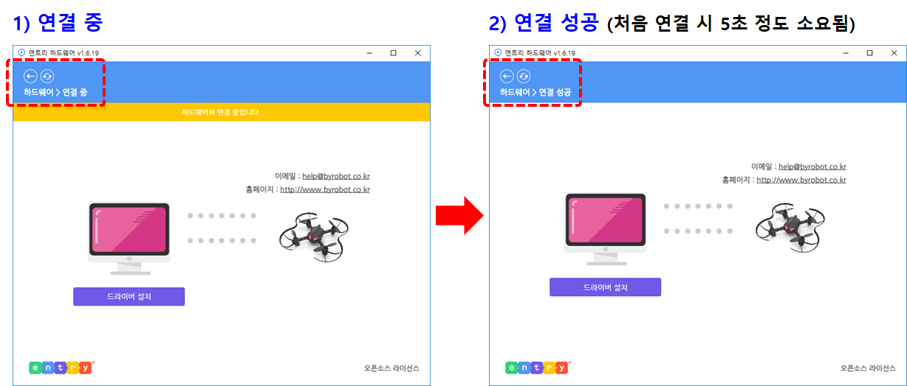
     

12)	엔트리에서 페트론 V2용 블록이 생성된 것을 확인할 수 있습니다.

    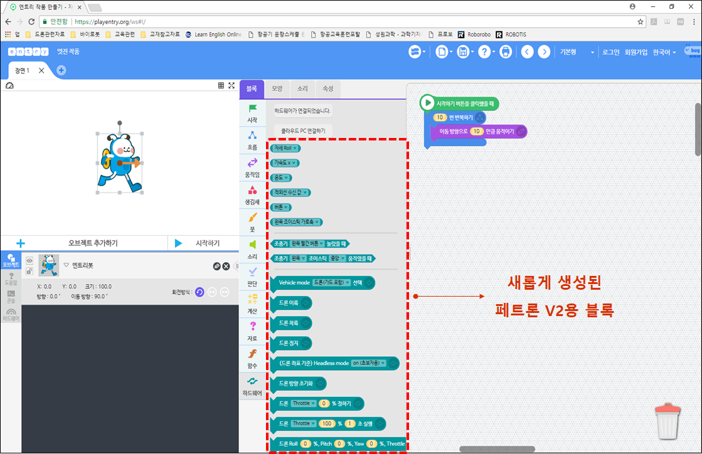
     

 
<h2> 2. 연결 오류 발생 시 조치 방법</h2>
 
1) 연결 성공 후 페트론 V2용 블록이 보이지 않는 경우  
    ①F5키를 눌러서 새로고침을 합니다. 
    ②블록꾸러미의 하드웨어 카테고리에서 ‘하드웨어 연결하기’ 버튼을 클릭합니다. 

    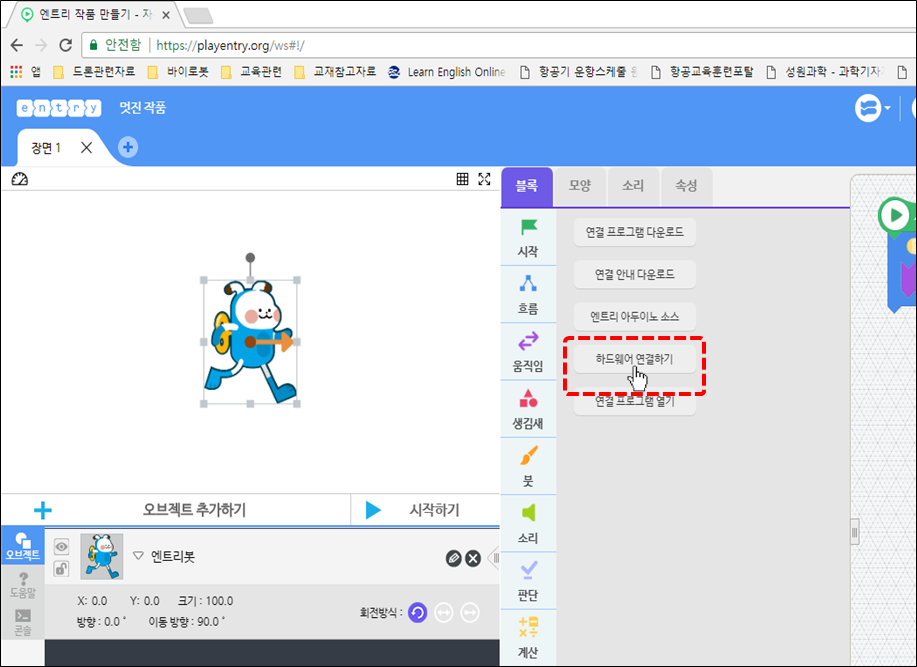
     

 
2) 하드웨어 연결 프로그램에서 계속 ‘연결 중’으로 표시되는 경우 

    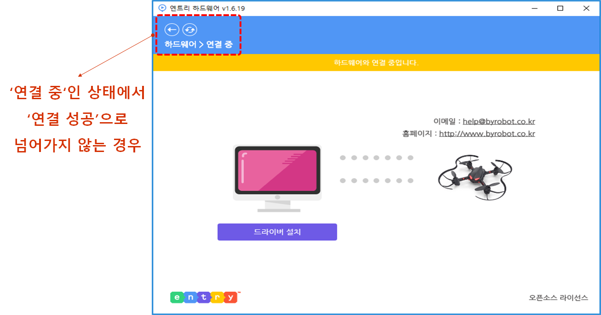
     

    <table>
        <tr>
            <td>
                

                    ①	조종기가 USB 모드인지 확인합니다.
                    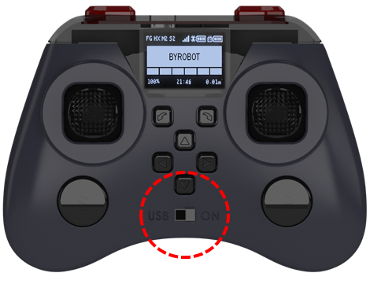 
                

            </td>
            <td>
                

                    ②	페트론 V2와 컴퓨터의 연결이 정상인지 확인합니다
                    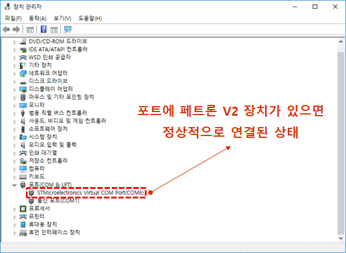 
                

            </td>
        </tr>
    </table>

3) 페트론 V2와 컴퓨터의 연결이 정상적이지 않은 경우

    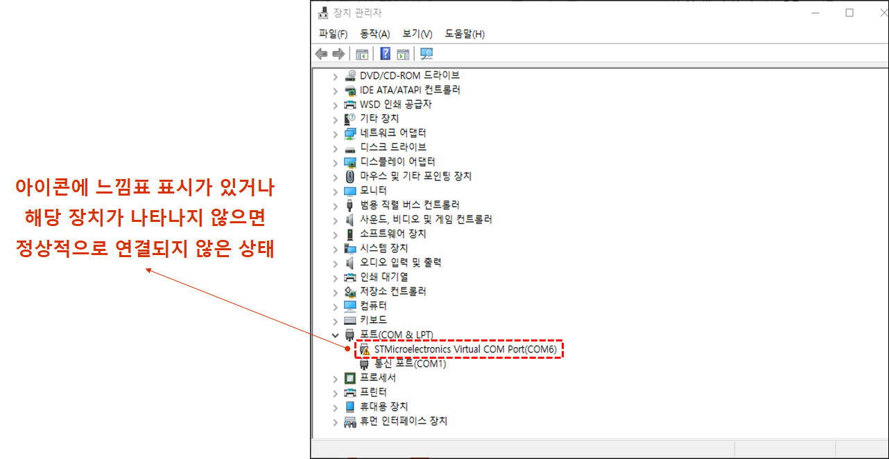
     

①	컴퓨터의 USB 포트가 접촉 불량일 수도 있으므로 다른 USB 포트에 연결해봅니다. 
②	USB 케이블이 불량일 수도 있으므로 USB 케이블을 교체해봅니다. 
 

---

 

    <h1>[알아두기]</h1>

 

<h2>1. 페트론 V2용 엔트리 블록</h2> 
<b>※엔트리 블록에 대한 자세한 설명은 블록 매뉴얼 자료를 참조해주세요.</b> 
<h4>1) 드론 센서 블록</h4>

    <table>
        <tr>
            <td>
                

                    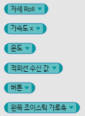 
                

            </td>
            <td>
                - 페트론 V2의 여러 가지 센서들의 측정값을 확인할 수 있습니다. 
            </td>
        </tr>
    </table>

<h4>2) 조종기 버튼/조이스틱(레버) 판단 블록</h4>

    <table>
        <tr>
            <td>
                

                    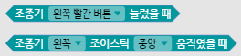 
                

            </td>
            <td>
                - 조종기의 버튼 및 조이스틱(레버) 동작을 판단하는 블록으로 조건문 블록에 조건 사항으로 사용합니다.  
                - 조종기 동작 신호를 발생시켜서 특정 명령을 수행하도록 할 수 있습니다. 
            </td>
        </tr>
    </table>

<h4>3) 드론 비행 블록</h4>

    <table>
        <tr>
            <td>
                

                    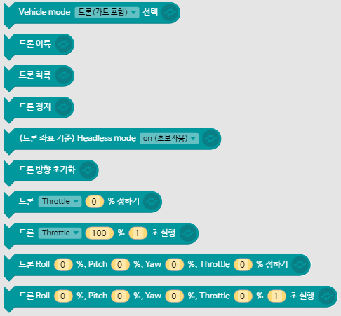 
                

            </td>
            <td>
                - 드론 모드 설정을 할 수 있습니다. 
                - 드론을 이륙/착륙 및 비행시킬 수 있습니다. 
            </td>
        </tr>
    </table>

<h4>4) 드론 모터 블록</h4>

    <table>
        <tr>
            <td>
                

                    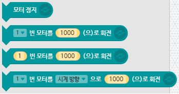 
                

            </td>
            <td>
                - 드론 모터를 개별적으로 회전시킬 수 있습니다. 
            </td>
        </tr>
    </table>

<h4>5) 적외선 송신 블록</h4>

    <table>
        <tr>
            <td>
                

                     
                

            </td>
            <td>
                - 적외선 센서를 통해 특정값을 송신할 수 있습니다. 
            </td>
        </tr>
    </table>

<h4>6) 드론 LED 블록</h4>

    <table>
        <tr>
            <td>
                

                    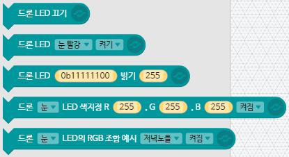 
                

            </td>
            <td>
                - 드론 LED를 다양한 색상으로 꾸밀 수 있습니다. 
            </td>
        </tr>
    </table>

<h4>7) 조종기 LED 블록</h4>

    <table>
        <tr>
            <td>
                

                    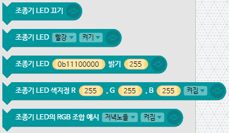 
                

            </td>
            <td>
                - 조종기의 LED를 다양한 색상으로 꾸밀 수 있습니다. 
            </td>
        </tr>
    </table>

<h4>8) 조종기 화면 그리기 블록</h4>

    <table>
        <tr>
            <td>
                

                    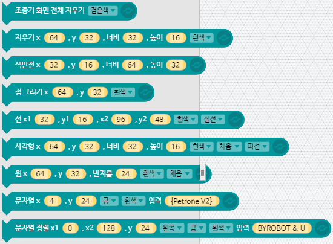 
                

            </td>
            <td>
                - 조종기의 OLED 화면에 점, 선, 도형을 그리고 문자를 표시할 수 있습니다. 
            </td>
        </tr>
    </table>

<h4>9) 조종기 버저 블록</h4>

    <table>
        <tr>
            <td>
                

                    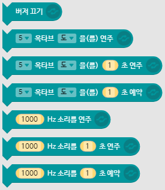 
                

            </td>
            <td>
                - 조종기의 버저(Buzzer)음으로 음계를 연주할 수 있습니다. 
            </td>
        </tr>
    </table>

<h4>10) 조종기 진동 블록</h4>

    <table>
        <tr>
            <td>
                

                    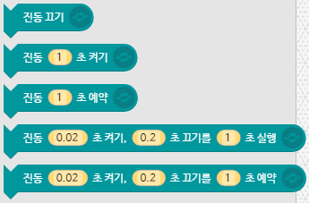 
                

            </td>
            <td>
                - 조종기의 진동을 켜고 끌 수 있습니다. 
            </td>
        </tr>
    </table>

 
<h2> 2. 사용 시 주의사항</h2>

1) 드론의 배터리가 완전히 충전된 상태에서 사용해주시고, 배터리 잔량이 50% 미만이면 비행 퍼포먼스에 영향을 줄 수 있습니다. 30% 미만이 되면 배터리를 교체합니다.

2) 배터리 잔량과 모터, 프로펠러 등 부품의 상태(모터 성능, 프로펠러 결함 여부 등)에 따라 비행 상태에 좋고 나쁨의 차이가 발생할 수 있습니다.

3) 드론과 조종기는 항상 최신 펌웨어를 설치합니다.

4) 프로그램 오류 등으로 인해 드론에 오작동이 발생할 수 있으니 가급적 넓은 공간에서 사용해주시고, 주변에 사람이나 장애물이 없는지 확인합니다.

 

<h2> 3. 드론을 강제로 멈추는 방법</h2>
 
<b>※엔트리에서 페트론 V2 사용 중에 오류가 발생하거나 드론이 원하는 방향으로 비행하지 않게 되면 드론을 강제로 멈춰야 합니다.</b> 

1) 실행 중인 엔트리 화면을 마우스로 클릭하여 실행을 종료시키면 드론이 멈추게 됩니다. 드론이 비행 중인 경우에는 그 위치에서 모터가 정지하여 드론이 추락하오니 주의해주세요

2) 엔트리 코드에 비상시 착륙할 수 있도록 착륙용 코드를 만들어서 사용합니다. 키보드의 특정 키를 눌렀을 때 드론이 착륙하도록 합니다. 아래 코드는 한가지 예시입니다.

    <table>
        <tr>
            <td>
                

                    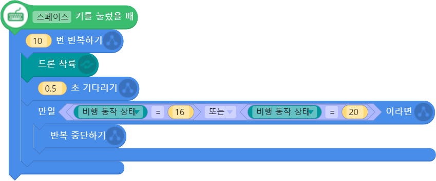 
                

            </td>
            <td>
                - 스페이스 키를 누르면 드론을 착륙 시킵니다. “비행 동작 상태”란 페트론 V2의 여러 가지 동작을 코드화 시켜서 코딩 시 활용할 수 있게 만든 블록입니다. 
                

                <table>
                    <tr>
                        <td>
                            

                                비행모드
                            

                        </td>
                        <td>
                            

                                코드
                            

                        </td>
                    </tr>
                    <tr>
                        <td>
                            

                                대기(Ready)
                            

                        </td>
                        <td>
                            

                                16
                            

                        </td>
                    </tr>
                    <tr>
                        <td>
                            

                                이륙(Take off)
                            

                        </td>
                        <td>
                            

                                18
                            

                        </td>
                    </tr>
                    <tr>
                        <td>
                            

                                비행(Flight)
                            

                        </td>
                        <td>
                            

                                19
                            

                        </td>
                    </tr>
                    <tr>
                        <td>
                            

                                착륙(Landing)
                            

                        </td>
                        <td>
                            

                                20
                            

                        </td>
                    </tr>
                    <tr>
                        <td>
                            

                                정지(Stop)
                            

                        </td>
                        <td>
                            

                                32
                            

                        </td>
                    </tr>
                </table>
                

            </td>
        </tr>
    </table>

 

---

 

    <h1>[정리하기]</h1>

 

페트론 V2와 엔트리를 연결하여 사용하는데 어려움은 없었나요? 

혹시 문제가 발생하였는데 해결하기 어려운 경우에는 바이로봇 AS센터(031–227–9675, help@byrobot.co.kr)로 연락바랍니다.

 그리고 핸드북에는 페트론 V2에 관한 조종법, 기능 설정 방법 등 자세한 설명이 되어 있으니 참고 바랍니다. 
 
 다음 강의부터는 직접 엔트리로 코딩해서 조종기로 음악을 연주해보고, 드론을 자율비행 시켜보도록 하겠습니다.

 

---

### [엔트리로 코딩해요](../)

 1. **페트론 V2와 엔트리가 만났어요**
 2. [조종기로 음악을 연주해보아요](../lesson2)
 3. [조종기 화면에 그림을 그려보아요](../lesson3)
 4. [조종기로 로봇청소기를 돌려보아요](../lesson4)
 5. [엔트리로 드론을 날려보아요](../lesson5)
 6. [드론으로 센서 놀이를 해보아요](../lesson6)
 7. [센서를 활용한 패턴 비행을 해보아요](../lesson7)
 8. [조종기 버튼으로 드론을 날려보아요](../lesson8)

---

Modified : 2019.1.9