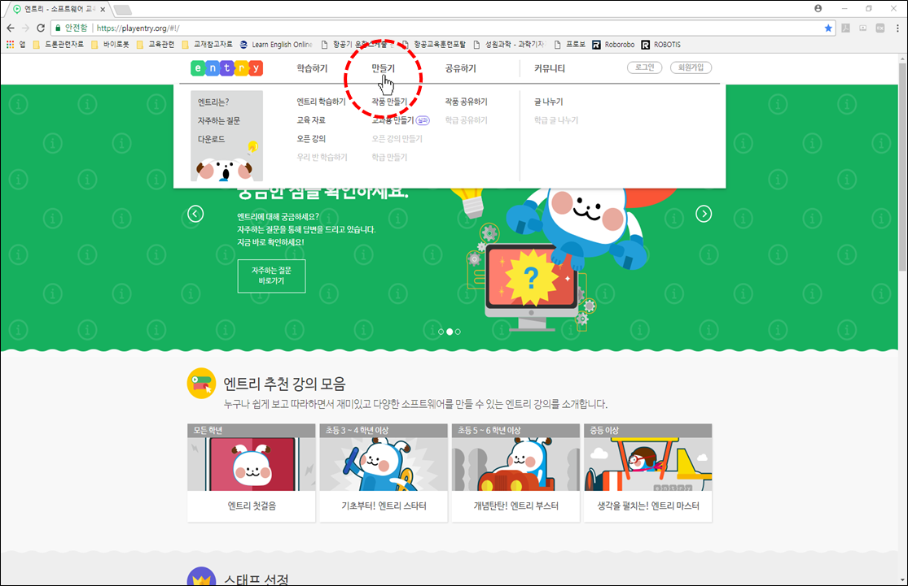

 

    <h1>Lesson 1. 페트론 V2와 엔트리가 만났어요!</h1>

 

---

 

    <h1>[들어가기]</h1>

 

엔트리에 페트론 V2를 연결하여 코딩할 수 있습니다. 

엔트리로 코딩하여 페트론 V2를 자율비행 시킬 수도 있고, 조종기로 음악을 연주할 수도 있습니다. 
그리고 텍스트가 아닌 블록을 조립하는 순차 코딩 방식이기 때문에 누구나 쉽게 배우고 사용할 수 있습니다.

이 강의를 통해서,
1. 엔트리 블록 코딩을 통해 코딩의 기본 개념을 배울 수 있습니다.
2. 드론의 자율비행을 직접 체험해볼 수 있습니다. 
3. 4차산업의 핵심 분야인 코딩과 드론을 접목하여 STEAM 교육에 필요한 통합&융합적 사고력을 기를 수 있습니다. 
4. 다가올 미래 사회에 꼭 필요한 창의융합형 인재의 역량을 키울 수 있습니다.

엔트리에 연결하여 코딩할 수 있는 바이로봇 제품은 다음과 같습니다.

    <table>
        <tr>
            <td>
페트론 V2 
</td>
            <td>
                

                     
                    페트론 V2 드론
                

            </td>
            <td>
                

                     
                    페트론 V2 자동차
                

            </td>
            <td>
                

                     
                    페트론 V2 조종기
                

            </td>
        </tr>
        <tr>
            <td>
드론파이터 
</td>
            <td>
                

                     
                    드론파이터 드론
                

            </td>
            <td>
                

                     
                    드론파이터 자동차
                

            </td>
            <td>
                

                     
                    드론파이터 조종기
                

            </td>
        </tr>
    </table>

 
<b>※이 강의는 페트론 V2 드론과 조종기에 관한 교육 자료입니다.</b> 

<b>※엔트리의 기본적인 사용법을 알고 있으면 좀 더 쉽게 이해할 수 있습니다. 
엔트리 홈페이지(https://playentry.org/)에서 엔트리를 학습해보세요..</b>

 

---

 

    <h1>[연결하기]</h1>

 

<h2> 1. 엔트리에 페트론 V2 연결하기</h2>
 

다음과 같이 엔트리에 페트론 V2를 연결합니다.

1) 준비물: PC, USB 케이블, 페트론 V2 드론, 조종기

2) 페트론 V2에 배터리를 장착합니다

3) 조종기를 USB 모드로 설정하고 USB 케이블을 이용하여 PC와 연결합니다.

<b>※드론과 조종기는 페어링이 되어있는 상태여야 합니다.</b> 
 

    
     

4) 엔트리 사이트(http://playentry.org)에 접속합니다.
 

    
     

<b>※엔트리는 PC에 프로그램을 설치하여 오프라인에서도 사용 가능합니다.</b> 
 

    
     

 

    < PC 최소 요구사항 > 
    <b>디스크 여유 공간 500MB 이상, windows7 혹은 MAC OS 10.8 이상</b>

 
5) 메인 메뉴에서 ‘만들기’를 클릭합니다.

    
     

6)	블록꾸러미에서 ‘하드웨어’ 카테고리를 클릭합니다.

    
     

7)	‘연결 프로그램 다운로드’ 버튼을 클릭하여 하드웨어 연결 프로그램 설치 파일을 다운로드한 후, 실행하여 프로그램을 설치합니다.

    
     

8)	‘연결 프로그램 열기’ 버튼을 클릭합니다.

    
     

9)	상단에 뜨는 팝업창에서 ‘Entry_HW 열기’ 버튼을 클릭합니다.

    
     

10)	하드웨어 연결 프로그램의 하드웨어 목록 중에서 ‘바이로봇 페트론V2 드론’을 클릭합니다.

    
     

11)	‘연결 성공’ 메시지가 나오면 정상적으로 연결된 것입니다.

    
     

12)	엔트리에서 페트론 V2용 블록이 생성된 것을 확인할 수 있습니다.

    
     

 
<h2> 2. 연결 오류 발생 시 조치 방법</h2>
 
1) 연결 성공 후 페트론 V2용 블록이 보이지 않는 경우  
    ①F5키를 눌러서 새로고침을 합니다. 
    ②블록꾸러미의 하드웨어 카테고리에서 ‘하드웨어 연결하기’ 버튼을 클릭합니다. 

    
     

 
2) 하드웨어 연결 프로그램에서 계속 ‘연결 중’으로 표시되는 경우 

    
     

    <table>
        <tr>
            <td>
                

                    ①	조종기가 USB 모드인지 확인합니다.
                     
                

            </td>
            <td>
                

                    ②	페트론 V2와 컴퓨터의 연결이 정상인지 확인합니다
                     
                

            </td>
        </tr>
    </table>

3) 페트론 V2와 컴퓨터의 연결이 정상적이지 않은 경우

    
     

①	컴퓨터의 USB 포트가 접촉 불량일 수도 있으므로 다른 USB 포트에 연결해봅니다. 
②	USB 케이블이 불량일 수도 있으므로 USB 케이블을 교체해봅니다. 
 

---

 

    <h1>[알아두기]</h1>

 

<h2>1. 페트론 V2용 엔트리 블록</h2> 
<b>※엔트리 블록에 대한 자세한 설명은 블록 매뉴얼 자료를 참조해주세요.</b> 
<h3>1) 드론 센서 블록</h3>

    <table>
        <tr>
            <td>
                

                     
                

            </td>
            <td>
                	페트론 V2의 여러 가지 센서들의 측정값을 확인할 수 있습니다.
            </td>
        </tr>
    </table>

    

 

<h4>상단 바 영역</h4>
- 바이블럭 버전 정보와 코드 관련 버튼들이 있습니다.

    

 

<h4>블록 영역</h4>
- 바이블럭에서 사용하는 블록들이 카테고리별로 구분되어 있고, 블록을 가져올 수 있습니다.

    
     
    

 

<h4>코딩 영역</h4>
- 블록을 조립하여 코드를 만드는 공간입니다.

    
     
    

 

<h4>상태 표시창 영역</h4>
- 드론의 모든 센서들의 값들을 실시간으로 확인할 수 있습니다. (열기/닫기 버튼을 터치하여 창 펼치기/숨기기 가능)

    

 

<h3> 2) 코드 실행방법</h3>

    

 

<h2> 2. 사용 시 주의사항</h2>

1) 드론의 배터리가 완전히 충전된 상태에서 사용해주시고, 배터리 잔량이 50% 미만이면 배터리를 교체합니다.

2) 배터리 잔량과 모터, 프로펠러 등 부품의 상태(모터 성능, 프로펠러 결함 여부 등)에 따라 비행 상태에 좋고 나쁨의 차이가 발생할 수 있습니다.

3) 드론과 조종기는 항상 최신 펌웨어를 설치합니다.

4) 프로그램 오류 등으로 인해 드론에 오작동이 발생할 수 있으니 가급적 넓은 공간에서 사용해주시고, 주변에 사람이나 장애물이 없는지 확인합니다.

 

<h2> 3. 드론을 강제로 멈추는 방법</h2>

바이블럭 사용 중에 오류가 발생하거나 드론이 원하는 방향으로 비행하지 않게 되면 드론을 강제로 멈춰야 합니다.

1) 상태 표시창 아래 코드 정지 버튼(정지)을 터치합니다. 드론이 비행 중인 경우에는 그 위치에서 모터가 정지하여 드론이 추락하오니 주의해주세요.

2) 바이블럭에 오류가 발생한 경우에는 휴대기기와 조종기의 연결을 해제합니다. 연결을 해제하면 드론은 약 5초간 호버링 후 자동으로 착륙합니다.

 

---

 

    <h1>[정리하기]</h1>

 

바이블럭을 설치하고 페트론 V2와 연결하는데 어려움은 없었나요? 

혹시 문제가 발생하였는데 해결하기 어려운 경우에는 바이로봇 AS센터(031–227–9675, help@byrobot.co.kr)로 연락바랍니다. 

그리고 바이블럭의 모든 블록에 대한 자세한 설명이 되어 있는 자료를 제공해 드리오니 참고 바랍니다. (링크 주소 업데이트 필요) 

다음 강의부터는 직접 바이블럭으로 코딩해보고, 만든 코드를 실행하여 드론을 자율비행시켜보도록 하겠습니다.

 

---

### [바이블럭으로 코딩해요](../)

 1. **페트론 V2와 바이블럭이 만났어요**
 2. [페트론 V2와 인사해요](../lesson2)
 3. [페트론 V2로 음악을 연주해요](../lesson3)
 4. [페트론 V2로 사각형을 그려보아요](../lesson4)
 5. [페트론 V2로 계단을 오르락내리락 해요](../lesson5)
 6. [페트론 V2를 원하는 높이로 상승시켜 보아요](../lesson6)
 7. [페트론 V2를 손바닥 위에 착륙시켜 보아요](../lesson7)
 8. [페트론 V2를 버튼으로 이륙/착륙시켜 보아요](../lesson8)

---

Modified : 2018.8.28