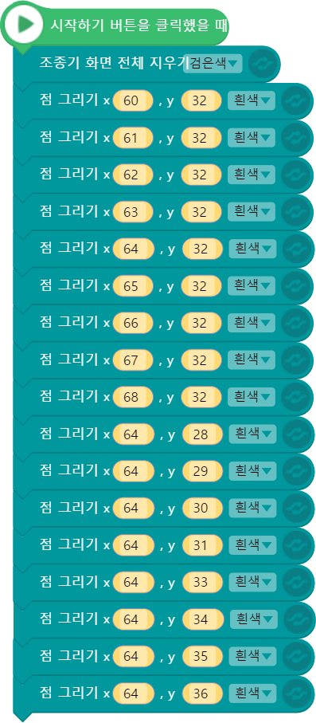
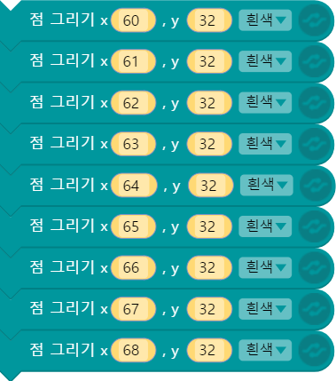
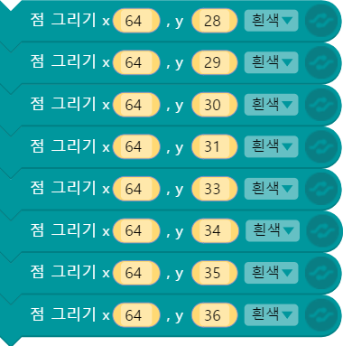
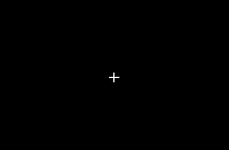
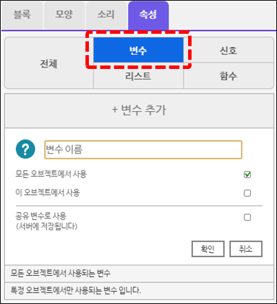
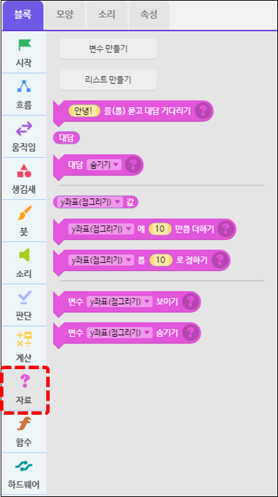
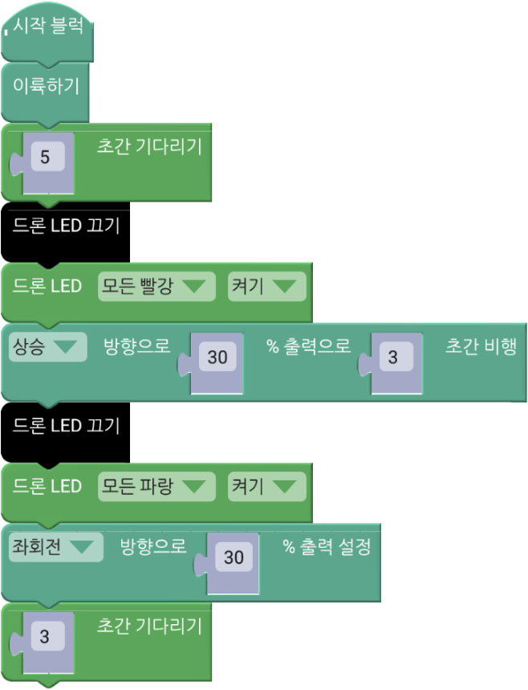
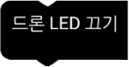
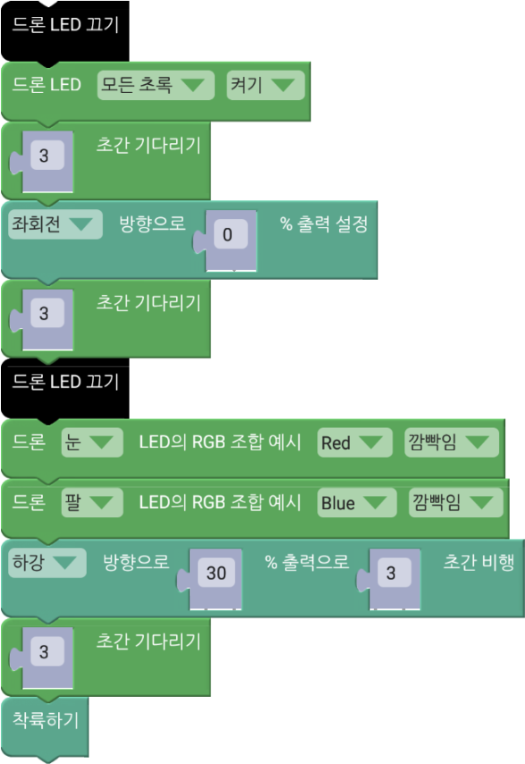

 

    <h1>Lesson 3. 조종기 화면에 그림을 그려보아요!</h1>

 

---

 

    <h1>[들어가기]</h1>

 
이번 강의에서는 조종기의 디스플레이 화면에 점, 선, 면을 그려보고 문자를 표시하는 코딩을 해보려고 합니다. 페트론 V2의 조종기에는 OLED 디스플레이 화면이 있어서 드론과 비행 관련 정보들을 확인할 수 있고, 드론과 조종기의 각종 설정값을 세팅할 수 있습니다. 바로 이곳에 엔트리 코딩으로 그림을 그리고 문자를 찍어서 조종기를 멋지게 꾸밀 수 있답니다. 그럼 자신만의 조종기를 꾸미러 가볼까요?

---

 

    <h1>[코드 생각하기]</h1>

 

<h2> 1. 점 그리기</h2>

점으로 화면 가운데 덧셈 기호 ‘+’를 그려보세요. 다음은 점 그리기 블록 설명입니다.

    <table>
        <tr>
            <td></td>
            <td>조종기 화면의 지정한 위치에 점을 찍습니다.  
            흰색과 검은색 중에서 색상을 선택할 수 있고, 점 찍는 위치는 x, y 좌표값으로 지정합니다. 
            ▶x 좌표: 화면상의 가로 위치로서 범위는 0~128입니다. 화면 왼쪽부터 0에서 시작합니다. (중앙: 64) 
            ▶y 좌표: 화면상의 세로 위치로서 범위는 0~64입니다. 화면 위쪽부터 0에서 시작합니다. (중앙: 32)
            </td>
        </tr>
    </table>

<h2> 2. 선 그리기</h2>

선으로 화면 가운데 X자를 그려보세요. 다음은 선 그리기 블록 설명입니다.

    <table>
        <tr>
            <td></td>
            <td>조종기 화면의 지정한 위치에 선을 그립니다.  
            흰색과 검은색 중에서 색상을 선택할 수 있고, 선 종류(실선, 점선, 파선)도 선택 가능합니다.  
            시작 점과 끝나는 점을 x, y 좌표로 설정합니다. 
            ▶시작 점: x1, y1으로 설정하고, 범위는 x(0~128), y(0~64) 입니다. 
            ▶끝나는 점: x2, y2로 설정하고, 범위는 x(0~128), y(0~64) 입니다.
            </td>
        </tr>
    </table>

<h2> 3. 원 그리기</h2>

화면 가운데 원을 그리고, 그 원 위에 눈과 입을 그려서 사람 얼굴을 완성해보세요. 다음은 원 그리기 블록 설명입니다.

    <table>
        <tr>
            <td></td>
            <td>조종기 화면의 지정한 위치에 원을 그립니다.  
            흰색과 검은색 중에서 색상을 선택할 수 있고, 안쪽을 선택한 색상으로 채울 수도 있습니다.  
            x, y 좌표는 원의 중심이고, 입력한 반지름의 크기로 원을 그립니다. 
            ▶원의 중심: x, y로 설정하고, 범위는 x(-50~178), y(-50~-114) 입니다. 
            ▶반지름: 원의 크기로서 범위는 1~200 입니다.
            </td>
        </tr>
    </table>

<h2> 4. 문자열 입력하기</h2>

화면 가운데 자신의 영어 이름과 ‘BYROBOT’ 글자를 위아래로 표시해보세요. 다음은 문자열 입력 블록 설명입니다.

    <table>
        <tr>
            <td></td>
            <td>조종기 화면의 지정한 위치에 문자열을 입력합니다.  
            글자 크기와 색상을 선택할 수 있고, 표시할 문자를 직접 입력합니다. 
            시작 점: x, y로 설정하고 범위는 x(0~120), y(0~60) 입니다. 
            문자열: 영문자 알파벳 대문자, 소문자, 숫자, 공백, 특수문자가 가능하고 한글은 지원되지 않습니다.
            </td>
        </tr>
        <tr>
            <td></td>
            <td>조종기 화면의 지정한 위치에 문자열을 정렬하여 입력합니다.  
            정렬할 방향과 글자 크기, 색상을 선택할 수 있고 표시할 문자를 직접 입력합니다.  
            ▶정렬 위치: x1, x2, y로 설정하고 x1과 x2 사이에서 설정한 방향으로 정렬합니다. 범위는 x1/x2(0~128), y(0~60) 입니다. 
            ▶정렬 방향: 왼쪽, 가운데, 오른쪽 중에서 선택 가능합니다. 
            ▶문자열: 영문자 알파벳 대문자, 소문자, 숫자, 공백, 특수문자가 가능하고 한글은 지원되지 않습니다.
            </td>
        </tr>
    </table>

 

---

    <h1>[코딩 및 실행하기]</h1>

 

<h2> 1. 점 그리기 - 덧셈 기호(+)</h2>
 

    <table>
        <tr>
            <td>
                

                     조종기 화면 지우기(전체) 블록
                

            </td>
            <td>
                

                    조종기 화면 전체를 검은색(또는 흰색 선택 가능)으로 채웁니다.  
                    조종기 화면에 이미 다른 그림이 그려져 있는 상태에서 새로운 그림을 그리고 싶을 때 사용합니다. 
                    ▶이 블록을 사용하지 않고 그림을 그리면 이전 그림과 겹쳐집니다.  
                    　일부 영역만 지우고 싶은 경우에는 조종기 화면 지우기(지정영역) 블록을 사용합니다.
                

            </td>
        </tr>
        <tr>
            <td>
                

                     점 그리기(가로) 블록
                

            </td>
            <td>
                

                    덧셈 기호 ‘+’ 의 가로 부분에 해당하는 점들을 찍습니다. 조종기 화면의 가운데 지점(x:64, y:32)을 기준으로 좌우로 4개씩의 점을 나란히 찍습니다.   
                    가로 부분이기 때문에 y좌표는 가운데 위치인 32로 고정하고, x좌표만 60부터 1씩 증가하며 총 9개의 점을 찍습니다. (화면 가운데 지점 포함) 
                    ▶좌표를 1씩 증가하며 점을 찍으면 선을 그리는 효과를 낼 수 있습니다.
                

            </td>
        </tr>
        <tr>
            <td>
                

                     점 그리기(세로) 블록
                

            </td>
            <td>
                

                    덧셈 기호 ‘+’ 의 세로 부분에 해당하는 점들을 찍습니다. 조종기 화면의 가운데 지점(x:64, y:32)을 기준으로 상하로 4개씩의 점을 나란히 찍습니다.   
                    가로 부분이기 때문에 x좌표는 가운데 위치인 64로 고정하고, y좌표만 28부터 1씩 증가하며 총 8개의 점을 찍습니다. (화면 가운데 지점은 가로 부분에서 찍었기 때문에 제외)
                

            </td>
        </tr>
    </table>

코드를 실행합니다. 조종기 화면에 다음과 같이 덧셈 기호가 표시되나요? 

    

코딩에 성공했다면 좀 더 큰 덧셈 기호를 표시해보아요. 코드가 많이 길어지나요? 그렇다면 반복문과 변수를 사용하면 코드를 줄일 수 있습니다. 변수는 다음 강의 시간에 배울 예정이므로 이번 시간에는 참고만 하도록 해요.

변수는 속성 탭에서 생성할 수 있고, 관련 블록들은 자료 카테코리에서 확인할 수 있습니다.

    <table>
        <tr>
            <td>
                

                    
                

            </td>
            <td>
                

                    
                

            </td>
        </tr>
        <tr>
            <td>
                

                    변수 생성하기
                

            </td>
            <td>
                

                    변수 관련 블록
                

            </td>
        </tr>
    </table>

코드를 실행합니다. 훌륭한 연주가 되었나요? 다른 듣고 싶은 노래들도 코딩하여 멋지게 연주해봐요.

 

<h2> 2. 드론 LED 꾸며보기</h2>

 

    <table>
        <tr>
            <td>
                

                     
                

            </td>
        </tr>
        <tr>
            <td>
                

                    코드 앞부분
                

            </td>
        </tr>
    </table>

    <table>
        <tr>
            <td>
                

                     
                    드론 LED 끄기 블록
                

            </td>
            <td>
                

                    드론의 모든 LED(눈과 팔 부분)를 끌 때 사용합니다. 
                    LED를 끄지 않고 색상을 바꾸면 이전 색상과 색이 겹쳐지기 때문에 원하는 색상으로 바꿀 수 없습니다.
                    색상 겹침을 피하기 위해서는 꼭 LED를 먼저 끄고 색상을 변경합니다.
                

            </td>
        </tr>
        <tr>
            <td>
                

                     
                    드론 LED 설정(RGB) 블록
                

            </td>
            <td>
                

                    드론 눈/팔/눈+팔 부분 LED를 설정한 색상으로 켜고 끌 때 사용합니다.
                    색상은 Red, Green, Blue 중에서 선택 가능합니다.
                

            </td>
        </tr>
    </table>

    <table>
        <tr>
            <td>
                

                     
                

            </td>
        </tr>
        <tr>
            <td>
                

                    코드 뒷부분
                

            </td>
        </tr>
    </table>

    <table>
        <tr>
            <td>
                

                     
                    드론 LED 설정(색선택) 블록
                

            </td>
            <td>
                

                    드론 눈/팔/눈+팔 부분 LED를 설정한 색상으로 켜고 끌 때 사용합니다. 
                    색상은 여러 가지 색상 중에서 선택 가능합니다. 
                    ※ 의도보다 색상이 더 밝게 표현될 수 있습니다.
                

            </td>
        </tr>
    </table>

코드를 실행합니다. 드론의 LED 색상이 변하면서 비행하니까 더 멋있지 않나요? 좀 더 다양한 색상으로 드론을 예쁘게 꾸며봐요.

---

 

    <h1>[정리하기]</h1>

 

눈과 귀가 즐거운 강의였나요? 이번 강의에서 배운 것을 활용하여 자신만의 음악을 만들어서 조종기로 연주해보고, 드론의 LED를 좀 더 화려하게 꾸며봐요.

1. 조종기의 Buzzer를 이용하여 음을 재생할 수 있습니다. (음계 선택 or 주파수)

2. 드론에는 눈과 팔 부분에 LED가 장착되어 있는데, 코딩으로 색상을 변경할 수 있습니다.

3. 드론의 LED 색상을 변경할 때, 이미 LED가 다른 색상으로 설정되어 있다면 색상이 겹쳐지기 때문에 꼭 LED를 먼저 끈 후 변경합니다.

※ 색상 겹침을 이용하여 특정 색상을 만들고 싶다면 LED를 끄지 않고 사용합니다.

 

---

### [바이블럭으로 코딩해요](../)

 1. [페트론 V2와 바이블럭이 만났어요](../lesson1)
 2. [페트론 V2와 인사해요](../lesson2)
 3. **페트론 V2로 음악을 연주해요**
 4. [페트론 V2로 사각형을 그려보아요](../lesson4)
 5. [페트론 V2로 계단을 오르락내리락 해요](../lesson5)
 6. [페트론 V2를 원하는 높이로 상승시켜 보아요](../lesson6)
 7. [페트론 V2를 손바닥 위에 착륙시켜 보아요](../lesson7)
 8. [페트론 V2를 버튼으로 이륙/착륙시켜 보아요](../lesson8)

---

Modified : 2018.8.28