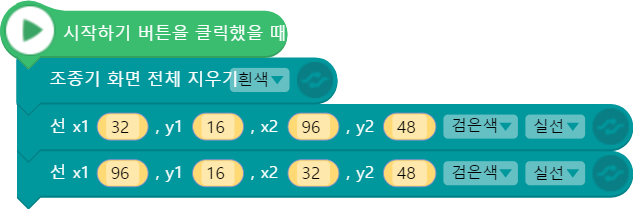
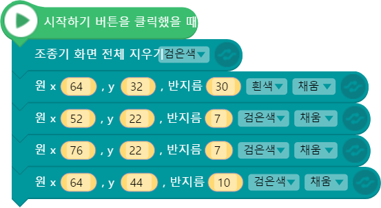
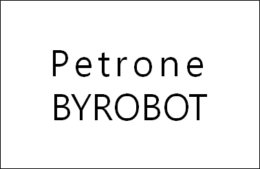

 

    <h1>Lesson 3. 조종기 화면에 그림을 그려보아요!</h1>

 

---

 

    <h1>[들어가기]</h1>

 
이번 강의에서는 조종기의 디스플레이 화면에 점, 선, 면을 그려보고 문자를 표시하는 코딩을 해보려고 합니다. 페트론 V2의 조종기에는 OLED 디스플레이 화면이 있어서 드론과 비행 관련 정보들을 확인할 수 있고, 드론과 조종기의 각종 설정값을 세팅할 수 있습니다. 바로 이곳에 엔트리 코딩으로 그림을 그리고 문자를 찍어서 조종기를 멋지게 꾸밀 수 있답니다. 그럼 자신만의 조종기를 꾸미러 가볼까요?

---

 

    <h1>[코드 생각하기]</h1>

 

<h2> 1. 점 그리기</h2>

점으로 화면 가운데 덧셈 기호 ‘+’를 그려보세요. 다음은 점 그리기 블록 설명입니다.

    <table>
        <tr>
            <td></td>
            <td>조종기 화면의 지정한 위치에 점을 찍습니다.  
            흰색과 검은색 중에서 색상을 선택할 수 있고, 점 찍는 위치는 x, y 좌표값으로 지정합니다. 
            ▶x 좌표: 화면상의 가로 위치로서 범위는 0~128입니다. 화면 왼쪽부터 0에서 시작합니다. (중앙: 64) 
            ▶y 좌표: 화면상의 세로 위치로서 범위는 0~64입니다. 화면 위쪽부터 0에서 시작합니다. (중앙: 32)
            </td>
        </tr>
    </table>

<h2> 2. 선 그리기</h2>

선으로 화면 가운데 X자를 그려보세요. 다음은 선 그리기 블록 설명입니다.

    <table>
        <tr>
            <td></td>
            <td>조종기 화면의 지정한 위치에 선을 그립니다.  
            흰색과 검은색 중에서 색상을 선택할 수 있고, 선 종류(실선, 점선, 파선)도 선택 가능합니다.  
            시작 점과 끝나는 점을 x, y 좌표로 설정합니다. 
            ▶시작 점: x1, y1으로 설정하고, 범위는 x(0~128), y(0~64) 입니다. 
            ▶끝나는 점: x2, y2로 설정하고, 범위는 x(0~128), y(0~64) 입니다.
            </td>
        </tr>
    </table>

<h2> 3. 원 그리기</h2>

화면 가운데 원을 그리고, 그 원 위에 눈과 입을 그려서 사람 얼굴을 완성해보세요. 다음은 원 그리기 블록 설명입니다.

    <table>
        <tr>
            <td></td>
            <td>조종기 화면의 지정한 위치에 원을 그립니다.  
            흰색과 검은색 중에서 색상을 선택할 수 있고, 안쪽을 선택한 색상으로 채울 수도 있습니다.  
            x, y 좌표는 원의 중심이고, 입력한 반지름의 크기로 원을 그립니다. 
            ▶원의 중심: x, y로 설정하고, 범위는 x(-50~178), y(-50~-114) 입니다. 
            ▶반지름: 원의 크기로서 범위는 1~200 입니다.
            </td>
        </tr>
    </table>

<h2> 4. 문자열 입력하기</h2>

화면 가운데 자신의 영어 이름과 ‘BYROBOT’ 글자를 위아래로 표시해보세요. 다음은 문자열 입력 블록 설명입니다.

    <table>
        <tr>
            <td></td>
            <td>조종기 화면의 지정한 위치에 문자열을 입력합니다.  
            글자 크기와 색상을 선택할 수 있고, 표시할 문자를 직접 입력합니다. 
            시작 점: x, y로 설정하고 범위는 x(0~120), y(0~60) 입니다. 
            문자열: 영문자 알파벳 대문자, 소문자, 숫자, 공백, 특수문자가 가능하고 한글은 지원되지 않습니다.
            </td>
        </tr>
        <tr>
            <td></td>
            <td>조종기 화면의 지정한 위치에 문자열을 정렬하여 입력합니다.  
            정렬할 방향과 글자 크기, 색상을 선택할 수 있고 표시할 문자를 직접 입력합니다.  
            ▶정렬 위치: x1, x2, y로 설정하고 x1과 x2 사이에서 설정한 방향으로 정렬합니다. 범위는 x1/x2(0~128), y(0~60) 입니다. 
            ▶정렬 방향: 왼쪽, 가운데, 오른쪽 중에서 선택 가능합니다. 
            ▶문자열: 영문자 알파벳 대문자, 소문자, 숫자, 공백, 특수문자가 가능하고 한글은 지원되지 않습니다.
            </td>
        </tr>
    </table>

 

---

    <h1>[코딩 및 실행하기]</h1>

 

<h2> 1. 점 그리기 - 덧셈 기호(+)</h2>
 

    <table>
        <tr>
            <td>
                

                     조종기 화면 지우기(전체) 블록
                

            </td>
            <td>
                

                    조종기 화면 전체를 검은색(또는 흰색 선택 가능)으로 채웁니다.  
                    조종기 화면에 이미 다른 그림이 그려져 있는 상태에서 새로운 그림을 그리고 싶을 때 사용합니다. 
                    ▶이 블록을 사용하지 않고 그림을 그리면 이전 그림과 겹쳐집니다.  
                    　일부 영역만 지우고 싶은 경우에는 조종기 화면 지우기(지정영역) 블록을 사용합니다.
                

            </td>
        </tr>
        <tr>
            <td>
                

                     점 그리기(가로) 블록
                

            </td>
            <td>
                

                    덧셈 기호 ‘+’ 의 가로 부분에 해당하는 점들을 찍습니다. 조종기 화면의 가운데 지점(x:64, y:32)을 기준으로 좌우로 4개씩의 점을 나란히 찍습니다.   
                    가로 부분이기 때문에 y좌표는 가운데 위치인 32로 고정하고, x좌표만 60부터 1씩 증가하며 총 9개의 점을 찍습니다. (화면 가운데 지점 포함) 
                    ▶좌표를 1씩 증가하며 점을 찍으면 선을 그리는 효과를 낼 수 있습니다.
                

            </td>
        </tr>
        <tr>
            <td>
                

                     점 그리기(세로) 블록
                

            </td>
            <td>
                

                    덧셈 기호 ‘+’ 의 세로 부분에 해당하는 점들을 찍습니다. 조종기 화면의 가운데 지점(x:64, y:32)을 기준으로 상하로 4개씩의 점을 나란히 찍습니다.   
                    가로 부분이기 때문에 x좌표는 가운데 위치인 64로 고정하고, y좌표만 28부터 1씩 증가하며 총 8개의 점을 찍습니다. (화면 가운데 지점은 가로 부분에서 찍었기 때문에 제외)
                

            </td>
        </tr>
    </table>

코드를 실행합니다. 조종기 화면에 다음과 같이 덧셈 기호가 표시되나요? 

    

코딩에 성공했다면 좀 더 큰 덧셈 기호를 표시해보아요. 코드가 많이 길어지나요? 그렇다면 반복문과 변수를 사용하면 코드를 줄일 수 있습니다. 변수는 다음 강의 시간에 배울 예정이므로 이번 시간에는 참고만 하도록 해요.

변수는 속성 탭에서 생성할 수 있고, 관련 블록들은 자료 카테코리에서 확인할 수 있습니다.

    <table>
        <tr>
            <td>
                

                    
                

            </td>
            <td>
                

                    
                

            </td>
        </tr>
        <tr>
            <td>
                

                    변수 생성하기
                

            </td>
            <td>
                

                    변수 관련 블록
                

            </td>
        </tr>
    </table>

 

    <table>
        <tr>
            <td>
                

                      
                     변수 블록
                

            </td>
            <td>
                

                    점을 그릴 x좌표와 y좌표 위치값을 저장할 변수입니다. 
                    덧셈 기호의 가로 부분에 해당하는 점을 찍기 때문에 x좌표는 54에서 1씩 증가하고, y좌표는 화면상 가운데 위치인 32로 고정됩니다.
                

            </td>
        </tr>
        <tr>
            <td>
                

                     점 그리기(가로) 블록 - 반복문
                

            </td>
            <td>
                

                    반복문을 사용하여 점을 찍습니다. 이때 y좌표는 동일하게 하고 x좌표는 1씩 증가시켜서 점을 찍습니다. 그럼 덧셈 기호의 가로 부분에 해당되는 직선이 그려집니다.  
                    ▶점을 많이 찍을수록 더 큰 덧셈 기호를 그릴 수 있습니다
                    좌표를 1씩 증가하며 점을 찍으면 선을 그리는 효과를 낼 수 있습니다.
                

            </td>
        </tr>
        <tr>
            <td>
                

                      
                     변수 블록
                

            </td>
            <td>
                

                    이번에는 덧셈 기호의 세로 부분에 해당하는 점을 찍기 때문에 x좌표는 화면상가운데 위치인 64로 고정되고 y좌표는 22에서 1씩 증가합니다.
                

            </td>
        </tr>
        <tr>
            <td>
                

                     점 그리기(세로) 블록 - 반복문
                

            </td>
            <td>
                

                    반복문을 사용하여 점을 찍습니다. 이때 x좌표는 동일하게 하고 y좌표는 1씩 증가시켜서 점을 찍습니다. 그럼 덧셈 기호의 세로 부분에 해당되는 직선이 그려집니다. 
                    ▶점을 많이 찍을수록 더 큰 덧셈 기호를 그릴 수 있습니다. 
                    ▶화면의 가운데 점은 가로 부분에서 찍었음으로 반복 횟수가 1번 적습니다.
                

            </td>
        </tr>
    </table>

<h2> 2. 선 그리기 – X자</h2>

 

 

    <table>
        <tr>
            <td>
                

                      
                     선 그리기 블록
                

            </td>
            <td>
                

                    X자를 그리기 위해서는 2개의 선이 필요하므로 선 그리기 블록 2개를 조립합니다.  
                    X자는 대칭이므로 x1, x2 좌표를 서로 반대로 입력하고 y1, y2 좌표는 동일하게 입력하면 X자를 그릴 수 있습니다.
                

            </td>
        </tr>
    </table>

코드를 실행합니다. 조종기 화면에 다음과 같이 X자가 그려지나요? 

    

코딩에 성공했다면 좀 더 다양한 모양을 선 그리기로 표현해보세요.

<h2> 3. 원 그리기 – 얼굴</h2>

 

    

    <table>
        <tr>
            <td>
                

                     원 그리기(얼굴) 블록
                

            </td>
            <td>
                

                    바탕이 되는 얼굴을 화면 가운데 위치에 그립니다. 반지름은 30인 원으로 색상은 흰색입니다.
                

            </td>
        </tr>
        <tr>
            <td>
                

                     원 그리기(눈) 블록
                

            </td>
            <td>
                

                    얼굴의 눈을 표현할 원을 그립니다. 눈이 2개이므로 블록 2개를 조립합니다. 얼굴이 흰색이므로 눈은 검은색으로 그립니다.
                

            </td>
        </tr>
        <tr>
            <td>
                

                     원 그리기(입) 블록
                

            </td>
            <td>
                

                    얼굴의 입을 표현할 원을 그립니다. 눈보다 반지름은 3만큼 크고, 색상은 동일하게 검은색으로 표현합니다.
                

            </td>
        </tr>
    </table>

코드를 실행합니다. 조종기 화면에 다음과 같이 얼굴이 그려지면 성공입니다. 지금까지 배운 점, 선, 원을 모두 사용하여 멋진 그림을 조종기에 그려보아요.

    

<h2> 4. 문자열 나타내기 – 영어 이름(위) & BYROBOT(아래)</h2>

 

    

    <table>
        <tr>
            <td>
                

                     문자열 입력 블록
                

            </td>
            <td>
                

                    자신의 영어 이름 길이를 고려하여 시작 점 위치를 설정합니다. 문자 크기(작음/큼)에 따라 시작 점 위치가 달라지는데, 여기서는 큼으로 설정합니다. 그리고 조종기 화면을 흰색으로 채웠기 때문에 문자열 색상은 검은색으로 설정합니다.
                

            </td>
        </tr>
        <tr>
            <td>
                

                     문자열 정리 블록
                

            </td>
            <td>
                

                    문자열 정렬 블록을 사용하면 문자열 위치를 쉽게 설정할 수 있습니다. 화면 가운데 입력하기 위해서는 x1, x2좌표에 최소값(0)과 최대값(128)을 입력하고 정렬 방향을 가운데로 설정한 후, y좌표로 상하 위치만 잡아주면 됩니다. ‘Petrone’ 아래 입력해야 하므로 y좌표를 가운데에서 조금 아래 위치로 설정합니다.
                

            </td>
        </tr>
    </table>

코드를 실행합니다. 다음과 같이 문자열이 표시되나요? 다른 사람에게 전달해야 할 메모를 조종기에 입력하여 주고받아 보아요.

    

---

 

    <h1>[정리하기]</h1>

 

조종기 화면 그리기 블록을 사용하여 조종기의 OLED 디스플레이 화면에 점, 선, 면, 문자열 등을 표시할 수 있습니다. 

1. 조종기의 OLED 디스플레이 화면을 통해 드론과 비행 관련 정보를 확인할 수 있고, 드론과 조종기의 각종 설정값을 세팅할 수 있습니다.

2. 조종기 화면에 점, 선, 사각형, 원을 그릴 수 있고, 문자열을 입력할 수 있습니다.

3. 조종기 화면 지우기(전체 or 지정영역) 블록을 사용하여 화면을 검은색 or 흰색으로 채울 수 있어서 새로 그리기를 할 수 있습니다.

※ 화면 지우기를 사용하지 않으면 그림이나 문자열이 겹쳐집니다.

 

---

### [엔트리로 코딩해요](../)

 1. [페트론 V2와 엔트리가 만났어요](../lesson1)
 2. [조종기로 음악을 연주해보아요](../lesson2)
 3. **페트론 V2로 음악을 연주해요**
 4. [조종기로 로봇청소기를 돌려보아요](../lesson4)
 5. [엔트리로 드론을 날려보아요](../lesson5)
 6. [드론으로 센서 놀이를 해보아요](../lesson6)
 7. [센서를 활용한 패턴 비행을 해보아요](../lesson7)
 8. [조종기 버튼으로 드론을 날려보아요](../lesson8)

---

Modified : 2019.1.14