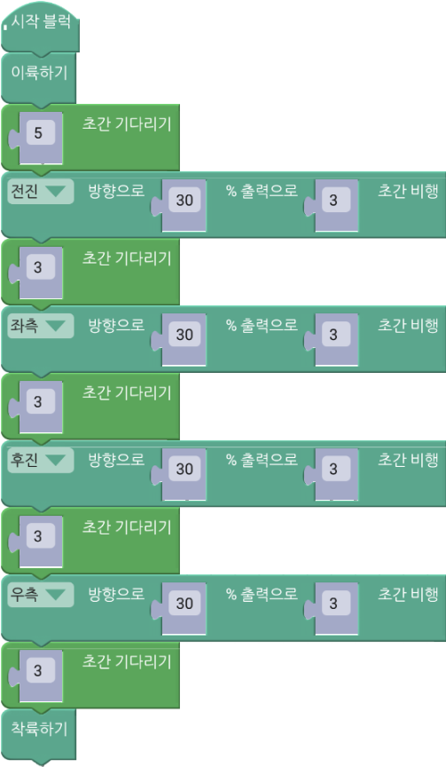
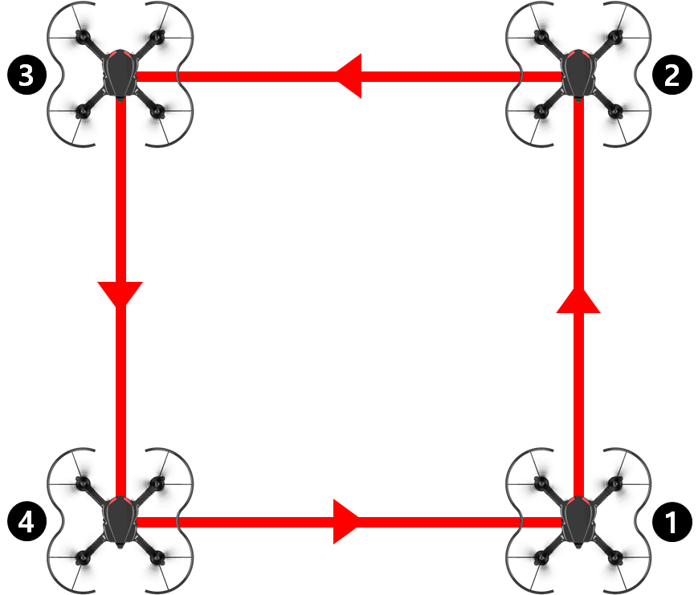
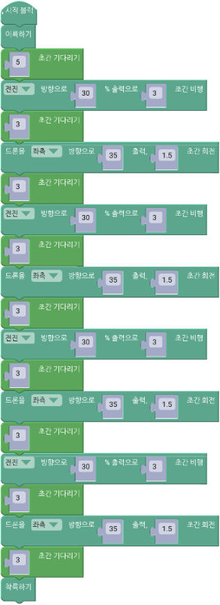
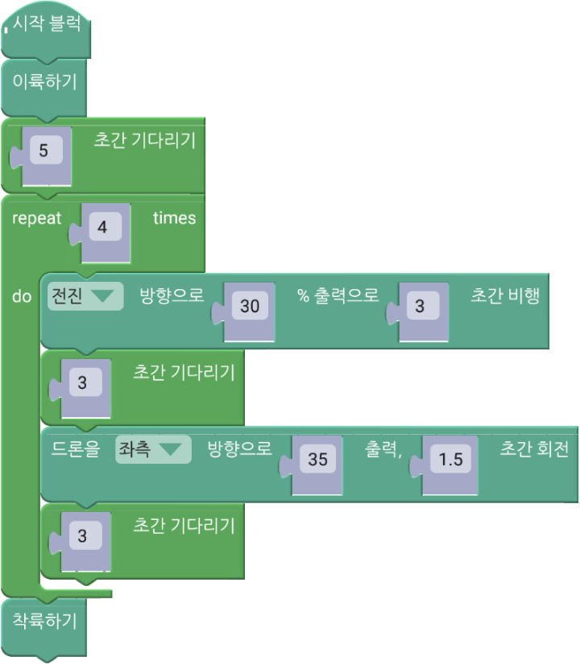
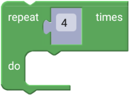

 

    <h1>Lesson 4. 조종기로 로봇청소기를 돌려보아요!</h1>

 

---

 

    <h1>[들어가기]</h1>

 

이번 강의에서는 조종기를 사용하여 엔트리의 로봇청소기를 움직여서 청소하는 프로그램을 만들어보려고 합니다. 조종기 조이스틱(레버) 판단 블록을 사용하면 조종기의 레버를 움직여서 엔트리의 로봇청소기를 움직일 수 있습니다. 그리고 제한된 시간에 모든 쓰레기를 치워야 하는 게임을 만들어서 친구들과 함께 즐겨보아요.

 

<h2>< 로봇청소기 게임 화면 ></h2>

 

---

 

    <h1>[코드 생각하기]</h1>

조종기 동작을 판단하는 블록은 2가지 종류가 있습니다. 엔트리의 조건문 블록에 조건 사항으로 사용합니다.

 

    <table>
        <tr>
            <td>
                

                    조종기 버튼 판단 블록
                

            </td>
            <td>
                

                    ▶ 조종기의 버튼을 눌렀을 때 신호를 발생시켜 True 값을 반환합니다.
                

            </td>
        </tr>
        <tr>
            <td>
                

                    
                

            </td>
            <td>
                

                    <b>버튼 종류</b>   
                    1. 왼쪽 빨간 버튼 
                    2. 오른쪽 빨간 버튼 
                    3. 왼쪽 S 버튼 
                    4. 오른쪽 P 버튼 
                    5. 트림 버튼 6개 (◀, ▶, ▲, ▼,  ,  )
                

            </td>
        </tr>
    </table>

    <table>
        <tr>
            <td>
                

                    조종기 조이스틱(레버) 판단 블록
                

            </td>
            <td>
                

                    ▶ 조종기의 조이스틱(레버)을 특정 방향으로 움직였을 때 신호를 발생시켜 True 값을 반환합니다.
                

            </td>
        </tr>
        <tr>
            <td>
                

                    
                

            </td>
            <td>
                

                    <b>조이스틱(레버) 방향(왼쪽/오른쪽 공통)</b>   
                    총 9방향 : 상, 좌상, 우상, 하, 좌하, 우하, 좌, 우, 센터
                

            </td>
        </tr>
    </table>

다음과 같이 엔트리의 조건문 블록에 판단 블록으로 조립하여 사용합니다.

 
청소하는 로봇청소기 프로그램을 코딩하기 위해서는 다음과 같은 오브젝트가 필요합니다.

<h3>1. 로봇청소기</h3> 

    <table>
        <tr>
            <td>
                

                    
                

            </td>
        </tr>
    </table>

<h3>2. 쓰레기</h3> 

    <table>
        <tr>
            <td>
                

                    
                

            </td>
            <td>
                

                    
                

            </td>
            <td>
                

                    
                

            </td>
            <td>
                

                    
                

            </td>
            <td>
                

                    
                

            </td>
        </tr>
        <tr>
            <td>
                

                    바나나껍질
                

            </td>
            <td>
                

                    고구마
                

            </td>
            <td>
                

                    수박
                

            </td>
            <td>
                

                    계란후라이
                

            </td>
            <td>
                

                    김밥
                

            </td>
        </tr>
    </table>

그리고 제한된 시간에 모든 쓰레기를 치우는 게임을 만들기 위해서는 추가로 다음 오브젝트가 필요합니다.

<h3>3. 초시계</h3> 
엔트리 화면에 제한시간 표시

 
---

위 오브젝트들은 각각 다음과 같이 동작합니다.

<h3>1. 로봇청소기</h3>

조종기 조이스틱(레버)의 움직임에 따라 로봇청소기가 다음과 같이 움직입니다.

    <table>
        <tr>
            <td>
                

                    
                

            </td>
            <td>
            ①	조종기의 오른쪽 조이스틱(레버)을 위로 움직이면 로봇청소기는 앞으로 1만큼 움직입니다.
            </td>
        </tr>
        <tr>
            <td>
                

                    
                

            </td>
            <td>
            ②	조종기의 오른쪽 조이스틱(레버)을 아래로 움직이면 로봇청소기는 뒤로 1만큼 움직입니다.
            </td>
        </tr>
        <tr>
            <td>
                

                    
                

            </td>
            <td>
            ③	조종기의 왼쪽 조이스틱(레버)을 오른쪽으로 움직이면 로봇청소기는 오른쪽으로 1도만큼 회전합니다.
        <tr>
            <td>
                

                    
                

            </td>
            <td>
            ④	조종기의 왼쪽 조이스틱(레버)을 왼쪽으로 움직이면 로봇청소기는 왼쪽으로 1도만큼 회전합니다.
            </td>
        </tr>
        </tr>
    </table>

<h3>2. 쓰레기</h3>

<table>
    <tr>
        <td>
            1)	쓰레기 개수: 5개 (바나나껍질, 고구마, 수박, 계란후라이, 김밥) 
            2)	동작 원리  
▶ 조건: 쓰레기가 로봇청소기에 닿았는가? 
▶ 명령: 조건이 참인 경우 
　　①	조종기에서 Buzzer가 울린다. 
　　②	10점을 획득한다. 
　　③	쓰레기가 사라진다. 
        </td>
    </tr>
</table>

1. 드론이 계속 정면을 바라보는 상태로 사각형 패턴 비행하기 : 4방향(전, 후, 좌, 우)으로 이동하기 필요 
2. 드론이 이동 경로를 따라 앞쪽 방향을 바꾸면서 사각형 패턴 비행하기 : 전진하기와 회전하기 필요 

☞ 각 방법에 따라 사용되는 블록이 달라집니다. <Lesson 2>에서 배운 블록들을 잘 활용하여 사각형 패턴 비행을 성공해봐요.

 

---

 

    <h1>[코딩 및 실행하기]</h1>

 

<h2> 1. 드론이 계속 정면을 바라보는 상태로 사각형 패턴 비행하기 </h2>
 

    <table>
        <tr>
            <td>
                

                    코드 
                    
                

            </td>
        </tr>
        <tr>
            <td>
                

                    설명 
                

            </td>
        </tr>
        <tr>
            <td>
                

                     
                

            </td>
        </tr>
        <tr>
            <td>
                    ①번 위치에서 이륙한 후, ‘전진’ → ‘좌로 이동’ → ’후진’ → ’우로 이동’ 순서로 비행하여 다시 ①번 위치로 돌아오게 됩니다. 
                    드론이 계속 정면을 바라봐야하기 때문에 전, 후, 좌, 우 방향으로 드론을 이동시켜 사각형 모양을 완성합니다.
            </td>
        </tr>
    </table>

코드를 실행합니다. 드론이 정해진 공간을 벗어난다면 조종값 또는 실행 시간을 줄이고, 원하는 거리만큼 이동하지 않는다면 조종값 또는 실행 시간을 늘려서 다시 실행해봅니다. 이처럼 여러 번의 테스트를 통해서 최적의 조종값과 실행 시간을 찾습니다.

 

<h2> 2. 드론이 이동 경로를 따라 앞쪽 방향을 바꾸면서 사각형 패턴 비행하기 </h2>
 

    <table>
        <tr>
            <td>
                

                    코드 
                    
                

            </td>
        </tr>
        <tr>
            <td>
                

                    설명 
                

            </td>
        </tr>
        <tr>
            <td>
                

                     
                

            </td>
        </tr>
        <tr>
            <td>
                    ①번 위치에서 이륙한 후, ②번 포인트까지 전진합니다. 그리고 좌로 90도 회전하여 드론의 앞 방향을 이동 경로와 일치시키고 ③번 위치까지 전진합니다. 이와 같이 전진과 좌회전을 총 4번 반복하여 ①번 위치로 돌아오면서 사각형 모양을 완성합니다. 드론을 좌회전시켜 앞 방향을 이동 경로와 일치시킨 후 비행을 하는 것이 주요 포인트인데, 마치 조종자가 드론에 타서 조종을 하는 것과 같습니다.
            </td>
        </tr>
    </table>

코드를 실행합니다. 드론이 정확하게 90도를 회전하지 않는다면 1번과 마찬가지로 좌(왼쪽) 회전 블록의 조종값 또는 실행 시간을 조정하여 최적의 값을 찾습니다.
 
그런데 위 코드에서 동일한 전진과 좌회전을 4번 반복하느라 같은 블록들을 4번이나 조립하는데 힘들지 않았나요? 그리고 코드가 길어서 한 눈에 보기도 어려워졌습니다. 이러한 문제점을 한 번에 해결해줄 방법이 있습니다. 바로 반복문을 사용하면 코드를 간단하게 줄일 수 있어서 코딩이 좀 더 쉬워집니다.

 

<h2> 3. 반복문을 사용하여 코드 줄이기 </h2>
 

    <table>
        <tr>
            <td>
                

                    알기 쉬운 코딩
                

            </td>
            <td>
                

                    반복문
                

            </td>
        </tr>
        <tr>
            <td>
                

                    
                

            </td>
            <td>
                

                    반복문이란 코딩의 주요 문법 중 하나로서 동일하거나 비슷한 명령을 반복할 때 사용합니다. 반복문을 사용하면 코드의 길이를 줄여줘서 코드를 이해하기 쉽게 해줄 뿐만 아니라, 좀 더 다양하고 효율적인 코딩 구현이 가능합니다.
                      
                    반복문에는 특정 조건이 만족할 때까지 반복하기, 지정한 횟수만큼 반복하기, 무한 반복하기 등 여러 종류가 있는데, 이 강의에서는 지정한 횟수만큼 반복하기와 무한 반복하기를 사용합니다.
                

            </td>
        </tr>
    </table>

 

2번 코드에 반복문을 사용하면 다음과 같이 간단하게 코딩할 수 있습니다. 반복문 블록은 “Loop” 카테고리에 있습니다.

 

    <table>
        <tr>
            <td>
                

                    코드 
                    
                

            </td>
        </tr>
        <tr>
            <td>
                

                    설명 
                

            </td>
        </tr>
        <tr>
            <td>
                

                     
                    반복문(횟수) 블록
                

            </td>
        </tr>
        <tr>
            <td>
                    반복문 블록 안에 블록들을 입력한 횟수만큼 반복하여 실행합니다. 여기서는 전진과 좌회전을 4번 반복하여 사각형 모양의 패턴 비행을 수행합니다.
            </td>
        </tr>
    </table>

 

반복문 블록을 사용하니 코드가 많이 줄어들었죠? 코드를 실행합니다. 드론이 2번 코드와 동일하게 사각형 패턴 비행을 하는지 확인합니다. 반복 횟수를 8로 한다면 사각형 패턴으로 2번 비행하게 됩니다.

 

---

 

    <h1>[정리하기]</h1>

 

코딩을 활용하면 정해진 패턴으로 드론을 자율비행시키는 것이 어렵지 않습니다. 이러한 드론의 자율 패턴 비행은 토지 측량, 농업 방제, 군집 비행 등 산업 분야에서도 다양하게 활용되고 있습니다.

1. 드론의 앞 방향을 바꾸지 않고 사각형 패턴 비행을 하기 위해서는 드론을 4방향(전, 후, 좌, 우)으로 이동시켜야 합니다.
2. 드론의 앞 방향을 이동 경로와 일치시켜서 사각형 패턴 비행을 하기 위해서는 드론을 회전시키는 것이 필요합니다.
3. 반복문을 사용하면 동일하거나 비슷한 블록들을 반복해서 수행할 때 코딩을 쉽고 효율적으로 할 수 있습니다.

 

---

### [바이블럭으로 코딩해요](../)

 1. [페트론 V2와 바이블럭이 만났어요](../lesson1)
 2. [페트론 V2와 인사해요](../lesson2)
 3. [페트론 V2로 음악을 연주해요](../lesson3)
 4. **페트론 V2로 사각형을 그려보아요**
 5. [페트론 V2로 계단을 오르락내리락 해요](../lesson5)
 6. [페트론 V2를 원하는 높이로 상승시켜 보아요](../lesson6)
 7. [페트론 V2를 손바닥 위에 착륙시켜 보아요](../lesson7)
 8. [페트론 V2를 버튼으로 이륙/착륙시켜 보아요](../lesson8)

---

Modified : 2018.8.28