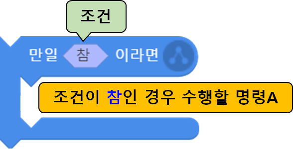
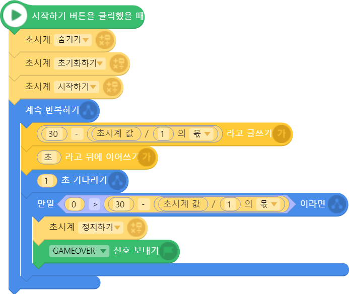
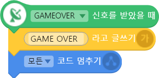

 

    <h1>Lesson 4. 조종기로 로봇청소기를 돌려보아요!</h1>

 

---

 

    <h1>[들어가기]</h1>

 

이번 강의에서는 조종기를 사용하여 엔트리의 로봇청소기를 움직여서 청소하는 프로그램을 만들어보려고 합니다. 조종기 조이스틱(레버) 판단 블록을 사용하면 조종기의 레버를 움직여서 엔트리의 로봇청소기를 움직일 수 있습니다. 그리고 제한된 시간에 모든 쓰레기를 치워야 하는 게임을 만들어서 친구들과 함께 즐겨보아요.

 

<h2>< 로봇청소기 게임 화면 ></h2>

 

---

 

    <h1>[코드 생각하기]</h1>

조종기 동작을 판단하는 블록은 2가지 종류가 있습니다. 엔트리의 조건문 블록에 조건 사항으로 사용합니다.

 

    <table>
        <tr>
            <td>
                

                    조종기 버튼 판단 블록
                

            </td>
            <td>
                

                    ▶ 조종기의 버튼을 눌렀을 때 신호를 발생시켜 True 값을 반환합니다.
                

            </td>
        </tr>
        <tr>
            <td>
                

                    
                

            </td>
            <td>
                

                    <b>버튼 종류</b>   
                    1. 왼쪽 빨간 버튼 
                    2. 오른쪽 빨간 버튼 
                    3. 왼쪽 S 버튼 
                    4. 오른쪽 P 버튼 
                    5. 트림 버튼 6개 (◀, ▶, ▲, ▼,  ,  )
                

            </td>
        </tr>
        <tr>
            <td>
                

                    조종기 조이스틱(레버) 판단 블록
                

            </td>
            <td>
                

                    ▶ 조종기의 조이스틱(레버)을 특정 방향으로 움직였을 때 신호를 발생시켜 True 값을 반환합니다.
                

            </td>
        </tr>
        <tr>
            <td>
                

                    
                

            </td>
            <td>
                

                    <b>조이스틱(레버) 방향(왼쪽/오른쪽 공통)</b>   
                    총 9방향 : 상, 좌상, 우상, 하, 좌하, 우하, 좌, 우, 센터
                

            </td>
        </tr>
    </table>

다음과 같이 엔트리의 조건문 블록에 판단 블록으로 조립하여 사용합니다.

 
청소하는 로봇청소기 프로그램을 코딩하기 위해서는 다음과 같은 오브젝트가 필요합니다.

<h2>1. 로봇청소기</h2> 

    <table>
        <tr>
            <td>
                

                    
                

            </td>
        </tr>
    </table>

<h2>2. 쓰레기</h2> 

    <table>
        <tr>
            <td>
                

                    
                

            </td>
            <td>
                

                    
                

            </td>
            <td>
                

                    
                

            </td>
            <td>
                

                    
                

            </td>
            <td>
                

                    
                

            </td>
        </tr>
        <tr>
            <td>
                

                    바나나껍질
                

            </td>
            <td>
                

                    고구마
                

            </td>
            <td>
                

                    수박
                

            </td>
            <td>
                

                    계란후라이
                

            </td>
            <td>
                

                    김밥
                

            </td>
        </tr>
    </table>

그리고 제한된 시간에 모든 쓰레기를 치우는 게임을 만들기 위해서는 추가로 다음 오브젝트가 필요합니다.

<h2>3. 초시계</h2> 
엔트리 화면에 제한시간 표시

 

---

위 오브젝트들은 각각 다음과 같이 동작합니다.

<h2>1. 로봇청소기</h2>

조종기 조이스틱(레버)의 움직임에 따라 로봇청소기가 다음과 같이 움직입니다.

    <table>
        <tr>
            <td>
                

                    
                

            </td>
            <td>
            ①	조종기의 오른쪽 조이스틱(레버)을 위로 움직이면 로봇청소기는 앞으로 1만큼 움직입니다.
            </td>
        </tr>
        <tr>
            <td>
                

                    
                

            </td>
            <td>
            ②	조종기의 오른쪽 조이스틱(레버)을 아래로 움직이면 로봇청소기는 뒤로 1만큼 움직입니다.
            </td>
        </tr>
        <tr>
            <td>
                

                    
                

            </td>
            <td>
            ③	조종기의 왼쪽 조이스틱(레버)을 오른쪽으로 움직이면 로봇청소기는 오른쪽으로 1도만큼 회전합니다.
            </td>
        </tr>
        <tr>
            <td>
                

                    
                

            </td>
            <td>
            ④	조종기의 왼쪽 조이스틱(레버)을 왼쪽으로 움직이면 로봇청소기는 왼쪽으로 1도만큼 회전합니다.
            </td>
        </tr>
    </table>

 
<h2>2. 쓰레기</h2>

<table>
    <tr>
        <td>
            1)	쓰레기 개수: 5개 (바나나껍질, 고구마, 수박, 계란후라이, 김밥) 
            2)	동작 원리  
▶ 조건: 쓰레기가 로봇청소기에 닿았는가? 
▶ 명령: 조건이 참인 경우 
　　①	조종기에서 Buzzer가 울린다. 
　　②	10점을 획득한다. 
　　③	쓰레기가 사라진다. 
        </td>
    </tr>
</table>
 

<h2>3. 초시계</h2>

<table>
    <tr>
        <td>
            초시계는 제한된 시간에 모든 쓰레기를 치워야 하는 게임을 위해 필요합니다.  
            1)	제한시간: 30초  
            2)	동작 원리  
            　①	게임 시작 시 0으로 초기화한다.  
            　②	30초에서 시작하여 1초씩 줄어든다.  
            　③	30초가 지나면 게임 종료 신호를 보내고, ‘GAME OVER’라는 문구를 화면에 표시한다.  
        </td>
    </tr>
</table>

 

---

 

    <h1>[코딩 및 실행하기]</h1>

 

필요한 오브젝트들을 순서대로 추가하고 코딩을 모두 완료한 후 실행합니다.

<h2> 1. 로봇청소기 코딩하기 </h2>
 
먼저 배경과 로봇청소기 오브젝트를 추가합니다.

    <table>
        <tr>
            <td>
                    1) 엔트리봇 오브젝트를 삭제하고 배경을 추가합니다. 오브젝트 추가하기에서 “마룻바닥”을 검색하여 추가합니다.
                    

                    
                

            </td>
            <td>
             
            ▶ 배경은 오브젝트의 바탕이 되는 공간에 적용되는 이미지입니다.  
            오브젝트 추가하기 화면에서 왼쪽 카테고리의 가장 아래쪽에서 다양한 배경 이미지를 선택할 수 있습니다.
            </td>
        </tr>
        <tr>
            <td>
                    2)	다음으로 로봇청소기 오브젝트를 추가합니다.
                    

                    
                

            </td>
            <td>
            </td>
        </tr>
        <tr>
            <td>
            3)	로봇청소기의 크기, 이동방향, 위치를 조정합니다.
                

                    
                

            </td>
            <td>
            ①	로봇청소기 오브젝트 설정 창에서 수정 아이콘(펜모양)을 클릭합니다.  
②	크기를 60(적절하게 크기를 정해주세요), 이동방향을 0도로 변경합니다.  
③	마우스로 로봇청소기 오브젝트를 드래그하여 원하는 위치로 이동시킵니다.
            </td>
        </tr>
    </table>

 
다음으로 블록을 조립하여 코딩합니다.

    <table>
        <tr>
            <td>
                

                     
                    반복문 블록
                

            </td>
            <td>
            반복문 블록 중의 하나인 계속 반복하기 블록을 사용하여 조종기로부터 조이스틱(레버) 동작 신호를 지속적으로 받을 수 있도록 합니다. 
            ▶엔트리는 순차적 코딩 프로그램이기 때문에 블록이 순차적으로 1번씩만 실행됩니다. 그렇기 때문에 계속 반복하기 블록을 사용하지 않는다면 조종기 동작 신호를 지속적으로 받을 수 없습니다.
            </td>
        </tr>
        <tr>
            <td>
                

                     
                    조건문 블록
                

            </td>
            <td>
            주어진 조건이 True인 경우에만 블록 안의 명령을 수행합니다. 
            여기서는 조종기 조이스틱(레버) 판단 블록을 조건으로 사용합니다.
            </td>
        </tr>
        <tr>
            <td>
                

                     
                    조종기 조이스틱(레버) 판단 블록
                

            </td>
            <td>
            조종기의 조이스틱(레버) 동작에 대한 조건 블록으로서 설정한 조이스틱과 방향으로 움직이면 True 값을 반환합니다.
            </td>
        </tr>
        <tr>
            <td>
                

                     
                    움직임 블록(움직이기)
                

            </td>
            <td>
            오브젝트가 이동 방향으로 설정한 거리만큼 움직입니다.
            </td>
        </tr>
        <tr>
            <td>
                

                     
                    움직임 블록(회전하기)
                

            </td>
            <td>
            오브젝트가 좌or우로 설정한 각도만큼 회전합니다.  
            ▶양수: 시계방향으로 회전 
            ▶음수: 반시계방향으로 회전
            </td>
        </tr>
        <tr>
            <td>
                

                     
                    조건+명령 블록
                

            </td>
            <td>
            조종기 레버(조이스틱)의 움직임에 따라 로봇청소기를 다음과 같이 조종합니다. 
①	조종기 오른쪽 레버 위쪽 → 로봇청소기 1만큼 전진
(이동방향이 전진방향) 
②	조종기 오른쪽 레버 아래쪽 → 로봇청소기 1만큼 후진 
(음수가 이동방향의 반대 방향) 
③	조종기 왼쪽 레버 오른쪽 → 로봇청소기 1도 만큼 오른쪽으로 회전
(양수가 오른쪽 방향으로 회전) 
④	조종기 왼쪽 레버 왼쪽 → 로봇청소기 1도 만큼 왼쪽으로 회전
(음수가 왼쪽 방향으로 회전)
            </td>
        </tr>
    </table>

로봇청소기용 코드에서 사용한 조건문 블록에 대해서 좀 더 자세히 알아볼까요?

    <table>
                <tr>
            <td>
                

                    알기 쉬운 코딩
                

            </td>
            <td>
                

                    조건문
                

            </td>
        </tr>
        <tr>
            <td>
                

                    
                

            </td>
            <td>
                

                    조건문이란 코딩의 주요 문법 중 하나로서 특정 조건을 주고 그 조건에 따라 서로 다른 명령을 수행해야할 때 사용합니다. 우리가 흔히 “만약 ~라면, ~하겠다”란 말을 자주 사용하는데, 바로 이러한 상황을 코딩으로 표현한 것이라고 보면 됩니다.   

엔트리에서는 다음과 같이 2가지 종류의 조건문 블록이 있습니다.  
①	주어진 조건의 참 or 거짓을 판단하여 참이면 명령A를 수행하고 거짓이면 수행하지 않습니다. 
②	주어진 조건의 참 or 거짓을 판단하여 참이면 명령A를 거짓이면 명령B를 수행합니다.
                

            </td>
        </tr>
    </table>

    <table>
        <tr>
            <td>
                

                    
                

            </td>
            <td>
                

                    
                

            </td>
        </tr>
        <tr>
            <td>
                

                    ①	주어진 조건의 참 or 거짓을 판단하여 참이면 명령A를 수행하고 거짓이면 수행하지 않습니다.
                

            </td>
            <td>
                

                    ②	주어진 조건의 참 or 거짓을 판단하여 참이면 명령A를 거짓이면 명령B를 수행합니다.
                

            </td>
        </tr>
    </table>

<h2> 2. 쓰레기 코딩하기 </h2>

쓰레기는 총 5개 오브젝트가 필요합니다. 오브젝트를 모두 추가한 후, 1가지 오브젝트의 코드를 만들어서 나머지는 복사&붙여넣기하면 쉽게 코딩할 수 있습니다.

1)	먼저 쓰레기를 제거할 때마다 점수를 주기 위해서 점수 변수를 생성합니다. 
※	변수: 변하는 수라는 의미로서 오브젝트의 행동이나 블록의 명령에 따라 발생하는 숫자 등의 데이터를 저장하는 공간입니다. 시간이나 점수를 세는데 유용하게 사용할 수 있습니다.

    <table>
        <tr>
            <td>
                    

                    
                

            </td>
            <td>
            ①	속성 탭을 클릭합니다.  
            ②	변수 버튼을 클릭합니다.  
            ③	‘+변수 추가’ 버튼을 클릭합니다.
            </td>
        </tr>
        <tr>
            <td>
                    

                    
                

            </td>
            <td>
            ④	사용할 변수의 이름을 적습니다. 여기서는 ‘점수’라고 합니다.  
            ⑤	확인 버튼을 클릭합니다.
            </td>
        </tr>
        <tr>
            <td>
                

                    
                

            </td>
            <td>
            ①	'점수'라는 변수가 추가되었습니다.  

②	옵션을 설정할 수 있어요. 
- 변수 보이기: 오브젝트 화면에 변수를 보이거나 안보이게 할 수 있어요. 
- 기본값: 변수의 기본값을 설정할 수 있어요. 
- 슬라이드: 변수 값이 변하는 정도를 슬라이드 바로 표현할 수 있어요.
            </td>
        </tr>
    </table>

    <table>
        <tr>
            <td>
                

                    알기 쉬운 코딩
                

            </td>
            <td>
                

                    변수
                

            </td>
        </tr>
        <tr>
            <td>
                

                    
                

            </td>
            <td>
                

                    변수는 프로그램에서 필요한 정보를 저장하는 기억 공간입니다. 게임에서의 ‘점수’, 전화번호부에서 ‘내 이름’과 같은 정보들을 컴퓨터에서 기억하게 하려면 어떻게 해야 할까요? ‘변수’는 프로그램에서 이러한 정보들을 저장할 수 있는 상자와 같은 공간입니다.   

①	변수는 자유롭게 이름을 붙여줄 수 있으며, 관련 블록명령어를 통해 프로그램 실행 중에 값을 입력, 변경, 삭제할 수 있습니다. 
②	하나의 변수에는 숫자 또는 문자값을 한 번에 하나씩만 저장할 수 있습니다. 
③	변수를 생성하면 화면에 ‘변수창’이 나타나며, 이 창은 ‘변수 숨기기/보이기’ 블록을 통해 화면에서 보이거나 숨길 수 있습니다. 
                

            </td>
        </tr>
    </table>

    <table>
        <tr>
            <td>
                

                    
                

            </td>
            <td>
            </td>
        </tr>
    </table>

 
2)	오브젝트 추가하기로 다음 5가지 쓰레기 오브젝트를 추가합니다.  
▶ 바나나껍질, 고구마, 수박, 계란후라이, 김밥

 

    

  
이제 오브젝트 각각 코드를 만들어보아요. 먼저 수박을 코딩해볼까요?
  

     
    수박을 코딩하기 위해서는 수박 오브젝트를 마우스 왼쪽 버튼으로 한 번 클릭한 후 블록을 조립하면 돼요.

  

     

    <table>
        <tr>
            <td>
                

                     
                    반복문 블록
                

            </td>
            <td>
                계속 반복하기 블록을 사용하여 로봇청소기가 쓰레기 오브젝트에 닿았는지 반복적으로 확인합니다.
            </td>
        </tr>
        <tr>
            <td>
                

                     
                    조건+명령 블록
                

            </td>
            <td>
                로봇청소기가 쓰레기 오브젝트에 닿으면, 다음 명령들이 순차적으로 실행됩니다. 
                ①	조종기 Buzzer 재생 
                ②	점수 변수의 현재 값에 10 더하기 
                ③	화면에서 쓰레기 오브젝트 숨기기
            </td>
        </tr>
    </table>

나머지 4개의 쓰레기 오브젝트도 동일한 코드를 만들어줍니다. 이 경우에 같은 블록을 4번 더 조립하여 만들지 않고, ‘코드 복사’와 ‘붙여넣기’를 사용하면 쉽게 코드를 만들 수 있습니다.

     

<h2> 3. 초시계 코딩하기 </h2>

화면에 남아있는 시간(초)을 표시하기 위해서 글상자 오브젝트를 추가합니다.

    <table>
        <tr>
            <td>
                

                    
                

            </td>
            <td>
                ①	화면에 시간을 보여주기 위해서 글상자 오브젝트를 추가합니다. 오브젝트 추가하기에서 글상자 탭을 클릭합니다.  
                ②	텍스트 적는 란에 ‘초시계’라고 적습니다. 상단에 옵션을 사용하여 글씨체, 색상 등을 변경할 수 있어요. 여기서는 글자색을 흰색, 바탕색을 없음으로 설정해요.  
                ③	하단에 적용하기 버튼을 클릭합니다.
            </td>
        </tr>
        <tr>
            <td>
                

                    
                

            </td>
            <td>
                ④	생성된 글상자 오브젝트를 마우스로 드래그하여 화면의 상단으로 이동시킵니다.
            </td>
        </tr>
    </table>

제한시간이 모두 지난 후 게임 종료 신호를 받아서 화면에 ‘GAME OVER’ 문구를 표시할 오브젝트도 추가합니다. 초시계와 동일하게 글상자 오브젝트를 추가하여 ‘GAME OVER’라는 문구를 입력합니다.

    

제한시간이 다 되면 종료 신호를 보내서 게임을 종료한다고 하였는데, 신호는 어떻게 주고 받을 수 있을까요? 엔트리의 신호 기능을 사용하여 특정 경우에 신호를 보내고 받아서 정해진 동작을 하도록 만들 수 있습니다.

    <table>
        <tr>
            <td>
                

                    알기 쉬운 코딩
                

            </td>
            <td>
                

                    신호
                

            </td>
        </tr>
        <tr>
            <td>
                

                    
                

            </td>
            <td>
                

                    신호를 주고받는 것을 이용해서 오브젝트 간에 연속적인 활동을 일으키는 기능입니다. 다시 말해서 A라는 상황이 발생하면 오브젝트1이 오브젝트2에게 신호를 주고, 오브젝트2는 신호를 받아 B라는 행동을 하게 됩니다.   
                    주로 대화를 하는 것이나, 점수 등을 기록하는데 사용할 수 있습니다. 그리고 개수에 상관없이 자유롭게 사용할 수 있습니다.
                

            </td>
        </tr>
    </table>

    

그럼 게임 종료를 위한 ‘GAMEOVER’란 신호를 만들어볼까요?

    <table>
        <tr>
            <td>
                

                     
                    ①	속성 탭을 클릭합니다. 
                    ②	신호 버튼을 클릭합니다. 
                    ③	‘+신호 추가’ 버튼을 클릭합니다.
                

            </td>
            <td>
                

                     
                    ④	사용할 신호의 이름을 적습니다. ‘GAMEOVER’로 합니다.
                

            </td>
        </tr>
    </table>

※	신호용 블록은 블록 탭의 시작 카테코리에 있습니다.

이제 추가한 초시계와 ‘GAME OVER’ 오브젝트에 해당하는 코드를 만들어보아요. 먼저 초시계용 코드입니다.

    

    <table>
        <tr>
            <td>
                

                     
                    초시계 블록
                

            </td>
            <td>
            초시계를 시작하면 자동으로 생성되는 초시계는 숨기기 블록으로 화면에서 보이지 않게 합니다. 
            ※	초시계 대신에 앞서 추가한 글상자 오브젝트로 남아있는 시간(초)을 표시합니다.  
            초시계를 초기화해서 0부터 1초씩 증가하도록 합니다.
            </td>
        </tr>
        <tr>
            <td>
                

                     
                    글상자 블록
                

            </td>
            <td>
            초시계는 0.1초 단위이기 때문에 현재 시간을 1로 나눈 몫을 30에서 빼주어 남아있는 시간을 초 단위로 화면에 표시합니다. 
            ※	1초 기다리기 블록을 사용하여 초단위로 표시하도록 합니다.
            </td>
        </tr>
        <tr>
            <td>
                

                     
                    조건+명령 블록
                

            </td>
            <td>
            제한시간인 30초가 모두 지나면 초시계를 정지하고 GAMEOVER 신호를 보냅니다.
            </td>
        </tr>
    </table>

 
마지막으로 ‘GAME OVER’ 글상자 오브젝트용 코드입니다.

      
    

    <table>
        <tr>
            <td>
                

                     
                    글상자 블록
                

            </td>
            <td>
            게임을 시작하면 텍스트 모두 지우기 블록을 사용하여 ‘GAME OVER’란 문구가 보이지 않게 합니다. 
            </td>
        </tr>
        <tr>
            <td>
                

                     
                    글상자 블록
                

            </td>
            <td>
            GAMEOVER 신호를 받았을 때 엔트리 화면에 ‘GAME OVER’란 문구를 표시하고 모든 코드 실행을 멈춰 프로그램을 종료합니다.
            </td>
        </tr>
    </table>

 

모든 코드를 만들었으니 실행해볼까요? 조종기의 레버를 움직여보세요. 엔트리 화면의 로봇청소기가 조종하는 대로 움직이나요? 그리고 로봇청소기가 쓰레기에 닿으면 쓰레기가 없어지고 점수가 올라가는지 확인해보세요. 문제없다면 이제 게임을 즐겨볼까요? 30초 내에 모든 쓰레기를 치워보아요!

    
    <h2>< 실행화면 ></h2>

 

---

 

    <h1>[정리하기]</h1>

 

조종기의 조이스틱(레버) 동작을 판단하는 블록을 사용하면, 조종기로 엔트리 화면의 오브젝트를 조종할 수 있습니다.

1. 조종기 버튼/조이스틱(레버) 판단 블록은 조건문의 조건으로 사용합니다. 지정한 동작 신호를 받으면 특정 명령을 수행하도록 할 수 있습니다.
2. 조건문은 여러 가지 조건에 따라서 서로 다른 명령을 수행할 때 사용합니다.
3. 반복문 안에 조건문을 사용하면 특정 동작을 반복적으로 수행하면서 어떤 조건이 발생했을 때 다른 동작을 수행하도록 할 수 있습니다.
4. 변수란 필요한 정보를 저장할 수 있는 공간을 뜻하며, 데이터를 입력/변경/삭제할 수 있습니다.
5. 신호란 신호를 주고받아서 오브젝트 간에 연속적인 활동을 일으키는 기능입니다.

 

---

### [엔트리로 코딩해요](../)

 1. [페트론 V2와 엔트리가 만났어요](../lesson1)
 2. [조종기로 음악을 연주해보아요](../lesson2)
 3. [조종기 화면에 그림을 그려보아요](../lesson3)
 4. **조종기로 로봇청소기를 돌려보아요**
 5. [엔트리로 드론을 날려보아요](../lesson5)
 6. [드론으로 센서 놀이를 해보아요](../lesson6)
 7. [센서를 활용한 패턴 비행을 해보아요](../lesson7)
 8. [조종기 버튼으로 드론을 날려보아요](../lesson8)

---

Modified : 2019.1.15