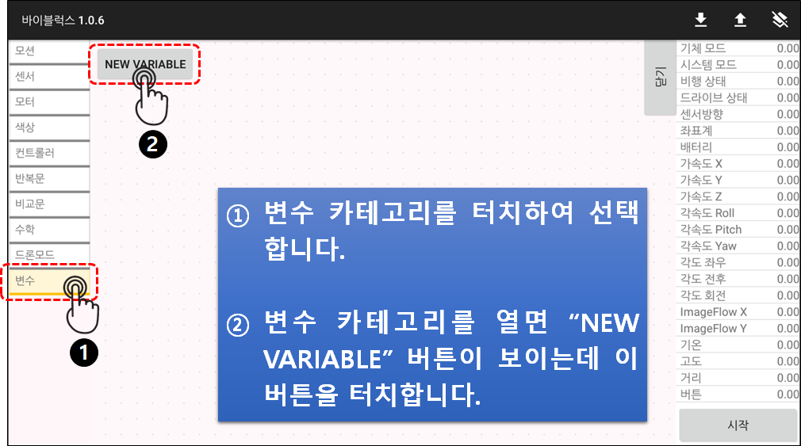
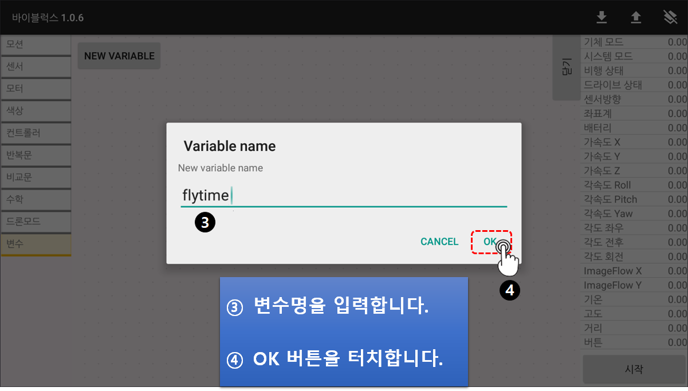
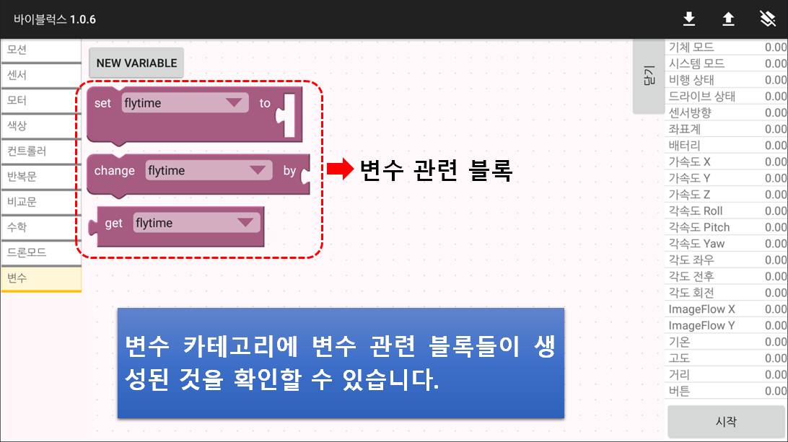
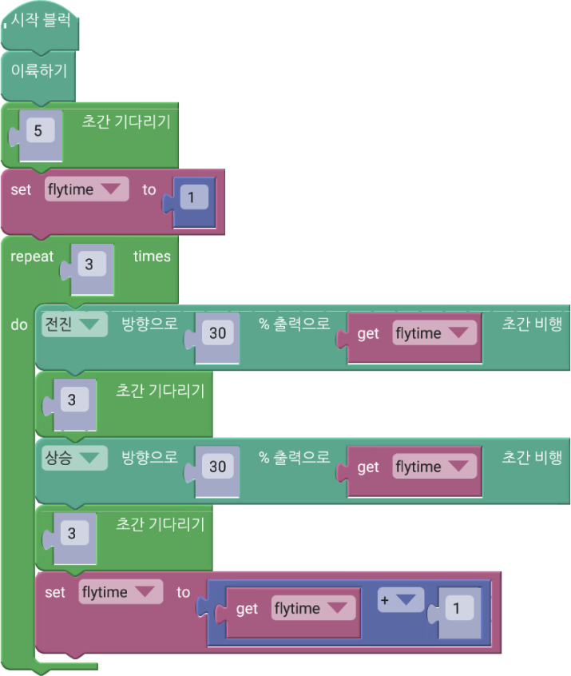
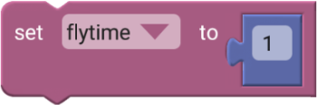
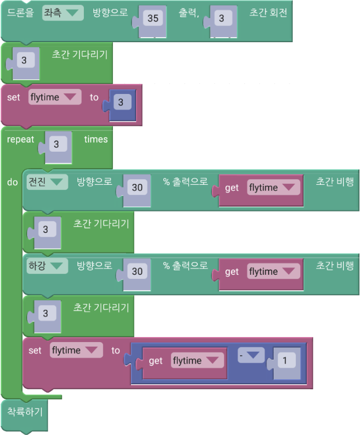
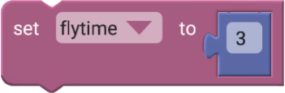
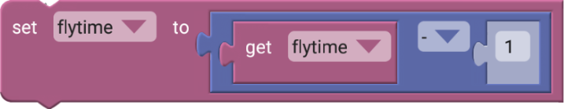

 

    <h1>Lesson 5. 엔트리로 드론을 날려보아요</h1>

 

---

 

    <h1>[들어가기]</h1>

 

이번 강의부터는 페트론 V2을 활용한 코딩을 해보려고 합니다. 엔트리 하드웨어 연결 시 ‘바이로봇 페트론 V2 드론’을 선택하여 연결해주세요. 이번 강의에서는 첫번째로 드론의 기본 비행을 엔트리로 코딩하여 자율비행 시켜보도록 하겠습니다. 어렵지 않은 간단한 코드를 직접 만들어보고 코드의 명령대로 드론이 비행하는 것을 보면서 페트론 V2와 친해져 보아요!

 

---

 

    <h1>[코드 생각하기]</h1>

 

드론의 기본 비행은 다음과 같습니다.

1. 이륙/착륙 
2. 상승/하강 
3. 전진/후진 
4. 좌/우 이동 
5. 좌/우 회전

 

기본 비행을 코딩하기 전에 엔트리에서 페트론 V2 자율비행을 코딩하기 위해서는 드론의 비행 원리와 관련된 용어를 알아야합니다. 다음 그림을 보면서 자세히 알아보아요.

    

①	<b>Throttle></b> : 드론이 상승 또는 하강합니다. 
②	<b>Pitch</b> : 드론이 전진 또는 후진합니다. 
③	<b>Roll</b> : 드론이 좌 또는 우로 이동합니다. 
④	<b>Yaw</b> : 드론이 좌 또는 우로 회전합니다.

 

---

 

    <h1>[코딩 및 실행하기]</h1>

 

<h3> 1. 이륙/착륙 </h3>
 
모든 비행의 기본이 되는 이착륙부터 시작해보아요. 모든 비행에는 이륙과 착륙이 있어야 합니다.
 

    

    <table>
        <tr>
            <td>
                

                     
                    이륙 블록
                

            </td>
            <td>
                

                    페트론 V2가 이륙합니다. 약 60cm 높이까지 이륙 후 호버링합니다. 
                    ※ 배터리 잔량과 드론의 상태에 따라 이륙하는 높이는 차이가 날 수 있습니다.
                

            </td>
        </tr>
        <tr>
            <td>
                

                     
                    기다리기 블록
                

            </td>
            <td>
                

                    현재 상태를 설정한 시간 동안 유지합니다. 약 60cm 높이까지 상승하여 이륙을 완료하기 위해서는 약 5초의 시간이 필요합니다. 5초 기다리기 블록을 사용하여 이륙 완료 후, 다음 동작이 수행될 수 있도록 합니다.
                

            </td>
        </tr>
        <tr>
            <td>
                

                     
                    착륙 블록
                

            </td>
            <td>
                

                    페트론 V2가 착륙합니다. 블록이 실행되면 현재 위치에서 착륙합니다. 드론에 충격을 줄 수 있으므로 착륙은 50cm 정도 높이에서 실행합니다.
                

            </td>
        </tr>
    </table>

 

코드를 다 만들었다면 실행해볼까요?

 

    <table>
        <tr>
            <td>
                

                    
                

            </td>
            <td>
                

                    <b>잠깐! 엔트리에서 드론 자율비행 코드를 실행하기 전에 한 번 더 확인해봐요!</b>  
                    1. 드론과의 안전거리(3m 이상)를 확보합니다. 
                    2. 드론 주변에 사람이나 장애물이 없는지 확인합니다. 
                    　☞ 코드의 드론 이동 방향과 거리를 예측하여 경로에 사람이나 장애물이 없는지 확인합니다. 
                    3. 드론의 오작동이나 바이블럭 오류 발생 시 드론을 강제로 멈추는 방법을 확인합니다.
                

            </td>
        </tr>
    </table>

 

드론이 어떻게 비행하나요? 자신이 만든 코드 순서대로 드론이 잘 비행한다면 성공한 것입니다. 그럼 다른 기본 비행들도 코드를 만들어서 실행해보아요. 코드를 만들기 전에 단일 조종 블록에 대해서 먼저 알아볼까요?

    <table>
        <tr>
            <td>
                

                    
                

            </td>
            <td>
                

                    ①	조종유형: Throttle / Roll / Pitch / Yaw 중에서 선택하여 드론을 어떻게 비행할지 정합니다. 
                    ②	조종값: -100~100 사이의 값을 입력 가능하고, 값에 따라 드론의 속도를 조절할 수 있습니다. 절대값이 클수록 모터의 출력이 커져서 드론의 속도가 빨라집니다. 
                    ③	실행시간: 설정한 조종유형과 조종값으로 드론을 얼마나 비행시킬지 시간을 입력합니다. (0.01초 단위) 
                    ※	조종값과 실행시간은 주어진 공간과 환경에 맞게 조절하여 사용합니다.
                

            </td>
        </tr>
    </table>

<h4> Q. 다음 단일 조종 블록의 차이점은? </h4> 

    <table>
        <tr>
            <td>
                

                    블록 1
                

            </td>
            <td>
                

                    
                

            </td>
            <td>
                

                    설정한 조종유형과 조종값을 계속 유지하면서 드론이 비행합니다.  
                    블록이 실행되고 바로 다음 블록으로 넘어가기 때문에 비행 중 다른 명령을 추가하고 싶을 때 사용할 수 있습니다.  
                    다시 조종값을 0으로 설정하거나 드론을 착륙시키면 비행을 멈출 수 있습니다.
                

            </td>
        </tr>
        <tr>
            <td>
                

                    블록 2
                

            </td>
            <td>
                

                    
                

            </td>
            <td>
                

                    설정한 조종유형과 조종값으로 실행시간동안 드론이 비행합니다.  
                    실행시간이 모두 지나면 비행을 멈추고 다음 블록으로 넘어갑니다.  
                    일정 시간동안 특정 비행을 하고 싶을 때 사용합니다.
                

            </td>
        </tr>
    </table>

 

<h3> 2. 상승/하강 </h3>

    

 

    

 

    

 

변수를 생성했으니 이제 코드를 만들어봅니다.

 

    <table>
        <tr>
            <td>
                

                     
                

            </td>
        </tr>
        <tr>
            <td>
                

                    코드 앞부분(계단 올라가기)
                

            </td>
        </tr>
    </table>

    <table>
        <tr>
            <td>
                

                     
                    변수 설정하기 블록
                

            </td>
            <td>
                

                    변수에 숫자 등의 데이터를 저장할 때(변수에 값을 설정) 사용합니다. 데이터는 변경할 수 있고, 변수에는 가장 마지막에 설정한 데이터가 저장되어 있습니다. 여기서는 비행 시간을 변수로 사용합니다.
                    ※ 숫자 블록은 “수학” 카테고리에 있습니다.
                

            </td>
        </tr>
        <tr>
            <td>
                

                     
                    변수 불러오기 블록
                

            </td>
            <td>
                

                    변수를 불러올 때 사용합니다. 현재 변수에 저장되어 있는 값을 이용해야하는 경우에 사용할 수 있습니다.
                

            </td>
        </tr>
        <tr>
            <td>
                

                     
                    산술 연산자 블록
                

            </td>
            <td>
                

                    산술 연산을 할 때 사용합니다. 덧셈, 뺄셈, 곱하기, 나누기, 제곱 연산이 가능합니다. 여기서는 “flytime” 변수에 1을 더하여 코드가 반복될 때마다 비행 시간이 1초씩 늘어나도록 합니다.
                    ※ 산술 연산자 블록은 “수학” 카테고리에 있습니다.
                

            </td>
        </tr>
    </table>

 

    <table>
        <tr>
            <td>
                

                     
                

            </td>
        </tr>
        <tr>
            <td>
                

                    코드 뒷부분(계단 내려가기)
                

            </td>
        </tr>
    </table>

    <table>
        <tr>
            <td>
                

                     
                     
                    변수 설정하기 블록
                

            </td>
            <td>
                

                    계단을 내려올 때는 올라갈 때와 반대로 “flytime” 변수에 1을 빼서, 코드가 반복될 때마다 비행 시간이 1초씩 줄어들도록 합니다.
                

            </td>
        </tr>
    </table>

 

코드를 실행합니다. 드론이 마치 계단을 오르락 내리락 하듯이 비행하나요? 비행에 성공했다면 나선형 모양으로 상승하고 하강하는 패턴 비행에 도전해봐요.

 

---

 

    <h1>[정리하기]</h1>

 

변수를 사용하면 코드에서 사용되는 데이터의 관리가 쉬워집니다. 변수를 사용하여 또 어떤 자율비행 코딩을 할 수 있는지 생각해봐요.

1. 변수는 데이터를 저장하는 공간이며, 값이 변하는 데이터를 관리하는데 유용하게 사용할 수 있습니다.
2. 변수 카테고리에서 변수를 생성할 수 있고, 변수 관련 블록들을 가져올 수 있습니다.
3. 반복문 안에서 비행 시간을 증가 or 감소시키기 위해 변수를 사용하면 효율적으로 코딩을 할 수 있습니다.

 

---

### [바이블럭으로 코딩해요](../)

 1. [페트론 V2와 바이블럭이 만났어요](../lesson1)
 2. [페트론 V2와 인사해요](../lesson2)
 3. [페트론 V2로 음악을 연주해요](../lesson3)
 4. [페트론 V2로 사각형을 그려보아요](../lesson4)
 5. **페트론 V2로 계단을 오르락내리락 해요**
 6. [페트론 V2를 원하는 높이로 상승시켜 보아요](../lesson6)
 7. [페트론 V2를 손바닥 위에 착륙시켜 보아요](../lesson7)
 8. [페트론 V2를 버튼으로 이륙/착륙시켜 보아요](../lesson8)
 
---

Modified : 2018.8.28