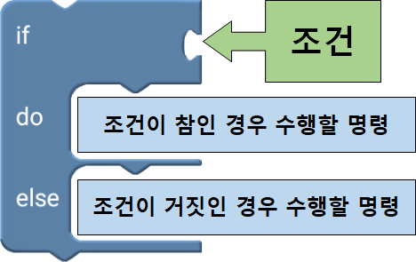
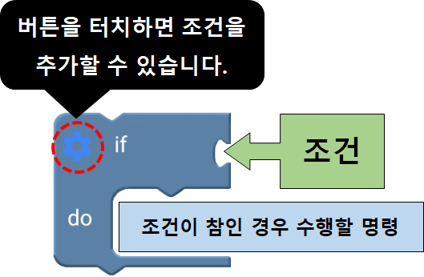
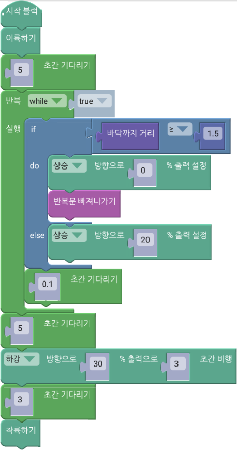
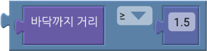

 

    <h1>Lesson 6. 드론으로 센서 놀이를 해보아요!</h1>

 

---

 

    <h1>[들어가기]</h1>

 

페트론 V2에는 다양한 센서들이 장착되어 있는데, 이러한 센서들이 안정적으로 비행하는데 도움을 줍니다. 그리고 센서들은 코딩에도 다양하게 활용될 수 있습니다. 이번 강의에서는 이러한 센서들을 자세히 알아보도록 합니다.

 

<h2> 1. 페트론 V2의 센서 및 용도</h2>

    

 

<h2> 2. 센서 상세정보</h2>

    

 

<h2> 3. 드론의 자세 : Roll, Pitch, Yaw</h2>
드론의 자세를 나타내는 Roll, Pitch, Yaw에 대해서 자세히 알아보아요.

    <table>
        <tr>
            <td>
                

                    
                

            </td>
            <td>
                

                    ▶드론은 기체의 중심을 기준으로 X, Y, Z축으로 이뤄져 있습니다. 그리고 축을 기준으로 회전을 하게 되는데, 이로 인해 드론이 전, 후, 좌, 우로 이동하고 회전할 수 있습니다.  
                    1. Roll : X축을 기준으로 드론이 회전하면서 좌우로 이동합니다.(= Roll 조종)  
                    2. Pitch : Y축을 기준으로 드론이 회전하면서 전진, 후진을 합니다.(= Pitch 조종) 
                    3. Yaw : Z축을 기준으로 드론이 회전하면서 좌우로 회전합니다.(= Yaw 조종)  
                

            </td>
        </tr>
    </table>

 

---

 

    <h1>[코드 생각하기]</h1>

 

    

먼저 엔트리의 페트론 V2 센서값 관련 블록들은 어떠한 것들이 있는지 알아보아요. 블록집합소의 블록을 클릭하면 상세 항목을 볼 수 있습니다.

 

    <table>
        <tr>
            <td>
                

                    ① 자세 Roll, 자세 Pitch, 자세 Yaw [단위: 도] 
                    ▶드론의 자세(기울기)를 각도로 나타냅니다. Roll은 X축으로 기울어진 각도, Pitch는 Y축으로 기울어진 각도, Yaw는 Z축을 기준으로 드론이 회전한 각도를 나타냅니다.  
                    ② 가속도 [단위: ㎨] 
                    ▶드론의 각 축(X, Y, Z축)의 속도 증가량을 나타냅니다. 여기서 가속도는 중력가속도를 뜻합니다.  
                    ③ 각속도 [단위: degree/sec(도/1초)] 
                    ▶Roll, Pitch, Yaw 방향으로 기울고 있는 속도를 나타냅니다. 1초당 기울어지는 각도로 계산합니다.  
                    ④ 온도 [단위: 도] 
                    ▶대기온도를 나타냅니다. 드론이 오래 비행할수록 내부 온도가 상승되어 영향을 받을 수 있습니다.  
                    ⑤ 해발고도 [단위: m] 
                    ▶해수면을 기준으로 하여 측정한 드론의 높이입니다. 대기압과 온도를 사용해서 계산한 값이기 때문에, 날씨의 영향을 받고 날마다 차이가 날 수 있습니다.  
                    ⑥ 바닥까지 거리 [단위: m] 
                    ▶지표면으로부터 드론까지의 거리를 나타냅니다. 일반적으로 드론의 고도를 뜻하지만 드론 바닥에 장착된 거리 센서에서 적외선을 발사하여 반사되는 곳까지의 거리를 측정합니다. 그래서 드론을 수직으로 세우면 벽면까지의 거리를 측정할 수도 있습니다. 정밀한 측정이 가능한 최대 거리는 2m 입니다.
                

            </td>
        </tr>
    </table>

 
위 센서값들은 엔트리의 왼쪽 하단 오브젝트 목록 화면에서 하드웨어 탭을 클릭하시면 실시간으로 확인하실 수 있습니다.

    

 
그럼 센서값들을 엔트리 화면에 표시해보고 드론을 움직이거나 비행시키면서 센서값들의 변화를 살펴보아요.

<h3>1. 자세 Roll, 자세 Pitch, 자세 Yaw</h3>

자세 Roll, 자세 Pitch, 자세 Yaw 센서값을 화면에 표시하고 드론을 움직일 때마다 값이 어떻게 변하는지 확인해보아요.
 

    <table>
        <tr>
            <td>
                

                      
                      
                     
                

            </td>
            <td>
                

                    드론이 각 축(3축)으로 기울어진 각도를 알 수 있습니다.  
                    1. 자세 Roll : 좌/우 기울기(X축) 
                    2. 자세 Pitch : 앞/뒤 기울기(Y축) 
                    3. 자세 Yaw : 좌/우 회전각(Z축)  
                    <b>※	드론의 IMU 센서(Inertial Measurement Unit, 관성측정장치)의 자이로스코프가 측정한 각속도 값으로부터 기울기를 계산합니다.</b>
                

            </td>
        </tr>
    </table>

<h3>2. 바닥까지 거리</h3>
 
드론이 이륙→상승→하강의 자율비행하면서 거리 센서가 측정하는 바닥까지 거리 센서값의 변화를 확인해보아요. 

    <table>
        <tr>
            <td>
                

                    
                

            </td>
            <td>
                

                    드론이 이륙한 지점의 바닥으로부터 떨어진 거리를 알 수 있습니다. 유효한 측정 범위는 0~2m 입니다.  
                    <b>※ 적외선 거리 센서(IR Range Sensor)가 바닥까지 적외선을 보내고 반사되어 다시 받는 시간을 계산하여 측정합니다.</b>
                

            </td>
        </tr>
    </table>

 

---

 

    <h1>[코딩 및 실행하기]</h1>

 

먼저 조건문이 무엇인지 알아볼까요.
 

    <table>
        <tr>
            <td>
                

                    알기 쉬운 코딩
                

            </td>
            <td>
                

                    조건문
                

            </td>
        </tr>
        <tr>
            <td>
                

                    
                

            </td>
            <td>
                

                    조건문이란 코딩의 주요 문법 중 하나로서 특정 조건을 주고 그 조건에 따라 서로 다른 명령을 수행해야할 때 사용합니다. 우리가 흔히 “만약 ~라면, ~하겠다”란 말을 자주 사용하는데, 바로 이러한 상황을 코딩으로 표현한 것이라고 보면 됩니다. 
                      
                    주어진 조건이 참인지 거짓인지 판단하여 참이면 명령A를 거짓이면 명령B를 수행할 수 있게 할 수 있습니다. 또한, 참과 거짓 2가지 경우로만 구분하지 않고 여러가지 경우에 따라 서로 다른 명령을 줄 수도 있습니다.
                

            </td>
        </tr>
    </table>

 

조건문 블록은 “Logic” 카테고리에 있습니다. “Logic” 카테고리에는 조건문 블록뿐만 아니라 비교 연산자, 논리 연산자 블록들도 있는데, 이 블록들을 이용하여 조건을 만들 수 있습니다.

 

    <table>
        <tr>
            <td>
                

                    
                

            </td>
            <td>
                

                    
                

            </td>
        </tr>
        <tr>
            <td>
                

                    1. 1가지 조건의 참/거짓을 판단하여 명령을 다르게 수행할 때 사용
                

            </td>
            <td>
                

                    1. 1가지 조건이 참인 경우만 판단하여 명령을 수행할 때 사용 
                    2. 조건을 더 추가해서 조건에 따라 명령을 다르게 수행할 때 사용
                

            </td>
        </tr>
    </table>

 

변수를 생성했으니 이제 코드를 만들어봅니다.

 

    <table>
        <tr>
            <td>
                

                     
                

            </td>
        </tr>
        <tr>
            <td>
                

                    코드
                

            </td>
        </tr>
    </table>

    <table>
        <tr>
            <td>
                

                     
                    반복문(조건) 블록
                

            </td>
            <td>
                

                    반복문 블록 안에 블록들을 조건이 참인 동안 계속해서 반복합니다. 기본 블록은 조건이 “true”이기 때문에 무한 반복하게 됩니다. 
                    ※ “true” 블록에 비교 연산자, 논리 연산자 블록을 조립하여 다른 조건을 줄 수 있습니다.
                

            </td>
        </tr>
        <tr>
            <td>
                

                     
                    비교 연산자 블록
                

            </td>
            <td>
                

                    조건문의 조건으로, 바닥까지 거리 값이 1.5m 이상이 되는지를 확인합니다. 무한 반복문 안에서 바닥까지 거리 값을 지속적으로 확인하여 1.5m 미만이면 드론을 상승시키고, 1.5m 이상이 되면 상승을 멈추고 무한 반복문을 빠져나갑니다. 
                    ※ 바닥까지 거리(거리 센서) 값의 단위는 m(미터)입니다. 
                    ※ 비교 연산자 블록은 “수학” 카테고리에 있습니다. 
                

            </td>
        </tr>
        <tr>
            <td>
                

                     
                    반복 중단 블록
                

            </td>
            <td>
                

                    반복문 안에 사용하여 반복을 중단하고 반복문을 빠져나갈 때 사용합니다.
                

            </td>
        </tr>
    </table>

 

코드를 실행합니다. 드론이 정확하게 1.5m 위치에서 멈추나요? 대부분 그렇지 않을 것입니다. 왜냐하면 바이블럭에서 명령이 드론에 전달되는데 지연 시간이 발생하기 때문에 오차가 발생합니다. 드론의 상승 속도를 빠르게 하면 그 오차는 더 커질 수 있고, 속도를 느리게 하면 오차를 줄일 수 있습니다.

 

그리고 반복문에서 반복문 안의 블록들이 실행되고 다시 반복을 시작하려고 할 때, 기다리기 블록이 사용되지 않았다면 0.1~0.2초 정도의 기다리기 블록을 사용하여 명령이 잘 전달될 수 있도록 해주는 것이 좋습니다.

 

---

 

    <h1>[정리하기]</h1>

 

드론의 센서들을 활용하여 코딩을 하니까 더 재미있고 신기하지 않나요? 거리 센서 외에 다른 센서들은 어떻게 활용할 수 있는지 생각해보고 코딩해봐요.

1. 페트론 V2에는 다양한 센서들이 장착되어 있고, 이 센서들은 드론이 안정적으로 비행하는데 도움을 줍니다.
2. IR Range Sensor(거리 센서)는 적외선을 이용하여 드론이 바닥으로부터 얼마나 떨어져 있는지 측정해주는 센서입니다.
3. 거리 센서를 이용하여 드론을 원하는 높이까지 상승시킬 수 있습니다.
4. 조건문은 조건에 따라 명령을 다르게 수행할 때 사용하고, 조건은 1개부터 여러 개까지 줄 수 있습니다.

 

---

### [바이블럭으로 코딩해요](../)

 1. [페트론 V2와 바이블럭이 만났어요](../lesson1)
 2. [페트론 V2와 인사해요](../lesson2)
 3. [페트론 V2로 음악을 연주해요](../lesson3)
 4. [페트론 V2로 사각형을 그려보아요](../lesson4)
 5. [페트론 V2로 계단을 오르락내리락 해요](../lesson5)
 6. **페트론 V2를 원하는 높이로 상승시켜 보아요**
 7. [페트론 V2를 손바닥 위에 착륙시켜 보아요](../lesson7)
 8. [페트론 V2를 버튼으로 이륙/착륙시켜 보아요](../lesson8)
 
---

Modified : 2018.8.28