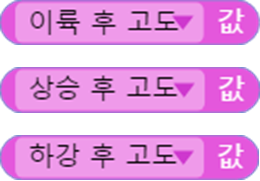

 

    <h1>Lesson 6. 드론으로 센서 놀이를 해보아요!</h1>

 

---

 

    <h1>[들어가기]</h1>

 

페트론 V2에는 다양한 센서들이 장착되어 있는데, 이러한 센서들이 안정적으로 비행하는데 도움을 줍니다. 그리고 센서들은 코딩에도 다양하게 활용될 수 있습니다. 이번 강의에서는 이러한 센서들을 자세히 알아보도록 합니다.

 

<h2> 1. 페트론 V2의 센서 및 용도</h2>

    

 

<h2> 2. 센서 상세정보</h2>

    

 

<h2> 3. 드론의 자세 : Roll, Pitch, Yaw</h2>
드론의 자세를 나타내는 Roll, Pitch, Yaw에 대해서 자세히 알아보아요.

    <table>
        <tr>
            <td>
                

                    
                

            </td>
            <td>
                

                    ▶드론은 기체의 중심을 기준으로 X, Y, Z축으로 이뤄져 있습니다. 그리고 축을 기준으로 회전을 하게 되는데, 이로 인해 드론이 전, 후, 좌, 우로 이동하고 회전할 수 있습니다.  
                    1. Roll : X축을 기준으로 드론이 회전하면서 좌우로 이동합니다.(= Roll 조종)  
                    2. Pitch : Y축을 기준으로 드론이 회전하면서 전진, 후진을 합니다.(= Pitch 조종) 
                    3. Yaw : Z축을 기준으로 드론이 회전하면서 좌우로 회전합니다.(= Yaw 조종)  
                

            </td>
        </tr>
    </table>

 

---

 

    <h1>[코드 생각하기]</h1>

 

    

먼저 엔트리의 페트론 V2 센서값 관련 블록들은 어떠한 것들이 있는지 알아보아요. 블록집합소의 블록을 클릭하면 상세 항목을 볼 수 있습니다.

 

    <table>
        <tr>
            <td>
                

                    ① 자세 Roll, 자세 Pitch, 자세 Yaw [단위: 도] 
                    ▶드론의 자세(기울기)를 각도로 나타냅니다. Roll은 X축으로 기울어진 각도, Pitch는 Y축으로 기울어진 각도, Yaw는 Z축을 기준으로 드론이 회전한 각도를 나타냅니다.  
                    ② 가속도 [단위: ㎨] 
                    ▶드론의 각 축(X, Y, Z축)의 속도 증가량을 나타냅니다. 여기서 가속도는 중력가속도를 뜻합니다.  
                    ③ 각속도 [단위: degree/sec(도/1초)] 
                    ▶Roll, Pitch, Yaw 방향으로 기울고 있는 속도를 나타냅니다. 1초당 기울어지는 각도로 계산합니다.  
                    ④ 온도 [단위: 도] 
                    ▶대기온도를 나타냅니다. 드론이 오래 비행할수록 내부 온도가 상승되어 영향을 받을 수 있습니다.  
                    ⑤ 해발고도 [단위: m] 
                    ▶해수면을 기준으로 하여 측정한 드론의 높이입니다. 대기압과 온도를 사용해서 계산한 값이기 때문에, 날씨의 영향을 받고 날마다 차이가 날 수 있습니다.  
                    ⑥ 바닥까지 거리 [단위: m] 
                    ▶지표면으로부터 드론까지의 거리를 나타냅니다. 일반적으로 드론의 고도를 뜻하지만 드론 바닥에 장착된 거리 센서에서 적외선을 발사하여 반사되는 곳까지의 거리를 측정합니다. 그래서 드론을 수직으로 세우면 벽면까지의 거리를 측정할 수도 있습니다. 정밀한 측정이 가능한 최대 거리는 2m 입니다.
                

            </td>
        </tr>
    </table>

 
위 센서값들은 엔트리의 왼쪽 하단 오브젝트 목록 화면에서 하드웨어 탭을 클릭하시면 실시간으로 확인하실 수 있습니다.

    

 
그럼 센서값들을 엔트리 화면에 표시해보고 드론을 움직이거나 비행시키면서 센서값들의 변화를 살펴보아요.
 
<h2>1. 자세 Roll, 자세 Pitch, 자세 Yaw</h2>

자세 Roll, 자세 Pitch, 자세 Yaw 센서값을 화면에 표시하고 드론을 움직일 때마다 값이 어떻게 변하는지 확인해보아요.
 

    <table>
        <tr>
            <td>
                

                      
                      
                     
                

            </td>
            <td>
                

                    드론이 각 축(3축)으로 기울어진 각도를 알 수 있습니다.  
                    1. 자세 Roll : 좌/우 기울기(X축) 
                    2. 자세 Pitch : 앞/뒤 기울기(Y축) 
                    3. 자세 Yaw : 좌/우 회전각(Z축)  
                    <b>※	드론의 IMU 센서(Inertial Measurement Unit, 관성측정장치)의 자이로스코프가 측정한 각속도 값으로부터 기울기를 계산합니다.</b>
                

            </td>
        </tr>
    </table>

<h2>2. 바닥까지 거리</h2>
 
드론이 이륙→상승→하강의 자율비행하면서 거리 센서가 측정하는 바닥까지 거리 센서값의 변화를 확인해보아요.

 

    <table>
        <tr>
            <td>
                

                    
                

            </td>
            <td>
                

                    드론이 이륙한 지점의 바닥으로부터 떨어진 거리를 알 수 있습니다. 유효한 측정 범위는 0~2m 입니다.  
                    <b>※ 적외선 거리 센서(IR Range Sensor)가 바닥까지 적외선을 보내고 반사되어 다시 받는 시간을 계산하여 측정합니다.</b>
                

            </td>
        </tr>
    </table>

 

---

 

    <h1>[코딩 및 실행하기]</h1>

 
<h2>1. 자세 Roll, 자세 Pitch, 자세 Yaw</h2>
 
드론의 각 축으로 기울어진 각도를 나타내는 자세 Roll, 자세 Pitch, 자세 Yaw 값을 화면에 표시해주는 코드를 만들어보아요.
 

    

    <table>
        <tr>
            <td>
                

                     
                    시작 블록
                

            </td>
            <td>
                

                    계속 반복하기 블록을 사용하여 센서값을 반복적으로 받아서 계속 업데이트될 수 있도록 합니다.  
                    ▶반복문을 사용하지 않으면 프로그램을 시작했을 때 받은 센서값만 표시되고 센서값이 업데이트되지 않습니다. 즉, 센서값의 변화를 확인할 수 없습니다.
                

            </td>
        </tr>
        <tr>
            <td>
                

                     
                    말하기 블록
                

            </td>
            <td>
                

                    엔트리의 말하기 블록을 사용하여 센서값을 엔트리 화면에 표시합니다.
                

            </td>
        </tr>
        <tr>
            <td>
                

                     
                    합치기 블록
                

            </td>
            <td>
                

                    엔트리의 합치기 블록을 사용하여 3가지 센서값을 모두 합쳐서 문구를 만듭니다.
                

            </td>
        </tr>
    </table>

 

코드를 만들었으면 실행해볼까요? 엔트리 화면에 다음과 같이 문구가 표시되는지 확인합니다.

 

    

 
그리고 드론을 움직일 때마다 값들이 어떻게 변하는지 알아보아요.
 

    <table>
        <tr>
            <td>
                

                    
                

            </td>
            <td>
                

                    ▶ 드론의 X축을 기준으로 드론을 좌우로 기울이면 자세 Roll 센서값이 변합니다. 
                    ▶ 센서값 범위 : -90~90 (좌로 기울이면 음수 / 우로 기울이면 양수)
                

            </td>
        </tr>
        <tr>
            <td>
                

                    
                

            </td>
            <td>
                

                    ▶ 드론의 Y축을 기준으로 드론을 앞뒤로 기울이면 자세 Pitch 센서값이 변합니다. 
                    ▶ 센서값 범위 : -90~90 (뒤로 기울이면 음수 / 앞으로 기울이면 양수)
                

            </td>
        </tr>
        <tr>
            <td>
                

                    
                

            </td>
            <td>
                

                    ▶ 드론의 Z축을 기준으로 드론을 좌우로 회전시키면 자세 Yaw 센서값이 변합니다. 
                    ▶ 센서값 범위 : -180~180 (좌로 회전하면 음수 / 우로 회전하면 양수)
                

            </td>
        </tr>
    </table>

 
<h2>2. 바닥까지 거리</h2>
 

이번에는 자율비행하는 드론을 통해 거리 센서가 측정하는 바닥까지 거리(=고도)가 어떻게 변하는지 확인해보아요.

    

 

    <table>
        <tr>
            <td>
                

                     
                    변수 블록
                

            </td>
            <td>
                

                    3가지 경우의 고도 측정을 위해서 변수 3개를 생성합니다. 
                    1)	이륙 후 고도 
                    2)	상승 후 고도 
                    3)	하강 후 고도
                

            </td>
        </tr>
        <tr>
            <td>
                

                     
                    이륙 후 고도 측정 블록
                

            </td>
            <td>
                

                    이륙 후 바닥까지 거리 센서값을 ‘이륙 후 고도’ 변수에 저장합니다. 말하기 블록을 사용하여 현재 고도와 이륙하면서 상승한 높이를 각각 3초 동안 엔트리 화면에 표시합니다.
                

            </td>
        </tr>
        <tr>
            <td>
                

                     
                    상승 후 고도 측정 블록
                

            </td>
            <td>
                

                    단일조종(지정시간) – 스로틀(상승) 블록으로 조종값 40 / 실행시간 2초로 드론을 상승시킵니다. 상승 후 현재 바닥까지 거리 센서값을 ‘상승 후 고도’ 변수에 저장합니다. 말하기 블록을 사용하여 현재 고도와 추가로 상승한 높이를 각각 3초 동안 엔트리 화면에 표시합니다. 
                    ▶추가로 상승한 높이는 상승 후 고도 변수값에서 이륙 후 고도 변수값의 차이로 알 수 있습니다.
                

            </td>
        </tr>
        <tr>
            <td>
                

                     
                    하강 후 고도 측정 블록
                

            </td>
            <td>
                

                    단단일조종(지정시간) – 스로틀(하강) 블록으로 조종값 -40 / 실행시간 3초로 드론을 하강시킵니다. 하강 후 현재 바닥까지 거리 센서값을 ‘하강 후 고도’ 변수에 저장합니다. 말하기 블록을 사용하여 현재 고도와 하강한 높이를 각각 3초 동안 엔트리 화면에 표시합니다. 
                    ▶하강한 높이는 상승 후 고도 변수값에서 하강 후 고도 변수값의 차이로 알 수 있습니다.
                

            </td>
        </tr>
    </table>

 

코드를 실행합니다. 드론이 이륙, 상승, 하강할 때 엔트리 화면에 현재 고도와 비행한 높이를 확인할 수 있나요? 조종값과 실행시간을 바꿔가며 값들이 어떻게 변하는지 확인해보아요.

 

---

 

    <h1>[정리하기]</h1>

 

드론의 센서들을 활용하여 코딩을 하니까 더 재미있고 신기하지 않나요? 이번 강의에서 이용한 자세값과 거리 센서 외에 다른 센서들은 어떻게 활용할 수 있는지 생각해보고 코딩해봐요.

1. 페트론 V2에는 다양한 센서들이 장착되어 있고, 이 센서들은 드론이 안정적으로 비행하는데 도움을 줍니다.
2. 드론은 3축(X, Y, Z)을 기준으로 회전 운동을 하고, 이로 인해 전후, 좌우, 회전 비행을 할 수 있습니다.
3. 자세 Roll, 자세 Pitch, 자세 Yaw는 드론이 각 축으로 기울어진 각도를 나타내며, 드론의 현재 자세를 알 수 있습니다. 
　1) 자세 Roll : X축으로 기울어진 각도이며, 드론이 좌우로 이동합니다.  
　2) 자세 Pitch : Y축으로 기울어진 각도이며, 드론이 전후로 이동합니다. 
　3) 자세 Yaw : Z축으로 기울어진 각도이며, 드론이 좌우로 회전합니다. 
4. IR Range Sensor(거리 센서)는 적외선을 이용하여 드론이 바닥으로부터 얼마나 떨어져 있는지 측정해주는 센서입니다.
5. 거리 센서가 측정하는 바닥까지 거리 블록을 사용하면 드론의 현재 고도와 상승 or 하강한 높이를 알 수 있습니다.

 

---

### [엔트리로 코딩해요](../)

 1. [페트론 V2와 엔트리가 만났어요](../lesson1)
 2. [조종기로 음악을 연주해보아요](../lesson2)
 3. [조종기 화면에 그림을 그려보아요](../lesson3)
 4. [조종기로 로봇청소기를 돌려보아요](../lesson4)
 5. [엔트리로 드론을 날려보아요](../lesson5)
 6. **드론으로 센서 놀이를 해보아요**
 7. [센서를 활용한 패턴 비행을 해보아요](../lesson7)
 8. [조종기 버튼으로 드론을 날려보아요](../lesson8)
 
---

Modified : 2019.1.15