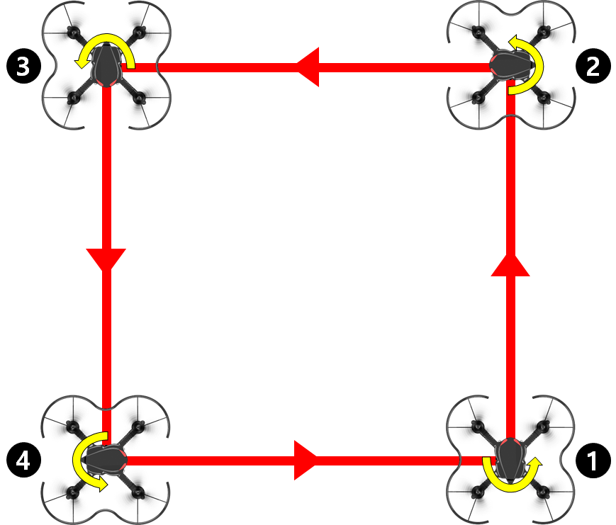
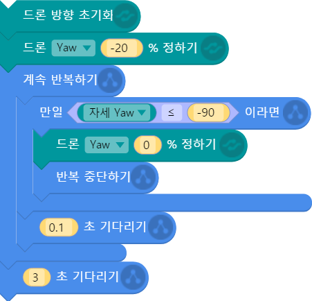
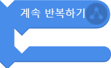
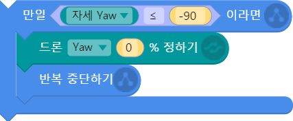
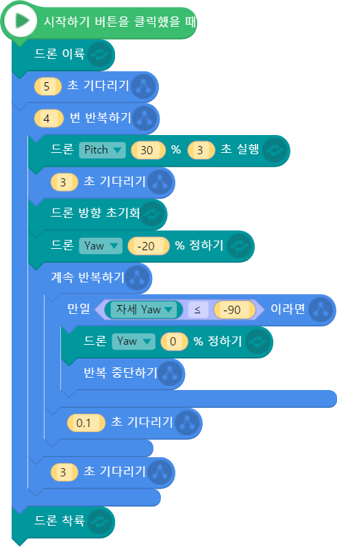
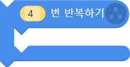
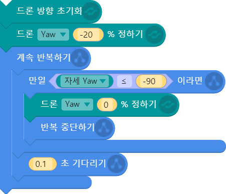

 

    <h1>Lesson 7. 센서를 활용한 패턴 비행을 해보아요!</h1>

 

---

 

    <h1>[들어가기]</h1>

 

이번 강의에서는 지난 강의에서 배운 센서값을 활용하여 드론을 패턴 비행시켜보는 코딩을 해보도록 해요. 사각형 패턴을 드론의 앞 부분을 회전시키면서 한 바퀴 비행하는 코드를 만들어보려고 합니다. 드론이 각 모서리에서 회전할 때 ‘자세 Yaw’ 센서값을 활용하면 좀 더 정교하게 원하는 각도만큼 회전시킬 수 있습니다. 지난 강의에서 배운 센서값과 조건문을 잘 활용해서 코딩을 해보도록 합니다.

 

---

 

    <h1>[코드 생각하기]</h1>

 

드론이 다음과 같은 순서로 사각형 모양의 패턴 비행을 합니다.

 

    <table>
        <tr>
            <td>
                

                    
                

            </td>
            <td>
                

                    1)	①번 위치에서 이륙합니다. 
                    2)	3초간 조종값 30%로 전진합니다. 
                    3)	좌로 90도만큼 회전합니다. 
                    4)	3초간 조종값 30%로 전진합니다. 
                    5)	좌로 90도만큼 회전합니다. 
                    6)	3초간 조종값 30%로 전진합니다. 
                    7)	좌로 90도만큼 회전합니다. 
                    8)	3초간 조종값 30%로 전진합니다. 
                    9)	좌로 90도만큼 회전합니다. 
                    10)	①번 위치에서 착륙합니다. 
                     
                    <b>※	2)~9)까지 과정은 전진과 회전이 반복되기 때문에 앞서 배운 반복문을 사용하면 효율적으로 코딩할 수 있습니다.</b>
                

            </td>
        </tr>
    </table>

 
그럼 센서를 활용하여 어떻게 드론을 좌로 90도만큼 회전시킬 수 있는지 알아보고, 코드를 생각해보아요.
 

드론이 좌/우로 회전할 때 회전 각도를 알 수 있는 센서값 블록은 “자세 Yaw” 입니다.

    <table>
        <tr>
            <td>
                

                    
                

            </td>
            <td>
                

                    ①	드론의 수직축을 기준으로 드론이 좌/우로 얼마나 회전한 상태인지 각도를 나타냅니다. 
                    ②	값 범위: -180~180(양수: 우로 회전 / 음수: 좌로 회전) 
                    ③	예) 자세 Yaw 값이 45라면, 드론의 정방향 기준으로 오른쪽으로 45도 회전해 있는 상태입니다.
                

            </td>
        </tr>
        <tr>
            <td>
                

                    
                

            </td>
            <td>
                

                    ①	드론의 방향을 현재 앞쪽 방향(페트론 V2의 눈 부분)을 기준으로 초기화해주는 블록입니다. 
②	이 블록을 사용하면 자세값(자세 Pitch, 자세 Roll, 자세 Yaw)이 모두 0으로 초기화되어, 자세 Yaw 값을 계산하여 특정 각도만큼 회전시키기 용이합니다. 
③	드론이 헤드리스 모드인 경우에 드론의 전진 방향을 변경할 때 사용합니다.
                

            </td>
        </tr>
    </table>

<b>< 드론을 좌로 90도 회전시키기 ></b> 
1)	드론 방향 초기화로 자세값(자세 Yaw)을 0으로 초기화 시킵니다. 
2)	드론을 좌로 회전 비행 시킵니다.  <b>⇒ 회전 비행을 계속 유지합니다.</b> 
3)	자세 Yaw 값이 -90 이하로 변하는지 반복적으로 확인합니다.  <b>⇒ 좌로 회전하기 때문에 값이 0에서 음수로 줄어듭니다.</b> 
4)	자세 Yaw 값이 -90 이하가 되면 회전 비행을 멈춥니다.  <b>⇒ 자세 Yaw 값이 0부터 -90까지 변했기 때문에 90도만큼 회전한 것입니다.</b> 

 

---

 

    <h1>[코딩 및 실행하기]</h1>

 

먼저 드론을 좌로 90도만큼 회전시키는 코드를 만들어 볼까요? 다음 코드는 한 가지 예시이고, 다양한 방법으로 여러 가지 코드를 만들 수 있습니다.
 

    

 

    <table>
        <tr>
            <td>
                

                     
                    드론 방향 초기화 블록
                

            </td>
            <td>
                

                    드론의 자세값을 초기화시킵니다. 자세 Yaw 값이 0이 되어 회전 각도를 계산하기 편리합니다.
                

                

                    <table>
                        <tr>
                            <td>
                                자세값
                            </td>
                            <td>
                                1. 자세 Pitch 
                                2. 자세 Roll 
                                3. 자세 Yaw
                            </td>
                        </tr>
                    </table>
                

            </td>
        </tr>
        <tr>
            <td>
                

                     
                    단일조종 – 요(좌 회전) 블록
                

            </td>
            <td>
                

                    페트론 V2가 좌로(조종값이 음수이기 때문) 회전합니다. 조종값 20의 힘으로 회전하며 정하기 블록이기 때문에 회전 비행을 계속 유지합니다.
                

            </td>
        </tr>
        <tr>
            <td>
                

                     
                    반복문 블록
                

            </td>
            <td>
                

                    계속 반복하기 블록을 사용하여 드론이 90도만큼 회전했는지 반복적으로 확인합니다.
                

            </td>
        </tr>
        <tr>
            <td>
                

                     
                    조건문 블록
                

            </td>
            <td>
                

                    조건문 블록을 사용하여 ‘자세 Yaw’ 센서값이 -90 이하가 되면 회전 비행을 멈추고 반복문을 빠져나오도록 합니다. 
                    ▶페트론 V2가 좌로 회전하기 때문에 자세 Yaw 값이 0에서 -1, -2, -3… 이렇게 음수로 변합니다. 그래서 -90이 되면 좌로 90도만큼 회전한 것이 됩니다.  
                    회전을 계속 유지하는 상태이기 때문에 다시 정하기 블록에 조종값을 0으로 설정하여 회전 비행을 멈추도록 합니다.
                

            </td>
        </tr>
        <tr>
            <td>
                

                     
                    기다리기 블록
                

            </td>
            <td>
                

                    계속 반복하기를 사용하여 코드가 무한 반복되는 경우에 시스템에 부하가 생기고 명령이 잘 전달되지 않을 수도 있기 때문에 기다리기 블록을 사용하여 약간의 Delay time을 줍니다.
                

            </td>
        </tr>
    </table>

 

그럼 이제 위 코드를 사용하여 전체 코드를 완성해보아요.
 

    

 

    <table>
        <tr>
            <td>
                

                     
                    반복문 블록
                

            </td>
            <td>
                

                    사각형 패턴 비행이므로 전진과 회전을 동일하게 4번 반복합니다. 반복문 블록을 사용하여 코드를 효율적으로 만듭니다.
                

            </td>
        </tr>
        <tr>
            <td>
                

                     
                    단일조종(지정시간) – 피치(전진) 블록
                

            </td>
            <td>
                

                    페트론 V2가 전진합니다. 조종값 30%로 3초간 전진합니다. 
                    ▶조종값과 실행시간은 주어진 공간과 환경에 맞게 조절하여 사용합니다.
                

            </td>
        </tr>
        <tr>
            <td>
                

                     
                    좌로 90도 회전하기 코드
                

            </td>
            <td>
                

                    페트론 V2가 좌로 90도 회전합니다. 자세 Yaw 값을 반복적으로 확인하여 -90(좌로 90도) 이하가 되면 회전 비행을 멈춥니다. 
                    ▶엔트리와 드론 간의 Delay time이 발생하기 때문에 회전 각도는 오차가 발생할 수 있습니다. 
                    ▶단일조종 – 요(좌 회전) 블록의 조종값을 너무 크게 하면 드론이 빨리 회전하기 때문에 더 큰 오차가 발생할 수 있으므로 20 정도가 적당합니다.
                

            </td>
        </tr>
    </table>

 

코드를 실행합니다. 사각형 모양의 패턴 비행에 성공하였나요? 드론이 정확히 90도 회전하지 않는다면, 어떻게 보완할 수 있을지 고민해보아요. 그리고 사각형 패턴 비행 외에 센서를 활용하여 어떤 패턴 비행을 할 수 있을지 생각해보고 코드를 만들어보아요.

 

---

 

    <h1>[정리하기]</h1>

 

드론의 여러 가지 센서값을 활용하여 다양한 패턴 비행을 코딩할 수 있습니다. 드론의 패턴 비행은 군집 비행, 촬영, 측량, 방제 등 많은 분야에서 활용됩니다.

1. 자세 Yaw 센서값을 사용하여 드론을 원하는 각도만큼 좌 or 우로 회전 비행시킬 수 있습니다.
2. 드론 방향 초기화 블록을 사용하면 드론의 전진 방향을 초기화할 수 있고(페트론 V2의 눈 쪽이 전진 방향으로), 자세값을 모두 0으로 초기화할 수 있습니다.

 

---

### [엔트리로 코딩해요](../)

 1. [페트론 V2와 엔트리가 만났어요](../lesson1)
 2. [조종기로 음악을 연주해보아요](../lesson2)
 3. [조종기 화면에 그림을 그려보아요](../lesson3)
 4. [조종기로 로봇청소기를 돌려보아요](../lesson4)
 5. [엔트리로 드론을 날려보아요](../lesson5)
 6. [드론으로 센서 놀이를 해보아요](../lesson6)
 7. **센서를 활용한 패턴 비행을 해보아요**
 8. [조종기 버튼으로 드론을 날려보아요](../lesson8)
 
 
---

Modified : 2019.1.15