 

    <h1>Lesson 8. 조종기 버튼으로 드론을 날려보아요!</h1>

 

---

 

    <h1>[들어가기]</h1>

 

이번 강의에서는 조종기의 버튼을 눌러서 드론을 조종하는 코드를 만들어보아요. Lesson 4에서 조종기의 조이스틱(레버)을 움직여서 로봇청소기를 조종했던 것을 기억하나요? 조종기의 버튼과 조이스틱(레버) 판단 블록을 이용하면 실제 조종하는 것처럼 조종기로 페트론 V2를 조종하는 코딩을 할 수 있습니다. 여기서는 조종기 버튼 판단 블록을 사용하여 버튼에 따라 드론이 이륙과 착륙, 상승과 하강을 하도록 코딩해보아요.

 

---

 

    <h1>[코드 생각하기]</h1>

 
Lesson 4에서 배운 조종기 동작을 판단하는 블록에 대해서 다시 한 번 알아볼까요?
 

    <table>
        <tr>
            <td>
                

                    조종기 버튼 판단 블록
                

            </td>
            <td>
                

                    ▶ 조종기의 버튼을 눌렀을 때 신호를 발생시켜 True 값을 반환합니다.
                

            </td>
        </tr>
        <tr>
            <td>
                

                    
                

            </td>
            <td>
                

                    <b>버튼 종류</b>   
                    1. 왼쪽 빨간 버튼 
                    2. 오른쪽 빨간 버튼 
                    3. 왼쪽 S 버튼 
                    4. 오른쪽 P 버튼 
                    5. 트림 버튼 6개 (◀, ▶, ▲, ▼, 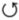 , 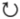 )
                

            </td>
        </tr>
        <tr>
            <td>
                

                    조종기 조이스틱(레버) 판단 블록
                

            </td>
            <td>
                

                    ▶ 조종기의 조이스틱(레버)을 특정 방향으로 움직였을 때 신호를 발생시켜 True 값을 반환합니다.
                

            </td>
        </tr>
        <tr>
            <td>
                

                    
                

            </td>
            <td>
                

                    <b>조이스틱(레버) 방향(왼쪽/오른쪽 공통)</b>   
                    총 9방향 : 상, 좌상, 우상, 하, 좌하, 우하, 좌, 우, 센터
                

            </td>
        </tr>
    </table>

다음과 같이 엔트리의 조건문 블록에 판단 블록으로 조립하여 사용합니다.

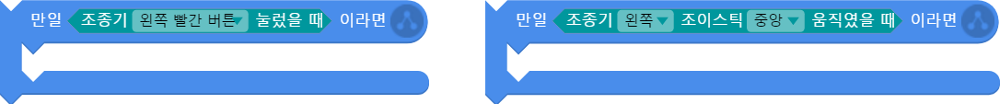

 

조종기 버튼을 누르면 드론이 다음과 같이 동작하는 코딩을 해보아요.

    <table>
        <tr>
            <td>
                

                    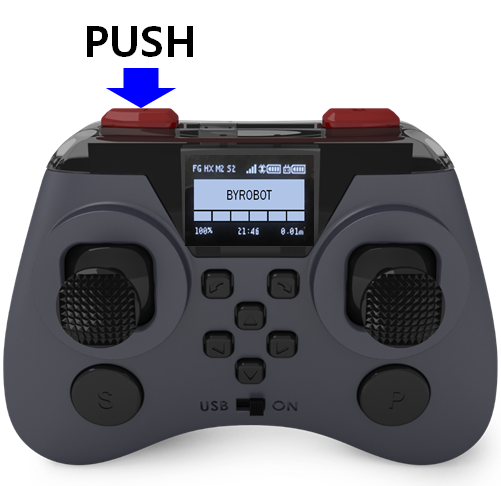
                

            </td>
            <td>
                

                    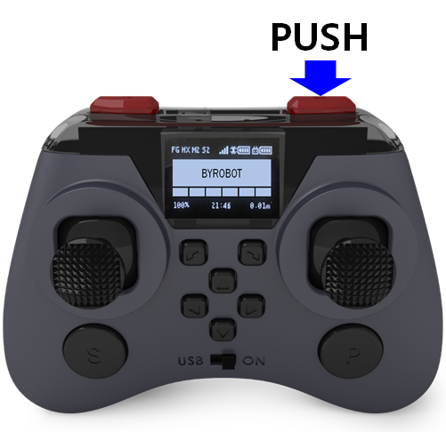
                

            </td>
        </tr>
        <tr>
            <td>
                

                    이륙하기 : 왼쪽 빨간색 버튼
                

            </td>
            <td>
                

                    착륙하기 : 오른쪽 빨간색 버튼
                

            </td>
        </tr>
        <tr>
            <td>
                

                    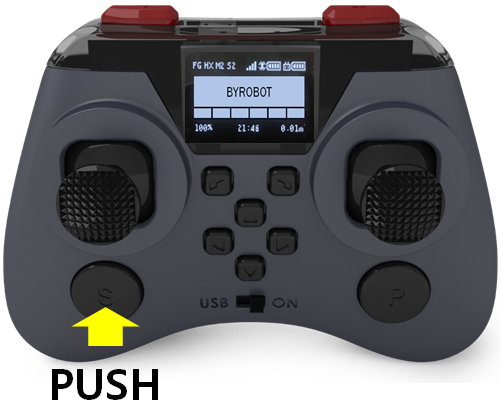
                

            </td>
            <td>
                

                    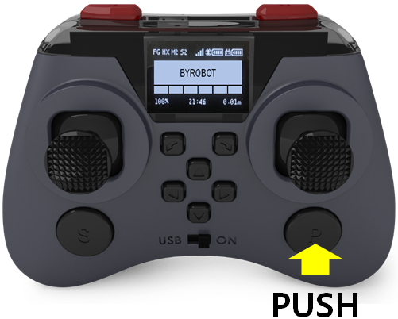
                

            </td>
        </tr>
        <tr>
            <td>
                

                    상승하기 : 왼쪽 둥근 버튼(설정버튼, S)
                

            </td>
            <td>
                

                    하강하기 : 오른쪽 둥근 버튼(페어링버튼, P)
                

            </td>
        </tr>
    </table>

 

---

 

    <h1>[코딩 및 실행하기]</h1>

 

조종기 버튼을 눌렀는지 지속적으로 확인을 해야 하기 때문에 조건문을 무한 반복문 안에 넣습니다.

 

    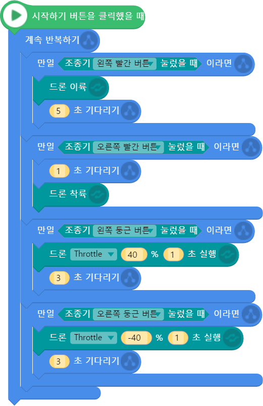

    <table>
        <tr>
            <td>
                

                    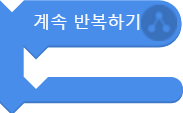 
                    반복문 블록
                

            </td>
            <td>
                

                    계속 반복하기 블록을 사용하여 조종기 버튼 동작 신호를 지속적으로 받을 수 있도록 합니다. 
                    ▶엔트리는 순차적 코딩 프로그램이기 때문에 블록이 순차적으로 1번씩만 실행됩니다. 그렇기 때문에 계속 반복하기 블록을 사용하지 않는다면 조종기 동작 신호를 지속적으로 받을 수 없습니다.
                

            </td>
        </tr>
        <tr>
            <td>
                

                    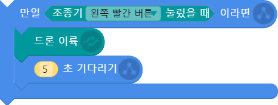 
                    조건문+명령 블록
                

            </td>
            <td>
                

                    조종기 왼쪽 앞부분의 빨간색 버튼을 눌렀을 때 신호가 발생합니다. 신호가 발생하면 조건문 안의 블록이 실행되어 드론이 이륙합니다.
                

            </td>
        </tr>
        <tr>
            <td>
                

                    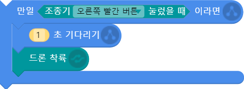 
                    조건문+명령 블록
                

            </td>
            <td>
                

                    조종기 오른쪽 앞부분의 빨간색 버튼을 눌렀을 때 신호가 발생합니다. 신호가 발생하면 조건문 안의 블록이 실행되어 드론이 착륙합니다.
                

            </td>
        </tr>
        <tr>
            <td>
                

                    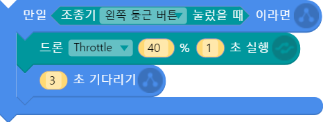 
                    조건문+명령 블록
                

            </td>
            <td>
                

                    조종기 왼쪽 아래의 둥근 버튼(설정버튼, S)을 눌렀을 때 신호가 발생합니다. 신호가 발생하면 조건문 안의 블록이 실행되어 드론이 40의 조종값으로 1초동안 상승합니다.
                

            </td>
        </tr>
        <tr>
            <td>
                

                    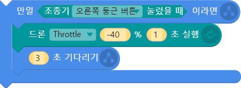 
                    조건문+명령 블록
                

            </td>
            <td>
                

                    조종기 오른쪽 아래의 둥근 버튼(페어링버튼, P)을 눌렀을 때 신호가 발생합니다. 신호가 발생하면 조건문 안의 블록이 실행되어 드론이 40의 조종값으로 1초동안 하강합니다.
                

            </td>
        </tr>
    </table>

 

코드를 실행하고 조종기 왼쪽 앞부분의 빨간색 버튼을 눌러봅니다. 드론이 이륙하나요? 그럼 빨간색 버튼과 둥근 버튼을 눌러보면서 드론이 정상적으로 비행하는지 확인합니다. 

 

---

 

    <h1>[정리하기]</h1>

 

조종기로 드론을 조종하니까 실제 조종하는 것처럼 느껴지지 않나요? 이처럼 조종기 버튼/조이스틱(레버) 판단 블록을 이용하면 실제 조종하는 것처럼 조종기로 드론을 비행시킬 수 있을 뿐만 아니라, 실제 조종법과 다르게 드론이 동작하도록 코딩하여 나만의 조종기를 만들 수도 있습니다. (예: 전진/후진 레버와 상승/하강 레버를 서로 바꿔보기 등)

1. 조종기의 버튼을 누르거나 조이스틱(레버)을 움직였을 때, 조종기 동작을 판단하는 블록을 사용하여 드론이 특정 명령을 수행하도록 할 수 있습니다.
2. 조종기 동작을 판단하는 블록은 2가지 종류(버튼/조이스틱(레버))가 있습니다.
3. 조종기 버튼/조이스틱(레버) 판단 블록은 조종기 동작 신호가 발생하였는지 지속적으로 확인해야 하기 때문에 반복문 안에서 조건문의 조건으로 사용합니다.

 

---

### [엔트리로 코딩해요](../)

 1. [페트론 V2와 엔트리가 만났어요](../lesson1)
 2. [조종기로 음악을 연주해보아요](../lesson2)
 3. [조종기 화면에 그림을 그려보아요](../lesson3)
 4. [조종기로 로봇청소기를 돌려보아요](../lesson4)
 5. [엔트리로 드론을 날려보아요](../lesson5)
 6. [드론으로 센서 놀이를 해보아요](../lesson6)
 7. [센서를 활용한 패턴 비행을 해보아요](../lesson7)
 8. **조종기 버튼으로 드론을 날려보아요**
 
---

Modified : 2019.1.15