 

    <h1>Lesson 1. GoCar와 친구해요!</h1>

 

---

 

    <h1>[들어가기]</h1>

 

GoCar는 교육용 로봇으로서 코딩과 RC조종이 모두 가능한 자율주행 스마트카입니다. 
남녀노소 누구나 좋아할 만한 귀여운 자동차 형태로 디자인되어 있어서 아이들이 친근하게 다가갈 수 있고 재미있게 놀면서 학습할 수 있습니다.

이 강의를 통해서,
1. 여러가지 언플러그드 코딩 활동을 통해 코딩의 기본 개념을 배울 수 있습니다.
2. GoCar의 자율주행을 직접 체험할 수 있습니다.
3. 4차산업의 핵심 분야인 코딩과 로봇을 접목하여 STEAM 교육에 필요한 통합&융합적 사고력을 기를 수 있습니다. 
4. 다가올 미래 사회에 꼭 필요한 창의융합형 인재의 역량을 키울 수 있습니다.

 

---

 

    <h3>GoCar는 이렇게 생겼어요!</h3>

 

        <table>
        <tr>
            <td>
                

                    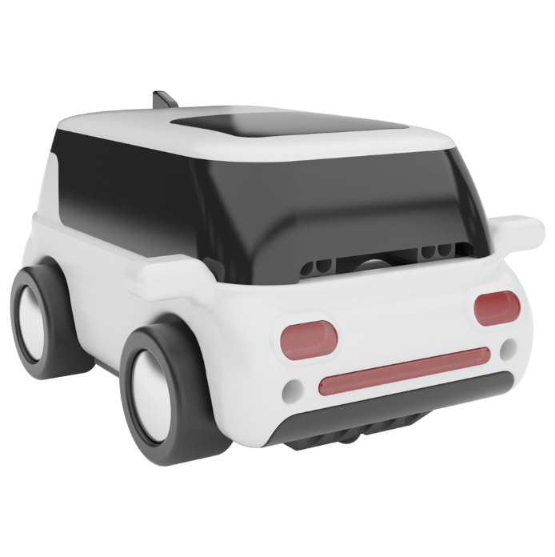 
                

            </td>
            <td>
                

                    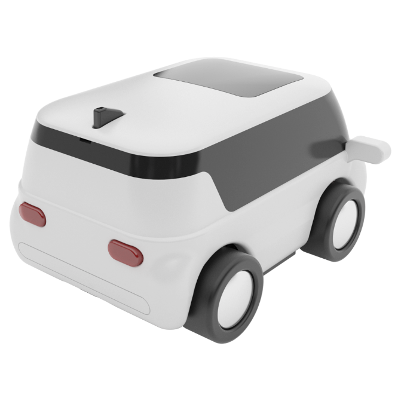 
                

            </td>
            <td>
                

                    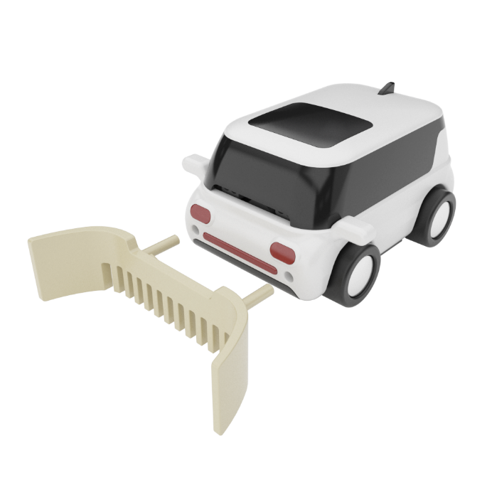 
                

            </td>
        </tr>
    </table>

 

    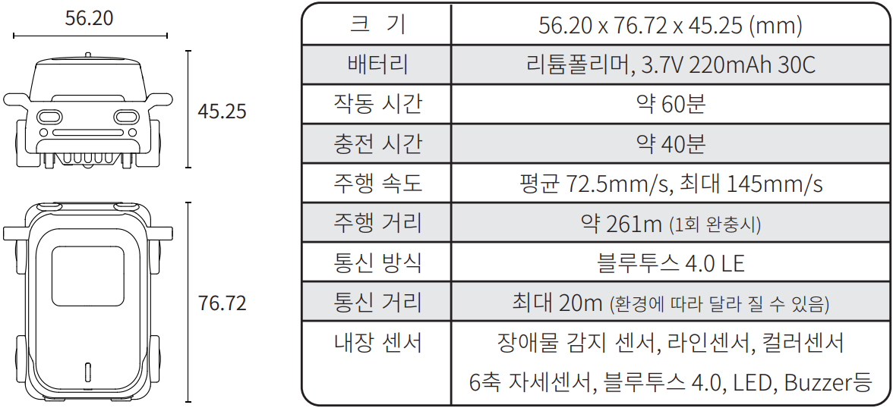 <h3>스펙</h3>
      
    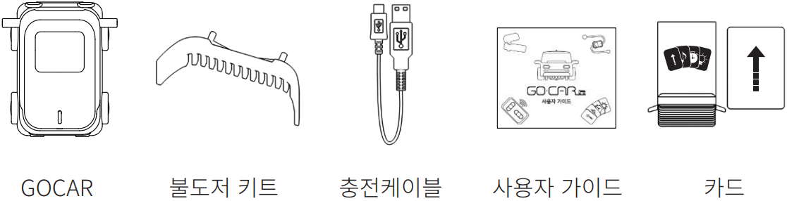 <h3>패키지 구성</h3>
      
    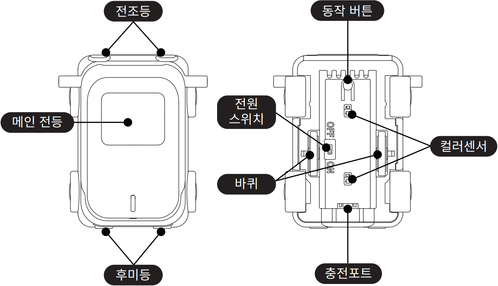 <h3>부분별 명칭</h3>

 

---

 

    <h1>[알아두기]</h1>

 

<h2>1. GoCar 충전하기</h2>

GoCar는 배터리를 충전해야 사용할 수 있습니다. 배터리를 충전하는 방법은 다음과 같습니다.
 

        <table>
        <tr>
            <td>
                

                    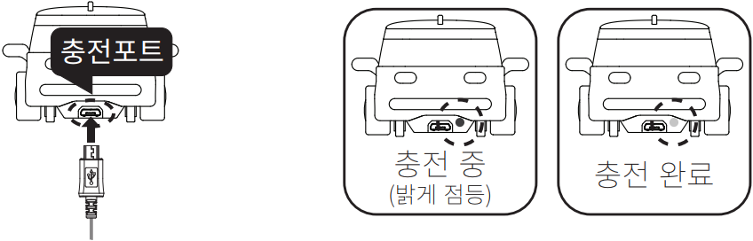
                

            </td>
        </tr>
        <tr>
            <td>
                

                1) 충전 케이블(USB 단자)을 컴퓨터 또는 충전 어댑터의 USB 포트에 연결합니다. 
                2) 충전 케이블(마이크로5핀 단자)을 GoCar 뒷면 충전포트에 삽입하여 충전을 시작합니다. 
                3) 충전 중일때는 녹색 LED가 밝게 점등되고, 충전이 완료되면 녹색 LED가 꺼집니다(충전포트 옆).
                

            </td>
        </tr>
    </table>

 
<b>※	배터리가 방전되면?!</b>
GoCar에서 부저음이 계속 울리면 배터리가 방전된 상태입니다. 즉시 작동을 멈추고 충전용 케이블을 사용하여 충전해주세요. 
(배터리 완충 시간 = <b>약 40분</b> / 주행 시간(1회 완충 시) = <b>약 60분</b>)

 

<h2>2. GoCar 전원켜기</h2>

배터리가 충전되었다면 GoCar의 전원을 켜볼까요?

        <table>
        <tr>
            <td>
                

                    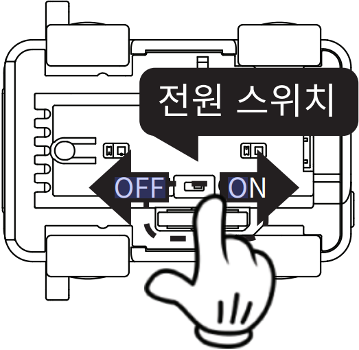
                

            </td>
            <td>
                

                1) 충전 케이블(USB 단자)을 컴퓨터 또는 충전 어댑터의 USB 포트에 연결합니다. 
                2) 충전 케이블(마이크로5핀 단자)을 GoCar 뒷면 충전포트에 삽입하여 충전을 시작합니다. 
                3) 충전 중일때는 녹색 LED가 밝게 점등되고, 충전이 완료되면 녹색 LED가 꺼집니다(충전포트 옆).
                

            </td>
        </tr>
    </table>

 

<h2>3. 컬러 캘리브레이션</h2>

GoCar로 코딩카드를 읽어서 다양한 언플러그드 코딩 활동을 할 수 있습니다.  
코딩카드를 읽는 방법은 카드에 있는 색상을 GoCar로 인식하는 것인데, 컬러 캘리브레이션 작업을 해주면 색상을 잘 인식할 수 있습니다.  

컬러 캘리브레이션 방법은 다음과 같습니다.

<b>※ 컬러 캘리브레이션 : 색상 인식을 위해 GoCar의 컬러 센서를 보정해주는 작업 </b>

<b>(총 8가지 색상 – 흰색/검정/빨강/노랑/초록/하늘/파랑/보라)</b>

 

    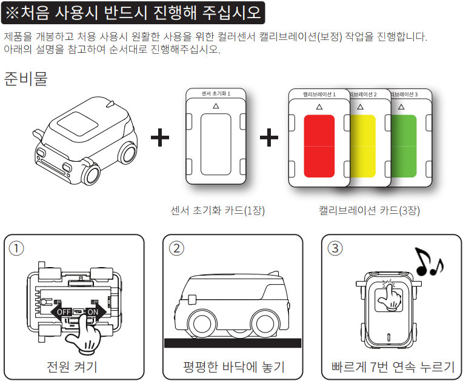
    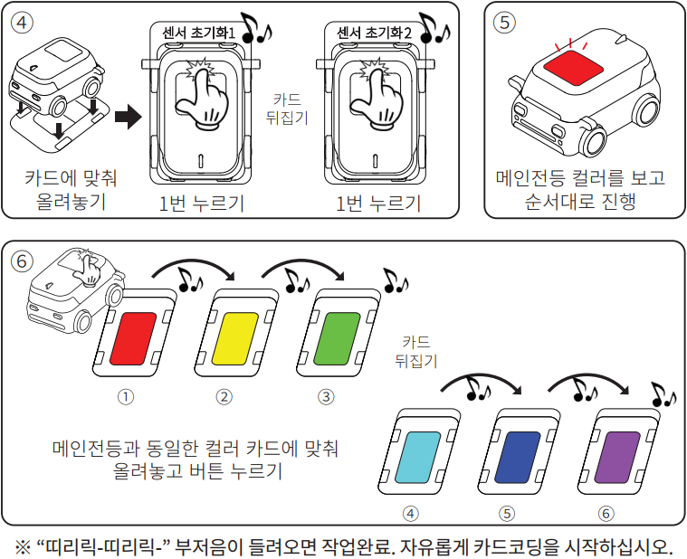

 

<h2>4. 코딩카드 읽기</h2>

다음으로 코딩카드를 읽는 방법을 알아볼까요? 코딩카드는 총 43장으로 구성되어 있고 서로 다른 명령어를 수행합니다.
 

    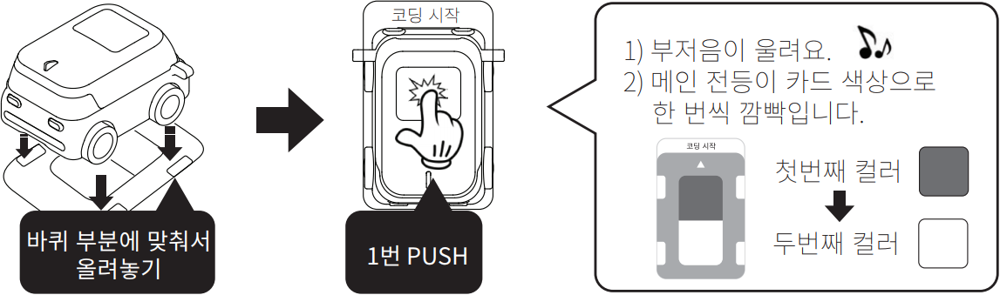

 

<h2>5. 기능별 모드 설정 방법</h2>
 
1) 언플러그드 모드의 기능별로 모드 카드가 존재합니다. 모드 카드를 다른 코딩카드 읽는 방법과 동일하게 읽으면 해당 모드로 설정됩니다. 
2) 모드 카드는 처음 한 번만 읽으면 되고 GoCar의 전원을 끄거나 다른 모드로 전환하기 전까지 해당 모드를 유지합니다. 
3) 다른 모드로 전환하는 방법은 전환할 모드 카드를 읽으면 해당 모드로 전환됩니다.
 
<b>※ 모드 카드를 읽으면 모드별로 다른 부저음이 울리고 메인 전등 색상이 달라지기 때문에 구분하기가 쉽습니다.</b> 

    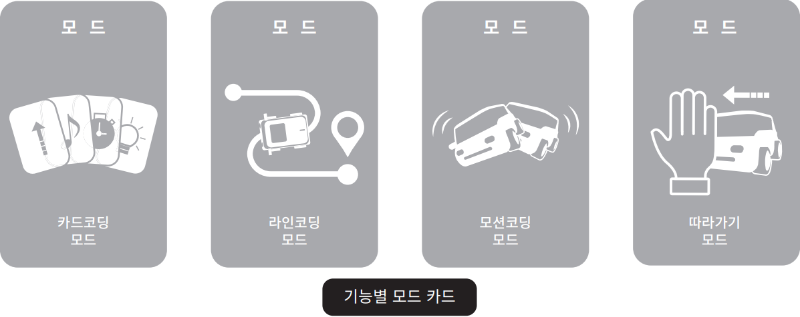

 

<h2>6. 사용 시 주의사항</h2>
 
1)	GoCar의 배터리가 방전되어 부저음이 계속 울리면, 즉시 작동을 멈추고 충전 후 사용합니다. 
2)	항상 최신 펌웨어를 설치합니다. 
- [펌웨어 프로그램 다운로드](http://dev.byrobot.co.kr/documents/kr/products/e_drive/log/updates/firmware/)
 
- [펌웨어 업데이트 매뉴얼](http://dev.byrobot.co.kr/documents/kr/products/e_drive/manual/update/drone4autoupdaterlight/)
 

3)	코딩카드를 읽을 때 힘을 많이 주어 누르거나, 손으로 잡고 미는 행위, 외부 충격 등은 GoCar를 손상시킬 수 있으므로 주의합니다.

 
<h2>7. GoCar를 강제로 멈추는 방법</h2>

 
☞	GoCar는 드론처럼 6축 자세센서가 장착되어 있어서 주행 중에 기체를 들어서 뒤집으면 작동을 멈출 수 있습니다.

 

---

 

    <h1>[정리하기]</h1>

 

GoCar에 대해 많이 알게 되었나요? 아직 주행하는 모습을 못 봐서 잘 모르겠다고요? 
걱정하지 마세요. 바로 다음 강의부터 직접 코딩해서 GoCar를 움직여 볼 거예요. 
혹시 사용 중 문제가 발생하였는데 해결하기 어려운 경우에는 바이로봇 AS센터(031–227–9675, help@byrobot.co.kr)로 연락바랍니다.

        <table>
        <tr>
            <td>
                

                    1) GoCar는 교육용 로봇으로서 코딩과 RC조종이 모두 가능한 자율주행 스마트카입니다. 
                    2) GoCar는 배터리가 내장되어 있고, 배터리가 방전되면 즉시 사용을 멈춘 후 충전하여 사용합니다. 
                    3) GoCar는 하부에 장착된 컬러 센서를 이용하여 2가지 색상이 그려진 코딩카드를 읽어서 모드 전환, 코딩 등 다양한 활동을 할 수 있습니다.  
                    4) 만약, 코딩카드를 읽는데 색상 인식이 잘되지 않는다면 컬러 캘리브레이션 작업을 실시합니다. 
                

            </td>
        </tr>
    </table>

 

 

---

### [코딩카드로 자율주행해요](../)

 1. **GoCar와 친구해요!**
 2. [GoCar로 카드코딩해요(1)](lesson2)
 3. [GoCar로 카드코딩해요(2)](lesson3)
 4. [GoCar로 카드코딩해요(3)] - 6월 셋째주(~6/19) 업데이트 예정
 5. [GoCar로 카드코딩해요(4)] - 6월 넷째주(~6/26) 업데이트 예정
 6. [GoCar로 라인코딩해요] - 7월 첫째주(~7/3) 업데이트 예정
 7. [GoCar로 모션코딩해요] - 7월 둘째주(~7/10) 업데이트 예정
 8. [GoCar로 따라가기해요] - 7월 셋째주(~7/17) 업데이트 예정

---

Modified : 2020.6.12