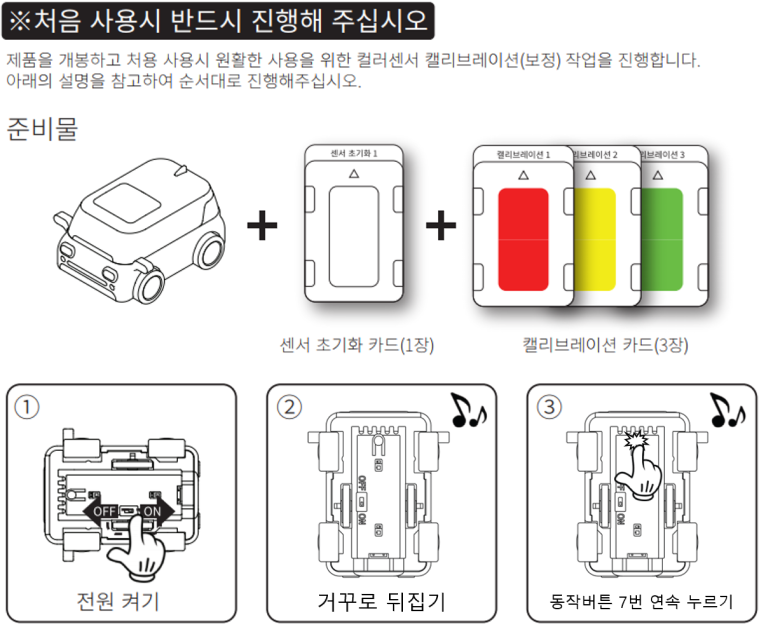

 

    <h1>Lesson 1. GoCar와 친구해요!</h1>

 

---

 

    <h1>[들어가기]</h1>

 

GoCar는 교육용 로봇으로서 코딩과 RC조종이 모두 가능한 자율주행 스마트카입니다. 
남녀노소 누구나 좋아할 만한 귀여운 자동차 형태로 디자인되어 있어서 아이들이 친근하게 다가갈 수 있고 재미있게 놀면서 학습할 수 있습니다.

이 강의를 통해서,
1. 여러가지 언플러그드 코딩 활동을 통해 코딩의 기본 개념을 배울 수 있습니다.
2. GoCar의 자율주행을 직접 체험할 수 있습니다.
3. 4차산업의 핵심 분야인 코딩과 로봇을 접목하여 STEAM 교육에 필요한 통합&융합적 사고력을 기를 수 있습니다. 
4. 다가올 미래 사회에 꼭 필요한 창의융합형 인재의 역량을 키울 수 있습니다.

 

---

 

    GoCar는 이렇게 생겼어요!

 

        <table>
        <tr>
            <td>
                

                     
                

            </td>
            <td>
                

                     
                

            </td>
            <td>
                

                     
                

            </td>
        </tr>
    </table>

 

     스펙
     
     패키지 구성
     
     부분별 명칭

 

---

 

    <h1>[알아두기]</h1>

 

<h2>1. GoCar 충전하기</h2>

<h3>GoCar는 배터리를 충전해야 사용할 수 있습니다. 배터리를 충전하는 방법은 다음과 같습니다.</h3>

 

        <table>
        <tr>
            <td>
                

                    
                

            </td>
        </tr>
        <tr>
            <td>
                

                1) 충전 케이블(USB 단자)을 컴퓨터 또는 충전 어댑터의 USB 포트에 연결합니다. 
                2) 충전 케이블(마이크로5핀 단자)을 GoCar 뒷면 충전포트에 삽입하여 충전을 시작합니다. 
                3) 충전 중일때는 녹색 LED가 밝게 점등되고, 충전이 완료되면 녹색 LED가 꺼집니다(충전포트 옆).
                

            </td>
        </tr>
    </table>

 
<b>※	배터리가 방전되면?!</b>
GoCar에서 부저음이 계속 울리면 배터리가 방전된 상태입니다. 즉시 작동을 멈추고 충전용 케이블을 사용하여 충전해주세요. 
(배터리 완충 시간 = <b>약 40분</b> / 주행 시간(1회 완충 시) = <b>약 60분</b>)

 

<h2>2. GoCar 전원켜기</h2>

배터리가 충전되었다면 GoCar의 전원을 켜볼까요?

        <table>
        <tr>
            <td>
                

                    
                

            </td>
            <td>
                

                1) 충전 케이블(USB 단자)을 컴퓨터 또는 충전 어댑터의 USB 포트에 연결합니다. 
                2) 충전 케이블(마이크로5핀 단자)을 GoCar 뒷면 충전포트에 삽입하여 충전을 시작합니다. 
                3) 충전 중일때는 녹색 LED가 밝게 점등되고, 충전이 완료되면 녹색 LED가 꺼집니다(충전포트 옆).
                

            </td>
        </tr>
    </table>

 

<h2>3. 컬러 캘리브레이션</h2>

GoCar로 코딩카드를 읽어서 다양한 언플러그드 코딩 활동을 할 수 있습니다.  
코딩카드를 읽는 방법은 카드에 있는 색상을 GoCar로 인식하는 것인데, 컬러 캘리브레이션 작업을 해주면 색상을 잘 인식할 수 있습니다.  

컬러 캘리브레이션 방법은 다음과 같습니다.

<b>※ 컬러 캘리브레이션 : 색상 인식을 위해 GoCar의 컬러 센서를 보정해주는 작업 </b> 
<b>(총 8가지 색상 – 흰색/검정/빨강/노랑/초록/하늘/파랑/보라)</b>

    
    

 

<h2>4. 코딩카드 읽기</h2>

    

 

<h4>상단 바 영역</h4>
- 바이블럭 버전 정보와 코드 관련 버튼들이 있습니다.

    

 

<h4>블록 영역</h4>
- 바이블럭에서 사용하는 블록들이 카테고리별로 구분되어 있고, 블록을 가져올 수 있습니다.

    
     
    

 

<h4>코딩 영역</h4>
- 블록을 조립하여 코드를 만드는 공간입니다.

    
     
    

 

<h4>상태 표시창 영역</h4>
- 드론의 모든 센서들의 값들을 실시간으로 확인할 수 있습니다. (열기/닫기 버튼을 터치하여 창 펼치기/숨기기 가능)

    

 

<h3> 2) 코드 실행방법</h3>

    

 

<h2> 2. 사용 시 주의사항</h2>

1) 드론의 배터리가 완전히 충전된 상태에서 사용해주시고, 배터리 잔량이 50% 미만이면 배터리를 교체합니다.

2) 배터리 잔량과 모터, 프로펠러 등 부품의 상태(모터 성능, 프로펠러 결함 여부 등)에 따라 비행 상태에 좋고 나쁨의 차이가 발생할 수 있습니다.

3) 드론과 조종기는 항상 최신 펌웨어를 설치합니다.

4) 프로그램 오류 등으로 인해 드론에 오작동이 발생할 수 있으니 가급적 넓은 공간에서 사용해주시고, 주변에 사람이나 장애물이 없는지 확인합니다.

 

<h2> 3. 드론을 강제로 멈추는 방법</h2>

바이블럭 사용 중에 오류가 발생하거나 드론이 원하는 방향으로 비행하지 않게 되면 드론을 강제로 멈춰야 합니다.

1) 상태 표시창 아래 코드 정지 버튼(정지)을 터치합니다. 드론이 비행 중인 경우에는 그 위치에서 모터가 정지하여 드론이 추락하오니 주의해주세요.

2) 바이블럭에 오류가 발생한 경우에는 휴대기기와 조종기의 연결을 해제합니다. 연결을 해제하면 드론은 약 5초간 호버링 후 자동으로 착륙합니다.

 

---

 

    <h1>[정리하기]</h1>

 

바이블럭을 설치하고 페트론 V2와 연결하는데 어려움은 없었나요? 

혹시 문제가 발생하였는데 해결하기 어려운 경우에는 바이로봇 AS센터(031–227–9675, help@byrobot.co.kr)로 연락바랍니다. 

그리고 바이블럭의 모든 블록에 대한 자세한 설명이 되어 있는 자료를 제공해 드리오니 참고 바랍니다. (링크 주소 업데이트 필요) 

다음 강의부터는 직접 바이블럭으로 코딩해보고, 만든 코드를 실행하여 드론을 자율비행시켜보도록 하겠습니다.

 

---

### [바이블럭으로 코딩해요](../)

 1. **페트론 V2와 바이블럭이 만났어요**
 2. [페트론 V2와 인사해요](../lesson2)
 3. [페트론 V2로 음악을 연주해요](../lesson3)
 4. [페트론 V2로 사각형을 그려보아요](../lesson4)
 5. [페트론 V2로 계단을 오르락내리락 해요](../lesson5)
 6. [페트론 V2를 원하는 높이로 상승시켜 보아요](../lesson6)
 7. [페트론 V2를 손바닥 위에 착륙시켜 보아요](../lesson7)
 8. [페트론 V2를 버튼으로 이륙/착륙시켜 보아요](../lesson8)

---

Modified : 2018.8.28