 

    <h1>Lesson 2. GoCar로 카드코딩해요(1)</h1>

 

---

 

    <h1>[들어가기]</h1>

 

이번 강의에서는 코딩카드를 사용하여 카드코딩하는 방법과 카드코딩으로 GoCar를 간단히 주행시켜보려고 합니다. 먼저 카드코딩이 무엇인지 알아볼까요?

 

    <table>
        <tr>
            <td>
<b>카드코딩이란?</b>
</td>
        </tr>
        <tr>
            <td>
                

                    카드코딩은 카드를 사용하여 코딩 학습을 할 수 있는 언플러그드 코딩교육의 한 종류입니다.   활용하는 교구재와 카드에 따라서 카드코딩에도 다양한 방식들이 있는데, GoCar를 활용한 카드코딩 방식은 다음과 같습니다.  
☞	카드별로 색상(상/하 2가지 색상)이 있고 GoCar에 장착된 컬러센서로 카드의 색상을 인식하여 카드를 읽을 수 있습니다.  
카드를 읽으면 해당 카드에 입력된 명령을 GoCar가 수행하게 됩니다.
                

                

                    
                    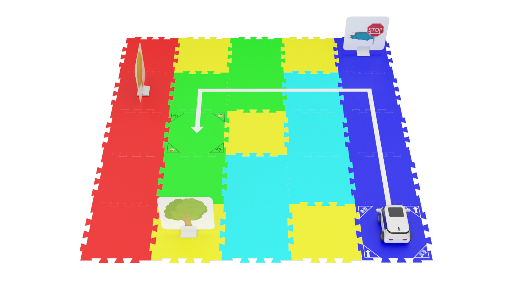
                

            </td>
        </tr>
    </table>

 

코딩카드는 기본으로 43장이 제공되며, 총 8개의 카테고리로 구성되어 있습니다.

 

    <table>
        <tr>
            <td>
<b>카테고리</b>
</td>
            <td>
<b>코딩카드(명령) 종류</b>
</td>
        </tr>
        <tr>
            <td>
                
캘리브레이션

            </td>
            <td>
                센서 초기화 1, 2 / 캘리브레이션 1, 4 / 캘리브레이션 2, 5 / 캘리브레이션 3, 6
            </td>
        </tr>
        <tr>
            <td>
                
모드

            </td>
            <td>
                카드코딩 모드 / 모션코딩 모드 / 따라가기 모드 / 라인코딩 모드
            </td>
        </tr>
        <tr>
            <td>
                
코딩

            </td>
            <td>
                코딩 시작 / 코딩 끝
            </td>
        </tr>
        <tr>
            <td>
                
동작

            </td>
            <td>
                1초 기다림
            </td>
        </tr>
        <tr>
            <td>
                
라이트

            </td>
            <td>
                상향등 켜기 / 좌회전 깜빡이 / 우회전 깜빡이 / 전조등, 상향등 끄기
            </td>
        </tr>
        <tr>
            <td>
                
이동

            </td>
            <td>
                계속 전진 / 1칸 전진 / U턴 / 90도 좌회전 / 90도 우회전 / 1칸 후진 / 계속 후진 / 정지
            </td>
        </tr>
        <tr>
            <td>
                
조건

            </td>
            <td>
                앞쪽 장애물 발견하면 / 빨간색 바닥 발견하면 / 녹색 바닥 발견하면 / 파란색 바닥 발견하면 / 조건이 맞지 않으면 / 조건 끝
            </td>
        </tr>
        <tr>
            <td>
                
반복

            </td>
            <td>
                무한 반복 / 2회 반복 / 3회 반복 / 4회 반복 / 반복 나가기 / 반복 끝
            </td>
        </tr>
        <tr>
            <td>
                
소리

            </td>
            <td>
                도 / 레 / 미 / 파 / 솔 / 라 / 시 / 도
            </td>
        </tr>
    </table>

 

컬러 캘리브레이션용 코딩카드는 앞면과 뒷면에 각각 다른 색상이 그려져 있습니다.  
그리고 나머지 코딩카드는 앞면에 색상이 그려져 있고, 뒷면에 명령어와 아이콘이 그려져 있습니다.

 

<b>컬러 캘리브레이션용 카드</b>

    <table>
        <tr>
            <td>
                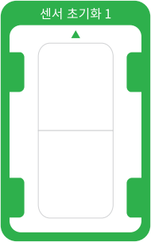
            </td>
            <td>
                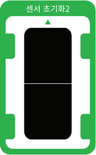
            </td>
        </tr>
        <tr>
            <td>
                
앞면

            </td>
            <td>
                
뒷면

            </td>
        </tr>
    </table>

 

<B>기타 코딩카드</b>

    <table>
        <tr>
            <td>
                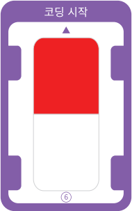
            </td>
            <td>
                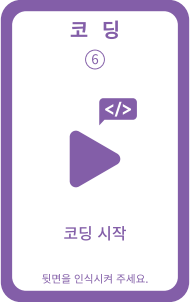
            </td>
        </tr>
        <tr>
            <td>
                
앞면

            </td>
            <td>
                
뒷면

            </td>
        </tr>
    </table>

 

<b>※ 만약, GoCar가 코딩카드를 잘 읽지 못한다면 1차시에 배웠던  컬러 캘리브레이션 작업을 해주세요!</b>

 

---

 

    <h1>[카드코딩 방법]</h1>

 

카드코딩은 다음 순서로 실시합니다.

    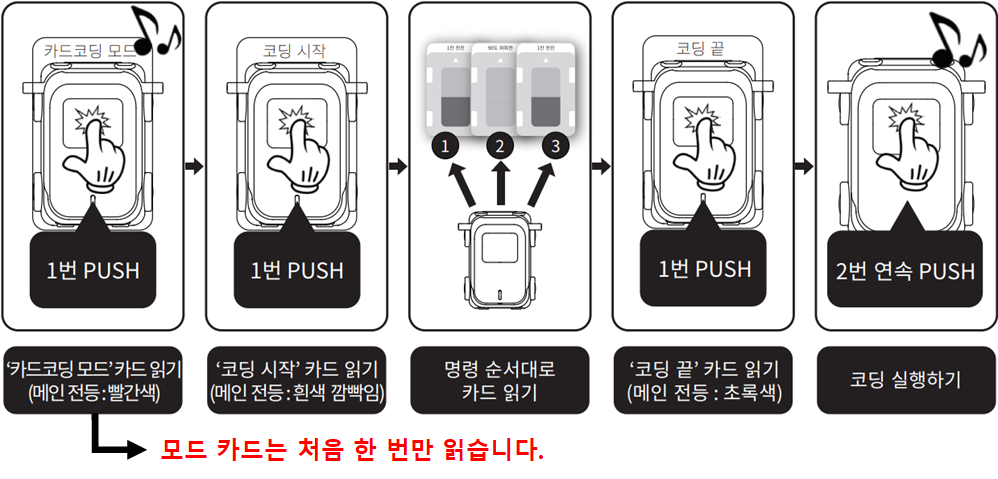

1) 카드코딩 실행 방법은 GoCar를 평평한 곳에 놓고 메인 전등 부분을 2번 연속으로 누르면 약 2~3초 후 부저음(띠리릭)이 울리면서 자동으로 실행됩니다. 
2) 한 번 입력된 코딩 명령은 메모리에 저장되어 계속 실행할 수 있습니다. 단, “코딩 시작” 카드를 다시 읽으면 초기화됩니다.  
<b>※ ※	GoCar의 전원을 꺼도 저장되어 있습니다. (저장 가능한 최대 카드 개수 : 120장)</b>

 

---

 

    <h1>[코드 생각하기]</h1>

 

지금부터는 직접 코딩해서 GoCar를 움직여 보기로 해요.  
먼저 코딩을 하기 전에 GoCar를 어떻게 움직일 것인지 생각하여 코드를 만들어봅니다. 
이번 강의에서는 전진과 후진, 그리고 좌회전과 우회전을 해볼거예요.  
먼저 1칸 전진 후 1칸 후진을 하려면 어떻게 코드를 짜야 할지 생각해봅시다.  
다음과 같이 코드를 생각해보았어요.

<h2>1. 전진/후진</h2>

    <table>
        <tr>
            <td>
                
동작 순서

            </td>
            <td>
                
시작 → 1칸 전진 → 1칸 후진 → 끝

            </td>
        </tr>
        <tr>
            <td>
                
카드 순서

            </td>
            <td>
                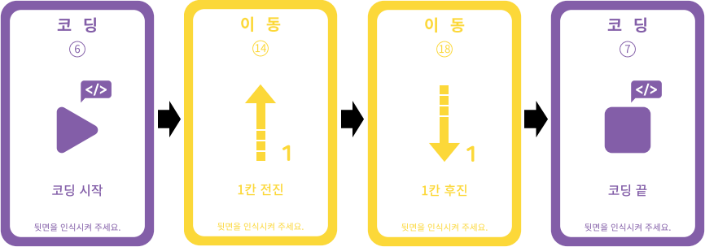
            </td>
        </tr>
    </table>

 

 

<h2>2. 좌회전/우회전</h2>

 

다음으로 좌회전과 우회전을 한 번씩 번갈아서 동작하려면 코드를 어떻게 짜야할까요? 
방금 전에 전진과 후진 코드를 생각하면서 다음과 같이 코드를 생각해보았습니다.

    <table>
        <tr>
            <td>
                
동작 순서

            </td>
            <td>
                
시작 → 좌회전 → 우회전 → 끝

            </td>
        </tr>
        <tr>
            <td>
                
카드 순서

            </td>
            <td>
                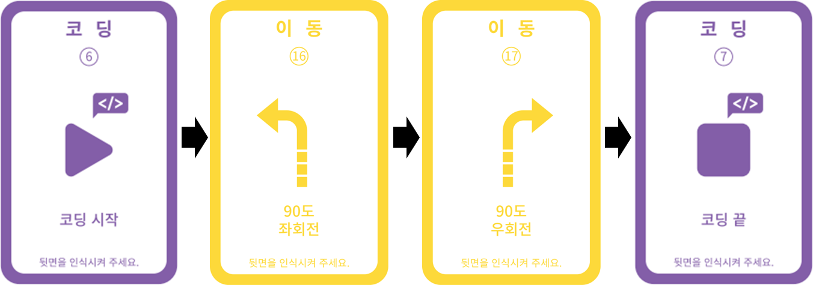
            </td>
        </tr>
    </table>

 

---

 

    <h1>[코딩 및 실행하기]</h1>

 

<h2>1. 전진/후진</h2>

 

이제 생각한 코드를 바탕으로 직접 코딩한 후 실행해보아요.  위에서 배웠던 카드코딩하는 방법을 잊지 않았죠? 
 다음 순서대로 차근차근 따라해보세요.

 

    <table>
        <tr>
            <td>
<b>1단계 코딩카드 준비하기</b>
</td>
        </tr>
        <tr>
            <td>
                

                    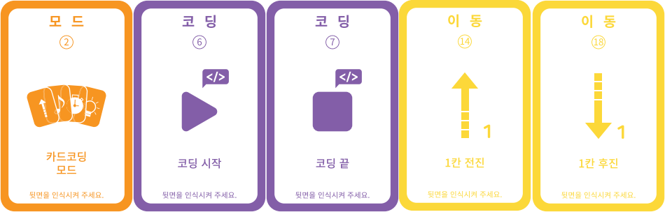 
                    카드코딩에 필요한 코딩카드들을 준비해보아요.
                

            </td>
        </tr>
        <tr>
            <td>
<b>2단계 코딩카드 배열하기 
            동작순서 : 1칸 전진 → 1칸 후진(1칸 이동거리 : 약 13cm)</b>
</td>
        </tr>
        <tr>
            <td>
                

                    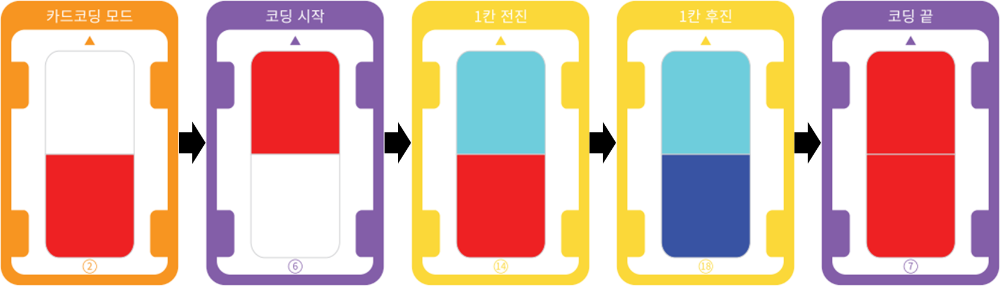 
                    동작 순서에 맞게 카드를 배열해 보아요. 코딩의 시작과 끝에는 항상 “코딩시작”과 “코딩끝” 카드가 온다는 것을 잊지 마세요
                

            </td>
        </tr>
        <tr>
            <td>
<b>3단계 코딩카드 읽기</b>
</td>
        </tr>
        <tr>
            <td>
                

                    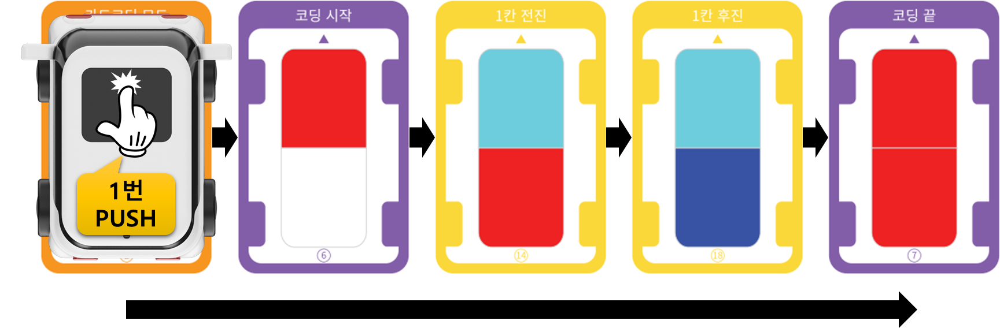 
                    GoCar의 전원을 켜고 코딩카드를 읽습니다.  코딩카드가 잘 읽히도록 올바른 위치에 GoCar를 올려놓고 카드 순서대로 메인 전등 부분을 1번 눌러서 카드를 읽어주세요.  만약, 중간에 카드를 잘못 읽었다면 처음부터(=”코딩시작” 카드부터) 다시 시작합니다.  
                    <b>※ “카드코딩 모드” 카드는 처음 한 번만 읽습니다!</b>
                

            </td>
        </tr>
        <tr>
            <td>
                

                    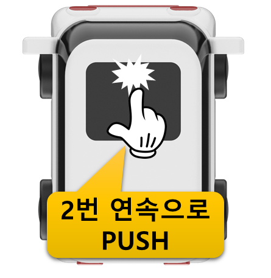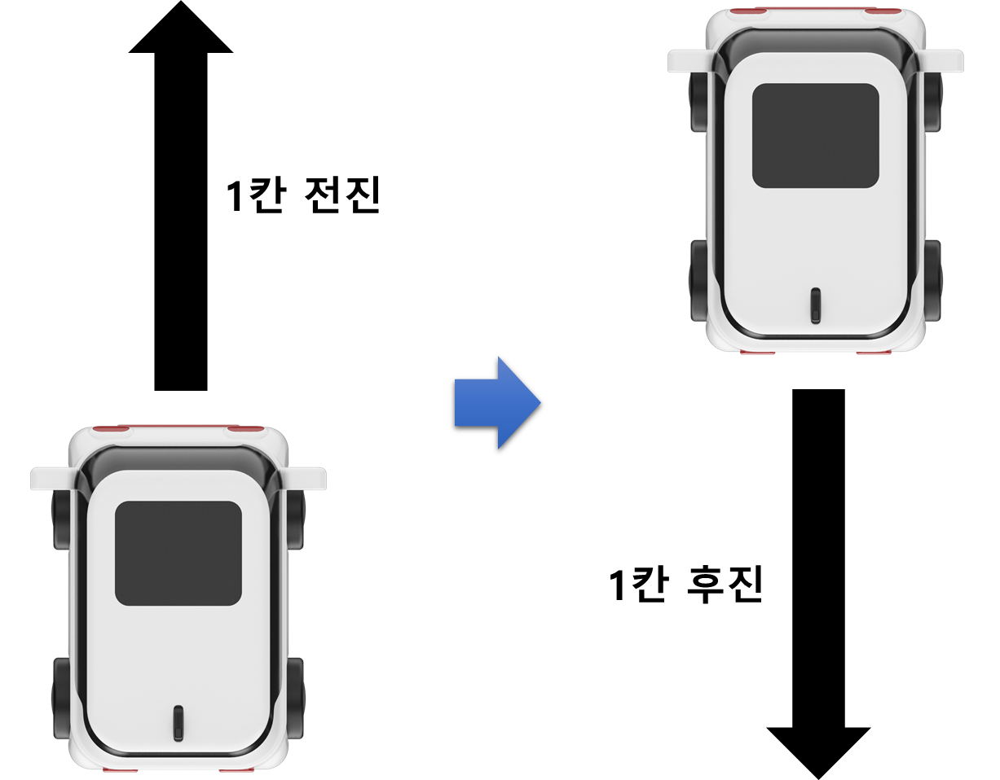 
                    GoCar를 평평한 바닥에 놓고 메인 전등 부분을 연속으로 2번 눌러서 코딩을 실행합니다.  약 3초 후 GoCar가 자동으로 코딩한 명령을 수행합니다.  GoCar가 잘 주행할 수 있도록 매끄럽고 평평한 바닥에서 실행해주세요.  
                    <b>※ 칸 전진과 후진의 이동 거리는 약 13cm입니다.</b>
                

            </td>
        </tr>
    </table>

 

<h2>2. 좌회전/우회전</h2>

 

다음으로 90도 좌회전 후 90도 우회전하는 코딩을 해보아요.  
전진과 후진 코딩과 동일한 방법으로 진행합니다.

 

    <table>
        <tr>
            <td>
<b>1단계 코딩카드 준비하기</b>
</td>
        </tr>
        <tr>
            <td>
                

                    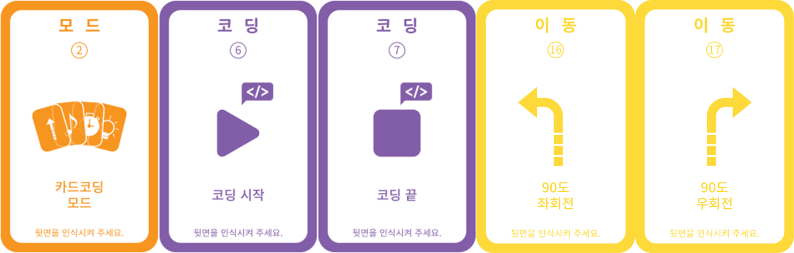 
                    카드코딩에 필요한 코딩카드들을 준비해보아요.
                

            </td>
        </tr>
        <tr>
            <td>
<b>2단계 코딩카드 배열하기 
            동작순서 : 90도 좌회전 → 90도 우회전</b>
</td>
        </tr>
        <tr>
            <td>
                

                    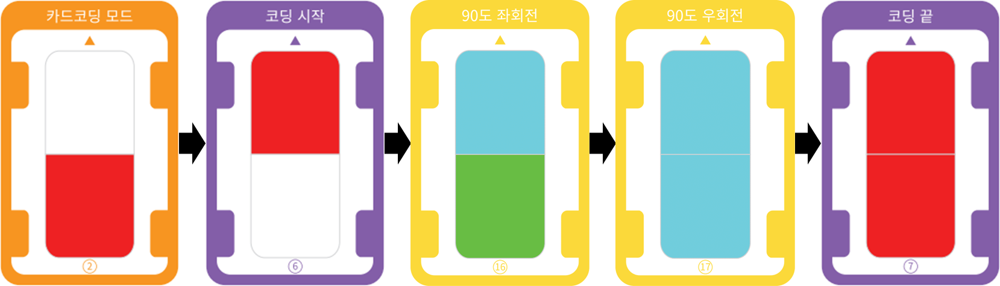 
                    동작 순서에 맞게 카드를 배열해 보아요. 코딩의 시작과 끝에는 항상 “코딩시작”과 “코딩끝” 카드가 온다는 것을 잊지 마세요!
                

            </td>
        </tr>
        <tr>
            <td>
<b>3단계 코딩카드 읽기</b>
</td>
        </tr>
        <tr>
            <td>
                

                    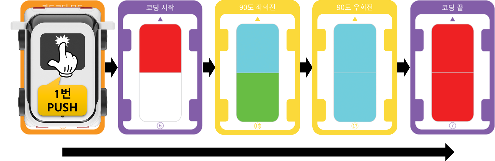 
                    GoCar의 전원을 켜고 코딩카드를 읽습니다.  코딩카드가 잘 읽히도록 올바른 위치에 GoCar를 올려놓고 카드 순서대로 메인 전등 부분을 1번 눌러서 카드를 읽어주세요.  만약, 중간에 카드를 잘못 읽었다면 처음부터(=”코딩시작” 카드부터) 다시 시작합니다.  
                    <b>※ “카드코딩 모드” 카드는 처음 한 번만 읽습니다!</b>
                

            </td>
        </tr>
        <tr>
            <td>
                

                    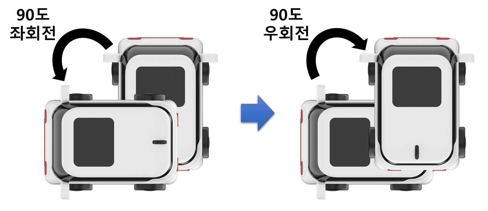 
                    GoCar를 평평한 바닥에 놓고 메인 전등 부분을 연속으로 2번 눌러서 코딩을 실행합니다. 
                    약 3초 후 GoCar가 자동으로 코딩한 명령을 수행합니다.  
                    GoCar가 잘 주행할 수 있도록 매끄럽고 평평한 바닥에서 실행해주세요. 
                

            </td>
        </tr>
    </table>

 

---

 

    <h1>[정리하기]</h1>

 

직접 코딩하여 GoCar를 움직여보니까 재미있었나요?  
전진과 후진, 좌회전과 우회전 명령어를 섞어서 사용하면 좀 더 다양한 주행을 할 수 있고, 출발지에서 도착지까지 찾아가는 길찾기 놀이도 할 수 있습니다.

1. GoCar로 총 43장의 카드를 읽어서 카드코딩을 할 수 있습니다.

2. 카드코딩 순서는 [코딩카드 준비하기 → 코딩카드 배열하기 → 코딩카드 읽기 → 코드 실행하기] 입니다.

3. 전진과 후진 카드를 사용하여 GoCar를 1칸 전진, 1칸 후진시킬 수 있습니다. 1칸 이동 거리는 약 13cm 입니다.

4. 90도 좌회전과 90도 우회전 카드를 사용하여 GoCar를 90도 좌회전, 90도 우회전시킬 수 있습니다.

5. 동일한 카드를 연속해서 사용하면 사용한 횟수만큼 이동하거나 회전합니다. 
   ex: 전진 카드를 3번 연속 읽으면 1칸씩 3번 전진하고, 90도 좌회전 카드를 2번 연속 읽으면 90도씩 2번 회전하여 총 180도를 회전합니다.

 

---

### [코딩카드로 자율주행해요](../)

 1. [GoCar와 친구해요!](../lesson1)
 2. **GoCar로 카드코딩해요(1)**
 3. [추후 업데이트 예정]
 
---

Modified : 2020.6.8