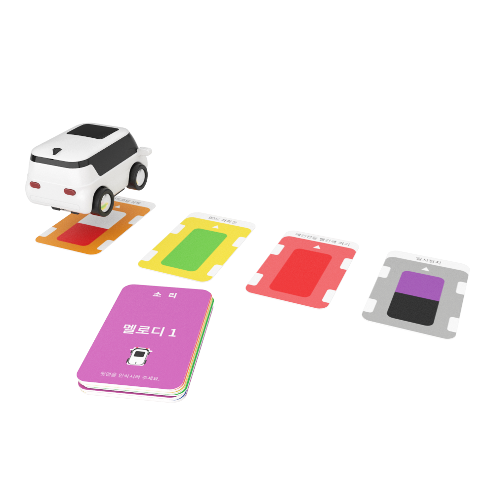

 

    <h1>Lesson 2. GoCar로 카드코딩해요(1)</h1>

 

---

 

    <h1>[들어가기]</h1>

 

이번 강의에서는 코딩카드를 사용하여 카드코딩하는 방법과 카드코딩으로 GoCar를 간단히 주행시켜보려고 합니다. 먼저 카드코딩이 무엇인지 알아볼까요?

 

    <table>
        <tr>
            <td>
카드코딩이란?
</td>
        </tr>
        <tr>
            <td>
                

                    카드코딩은 카드를 사용하여 코딩 학습을 할 수 있는 언플러그드 코딩교육의 한 종류입니다. 활용하는 교구재와 카드에 따라서 카드코딩에도 다양한 방식들이 있는데, GoCar를 활용한 카드코딩 방식은 다음과 같습니다. 

☞	카드별로 색상(상/하 2가지 색상)이 있고 GoCar에 장착된 컬러센서로 카드의 색상을 인식하여 카드를 읽을 수 있습니다. 카드를 읽으면 해당 카드에 입력된 명령을 GoCar가 수행하게 됩니다.
                

                

                    
                    
                

            </td>
        </tr>
    </table>

 

코딩카드는 기본으로 43장이 제공되며, 총 8개의 카테고리로 구성되어 있습니다.

 

    <table>
        <tr>
            <td>
<b>카테고리</b>
</td>
            <td>
<b>코딩카드(명령) 종류</b>
</td>
        </tr>
        <tr>
            <td>
                
캘리브레이션

            </td>
            <td>
                센서 초기화 1, 2 / 캘리브레이션 1, 4 / 캘리브레이션 2, 5 / 캘리브레이션 3, 6
            </td>
        </tr>
        <tr>
            <td>
                
모드

            </td>
            <td>
                카드코딩 모드 / 모션코딩 모드 / 따라가기 모드 / 라인코딩 모드
            </td>
        </tr>
        <tr>
            <td>
                
코딩

            </td>
            <td>
                코딩 시작 / 코딩 끝
            </td>
        </tr>
        <tr>
            <td>
                
동작

            </td>
            <td>
                1초 기다림
            </td>
        </tr>
        <tr>
            <td>
                
라이트

            </td>
            <td>
                상향등 켜기 / 좌회전 깜빡이 / 우회전 깜빡이 / 전조등, 상향등 끄기
            </td>
        </tr>
        <tr>
            <td>
                
이동

            </td>
            <td>
                계속 전진 / 1칸 전진 / U턴 / 90도 좌회전 / 90도 우회전 / 1칸 후진 / 계속 후진 / 정지
            </td>
        </tr>
        <tr>
            <td>
                
조건

            </td>
            <td>
                앞쪽 장애물 발견하면 / 빨간색 바닥 발견하면 / 녹색 바닥 발견하면 / 파란색 바닥 발견하면 / 조건이 맞지 않으면 / 조건 끝
            </td>
        </tr>
        <tr>
            <td>
                
반복

            </td>
            <td>
                무한 반복 / 2회 반복 / 3회 반복 / 4회 반복 / 반복 나가기 / 반복 끝
            </td>
        </tr>
        <tr>
            <td>
                
소리

            </td>
            <td>
                도 / 레 / 미 / 파 / 솔 / 라 / 시 / 도
            </td>
        </tr>
    </table>

 

컬러 캘리브레이션용 코딩카드는 앞면과 뒷면에 각각 다른 색상이 그려져 있습니다.  
그리고 나머지 코딩카드는 앞면에 색상이 그려져 있고, 뒷면에 명령어와 아이콘이 그려져 있습니다.

 

컬러 캘리브레이션용 카드
 

    <table>
        <tr>
            <td>
                
            </td>
            <td>
                
            </td>
        </tr>
        <tr>
            <td>
                
앞면

            </td>
            <td>
                
뒷면

            </td>
        </tr>
    </table>

 

기타 코딩카드
 

    <table>
        <tr>
            <td>
                
            </td>
            <td>
                
            </td>
        </tr>
        <tr>
            <td>
                
앞면

            </td>
            <td>
                
뒷면

            </td>
        </tr>
    </table>

 

<b>※ 만약, GoCar가 코딩카드를 잘 읽지 못한다면 1차시에 배웠던  컬러 캘리브레이션 작업을 해주세요!</b>

---

 

    <h1>[카드코딩 방법]</h1>

 

카드코딩은 다음 순서로 실시합니다.

    

1) 카드코딩 실행 방법은 GoCar를 평평한 곳에 놓고 메인 전등 부분을 2번 연속으로 누르면 약 2~3초 후 부저음(띠리릭)이 울리면서 자동으로 실행됩니다. 
2) 한 번 입력된 코딩 명령은 메모리에 저장되어 계속 실행할 수 있습니다. 단, “코딩 시작” 카드를 다시 읽으면 초기화됩니다.  
<b>※ ※	GoCar의 전원을 꺼도 저장되어 있습니다. (저장 가능한 최대 카드 개수 : 120장)</b>

 

---

 

    <h1>[코드 생각하기]</h1>

 

지금부터는 직접 코딩해서 GoCar를 움직여 보기로 해요. 먼저 코딩을 하기 전에 GoCar를 어떻게 움직일 것인지 생각하여 코드를 만들어봅니다.
이번 강의에서는 전진과 후진, 그리고 좌회전과 우회전을 해볼거예요. 먼저 1칸 전진 후 1칸 후진을 하려면 어떻게 코드를 짜야 할지 생각해봅시다.
다음과 같이 코드를 생각해보았어요.

<h2>1. 전진/후진</h2>

    <table>
        <tr>
            <td>
                
동작 순서

            </td>
            <td>
                
시작 → 1칸 전진 → 1칸 후진 → 끝

            </td>
        </tr>
        <tr>
            <td>
                
카드 순서

            </td>
            <td>
                
            </td>
        </tr>
    </table>

 

 

<h2>2. 좌회전/우회전</h2>

 

다음으로 좌회전과 우회전을 한 번씩 번갈아서 동작하려면 코드를 어떻게 짜야할까요?
방금 전에 전진과 후진 코드를 생각하면서 다음과 같이 코드를 생각해보았습니다.

    <table>
        <tr>
            <td>
                
동작 순서

            </td>
            <td>
                
시작 → 좌회전 → 우회전 → 끝

            </td>
        </tr>
        <tr>
            <td>
                
카드 순서

            </td>
            <td>
                
            </td>
        </tr>
    </table>

 

---

 

    <h1>[코딩 및 실행하기]</h1>

 

<h2>1. 전진/후진</h2>

 

이제 생각한 코드를 바탕으로 직접 코딩한 후 실행해보아요. 위에서 배웠던 카드코딩하는 방법을 잊지 않았죠? 다음 순서대로 차근차근 따라해보세요.

 

    <table>
        <tr>
            <td>
1단계 코딩카드 준비하기
</td>
        </tr>
        <tr>
            <td>
                

                     
                    카드코딩에 필요한 코딩카드들을 준비해보아요.
                

            </td>
        </tr>
        <tr>
            <td>
2단계 코딩카드 배열하기
</td>
        </tr>
        <tr>
            <td>
                

                     
                    동작 순서에 맞게 카드를 배열해 보아요. 코딩의 시작과 끝에는 항상 “코딩시작”과 “코딩끝” 카드가 온다는 것을 잊지 마세요
                

            </td>
        </tr>
    </table>

    <table>
        <tr>
            <td>
                

                     
                    상승(지정시간) 블록
                

            </td>
            <td>
                

                    페트론 V2가 상승합니다. 출력(%)은 조종값으로 0~100까지 입력 가능하고, 값이 클수록 모터의 출력이 커져서 드론의 이동 속도가 빨라집니다. 시간은 0.01초 단위로 입력 가능하고, 입력한 시간 동안 전진합니다. 
                    ※ 입력한 시간 동안 상승한 후 다음 블록이 실행됩니다.
                

            </td>
        </tr>
        <tr>
            <td>
                

                     
                    하강(지정시간) 블록
                

            </td>
            <td>
                

                    페트론 V2가 하강합니다. 출력(%)은 조종값으로 0~100까지 입력 가능하고, 값이 클수록 모터의 출력이 커져서 드론의 이동 속도가 빨라집니다. 시간은 0.01초 단위로 입력 가능하고, 입력한 시간 동안 후진합니다. 
                    ※ 입력한 시간 동안 하강한 후 다음 블록이 실행됩니다.
                

            </td>
        </tr>
        <tr>
            <td>
                

                     
                    기다리기 블록
                

            </td>
            <td>
                

                    바이블럭에서 코드를 실행하고 블록 명령이 페트론 V2에 잘 전달되려면 시간이 필요합니다(Delay time). 그래서 이와 같이 특정 동작을 수행하는 블록 다음에는 꼭 기다리기 블록을 사용하여 명령이 잘 전달될 수 있도록 해줍니다. 
                    ※ 숫자 블록을 터치하면 숫자 입력이 가능합니다.
                

            </td>
        </tr>
    </table>

 

<h2>3. 전진/후진</h2>

    

 

    <table>
        <tr>
            <td>
                

                     
                    전진(지정시간) 블록
                

            </td>
            <td>
                

                    페트론 V2가 전진합니다. 출력(%)은 조종값으로 0~100까지 입력 가능하고, 값이 클수록 모터의 출력이 커져서 드론의 이동 속도가 빨라집니다. 시간은 0.01초 단위로 입력 가능하고, 입력한 시간 동안 전진합니다. 
                    ※ 입력한 시간 동안 전진한 후 다음 블록이 실행됩니다.
                

            </td>
        </tr>
        <tr>
            <td>
                

                     
                    후진(지정시간) 블록
                

            </td>
            <td>
                

                    페트론 V2가 후진합니다. 출력(%)은 조종값으로 0~100까지 입력 가능하고, 값이 클수록 모터의 출력이 커져서 드론의 이동 속도가 빨라집니다. 시간은 0.01초 단위로 입력 가능하고, 입력한 시간 동안 후진합니다. 
                    ※ 입력한 시간 동안 후진한 후 다음 블록이 실행됩니다.
                

            </td>
        </tr>
    </table>

 

<h2>4. 좌/우 이동</h2>

    

 

    <table>
        <tr>
            <td>
                

                     
                    좌 이동(지정시간) 블록
                

            </td>
            <td>
                

                    페트론 V2가 좌(왼쪽)로 이동합니다. 출력(%)은 조종값으로 0~100까지 입력 가능하고, 값이 클수록 모터의 출력이 커져서 드론의 이동 속도가 빨라집니다. 시간은 0.01초 단위로 입력 가능하고, 입력한 시간 동안 좌로 이동합니다. 
                    ※ 입력한 시간 동안 좌로 이동한 후 다음 블록이 실행됩니다.
                

            </td>
        </tr>
        <tr>
            <td>
                

                     
                    우 이동(지정시간) 블록
                

            </td>
            <td>
                

                    페트론 V2가 우(오른쪽)로 이동합니다. 출력(%)은 조종값으로 0~100까지 입력 가능하고, 값이 클수록 모터의 출력이 커져서 드론의 이동 속도가 빨라집니다. 시간은 0.01초 단위로 입력 가능하고, 입력한 시간 동안 우로 이동합니다. 
                    ※ 입력한 시간 동안 우로 이동한 후 다음 블록이 실행됩니다.
                

            </td>
        </tr>
    </table>

 

<h2>5. 좌/우 회전</h2>

    

 

    <table>
        <tr>
            <td>
                

                     
                    좌 회전(지정시간) 블록
                

            </td>
            <td>
                

                    페트론 V2가 좌(왼쪽)로 회전합니다. 출력(%)은 조종값으로 0~100까지 입력 가능하고, 값이 클수록 모터의 출력이 커져서 드론의 이동 속도가 빨라집니다. 시간은 0.01초 단위로 입력 가능하고, 입력한 시간 동안 좌로 회전합니다. 
                    ※ 입력한 시간 동안 좌로 회전한 후 다음 블록이 실행됩니다.
                

            </td>
        </tr>
        <tr>
            <td>
                

                     
                    우 이동(지정시간) 블록
                

            </td>
            <td>
                

                    페트론 V2가 우(오른쪽)로 회전합니다. 출력(%)은 조종값으로 0~100까지 입력 가능하고, 값이 클수록 모터의 출력이 커져서 드론의 이동 속도가 빨라집니다. 시간은 0.01초 단위로 입력 가능하고, 입력한 시간 동안 우로 회전합니다. 
                    ※ 입력한 시간 동안 우로 회전한 후 다음 블록이 실행됩니다.
                

            </td>
        </tr>
    </table>

 

---

 

    <h1>[정리하기]</h1>

 

바이블럭, 페트론 V2와 좀 친숙해졌나요? 조종값과 비행 시간을 바꿔보고 블록들을 다르게 조합하여 실행해보면서 좀 더 다양하고 재미있게 자율비행을 즐겨봅시다.

1. 이/착륙 블록은 처음에 드론을 이륙시키고, 마지막에 착륙시킬 때 사용합니다.

2. 기본 비행 블록에서 방향, 조종값, 비행 시간을 설정하여 드론을 자율비행시킬 수 있습니다.

3. 조종값이 크면 모터의 출력이 커져서 드론의 이동 속도가 빨라집니다.

4. 이륙 후 5초 기다리기 블록을 사용하여 드론이 완전히 이륙할 수 있도록 합니다.

5. 비행 동작 후에는 3초 기다리기 블록을 사용하여 다음 명령이 드론에게 잘 전달될 수 있도록 합니다.

 

---

### [바이블럭으로 코딩해요](../)

 1. [페트론 V2와 바이블럭이 만났어요](../lesson1)
 2. **페트론 V2와 인사해요**
 3. [페트론 V2로 음악을 연주해요](../lesson3)
 4. [페트론 V2로 사각형을 그려보아요](../lesson3)
 5. [페트론 V2로 계단을 오르락내리락 해요](../lesson5)
 6. [페트론 V2를 원하는 높이로 상승시켜 보아요](../lesson6)
 7. [페트론 V2를 손바닥 위에 착륙시켜 보아요](../lesson7)
 8. [페트론 V2를 버튼으로 이륙/착륙시켜 보아요](../lesson8)
 
---

Modified : 2018.8.28