 

    <h1>Lesson 3. GoCar로 카드코딩해요(2)</h1>

 

---

 

    <h1>[들어가기]</h1>

 

이번 강의에서는 GoCar로 패턴주행하는 코딩을 해보려고 합니다.  
패턴주행이란 특정한 형태의 루트로 주행하는 것을 말하는데, 사각형, 원형, 8자 모양 등을 예로 들 수 있습니다.  
여기서는 사각형 패턴주행을 해볼 거예요. 그리고 패턴주행은 루트가 정형화되어 있기 때문에 일부 패턴이 반복되는 경우가 있습니다.  
이 경우에는 코딩을 할 때 반복문을 사용하여 코드를 간단하게 만들 수 있습니다.  

이번 강의에서 패턴주행을 통해 반복문이 무엇이고 어떻게 활용할 수 있는지 같이 배워보아요.

 

---

 

    <h1>[코드 생각하기]</h1>

 

사각형 패턴 주행 순서는 1칸 전진하기와 좌회전하기를 4회 반복합니다.

<b>4회 반복하기</b>

    <table>
        <tr>
            <td>
                
① 1칸 전진하기

            </td>
            <td>
                
②좌회전하기

            </td>
        </tr>
    </table>

 

위와 같이 주행하려면 어떻게 코드를 짜야 할지 생각해볼까요? 먼저 반복문을 사용하지 않고 코드를 만들어보아요.

 

<h2>1. 사각형 패턴 비행(반복문 미사용)</h2>

    <table>
        <tr>
            <td>
                
동작 순서

            </td>
            <td>
                
시작 → (1칸 전진 → 90도 좌회전) x 4 → 끝

            </td>
        </tr>
        <tr>
            <td>
                
카드 순서

            </td>
            <td>
                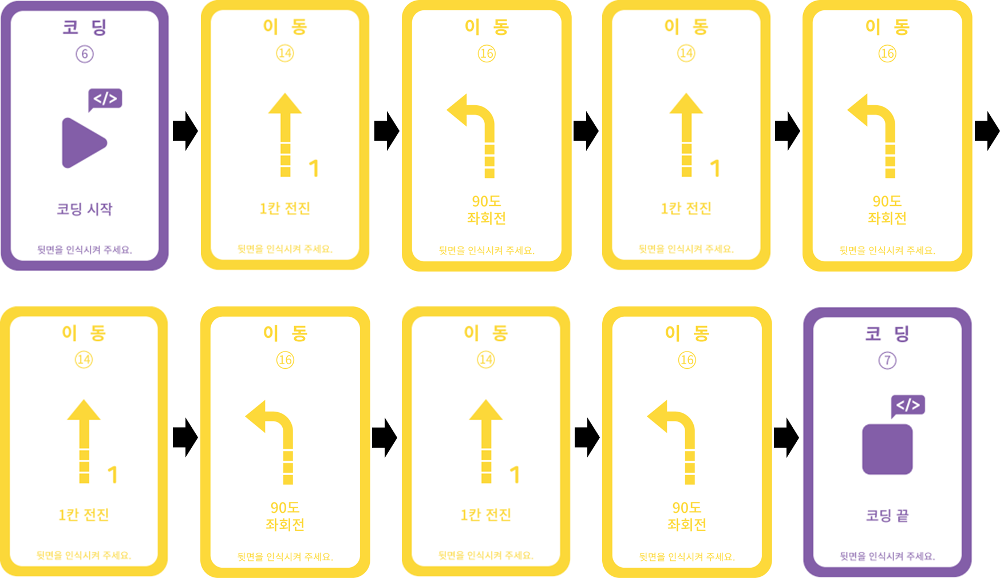
            </td>
        </tr>
    </table>

 

다음으로 반복문을 사용하여 코드를 만들어볼까요? 먼저 반복문이 무엇인지 알아봅시다.
 

    <table>
        <tr>
            <td>
                

                    알기 쉬운 코딩
                

            </td>
            <td>
                

                    반복문
                

            </td>
        </tr>
        <tr>
            <td>
                

                    
                

            </td>
            <td>
                

                    반복문이란 코딩의 주요 문법 중 하나로서 동일하거나 비슷한 명령을 반복할 때 사용합니다.  반복문을 사용하면 코드의 길이를 줄여줘서 코드를 이해하기 쉽게 해줄 뿐만 아니라, 좀 더 다양하고 효율적인 코딩 구현이 가능합니다.  
                    반복문에는 특정 조건이 만족할 때까지 반복하기, 지정한 횟수만큼 반복하기, 무한 반복하기 등 여러 종류가 있는데, GoCar의 카드코딩에서는 지정한 횟수만큼 반복하기와 무한 반복하기가 가능합니다.
                

            </td>
        </tr>
    </table>

 

카드코딩에서 기본적으로 제공되는 반복문은 총 4가지입니다.

 

    <table>
        <tr>
            <td>
                
① 무한 반복

            </td>
            <td>
                
② 2회 반복

            </td>
            <td>
                
③ 3회 반복

            </td>
            <td>
                
④ 4회 반복

            </td>
        </tr>
        <tr>
            <td>
                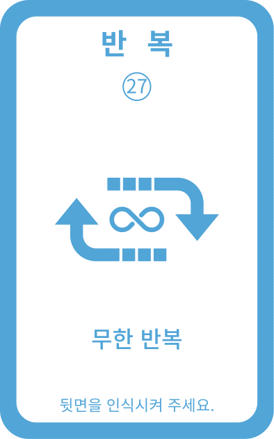
            </td>
            <td>
                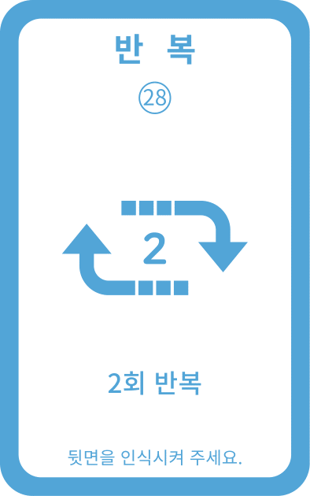
            </td>
            <td>
                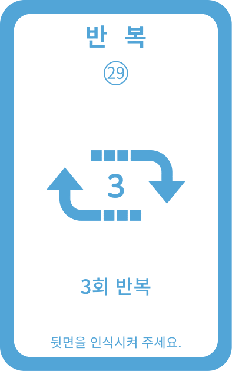
            </td>
            <td>
                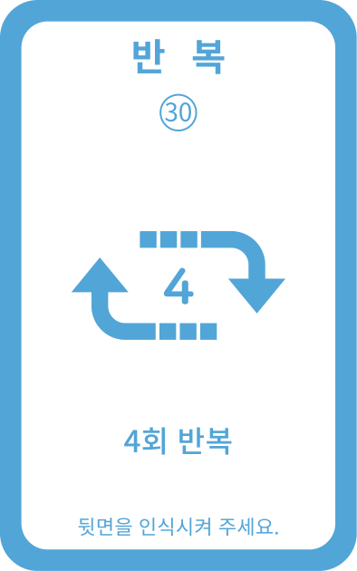
            </td>
        </tr>
    </table>

 

반복문을 사용하는 방법은 다음과 같습니다.

 

    <table>
        <tr>
            <td>
                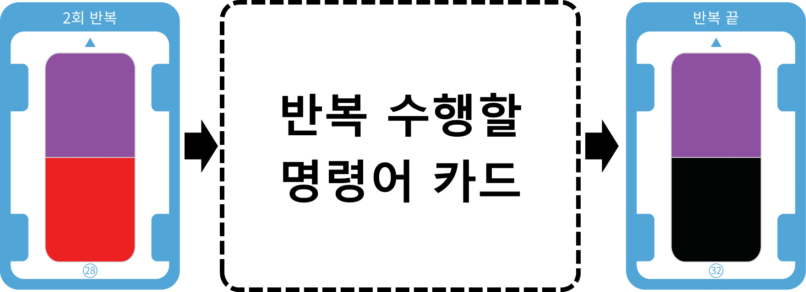
            </td>
        </tr>
        <tr>
            <td>
                
☞ 반복 시작 카드(무한 반복, 2회 반복, 3회 반복, 4회 반복)와 반복 끝 사이에 반복 수행할 명령어 카드들을 차례대로 읽어주면 반복 명령이 입력됩니다.

            </td>
        </tr>
    </table>

 
그럼 이제 반복문을 사용하여 사각형 패턴 주행 코드를 만들어보아요. 반복문을 사용하지 않은 코드와 어떻게 달라지는지 비교해보아요.
 

 

<h2>2. 사각형 패턴 비행(반복문 사용)</h2>

    <table>
        <tr>
            <td>
                
동작 순서

            </td>
            <td>
                
시작 → (1칸 전진 → 90도 좌회전) x 4 → 끝

            </td>
        </tr>
        <tr>
            <td>
                
카드 순서

            </td>
            <td>
                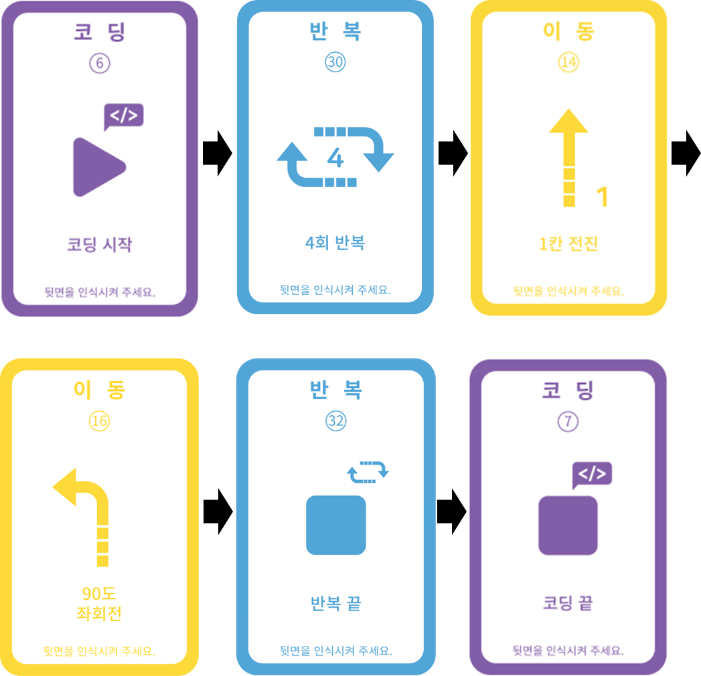
            </td>
        </tr>
    </table>

 

반복문을 사용하지 않은 코드보다 많이 단순화된 것을 알 수 있죠?  
이처럼 특정 명령을 반복하는 동작을 수행할 때 반복문을 사용하면 코드를 좀 더 간결하고 쉽게 만들 수 있습니다. 이제 코드를 실행해볼까요?

---

 

    <h1>[코딩 및 실행하기]</h1>

 

<h2>1. 사각형 패턴 비행(반복문 미사용)</h2>

 

    <table>
        <tr>
            <td> 
<b><h3>1단계 코딩카드 준비하기</h3> </b>
</td>
        </tr>
        <tr>
            <td>
                

                    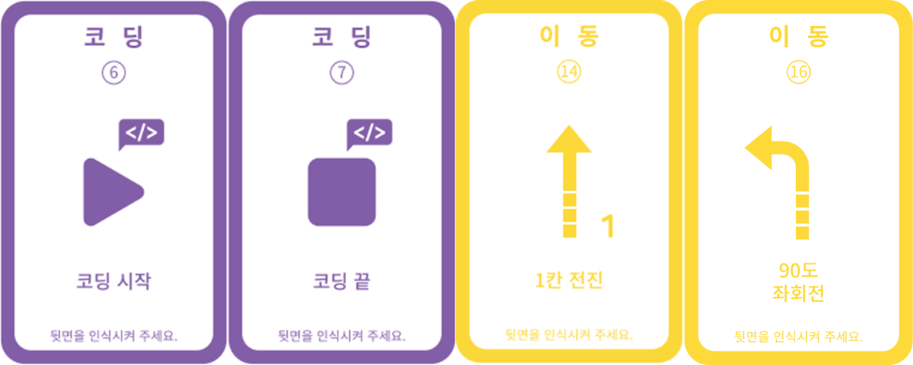 
                    카드코딩에 필요한 코딩카드들을 준비해보아요 
                    <b>※ “카드코딩 모드” 카드는 생략</b>
                

            </td>
        </tr>
        <tr>
            <td>
<b> <h3>2단계 코딩카드 배열하기</h3> 
            (1칸 전진 → 90도 좌회전) x 4번 반복</b>
</td>
        </tr>
        <tr>
            <td>
                

                    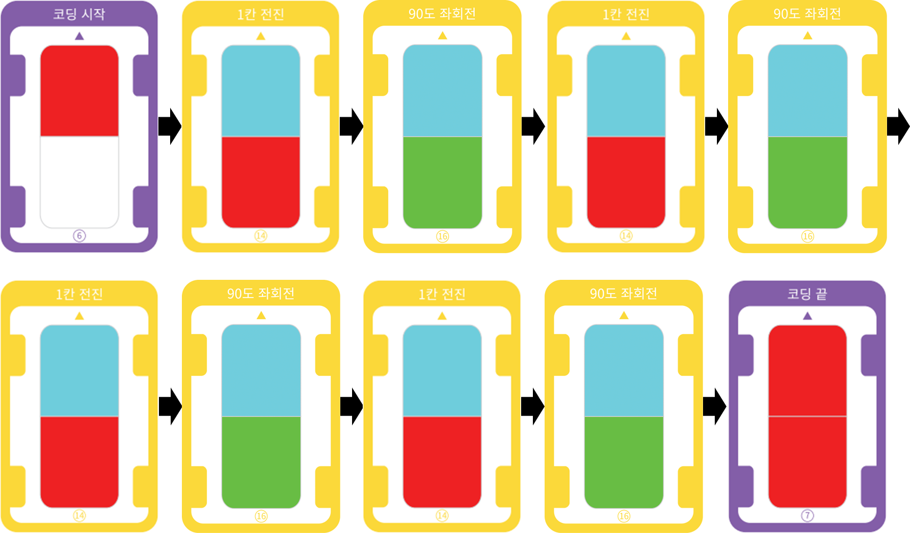 
                    동작 순서에 맞게 카드를 배열해 보아요. 코딩의 시작과 끝에는 항상 “코딩시작”과 “코딩끝” 카드가 온다는 것을 잊지 마세요
                

            </td>
        </tr>
        <tr>
            <td>
<b> <h3>3단계 코딩카드 읽기</h3> </b>
</td>
        </tr>
        <tr>
            <td>
                

                    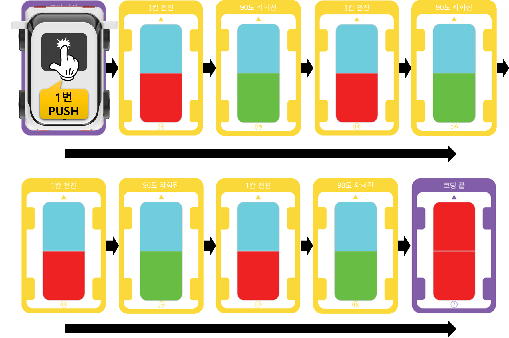 
                    GoCar의 전원을 켜고 코딩카드를 읽습니다.  코딩카드가 잘 읽히도록 올바른 위치에 GoCar를 올려놓고 카드 순서대로 메인 전등 부분을 1번 눌러서 카드를 읽어주세요.  만약, 중간에 카드를 잘못 읽었다면 처음부터(=”코딩시작” 카드부터) 다시 시작합니다.  
                

            </td>
        </tr>
        <tr>
            <td>
<b> <h3>4단계 코딩 실행하기</h3> </b>
</td>
        </tr>
        <tr>
            <td>
                

                    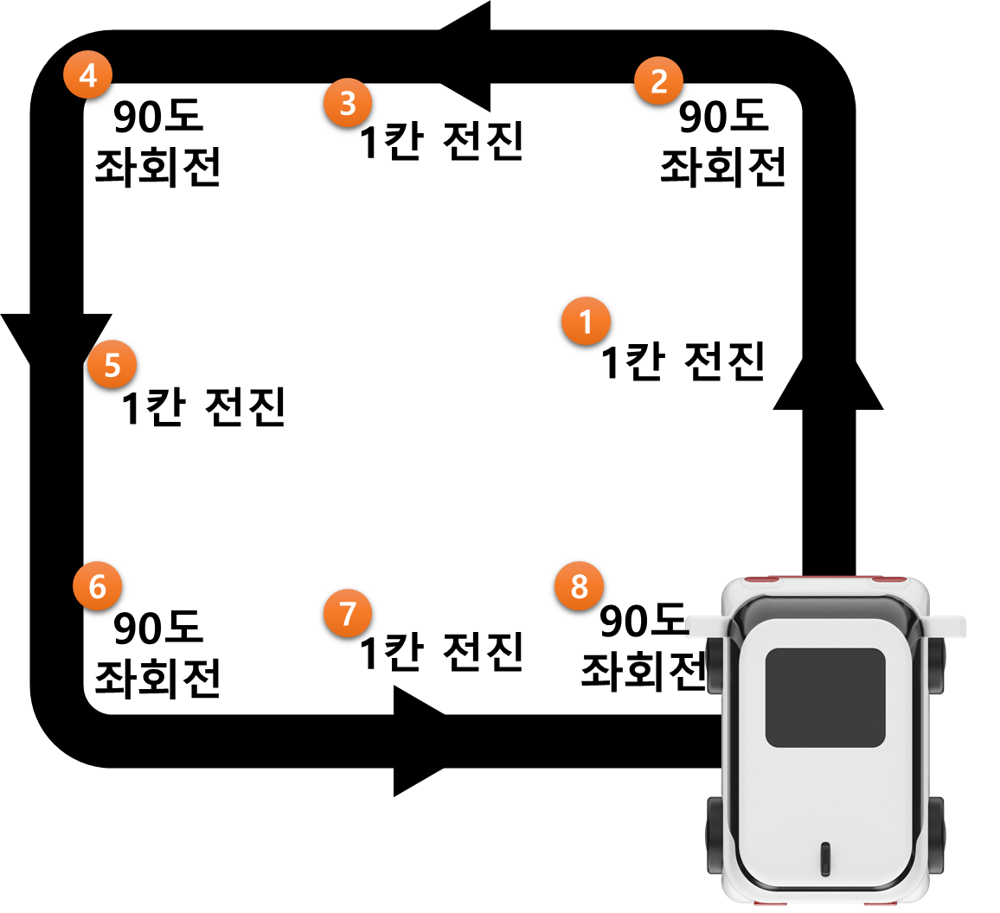 
                    GoCar를 평평한 바닥에 놓고 메인 전등 부분을 연속으로 2번 눌러서 코딩을 실행합니다.  약 3초 후 GoCar가 자동으로 코딩한 명령을 수행합니다.  GoCar가 잘 주행할 수 있도록 매끄럽고 평평한 바닥에서 실행해주세요.  
                

            </td>
        </tr>
    </table>

 

다음은 반복문을 사용한 코드를 실행해보아요.

 

<h2>2. 사각형 패턴 비행(반복문 사용)</h2>

 

    <table>
        <tr>
            <td>
<b> <h3>1단계 코딩카드 준비하기</h3> </b>
</td>
        </tr>
        <tr>
            <td>
                

                    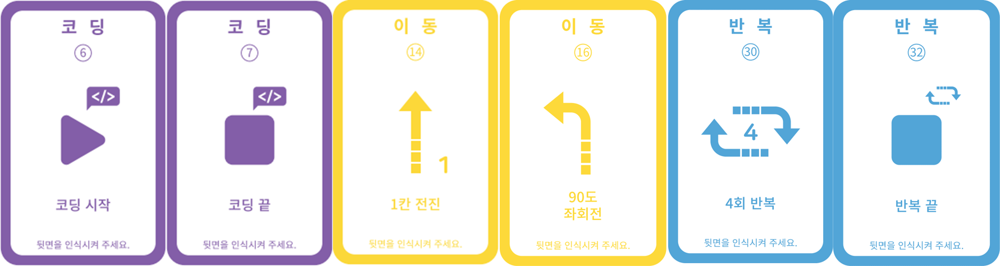 
                    카드코딩에 필요한 코딩카드들을 준비해보아요. 
                    <b>※ “카드코딩 모드” 카드는 생략</b>
                

            </td>
        </tr>
        <tr>
            <td>
<b> <h3>2단계 코딩카드 배열하기</h3>  
            동작순서 : (1칸 전진 → 90도 좌회전) x 4번 반복  </b>
</td>
        </tr>
        <tr>
            <td>
                

                    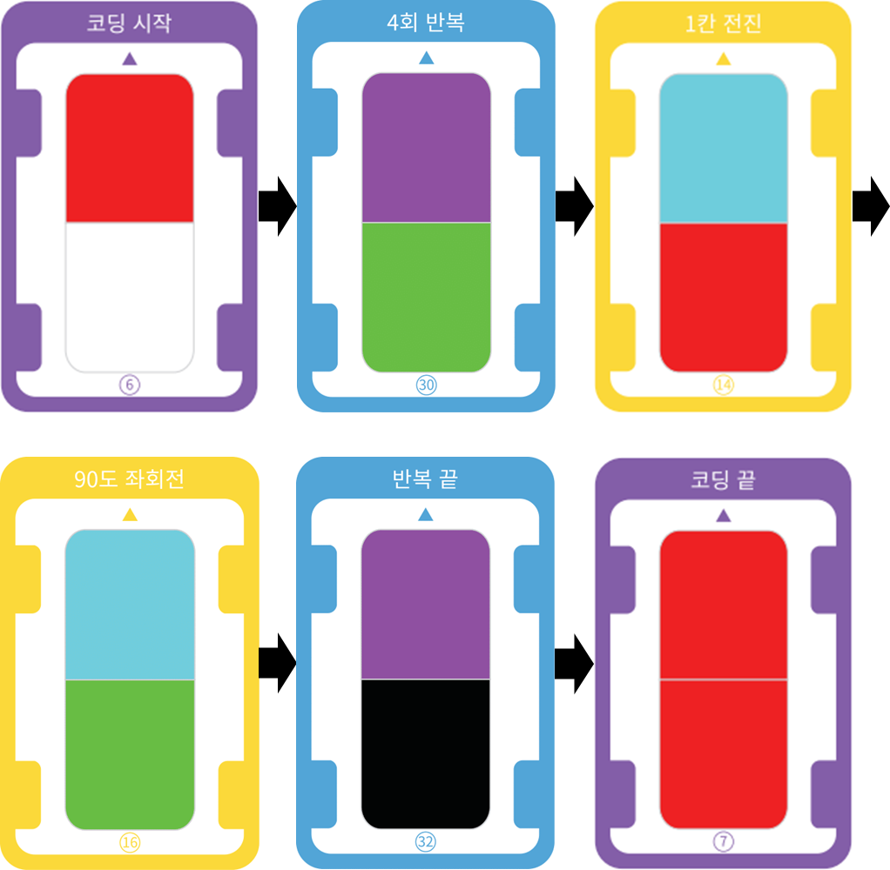 
                    동작 순서에 맞게 카드를 배열해 보아요. 코딩의 시작과 끝에는 항상 “코딩시작”과 “코딩끝” 카드가 온다는 것을 잊지 마세요!
                

            </td>
        </tr>
        <tr>
            <td>
<b> <h3>3단계 코딩카드 읽기</h3> </b>
</td>
        </tr>
        <tr>
            <td>
                

                    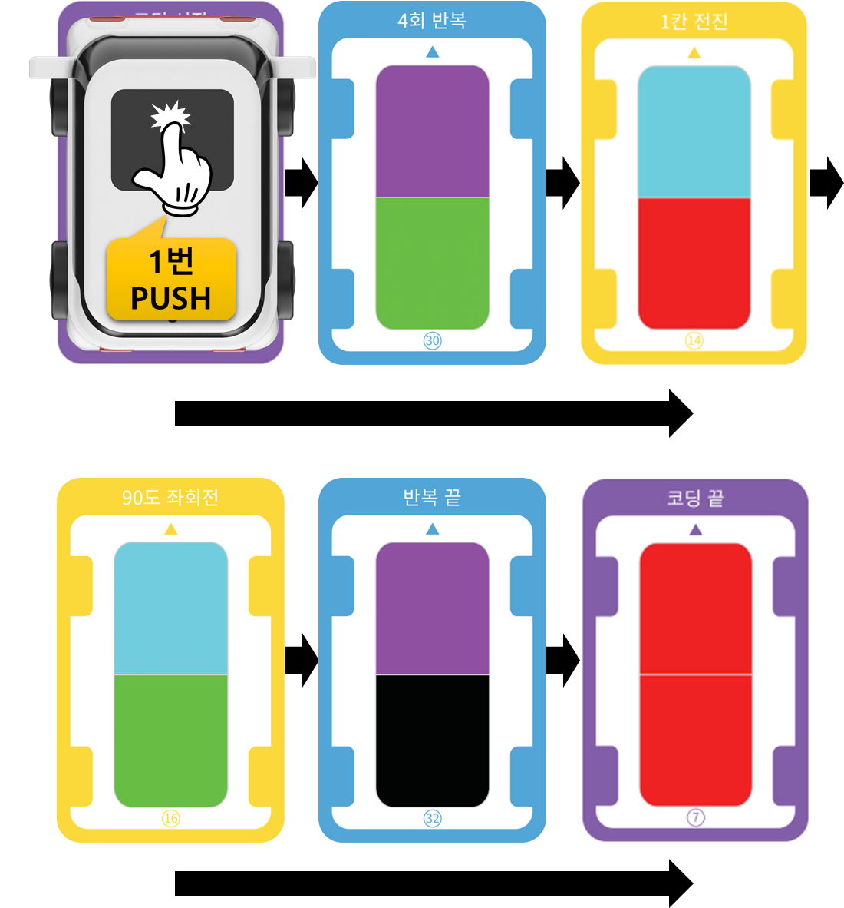 
                    GoCar의 전원을 켜고 코딩카드를 읽습니다.  코딩카드가 잘 읽히도록 올바른 위치에 GoCar를 올려놓고 카드 순서대로 메인 전등 부분을 1번 눌러서 카드를 읽어주세요.  만약, 중간에 카드를 잘못 읽었다면 처음부터(=”코딩시작” 카드부터) 다시 시작합니다.  
                

            </td>
        </tr>
        <tr>
            <td>
<b> <h3>4단계 코딩 실행하기</h3> </b>
</td>
        </tr>
        <tr>
            <td>
                

                     
                    GoCar를 평평한 바닥에 놓고 메인 전등 부분을 연속으로 2번 눌러서 코딩을 실행합니다. 
                    약 3초 후 GoCar가 자동으로 코딩한 명령을 수행합니다.  
                    GoCar가 잘 주행할 수 있도록 매끄럽고 평평한 바닥에서 실행해주세요. 
                

            </td>
        </tr>
    </table>

 

---

 

    <h1>[정리하기]</h1>

 

이번 강의에서는 GoCar로 사각형 패턴 주행하는 코딩을 해보았습니다.  
사각형 외에 다른 패턴들도 어떻게 코드를 짜야 할지 고민해보고 코딩해서 주행시켜보아요.  
반복되는 패턴은 반복문을 활용하면 더욱 쉽게 코드를 만들 수 있다는 것을 꼭 알아 두어요.

1. 패턴주행이란 특정한 형태의 루트로 주행하는 것을 말하는데, 사각형, 원형, 8자 모양 등을 예로 들 수 있습니다.

2. 패턴주행은 루트가 정형화되어 있기 때문에 일부 패턴이 반복되는 경우가 있는데, 이 경우에는 반복 카드를 사용할 수 있습니다.

3. 코딩에서 반복문을 활용하면 코드를 좀 더 간결하게 만들 수 있어서 코딩을 더욱 쉽게 할 수 있습니다.

 

---

### [코딩카드로 자율주행해요](../)

 1. [GoCar와 친구해요!](../lesson1)
 2. [GoCar로 카드코딩해요(1)](../lesson2)
 3. **GoCar로 카드코딩해요(2)**
 4. [GoCar로 카드코딩해요(3)](../lesson4)
 5. [GoCar로 카드코딩해요(4)](../lesson5)
 6. [GoCar로 라인코딩해요](../lesson6)
 7. [GoCar로 모션코딩해요] - 7월 둘째주(~7/10) 업데이트 예정
 8. [GoCar로 따라가기해요] - 7월 셋째주(~7/17) 업데이트 예정

---

Modified : 2020.6.26