 

    <h1>Lesson 4. GoCar로 카드코딩해요(3)</h1>

 

---

 

    <h1>[들어가기]</h1>

 

로봇은 여러 가지 센서들이 장착되어 있습니다.  
이러한 센서들이 정보를 수집하여 로봇에게 상태를 알려주면 로봇은 상황에 맞게 동작하게 됩니다.  
GoCar에도 전방 장애물 감지 센서(적외선 센서), 컬러 센서, 자세 센서 등 첨단 센서들이 장착되어 다양한 기능을 수행합니다.

 

    <table>
        <tr>
            <td>
                
센서(Sensor)란?

            </td>
        </tr>
        <tr>
            <td>
                
▶	센서(Sensor)란 무언가를 느끼고, 그 감각으로부터 무언가를 알아내는 것을 의미합니다. <b>빛, 소리, 화학물질, 온도 등과 같이 감각과 관련된 신호들을 수집하여 이 신호들을 과학적인 방법으로 분석하고 상태를 알아내는 장치</b>를 통틀어서 센서라고 합니다.  

▶	센서는 우리 일상생활 속에서 다양하게 사용되고 있습니다. 예를 들어, 사람이 자동문 앞에 서면 센서가 이를 알아내어 문이 열리도록 신호를 보냅니다. 그리고 갑자기 불이 나면 센서가 이를 알아내어 소화 장치가 작동하도록 신호를 보내는 것 모두 센서가 사용되는 경우입니다.  

▶	GoCar에 사용되는 센서들은 장애물 감지(적외선) 센서, 컬러 센서, 자세 센서(가속도, 자이로스코프) 등이 있습니다.  
①	장애물 감지(적외선) 센서 : 적외선을 이용하여 센서와 장애물까지의 거리를 측정할 수 있고, 장애물을 감지하면서 주행하는 자율주행이 가능합니다. 
②	컬러 센서 : 코딩카드의 색상을 인식하여 카드코딩을 할 수 있고, 검은색 또는 흰색 라인을 따라 주행할 수 있습니다. 
③	자세 센서 : GoCar가 정확한 방향으로 주행할 수 있고, GoCar의 기울임에 따라 명령을 줄 수 있는 모션코딩이 가능합니다. 

            </td>
        </tr>
        <tr>
            <td>여러가지 센서
            </td>
        </tr>
        <tr>
            <td>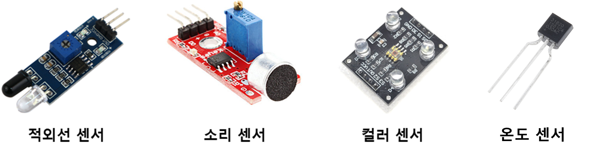
            </td>
        </tr>
    </table>

 

이번 강의에서는 GoCar의 다양한 센서 중에서 전방 장애물 감지(적외선) 센서를 이용하여 장애물을 피해서 주행하는 코딩을 해보려고 합니다.  
센서를 활용한 코딩은 조건문이란 명령어를 사용해야 하는데, 특정 조건에서 어떻게 동작하라는 명령을 줄 수 있습니다.  
코딩카드가 많이 사용되어 어렵게 느껴질 수 있지만 차근차근 따라해보면 쉽게 해낼 수 있을 거예요.  
그럼 시작해볼까요?

 

---

 

    <h1>[코드 생각하기]</h1>

 

GoCar는 다음과 같이 동작합니다. 만약 전방에 장애물이 있으면 U턴을 하고, 장애물이 없으면 1칸 전진합니다.

    <table>
        <tr>
            <td>
                
① 만약 전방에 장애물이 있으면 U턴하기

            </td>
        </tr>
        <tr>
            <td>
                
② 만약 전방에 장애물이 없으면 1칸 전진하기

            </td>
        </tr>
    </table>

 

장애물의 유무에 따라 동작을 다르게 하는 조건문이 사용되었어요. 그럼 먼저 조건문이 무엇인지 알아볼까요?
 

    <table>
        <tr>
            <td>
                

                    알기 쉬운 코딩
                

            </td>
            <td>
                

                    조건문
                

            </td>
        </tr>
        <tr>
            <td>
                

                    
                

            </td>
            <td>
                

                    조건문이란 코딩의 주요 문법 중 하나로서 특정 조건을 주고 그 조건에 따라 서로 다른 명령을 수행해야할 때 사용합니다.  
                    우리가 흔히 “만약 ~라면, ~하겠다”란 말을 자주 사용하는데, 바로 이러한 상황을 코딩으로 표현한 것이라고 보면 됩니다.  
                    주어진 조건이 참인지 거짓인지 판단하여 참이면 명령A를 거짓이면 명령B를 수행할 수 있게 할 수 있습니다.  또한, 참과 거짓 2가지 경우로만 구분하지 않고 여러가지 경우에 따라 서로 다른 명령을 줄 수도 있습니다.
                

            </td>
        </tr>
    </table>

 

조건문을 사용하는 방법은 다음과 같습니다.

 

    <table>
        <tr>
            <td>
                <b>1. 조건이 참인 경우에만 특정 명령 수행</b>
            </td>
        </tr>
        <tr>
            <td>
                
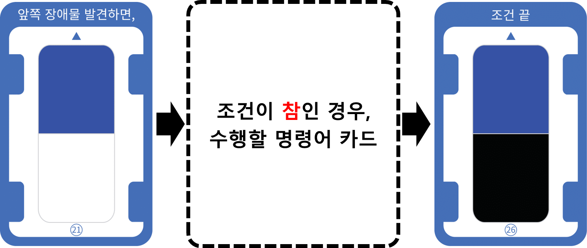

            </td>
        </tr>
        <tr>
            <td>
                <b>2. 조건이 참인 경우와 거짓인 경우 모두 특정 명령 수행</b>
            </td>
        </tr>
        <tr>
            <td>
                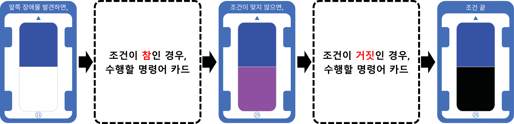
            </td>
        </tr>
        <tr>
            <td>
                ☞	조건이 참인 경우에만 특정 명령을 수행하고 싶으면 조건 시작 카드와 조건 끝 카드 사이에 수행할 명령어 카드를 읽습니다.  그리고 조건이 참인 경우와 거짓인 경우 각각 다른 명령을 수행하고 싶으면 <b>“조건이 맞지 않으면,”</b> 카드를 사용하여 구분해줍니다. 그래서 조건 시작 카드와 조건이 맞지 않으면 카드 사이에는 참인 경우에 수행할 명령어 카드를, 조건이 맞지 않으면 카드와 조건 끝 카드 사이에는 거짓인 경우에 수행할 명령어 카드를 읽습니다.  항상 마지막엔 <b>“조건 끝”</b> 카드를 읽어줘야 한다는 것을 잊지마세요!
            </td>
        </tr>
    </table>

 
조건문 사용법을 알았다면 이제 어떻게 코드를 짜야 할지 생각해볼까요?
 

    <table>
        <tr>
            <td>
                
동작 순서

            </td>
            <td>
                
시작 → (앞쪽 장애물을 발견하면) U턴 / (조건이 맞지 않으면) 1칸 전진 → 끝

            </td>
        </tr>
        <tr>
            <td>
                
카드 순서

            </td>
            <td>
                

                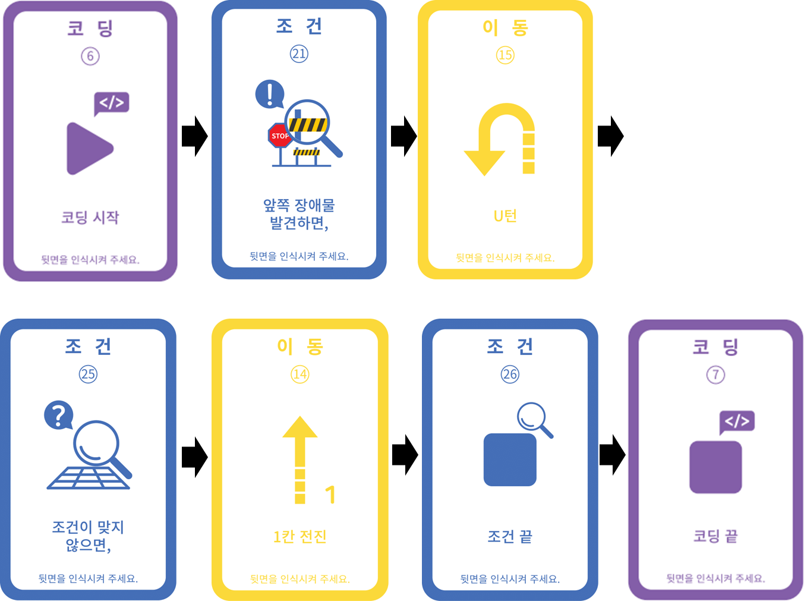 
                <b>※ “카드코딩 모드” 카드는 생략</b>
                

            </td>
        </tr>
    </table>

 

조건 시작 카드(앞쪽 장애물 발견하면,)와 조건이 맞지 않으면 카드 사이에 U턴 카드를 사용하여 전방에 장애물이 있으면 U턴을 하도록 하였습니다.  
그리고 조건이 맞지 않으면 카드와 조건 끝 카드 사이에 1칸 전진 카드를 사용하여 전방에 장애물이 없으면 1칸 전진하도록 하였습니다.

---

 

    <h1>[코딩 및 실행하기]</h1>

 

    <table>
        <tr>
            <td> 
<b><h3>1단계 코딩카드 준비하기</h3> </b>
</td>
        </tr>
        <tr>
            <td>
                

                    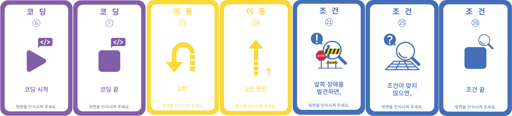 
                    카드코딩에 필요한 코딩카드들을 준비해보아요 
                    <b>※ “카드코딩 모드” 카드는 생략</b>
                

            </td>
        </tr>
        <tr>
            <td>
<b> <h3>2단계 코딩카드 배열하기</h3> 
            (앞쪽 장애물을 발견하면) U턴 / (조건이 맞지 않으면) 1칸 전진 </b>
</td>
        </tr>
        <tr>
            <td>
                

                    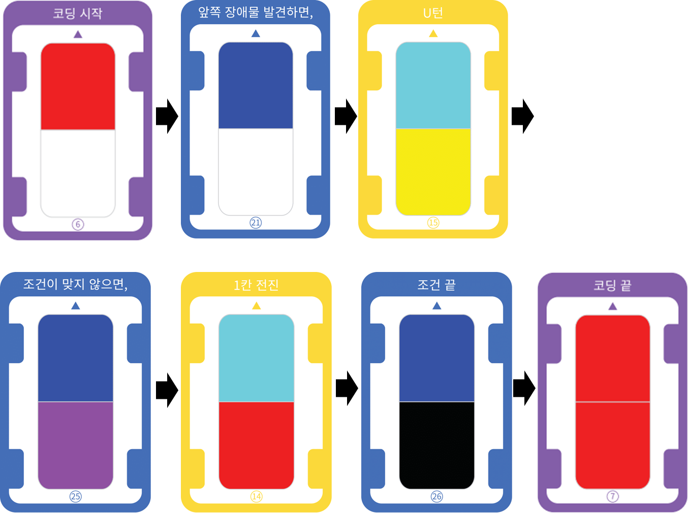 
                    동작 순서에 맞게 카드를 배열해 보아요. 코딩의 시작과 끝에는 항상 “코딩시작”과 “코딩끝” 카드가 온다는 것을 잊지 마세요
                

            </td>
        </tr>
        <tr>
            <td>
<b> <h3>3단계 코딩카드 읽기</h3> </b>
</td>
        </tr>
        <tr>
            <td>
                

                    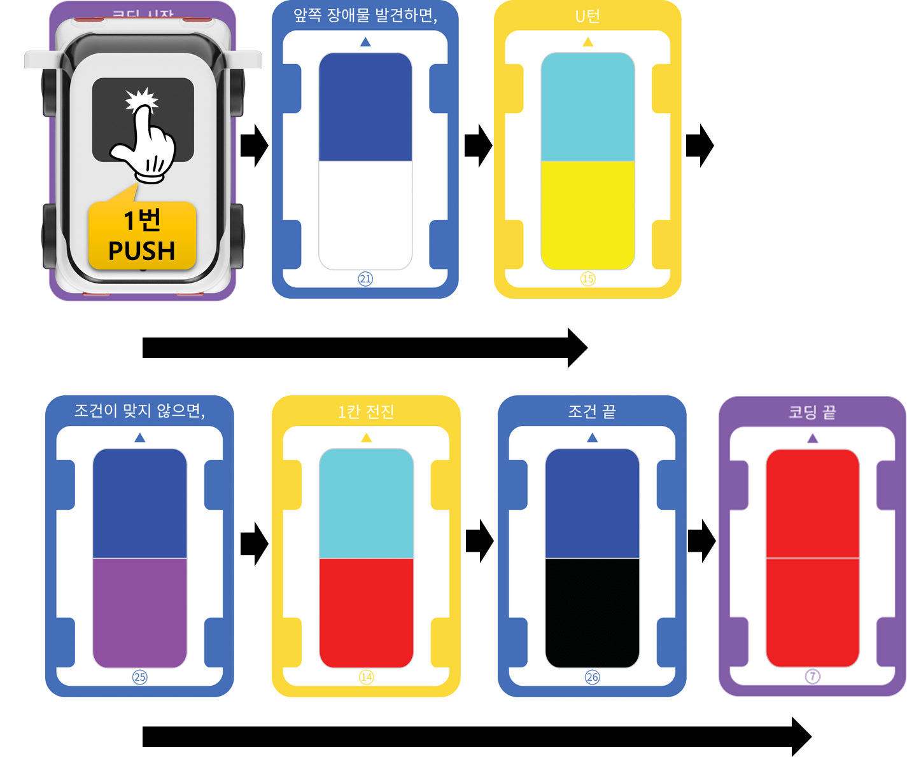 
                    GoCar의 전원을 켜고 코딩카드를 읽습니다.  코딩카드가 잘 읽히도록 올바른 위치에 GoCar를 올려놓고 카드 순서대로 메인 전등 부분을 1번 눌러서 카드를 읽어주세요.  만약, 중간에 카드를 잘못 읽었다면 처음부터(=”코딩시작” 카드부터) 다시 시작합니다.  
                

            </td>
        </tr>
        <tr>
            <td>
<b> <h3>4단계 코딩 실행하기</h3> </b>
</td>
        </tr>
        <tr>
            <td>
                

                    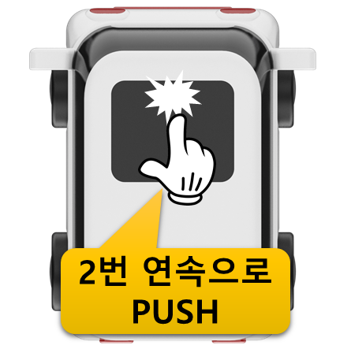 
                    ① 만약 전방에 장애물이 있으면 
                    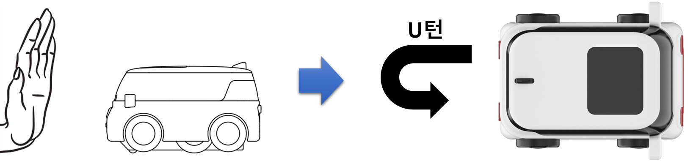 
                    ② 만약 전방에 장애물이 없으면 
                    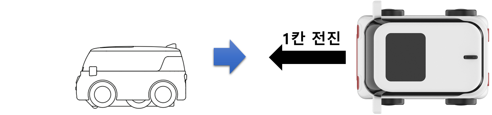 
                    GoCar를 평평한 바닥에 놓고 메인 전등 부분을 연속으로 2번 눌러서 코딩을 실행합니다.  약 3초 후 GoCar가 자동으로 코딩한 명령을 수행합니다.  GoCar가 잘 주행할 수 있도록 매끄럽고 평평한 바닥에서 실행해주세요.  
                    ① GoCar 앞에 손바닥이나 종이 등을 대서 장애물을 인식할 수 있도록 해주세요. 그 상태에서 코딩을 실행하면 GoCar가 장애물을 인식하여 U턴합니다. 
② GoCar 앞에 아무것도 없는 상태에서 코딩을 실행합니다. GoCar가 장애물이 없음을 인지하고 1칸 전진합니다. 
<b>※ GoCar와 장애물 사이의 거리는 약 10cm 이내로 해주세요.</b>
                

            </td>
        </tr>
    </table>

 

GoCar의 센서를 활용하여 코딩을 해보니 더 신기하고 재미있죠? 그런데 너무 금방 끝나버렸나요? 

그렇다면 한 단계 응용된 코딩을 해볼까요?  
지난 강의에서 배운 반복문을 사용하여 장애물 유무를 계속 확인하면서 자율주행하는 코딩을 해보도록 해요. 다음과 같이 코드를 만들어서 읽고 실행합니다.

 

    <table>
        <tr>
            <td>
                

                    <b> <h3>장애물 회피 자율주행 코드(무한반복, 반복문과 조건문을 함께 사용)</h3> </b>
                

            </td>
        </tr>
        <tr>
            <td>
                

                    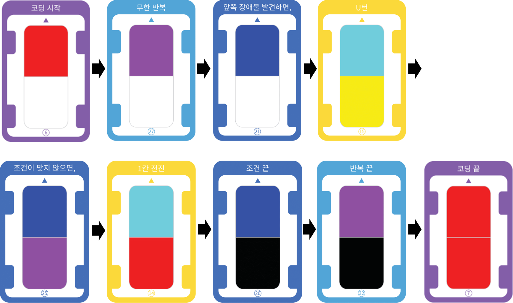 
                        

                        위 코드를 실행하면 GoCar는 다음과 같이 동작합니다. 
                        실행 후 전방에 장애물이 있는지 확인하여 있으면 U턴, 없으면 1칸 전진을 반복적으로 수행합니다. 
                        그래서 장애물을 피해서 주행하는 자율주행을 직접 체험해볼 수 있습니다.  
                        <b>[꼭 알아두세요!]</b> 
                        ①반복문과 조건문을 함께 사용할 경우에는 반복문 안에 조건문이 들어가 있는 구조로 코딩합니다. 
                        그래서 반복적으로 조건의 참과 거짓을 확인하여 결과에 맞는 동작을 수행할 수 있습니다.
                        

                

            </td>
        </tr>
        <tr>
            <td>
                
<b> <h3>반복문과 조건문 사용 예시</h3></b>  
                

            </td>
        </tr>
        <tr>
            <td>
                

                    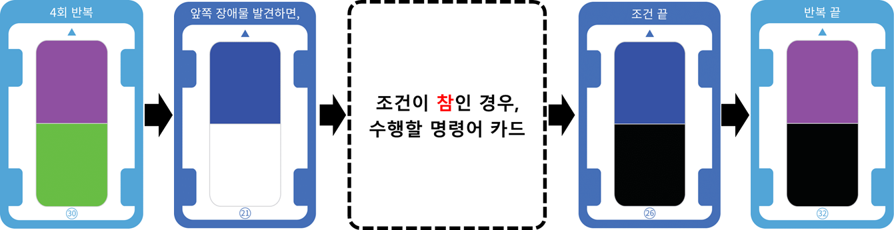 
                    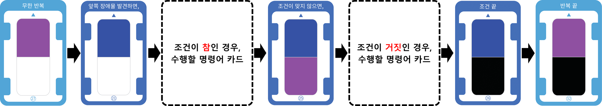 
                        
②	코드를 실행하면 무한 반복되므로 종료가 되지 않습니다.  
                        코딩을 종료하고 GoCar의 주행을 멈추기 위해서는 강제 종료를 시켜야 합니다.  
                        강제 종료시키는 방법은 GoCar를 손으로 잡고 들어서 뒤집으면 모터가 회전을 멈추면서 종료됩니다.  
                        이러한 강제 종료 방법은 주행 중인 모든 경우에 사용할 수 있습니다.
                        

                

            </td>
        </tr>
    </table>

 

---

 

    <h1>[더 알아보기]</h1>

 

GoCar의 하부에는 색상을 인식할 수 있는 컬러센서가 2개 장착되어 있는데, 이 컬러센서를 이용하여 코딩카드를 읽고 코딩을 할 수 있습니다.  이러한 컬러센서도 전방 장애물 감지 센서처럼 조건문을 사용한 카드코딩이 가능합니다. 다음 코드를 보고 GoCar가 어떻게 동작할지 생각해보아요.

 

    <table>
        <tr>
            <td>
<b> <h3>컬러센서를 활용한 카드코딩 예제</h3> </b>
</td>
        </tr>
        <tr>
            <td>
                

                    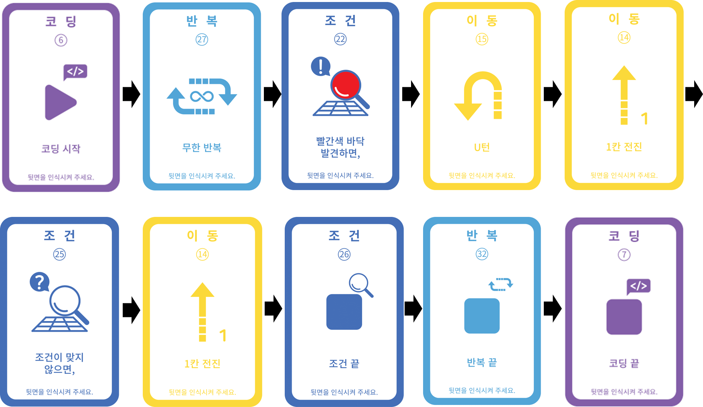 
                

            </td>
        </tr>
    </table>

 
위 코드를 실행하면 다음과 같이 동작합니다.  
현재 GoCar가 있는 바닥면의 색상이 무엇인지 확인하여 만약 빨간색이면 U턴 후 1칸 전진하고, 빨간색이 아니면 1칸 전진만 합니다. 
그리고 이 동작을 무한 반복합니다. 

<b>무한 반복하기</b>

    <table>
        <tr>
            <td>
                
만약 바닥 색상이 빨간색이면 U턴 후 1칸 전진하기

            </td>
        </tr>
        <tr>
            <td>
                
만약 바닥 색상이 빨간색이 아니면 1칸 전진하기

            </td>
        </tr>
    </table>

 

    <table>
        <tr>
            <td>
                
<b>① 만약 바닥 색상이 빨간색이면</b>

            </td>
        </tr>
        <tr>
            <td>
                
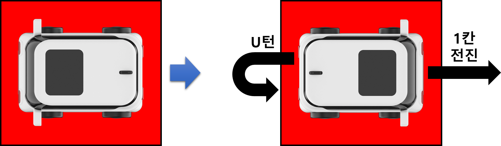

            </td>
        </tr>
        <tr>
            <td>
                
<b>② 만약 바닥 색상이 빨간색이 아니면</b>

            </td>
        </tr>
        <tr>
            <td>
                
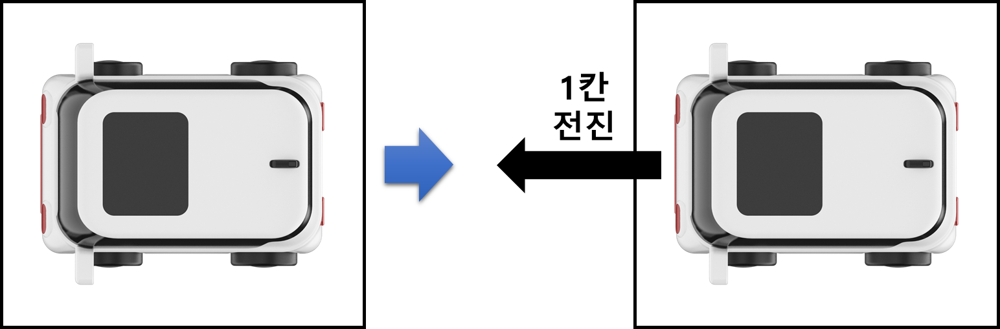

            </td>
        </tr>
    </table>

 

빨간색 외에도 녹색과 파란색 조건 카드가 기본적으로 제공됩니다.  
빨간색, 녹색, 파란색이 그려진 활동판을 만들어서 길찾기, 장애물 피해서 목적지 찾아가기 등 다양한 활동을 즐길 수 있습니다. 

 

    <table>
        <tr>
            <td>
                
<b>GoCar 활동판 예시</b>

            </td>
        </tr>
        <tr>
            <td>
                
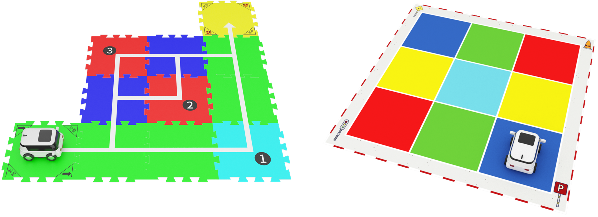

            </td>
        </tr>
    </table>

---

 

    <h1>[정리하기]</h1>

 

이번 강의에서는 GoCar의 센서를 활용한 코딩을 해보았습니다.  
GoCar의 전방에 있는 장애물 감지 센서로 장애물 유무를 확인하고 장애물을 피해서 주행할 수 있었습니다.  
이러한 센서 코딩이 바로 자동차 자율주행의 기초가 됩니다.  
또한, 조건 카드를 사용해보면서 조건문이 무엇이고 어떻게 사용해야 하는지 배워보았습니다.  
센서를 활용한 코딩을 하기 위해서는 조건 카드가 꼭 필요하다는 것을 잊지 말아요!

1. 센서(Sensor)란 빛, 소리, 화학물질, 온도 등과 같이 감각과 관련된 신호들을 수집하여 이 신호들을 과학적인 방법으로 분석하고 상태를 알아내는 장치입니다.
2. GoCar는 전방 장애물 감지 센서(적외선 센서), 컬러 센서, 자세 센서 등 첨단 센서들이 장착되어 다양한 기능을 수행합니다.

3. GoCar의 전방 장애물 감지 센서를 이용하여 전방에 장애물 유무를 확인하고 장애물을 피해서 자율주행하는 코딩을 할 수 있습니다.

4. 센서를 활용한 코딩을 하기 위해서는 조건 카드를 사용합니다.

5. 반복문과 조건문을 함께 사용하면 조건의 참, 거짓을 판단하고 동작하는 것을 반복적으로 수행할 수 있습니다.

6. 카드코딩 실행 중에 GoCar를 들어서 뒤집으면 모터가 회전을 멈춰 강제 종료시킬 수 있습니다.

 

---

### [코딩카드로 자율주행해요](../)

 1. [GoCar와 친구해요!](../lesson1)
 2. [GoCar로 카드코딩해요(1)](../lesson2)
 3. [GoCar로 카드코딩해요(2)](../lesson3)
 4. **GoCar로 카드코딩해요(3)**
 5. [GoCar로 카드코딩해요(4)] - 6월 넷째주(~6/26) 업데이트 예정
 6. [GoCar로 라인코딩해요] - 7월 첫째주(~7/3) 업데이트 예정
 7. [GoCar로 모션코딩해요] - 7월 둘째주(~7/10) 업데이트 예정
 8. [GoCar로 따라가기해요] - 7월 셋째주(~7/17) 업데이트 예정

---

Modified : 2020.6.19