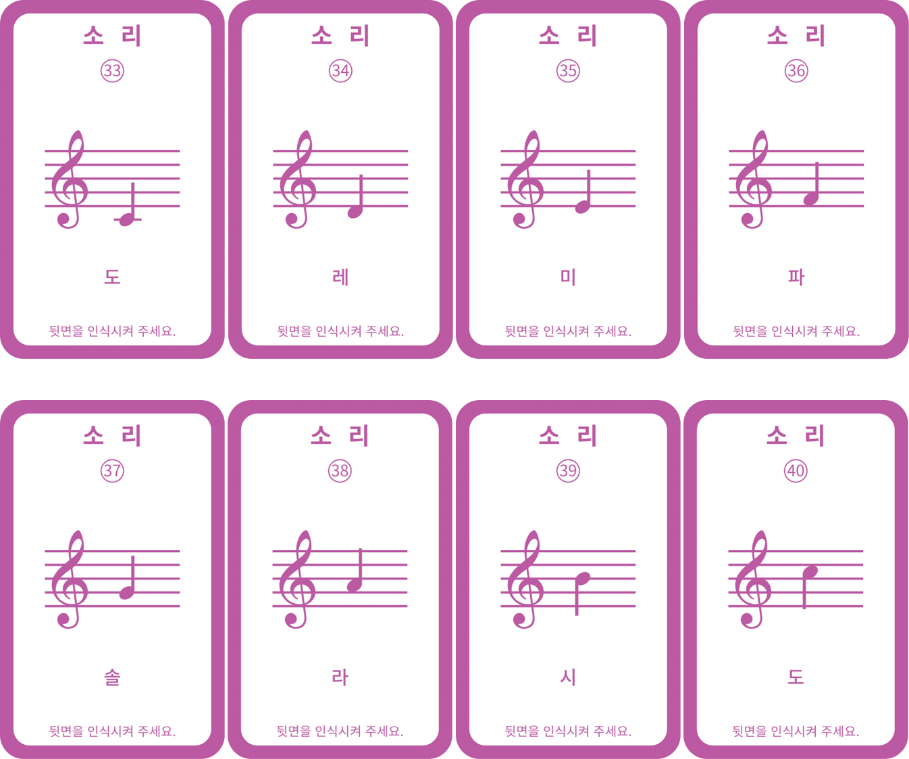

 

    <h1>Lesson 5. GoCar로 카드코딩해요(4)</h1>

 

---

 

    <h1>[들어가기]</h1>

 

GoCar에는 소리를 낼 수 있는 부저와 여러 가지 색상으로 빛을 낼 수 있는 LED가 장착되어 있습니다. 
이번 강의에서는 GoCar의 부저와 LED 등을 이용하여 다양한 효과를 내면서 주행하는 코딩을 해보려고 합니다. 
그럼 먼저 소리/라이트(Light)와 관련된 카드는 어떤 것들이 있는지 살펴보아요.

 

    <table>
        <tr>
            <td>
                
<b>소리 카드(총 8장)</b>

            </td>
        </tr>
        <tr>
            <td>
                

                    
                

            </td>
        </tr>
    </table>

 

    <table>
        <tr>
            <td>
                
<b>라이트 카드(총 4장)</b>

            </td>
        </tr>
        <tr>
            <td>
                

                    
                

            </td>
        </tr>
        <tr>
            <td>
                

                    
                

            </td>
        </tr>
        <tr>
            <td>
                

                    
                

            </td>
        </tr>
        <tr>
            <td>
                

                    
                

            </td>
        </tr>
    </table>

 

이제 주행하면서 여러가지 음을 연주하고 아름답게 빛나는 GoCar를 만나러 가볼까요?

 

---

 

    <h1>[코드 생각하기]</h1>

 

아래 주차 실습판을 활용하여 GoCar로 후진 주차하는 코딩을 해볼거예요. 후진 주차를 하면서 소리와 라이트 카드를 사용하여 효과를 줘보아요.

    <table>
        <tr>
            <td>
                
주차 실습판

            </td>
            <td>
                
 
                

            </td>
        </tr>
    </table>

 

먼저 실습판의 “START” 위치에서 “P(Parking)” 위치까지 GoCar를 이동시키려면 어떻게 코드를 짜야 할지 생각해보아요.  
<b>※	마지막 “P(Parking)” 위치는 후진하여 이동해야 합니다.</b> 
여러가지 방법이 있겠지만 다음과 같이 동작한다고 가정해서 코드를 만들어보았습니다.

 

    <table>
        <tr>
            <td>
                
동작 순서

            </td>
            <td>
                
1칸 전진 → 90도 우회전 → 1칸 전진 → 90도 좌회전 → 1칸 후진

            </td>
        </tr>
        <tr>
            <td>
                
카드 순서

            </td>
            <td>
                

                
                

            </td>
        </tr>
    </table>

 

이제 여러가지 효과를 추가해볼까요? 여기서는 회전할 때 깜빡이 라이트와 후진할 때 소리를 추가해볼 거예요.

 

    <table>
        <tr>
            <td>
                
동작 순서

            </td>
            <td>
                
1칸 전진 → 우회전 깜빡이 켜기 → 90도 우회전 → 1칸 전진 → 좌회전 깜빡이 켜기 → 90도 좌회전 → “솔파미레도” 음 재생 → 1칸 후진

            </td>
        </tr>
        <tr>
            <td>
                
카드 순서

            </td>
            <td>
                

                
                

            </td>
        </tr>
    </table>

 

    <table>
        <tr>
            <td>
                
알아두기

            </td>
        </tr>
        <tr>
            <td>
                
1. “우회전 깜빡이”, “좌회전 깜빡이” 명령은 실행하면 켜졌다가 3초 뒤 자동으로 꺼집니다. 
<b>※ “상향등 켜기” 명령은 실행하면 계속 켜져 있고, “전조등/상향등 끄기” 명령을 실행해야 꺼집니다.</b> 
2. 소리/라이트 명령은 다른 명령과 달리 실행 후 바로 다음 명령이 실행됩니다.  
그래서 소리/라이트 카드를 이동 카드 전에 사용하면 음을 재생하거나 라이트를 켠 상태에서 주행하는 것이 가능합니다. 
<b>※ 일반적으로 카드코딩이나 블록코딩은 순차 코딩이기 때문에 한가지 명령이 모두 완료된 후 다음 명령이 실행됩니다.</b>

            </td>
        </tr>
    </table>

 

---

 

    <h1>[코딩 및 실행하기]</h1>

 

    <table>
        <tr>
            <td> 
<b><h3>1단계 코딩카드 준비하기</h3> </b>
</td>
        </tr>
        <tr>
            <td>
                

                     
                    카드코딩에 필요한 코딩카드들을 준비해보아요 
                    <b>※ “카드코딩 모드” 카드는 생략</b>
                

            </td>
        </tr>
        <tr>
            <td>
<b> <h3>2단계 코딩카드 배열하기</h3> 
            1칸 전진 → 우회전 깜빡이 켜기 → 90도 우회전 → 1칸 전진 → 좌회전 깜빡이 켜기 → 90도 좌회전 → “솔파미레도” 음 재생 → 1칸 후진 </b>
</td>
        </tr>
        <tr>
            <td>
                

                     
                    동작 순서에 맞게 카드를 배열해 보아요. 코딩의 시작과 끝에는 항상 “코딩시작”과 “코딩끝” 카드가 온다는 것을 잊지 마세요
                

            </td>
        </tr>
        <tr>
            <td>
<b> <h3>3단계 코딩카드 읽기</h3> </b>
</td>
        </tr>
        <tr>
            <td>
                

                     
                    GoCar의 전원을 켜고 코딩카드를 읽습니다.  코딩카드가 잘 읽히도록 올바른 위치에 GoCar를 올려놓고 카드 순서대로 메인 전등 부분을 1번 눌러서 카드를 읽어주세요.  만약, 중간에 카드를 잘못 읽었다면 처음부터(=”코딩시작” 카드부터) 다시 시작합니다.  
                

            </td>
        </tr>
        <tr>
            <td>
<b> <h3>4단계 코딩 실행하기</h3> </b>
</td>
        </tr>
        <tr>
            <td>
                

                     
                    GoCar를 주차 실습판의 “START” 위치에 놓고 메인 전등 부분을 연속으로 2번 눌러서 코딩을 실행합니다.  약 3초 후 GoCar가 자동으로 코딩한 명령을 수행합니다.  GoCar가 “P(Parking)” 위치까지 잘 이동하는지 확인합니다.  만약 “P(Parking)” 위치까지 이동하지 않으면 어떤 부분이 잘못됐는지 확인하여 수정 후 재실행합니다. 
                

            </td>
        </tr>
    </table>

 

GoCar가 우회전, 좌회전할 때 깜빡이가 켜지는 것을 보았나요? 그리고 후진 주차를 시작할 때 “솔파미레도” 음계 소리를 들었나요?  

GoCar가 소리, 라이트 효과와 함께 주행하니까 좀 더 실제 자동차처럼 느껴지지 않나요? 소리와 라이트 카드를 사용하여 더욱 다이내믹한 코딩을 즐겨보아요. 

그리고 다른 후진 주차 방법이 있는지 생각해보고, 그 방법으로도 코딩하여 실행해보아요.

 

---

 

    <h1>[정리하기]</h1>

 

이번 강의에서는 소리와 라이트 카드를 사용하여 GoCar가 음계를 연주하고 좌우 깜빡이 LED를 켜면서 주행하는 코딩을 해보았습니다.  그리고 주차 실습판을 활용하여 후진 주차 주행을 해보면서 현실에서 사용하는 주행 기술을 코딩으로 구현해보기도 하였습니다.  GoCar가 점점 진짜 자동차처럼 느껴지지 않나요? 
주차 실습판처럼 다양한 활동판을 만들어서 코딩 학습도 하고 여러가지 주행 기술도 배우면 좋을 것 같아요.

1. GoCar에는 소리를 낼 수 있는 부저와 여러 가지 색상으로 빛을 낼 수 있는 LED가 장착되어 있습니다.

2. 소리와 라이트(Light) 카드를 사용하여 GoCar가 음계를 연주하고 라이트를 켜면서 주행하는 코딩을 할 수 있습니다.

3. 소리와 라이트 명령은 실행 후 바로 다음 명령이 실행되어, 이동 명령 전에 사용하면 음을 재생하거나 라이트를 켠 상태에서 주행이 가능합니다.

 

---

### [코딩카드로 자율주행해요](../)

 1. [GoCar와 친구해요!](../lesson1)
 2. [GoCar로 카드코딩해요(1)](../lesson2)
 3. [GoCar로 카드코딩해요(2)](../lesson3)
 4. [GoCar로 카드코딩해요(3)](../lesson4)
 5. **GoCar로 카드코딩해요(4)**
 6. [GoCar로 라인코딩해요](../lesson6)
 7. [GoCar로 모션코딩해요](../lesson7)
 8. [GoCar로 따라가기해요](../lesson8)

---

Modified : 2020.6.26