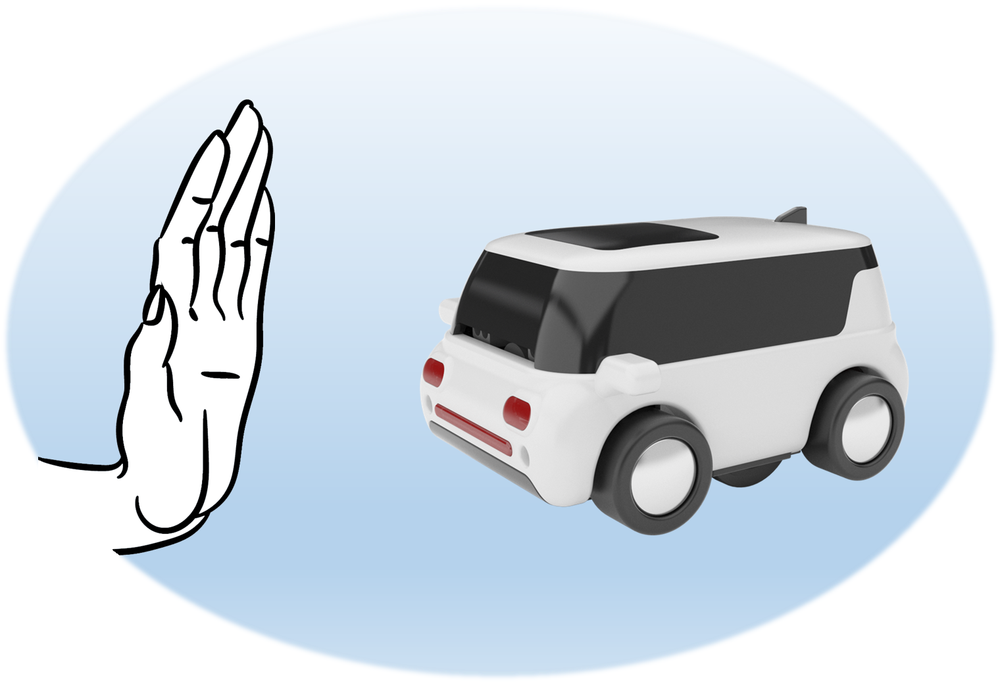
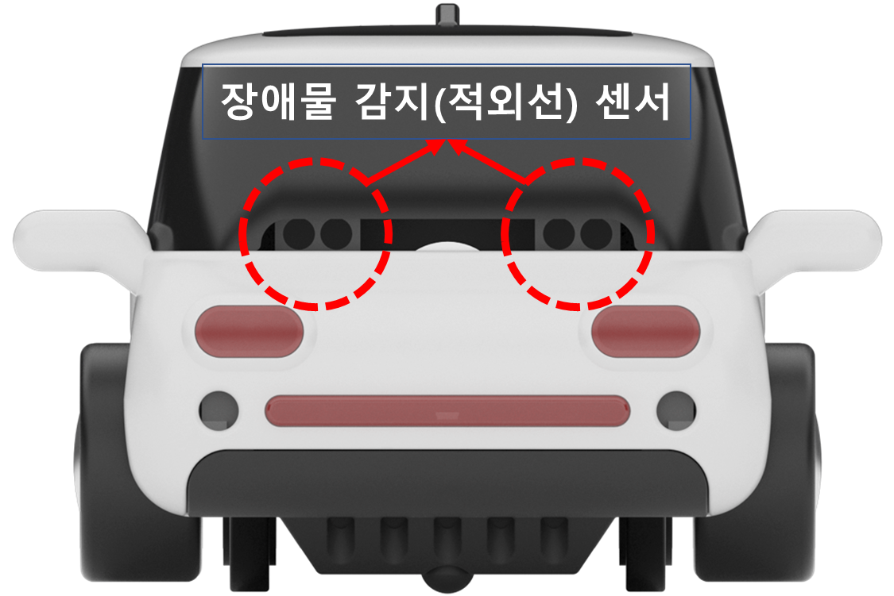
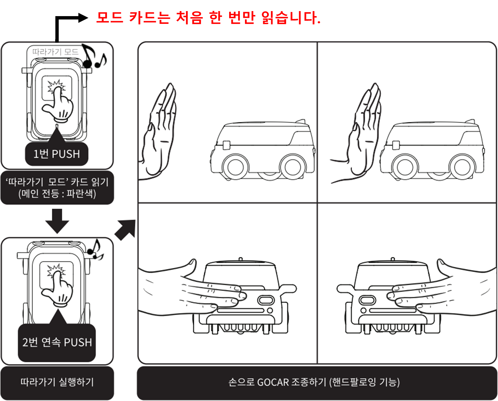
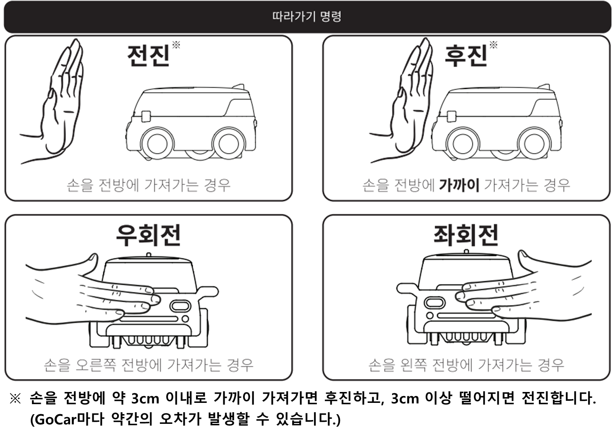
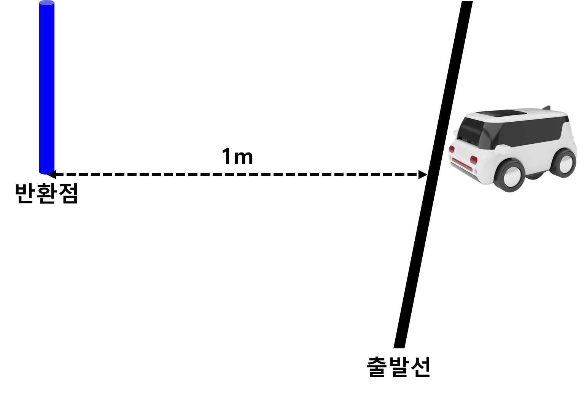
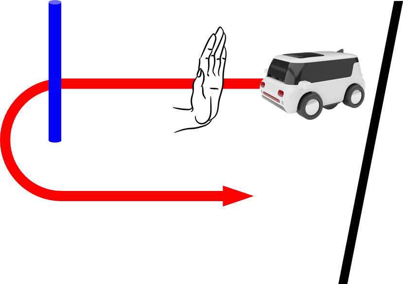

 

    <h1>Lesson 8. GoCar로 따라가기해요</h1>

 

---

 

    <h1>[들어가기]</h1>

 

이번 강의에서는 GoCar로 4번째 언플러그드 코딩 기능인 따라가기를 해보려고 합니다.  
먼저 따라가기가 무엇인지 알아볼까요?

 

    <table>
        <tr>
            <td>
                
<b>따라가기란?</b>

            </td>
        </tr>
        <tr>
            <td>
                
☞	GoCar의 전방에 장착되어 있는 장애물 감지(적외선) 센서를 이용하여 손이나 물체의 위치와 거리에 따라 GoCar를 주행시킬 수 있는 코딩 방식입니다.  
                주행 명령은 총 4가지로, 손이나 물체를 전방으로 일정 거리 이상 가져가면 전진, 전방으로 더 가까이 가져가면 후진, 전방 오른쪽으로 가져가면 우회전, 전방 왼쪽으로 가져가면 좌회전입니다.  
                즉, 손이나 물체의 움직임에 따라 GoCar가 따라서 움직입니다. <br 
                ☞ 지난 4차시에서 배운 것처럼 GoCar의 전방 <b>장애물 감지(적외선) 센서</b>가 물체를 감지하여 거리를 측정할 수 있습니다.  그리고 오른쪽과 왼쪽 1개씩, 총 2개의 센서가 장착되어 있어서 우측과 좌측의 물체도 감지할 수 있습니다.
                

            </td>
        </tr>
        <tr>
            <td>
                

                    
                

            </td>
        </tr>
    </table>

 

    <table>
        <tr>
            <td>
                
<b>※ 전방 장애물 감지(적외선) 센서</b>

            </td>
        </tr>
        <tr>
            <td>
                

                

            </td>
        </tr>
        <tr>
            <td>
                

                ▶ 적외선 센서는 빛을 발산하는 발광부와 빛을 받아들이는 수광부로 구성되어 있습니다.  발광부에서 적외선을 내보내어 물체에 부딪혀 반사되는 양을 수광부가 측정하여 물체와의 거리를 알 수 있습니다.
                

            </td>
        </tr>
    </table>

 

모설명만 보고서는 따라가기 기능이 무엇인지 잘 이해하기 힘들죠?  
그럼 이제 따라가기를 직접 실행해보면서 배워볼까요?

 

---

 

    <h1>[따라가기 방법]</h1>

 

따라가기는 다음 순서로 실시합니다.

 

    <table>
        <tr>
            <td>
                

            </td>
        </tr>
        <tr>
            <td>
                

            </td>
        </tr>
        <tr>
            <td>
                
①	따라가기 실행 방법은 GoCar를 평평한 곳에 놓고 메인 전등 부분을 2번 연속으로 누르면 약 2~3초 후에 부저음(띠리릭)이 울리면서 자동으로 실행됩니다.
                  
                ② 손의 움직임에 따라 GoCar를 조종할 수 있으며(=핸드팔로잉), 메인 전등이 주행 시에는 초록색으로 점등되고, 정지 시에는 노란색으로 깜빡입니다.  
                ③ 따라가기 정지 방법은 GoCar를 손으로 잡고 들어서 뒤집으면 정지합니다. 이렇게 정지하더라도 따라가기 모드는 유지됩니다. 
                

            </td>
        </tr>
    </table>

 

---

 

    <h1>[코딩 실행하기]</h1>

 

따라가기 레이싱을 해보려고 해요. 출발선에서 출발하여 반환점을 돌아 다시 출발선까지 돌아오는 경로입니다. 

 

    <table>
        <tr>
            <td>
                
따라가기 레이싱

            </td>
            <td>
                

                
                

            </td>
        </tr>
    </table>

 

    <table>
        <tr>
            <td>
                
코딩 실행하기

            </td>
        </tr>
        <tr>
            <td>
                

            </td>
        </tr>
        <tr>
            <td>
                
“따라가기 모드” 카드를 읽은 후 GoCar를 출발선에 맞춰 올려놓고 메인 전등 부분을 2번 연속으로 누르면 따라가기 모드가 실행됩니다.  
                손으로 GoCar를 따라오게 하여 반환점을 돌고 다시 출발선까지 돌아오면 완주입니다.  
                친구들과 함께 누가 먼저 완주를 하는지 레이싱 경기를 해보세요.
                  
                <b>▶	따라가기를 실행 중인 상태에서 정지시키는 방법은 GoCar를 들어서 뒤집으면 된다는 것을 잊지 마세요!</b>
                

            </td>
        </tr>
    </table>

 

따라가기로 레이싱을 잘 완주할 수 있었나요? GoCar는 손뿐만 아니라 형태를 가진 물체는 모두 인식하기 때문에 여러 대의 GoCar를 차례대로 나열하여 기차놀이 등의 활동도 가능합니다.  
그 밖에 따라가기 기능을 이용하여 할 수 있는 활동에는 어떤 것들이 있을지 생각해보아요.

 

---

 

    <h1>[정리하기]</h1>

 

이번 강의에서는 GoCar의 4번째 언플러그드 코딩 기능인 따라가기를 해보았습니다.  
손으로 GoCar를 이리저리 조종해보니 재미있지 않나요? 손이 아닌 다른 도구들을 사용해서도 따라가기를 해보세요.

1. GoCar로 “따라가기 모드” 카드를 읽으면 따라가기 모드로 설정됩니다.

2. 따라가기는 GoCar의 전방에 손이나 물체를 가까이 가져가서 주행 명령을 줄 수 있고, 명령은 총 4가지입니다. 
    (1)	손을 전방에 가져가는 경우(3cm 이상) : 전진 
    (2)	손을 전방에 가까이 가져가는 경우(3cm 이내) : 후진 
    (3)	손을 오른쪽 전방에 가져가는 경우 : 우회전 
    (4)	손을 왼쪽 전방에 가져가는 경우 : 좌회전

3. GoCar의 전방에 장착된 장애물 감지(적외선) 센서가 물체를 감지하여 거리를 측정할 수 있습니다. 센서는 오른쪽과 왼쪽 1개씩, 총 2개의 센서가 장착되어 있습니다.

4. 따라가기를 실행 중인 상태에서 정지시키는 방법은 GoCar를 손으로 잡고 들어서 뒤집으면 정지합니다. 이때, 따라가기 모드는 유지됩니다.

 

---

### [코딩카드로 자율주행해요](../)

 1. [GoCar와 친구해요!](../lesson1)
 2. [GoCar로 카드코딩해요(1)](../lesson2)
 3. [GoCar로 카드코딩해요(2)](../lesson3)
 4. [GoCar로 카드코딩해요(3)](../lesson4)
 5. [GoCar로 카드코딩해요(4)](../lesson5)
 6. [GoCar로 라인코딩해요](../lesson6)
 7. [GoCar로 모션코딩해요](../lesson7)
 8. **GoCar로 따라가기해요**

---

Modified : 2020.7.16